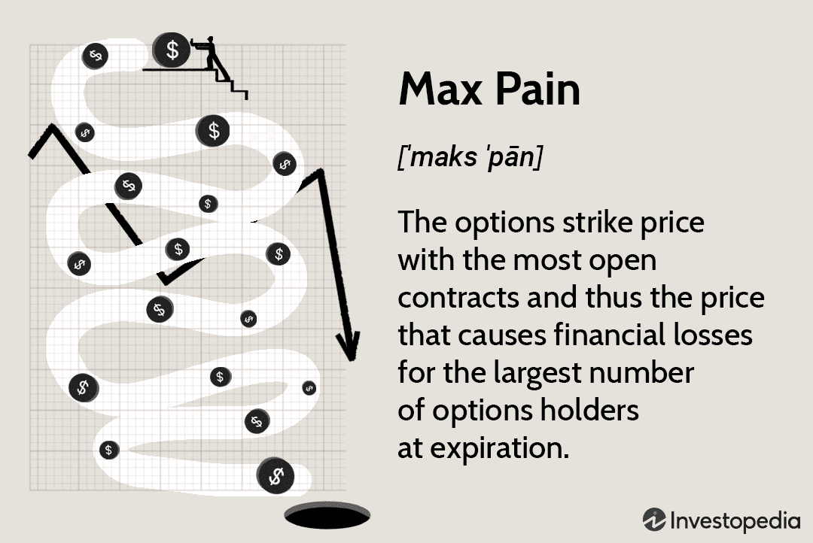

Options trading has become a crucial element of today's financial markets, serving as a versatile tool for both hedging against potential losses and speculating on future price movements. This form of trading involves buying and selling options contracts, which grant the holder the right, but not the obligation, to buy or sell an underlying asset at a predetermined price, known as the strike price, before a specified expiration date. The nuanced nature of these contracts allows market participants to tailor their risk exposure and leverage market opportunities with greater precision.

A significant concept within the options trading community is the Maximum Pain Theory. This theory posits that there exists a particular price level, often referred to as the max pain price, where the maximum number of options expire worthless. This phenomenon occurs because option writers (typically market makers) have an incentive to steer the asset’s price towards this level by expiration. By doing so, they minimize the payout required for exercised options, thereby maximizing their profitability.



Understanding and calculating the Max Pain point provides valuable insights for traders looking to optimize their strategies. The concept suggests that price movements near options expiry may be influenced by the concentration of open interest across different strike prices, leading to potential predictability in price behavior. This article aims to explore the Maximum Pain Theory in depth, outlining the methods used for its calculation and discussing its strategic significance. Additionally, it will cover the integration of this theory into algorithmic trading strategies, where automated platforms can enhance traders' ability to respond to market signals efficiently. By doing so, both novice and seasoned traders may better manage risk and increase their chances of achieving favorable returns in the dynamic world of options trading.

## Table of Contents

## Understanding Max Pain in Options Trading

Max Pain, also known as the max pain price, is a concept in options trading that identifies the strike price at which the largest number of open option contracts—including both calls and puts—are held. At this strike price, the most significant number of options expire worthless, resulting in maximum financial loss for the largest number of option holders. The Max Pain theory postulates that the market makers, who are often the counterparties to many options trades, have a financial incentive to drive the price of the underlying asset towards this max pain point as options near expiration. This reduction in payout obligations allows market makers to protect their interests by effectively reducing the total profits paid out to holders of in-the-money options.

Within this framework, market makers and other liquidity providers are suggested to potentially engage in market activities—though not necessarily manipulative in nature—that align the stock price closer to the max pain strike price. Such activities might include adjusting hedging positions or managing their exposures to align with their financial strategies as expiration approaches.

Understanding the dynamics behind Max Pain is crucial for options traders, as it predicts the level where the majority of options will expire worthless. This information can be strategically leveraged by traders when forming positions, with the anticipation that stock prices might gravitate towards the max pain point as expiration approaches. However, it is essential to consider that while the theory is plausible, it may not always manifest in practice due to various influencing factors in the market, such as supply and demand, volatility, and external economic events. Therefore, traders using this theory as part of their strategy should remain vigilant and consider it as one part of a comprehensive trading approach.

## Calculating the Max Pain Point

To calculate the Max Pain point in options trading, it is essential to evaluate the open interest at each strike price for both call and put options. This process provides insight into where the most option holders are exposed to potential financial losses. The Max Pain theory suggests that the stock price will gravitate towards the strike price that causes the greatest total monetary loss to option holders at expiration, thus maximizing their financial pain.

The calculation starts by aggregating the open interest data across various strike prices. Open interest refers to the total number of outstanding option contracts that are not yet exercised or closed. Both call and put options open interest are considered. For each strike price, potential losses are computed by assuming that the stock price closes at that strike and determining the payouts for all options.

Here is a step-by-step breakdown of the calculation:

1. **Data Collection**: Gather open interest data for both puts and calls across all relevant strike prices of the options series. This can typically be obtained from a financial data provider or trading platform.

2. **Potential Loss Calculation**: For each strike price, calculate the potential losses that would occur if the stock closes at that price. This involves summing the intrinsic value of all in-the-money options that would be exercised. The intrinsic value is the difference between the stock price at expiration and the strike price, multiplied by the open interest.

3. **Summation of Total Loss**: For each strike price, sum the potential losses for both call and put options. These calculations will yield the total monetary losses for option holders if the stock closes at each respective strike price.

   - For a call option at strike price $K$:
     - If $S > K$, the intrinsic value is $S - K$.
     - If $S \leq K$, the intrinsic value is 0.
   - For a put option at strike price $K$:
     - If $S < K$, the intrinsic value is $K - S$.
     - If $S \geq K$, the intrinsic value is 0.

   The formula for total loss at strike price $K$:
$$
   \text{Total Loss}(K) = \sum (\text{Open Interest Call} \times \text{Intrinsic Value Call} + \text{Open Interest Put} \times \text{Intrinsic Value Put})

$$

4. **Identify Max Pain Point**: The strike price with the highest total loss sum is the Max Pain point. This is the price that, according to the theory, the stock is likely to approach at expiration, minimizing the payouts to option holders.

In practice, this calculation can be implemented using programming languages like Python, which can efficiently handle the data processing and mathematical calculations involved:

```python
# Example Python code to calculate Max Pain point
strike_prices = [/* list of strike prices */]
open_interest_calls = [/* list of open interest for calls */]
open_interest_puts = [/* list of open interest for puts */]
stock_price = /* current stock price */

def calculate_max_pain(strike_prices, open_interest_calls, open_interest_puts, stock_price):
    total_losses = []
    for i, K in enumerate(strike_prices):
        # Calculate intrinsic values
        intrinsic_value_calls = max(stock_price - K, 0) * open_interest_calls[i]
        intrinsic_value_puts = max(K - stock_price, 0) * open_interest_puts[i]
        # Sum total losses
        total_loss = intrinsic_value_calls + intrinsic_value_puts
        total_losses.append(total_loss)
    # Find the strike price with maximum total loss
    max_pain_index = total_losses.index(max(total_losses))
    return strike_prices[max_pain_index]

max_pain_point = calculate_max_pain(strike_prices, open_interest_calls, open_interest_puts, stock_price)
```

This approach provides traders with a systematic way to identify the Max Pain point, which can potentially guide their trading strategies around options expiration dates. However, it is important to understand that market dynamics can be influenced by various factors, and the Max Pain point should be considered as a tool rather than a forecast.

## The Role of Max Pain in Financial Strategies

Incorporating the Max Pain concept into financial strategies can significantly influence decision-making, particularly by identifying strike prices that may yield profitable outcomes. The Max Pain theory suggests the strike price at which the majority of options expire worthless is optimal for minimizing payouts from option sellers. Thus, traders can strategically use this theory to position themselves favorably in the market.

One primary application of Max Pain is in risk management. By determining the Max Pain point, traders can anticipate potential market movements and adjust their positions to mitigate risk. For instance, option writers—also known as sellers—can use the Max Pain level to decide which options to sell, maximizing their probability of retaining the premium without having to face assignment. This serves as a powerful technique for premium collection, where the seller benefits from the decay of option value as it approaches expiration.

Max Pain also aids in identifying strike prices that might be artificially manipulated as the expiration date approaches. Market participants, particularly institutional traders and market makers, might influence stocks to gravitate towards the Max Pain price, enabling them to minimize losses. Traders who recognize these patterns can adjust their strategies accordingly, rebalancing their portfolios and managing their exposure effectively.

Moreover, Max Pain can serve to guide traders in setting stop-loss and take-profit levels, optimizing their trading tactics in line with anticipated price movements. By incorporating this information into broader options strategies, such as straddles or strangles, traders can refine their engagement in the market, ensuring that the downside is limited while maintaining upside potential.

To practically implement Max Pain in trading decisions, consider this Python code snippet illustrating how to calculate Max Pain:

```python
# Assume data contains open interest data for calls and puts at various strike prices
def calculate_max_pain(data):
    min_pain = float('inf')
    max_pain_strike = None
    for strike in data.keys():
        total_loss = 0
        for other_strike, open_interest in data.items():
            call_loss = max(0, other_strike - strike) * open_interest['calls']
            put_loss = max(0, strike - other_strike) * open_interest['puts']
            total_loss += call_loss + put_loss
        if total_loss < min_pain:
            min_pain = total_loss
            max_pain_strike = strike
    return max_pain_strike

# Example data structure
data = {
    100: {'calls': 500, 'puts': 300},
    105: {'calls': 600, 'puts': 200},
    110: {'calls': 400, 'puts': 500},
}

max_pain_price = calculate_max_pain(data)
print(f"Max Pain is at strike price: {max_pain_price}")
```

In conclusion, traders can leverage the Max Pain theory to derive profitable strategies in options trading, using it as a tool for informed decision-making, effective risk management, and enhanced premium collection. While it remains a strategic insight rather than a guaranteed forecast, aligning trades with Max Pain calculations can optimize financial outcomes and bolster trading success.

## Max Pain and Algorithmic Trading

Algorithmic trading leverages computational algorithms to automate trading decisions, and when combined with the Max Pain theory, it can significantly enhance the trading process. Platforms like UltraAlgo have streamlined the integration of Max Pain analysis by automating data analysis and executing trading strategies based on this concept. 

These platforms use sophisticated algorithms to process large datasets involving options market data, such as open interest and strike prices, crucial for determining the Max Pain point. By automating the calculation of Max Pain, traders can swiftly identify the strike price at which options are expected to expire worthless, thereby predicting stock movements with higher precision.

Furthermore, [algorithmic trading](/wiki/algorithmic-trading) enables options traders to backtest strategies effectively. Backtesting involves running trading strategies on historical data to evaluate their reliability and profitability. Through [backtesting](/wiki/backtesting), traders can refine and optimize their strategies based on past market conditions, ensuring their approach aligns with the predicted Max Pain levels. For instance, a trader could employ a Python script to backtest an options strategy:

```python
import pandas as pd

# Load historical options data
data = pd.read_csv('options_data.csv')

# Calculate the potential losses for each strike price
data['loss'] = data['open_interest'] * (abs(data['strike_price'] - data['underlying_price']))
# Find the Max Pain point where the total loss is maximized
max_pain_point = data.groupby('strike_price')['loss'].sum().idxmax()

print(f"The Max Pain point is: {max_pain_point}")
```

This example script calculates the potential loss for each strike price, aggregates it, and identifies the Max Pain point where total losses are maximized. By using such algorithms, traders can automate the process of detecting these points, making it easier to adapt trading strategies in real-time.

In addition, platforms like UltraAlgo can simulate trading strategies under various scenarios, providing traders with insights into potential outcomes under different market conditions. This fosters a more informed decision-making process, thereby aligning trades with the insights derived from Max Pain analysis. By incorporating these algorithmic tools with Max Pain theory, traders can not only enhance their strategy development but also improve their risk management and trading performance, ensuring they remain competitive in the fast-paced options market.

## Examples and Applications

One illustrative example of the Maximum Pain Theory in action is observed with options trading on the Nifty 50 index. Suppose the Max Pain point for Nifty 50 options is calculated to be around 24,800. This indicates that the strike price of 24,800 is where the greatest number of options (both calls and puts) are likely to expire worthless, thereby causing maximum financial losses to the majority of option holders.

Traders can leverage this information by writing options that are expected to expire worthless if the market trends toward the Max Pain point. For instance, if the current market price of Nifty 50 is below 24,800, traders might consider writing call options with a strike price close to 24,800. Conversely, if the market price is above this Max Pain point, put options might be written near the price.

Incorporating the Max Pain calculation into trading strategies requires careful attention to variables such as open interest and prevailing market conditions. Open interest, which represents the total number of outstanding option contracts at a particular strike price, is a critical [factor](/wiki/factor-investing) as it helps identify where the significant accumulations of contracts lie. Along with considering open interest, market trends, [volume](/wiki/volume-trading-strategy), and macroeconomic indicators need to be accounted for to ascertain the potential movement toward the Max Pain point.

### Python Example

A simplified Python calculation, using hypothetical open interest data, would illustrate how a trader might compute potential Max Pain points:

```python
# Hypothetical open interest data
open_interest_calls = {24500: 1200, 24600: 1500, 24700: 1800, 24800: 2200}
open_interest_puts = {24300: 1300, 24400: 1600, 24500: 2000, 24700: 1700, 24800: 2400}

def calculate_max_pain(call_oi, put_oi):
    strike_prices = set(call_oi.keys()).union(set(put_oi.keys()))
    total_pain = {}

    for strike in strike_prices:
        call_loss = sum([(k - strike) * v for k, v in call_oi.items() if k >= strike])
        put_loss = sum([(strike - k) * v for k, v in put_oi.items() if k < strike])
        total_pain[strike] = call_loss + put_loss

    max_pain = min(total_pain, key=total_pain.get)
    return max_pain, total_pain[max_pain]

max_pain_strike, total_loss = calculate_max_pain(open_interest_calls, open_interest_puts)
print(f"Max Pain Strike: {max_pain_strike}, Total Loss at Max Pain: {total_loss}")
```

In this example, the code calculates potential financial loss at each strike price, helping determine where the Max Pain point might lie. This approach can serve as a foundational tool for traders seeking to optimize their positioning by using predictive analysis based on the Max Pain Theory.

## Considerations and Limitations

While the Maximum Pain Theory offers valuable insights for options trading, it is not devoid of limitations and should not be relied upon exclusively. Traders should integrate this concept into a diversified trading approach to mitigate inherent risks and maximize strategy efficacy.

One of the primary considerations is market behavior's complexity and unpredictability. The Max Pain Theory posits that prices tend to gravitate towards the point where option holders experience the most significant financial loss. However, this assumption can be influenced by a myriad of factors, including economic events, investor sentiment, and unexpected market news, which can cause deviations from predicted price movements. 

Moreover, the potential for market manipulation presents a significant risk. This theory suggests an incentive for market makers to influence stock prices towards the Max Pain point. Such practices, though unethical, are not unprecedented. Traders should remain vigilant and critically assess market conditions to discern between genuine price movements and potential manipulation. 

Incorporating Max Pain analysis should be done in conjunction with other technical indicators and trading strategies. Utilizing a robust set of tools can offer a more comprehensive view of market dynamics. For instance, technical indicators such as moving averages, Relative Strength Index (RSI), and Bollinger Bands can provide additional context for price trends and potential inflection points, supplementing Max Pain insights.

Lastly, while the Maximum Pain Theory can propose an endpoint for price movements, it does not account for the path prices may take to reach that point. Therefore, traders should consider [volatility](/wiki/volatility-trading-strategies) metrics and other risk assessment tools to prepare adequately for price fluctuations throughout an option's lifecycle.

By complementing the Max Pain Theory with a diversified strategy and other analytical tools, traders can enhance their decision-making processes, manage risks more effectively, and improve their potential for achieving favorable returns.

## Conclusion

The Max Pain Theory offers a valuable perspective on options trading, benefiting both novice and seasoned traders. By integrating this concept into trading strategies, traders can effectively manage risk, optimize trades, and potentially achieve better returns. The theory's fundamental insight, which identifies the strike price at which the maximum number of options expire worthless, serves as a strategic guide for positioning in options markets.

Adopting the Max Pain theory into trading practices requires a dynamic approach that includes continuous learning and adaptation. Markets are constantly evolving, and traders need to adjust their strategies accordingly. Utilizing advanced trading tools and technologies can further enhance the practical application of the Max Pain theory. Algorithmic trading platforms, for instance, can automate data analysis and execute trades in line with Max Pain analysis, thus streamlining the decision-making process.

Traders should remain open to integrating the Max Pain concept with other technical indicators and strategies to build a robust trading framework. This not only diversifies the approach but also mitigates potential shortcomings intrinsic to relying solely on Max Pain. By doing so, traders increase their chances of navigating complex markets effectively, thereby maximizing the potential benefits that the Max Pain strategy offers.

## References & Further Reading

[1]: Natenberg, S. (1994). ["Option Volatility and Pricing: Advanced Trading Strategies and Techniques."](https://www.amazon.com/Option-Volatility-Pricing-Strategies-Techniques/dp/0071818774) McGraw-Hill Education.

[2]: Cottle, R., Fekete, D., & Mohan, P. (2021). ["Options Pricing and Strategy Patterns."](https://www.researchgate.net/publication/351245898_Marketing_Strategy_Pricing_strategies_and_its_influence_on_consumer_purchasing_decision) Cambridge University Press.

[3]: Espen Gaarder Haug. (2007). ["The Complete Guide to Option Pricing Formulas."](https://www.amazon.com/Complete-Guide-Option-Pricing-Formulas/dp/0786312408) McGraw-Hill Education.

[4]: Hull, J. C. (2017). ["Options, Futures, and Other Derivatives."](https://www.semanticscholar.org/paper/Options%2C-Futures%2C-and-Other-Derivatives-Hull/89bdee500c8623864fc9eb7a471546aa713acc44) Pearson Education.

[5]: [Ser-Huang Poon](https://research.manchester.ac.uk/en/persons/ser-huang.poon) (2005). "A Practical Guide to Forecasting Financial Market Volatility." John Wiley & Sons.