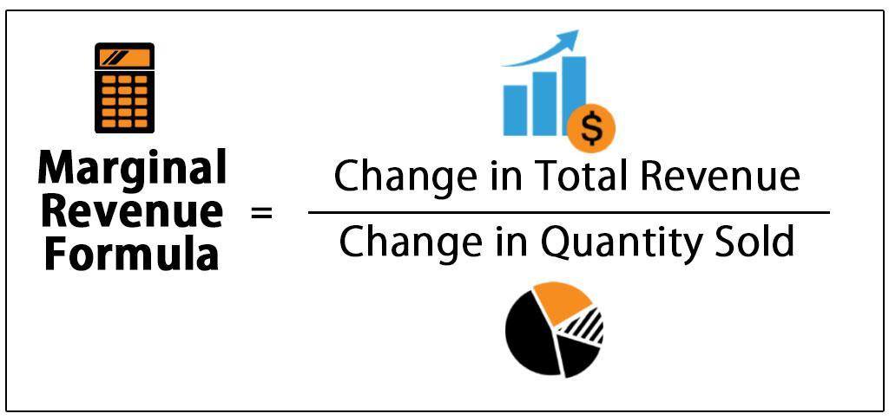

Understanding the delicate balance between marginal cost, marginal revenue, and profitability is crucial in today's economic and financial landscapes. These concepts are fundamental not only to traditional production processes but also to contemporary algorithmic trading, serving as pivotal elements in formulating strategies for profit maximization. In essence, marginal cost refers to the expense of producing an additional unit of a product, while marginal revenue is the additional income generated from selling one more unit. The equilibrium condition for profit maximization occurs when marginal cost equals marginal revenue.

This article examines the vital role these principles play across different sectors, such as manufacturing and finance, by guiding both production decisions and automated trading strategies. In manufacturing, understanding and managing these economic variables assist in determining optimal production levels, promoting efficiency and profitability. In finance, particularly in algorithmic trading, these concepts help in refining strategy and adapting to dynamic market changes by leveraging real-time data and machine learning algorithms.



Throughout this exploration, we will provide insights into the analytical framework of profit maximization. By using marginal cost and marginal revenue as key indicators, businesses can craft strategies that ensure sustainable growth and competitive advantage. The application of marginal analysis techniques enables companies to optimize their operations, whether in traditional production scenarios or the intricacies of algorithmic trading. By understanding these concepts, businesses can harness the potential of marginal analysis to enhance their productivity and profitability, thereby achieving long-term success in a constantly evolving economic environment.

## Table of Contents

## Understanding Marginal Cost and Revenue

Marginal cost is a fundamental economic concept that pertains to the expense incurred to produce one additional unit of a given product. This cost is essential for businesses seeking to determine optimal production levels, as it directly influences decisions on whether to expand, reduce, or maintain current production levels. 

Mathematically, marginal cost (MC) is calculated by differentiating the total cost (TC) function with respect to the quantity (Q) produced:

$$
MC = \frac{dTC}{dQ}
$$

This calculation facilitates an understanding of how total production costs change in response to producing varying quantities of output. By precisely measuring these incremental costs, firms can make informed decisions about scaling their production processes.

Marginal revenue (MR), on the other hand, represents the additional income generated from selling one more unit of a product. It is derived by differentiating the total revenue (TR) function with respect to quantity:

$$
MR = \frac{dTR}{dQ}
$$

The crux of profit maximization lies in achieving a balance where marginal cost equals marginal revenue (MC = MR). At this juncture, a firm optimizes its profit, as the cost of producing one more unit is exactly offset by the revenue it generates, preventing unnecessary expenditures or loss of potential income. 

The interaction between marginal cost and marginal revenue is pivotal in guiding firms to set efficient production levels and devise effective pricing strategies. By consistently assessing and equating these metrics, firms can adjust their production quantities or prices in a manner that enhances profitability. 

Understanding these concepts from an economic perspective forms a cornerstone of economic theory and practice. Classical economics stresses the importance of marginal analysis, as discussed in seminal works like Alfred Marshall’s "Principles of Economics," guiding how businesses react to market dynamics and influencing their long-term strategic planning. 

Thus, marginal cost and marginal revenue not only anchor critical financial decisions but also underpin broader economic models, thereby serving as essential tools for business operations and economic policy formulation.

## Calculating Marginal Cost and Revenue

Calculating marginal cost and marginal revenue is fundamental to understanding how businesses make strategic decisions to optimize their operations. Marginal cost refers to the increase in total production cost when an additional unit is produced. This is crucial for determining the optimal level of production. To calculate marginal cost, one examines both variable and fixed costs. Variable costs change with the level of output, such as material and labor costs. Fixed costs, such as rent and salaries, do not vary with production levels. The marginal cost ($MC$) can be expressed mathematically as:

$$

MC = \frac{\Delta TC}{\Delta Q}
$$

where $\Delta TC$ is the change in total cost, and $\Delta Q$ is the change in quantity produced.

Marginal revenue, on the other hand, represents the additional income from selling one more unit of a product. It is calculated by determining the change in total revenue ($TR$) from the sale of additional units, formulated as:

$$

MR = \frac{\Delta TR}{\Delta Q}
$$

where $\Delta TR$ is the change in total revenue corresponding to $\Delta Q$, the change in quantity sold.

For businesses seeking to optimize their operations, understanding and applying these formulas is essential. Strategic decision-making is guided by the relationship between marginal cost and marginal revenue. Profit maximization occurs when the marginal cost equals marginal revenue ($MC = MR$). At this point, producing more would not increase profit, as the additional cost of producing another unit would exceed the revenue it generates.

To illustrate these calculations, consider a hypothetical scenario where a company produces widgets. Suppose producing 100 widgets costs $1,000, while producing 101 widgets costs $1,010. Here, the marginal cost of the 101st widget is:

$$

MC = \frac{1,010 - 1,000}{101 - 100} = 10
$$

If the total revenue from selling 100 widgets is $2,500, and selling 101 widgets increases the total revenue to $2,520, the marginal revenue of the 101st widget would be:

$$

MR = \frac{2,520 - 2,500}{101 - 100} = 20
$$

The strategic implications of these calculations mean the company should continue producing as long as MR exceeds MC. Both of these calculations underscore their importance in optimizing production levels and pricing strategies.

In practical applications, businesses often use these calculations in software models to anticipate changes in cost and revenue based on different production scenarios. Here’s a simple Python script to calculate marginal costs and revenue:

```python
def calculate_marginal_cost(delta_total_cost, delta_quantity):
    return delta_total_cost / delta_quantity

def calculate_marginal_revenue(delta_total_revenue, delta_quantity):
    return delta_total_revenue / delta_quantity

# Example data
delta_total_cost = 10
delta_total_revenue = 20
delta_quantity = 1

mc = calculate_marginal_cost(delta_total_cost, delta_quantity)
mr = calculate_marginal_revenue(delta_total_revenue, delta_quantity)

print(f"Marginal Cost: {mc}")
print(f"Marginal Revenue: {mr}")
```

This practical approach allows firms to quickly determine the feasibility of increasing production and aids significantly in strategic planning.

## Profit Maximization in Production

Profit maximization in production hinges on the fundamental economic principle that occurs when marginal cost (MC) equals marginal revenue (MR). This equality point represents the optimal production level where any additional unit of output will not contribute to further profit. Understanding and reaching this equilibrium point allows businesses to maximize their profitability by efficiently managing resources and production capabilities.

### Continuous Assessment and Adjustment

To effectively achieve profit maximization, firms must continuously monitor and adjust their production levels according to shifting market conditions and evolving cost structures. Variables such as changes in material costs, labor rates, or consumer demand can impact marginal costs and revenues. By frequently reassessing these factors, businesses can align production processes with the current economic environment, ensuring that operations remain profitable even amidst [volatility](/wiki/volatility-trading-strategies).

### Strategies for Optimizing Production Processes

**1. Cost-Volume-Profit Analysis:**
A primary strategy involves conducting a cost-[volume](/wiki/volume-trading-strategy)-profit (CVP) analysis to understand the relationship between fixed and variable costs, production volume, and overall profitability. By analyzing this relationship, businesses can identify break-even points and target levels of production that optimize profits.

**2. Lean Manufacturing Approaches:**
Implementing lean manufacturing principles can reduce waste and minimize costs, directly influencing the marginal cost. By streamlining production processes and focusing on value-added activities, businesses reduce unnecessary expenditures, aligning their production more closely with demand and maximizing output efficiency.

**3. Dynamic Pricing Strategies:**
Dynamic pricing adjusts prices based on real-time analytics and market demand, which directly affects marginal revenue. By leveraging such strategies, companies can optimize their sales volumes, aligning them with their cost structures to hit that sweet spot where MR equals MC.

### Real-World Case Studies

**Toyota Production System (TPS):**
Toyota’s approach exemplifies effective marginal analysis in a manufacturing setting. By employing just-in-time (JIT) production and thorough cost management, Toyota reduced its marginal costs while maintaining flexibility in its manufacturing processes. This system allows Toyota to adjust quickly to market changes without incurring excessive inventory costs, thus optimizing their production levels to closely align with MR = MC.

**General Electric (GE):**
Another example is General Electric's use of digital twin technology, which simulates production processes in real time. By continuously analyzing data from manufacturing operations, GE can dynamically adjust production parameters, keeping close tabs on marginal costs and revenues. This real-time adjustment ensures they maintain an optimized production state that supports profit maximization.

In summary, achieving profit maximization through marginal analysis is a dynamic process. It requires businesses to regularly assess external and internal factors affecting production costs and revenues. By employing strategies such as cost-volume-profit analysis and lean manufacturing while closely monitoring real-world data and examples, firms can effectively navigate the complexities of production to sustain profitability.

## Algorithmic Trading and Marginal Cost

In [algorithmic trading](/wiki/algorithmic-trading), the marginal cost analysis serves as a foundational tool to enhance trade execution for improved efficiency and profitability. Automated trading systems, which execute trading strategies without human intervention, utilize marginal cost information to adjust their strategies dynamically. This ensures that the trades executed are cost-effective and align with changing market conditions.

At its core, marginal cost in trading is concerned with the additional expense incurred when executing an additional trade. This involves transaction costs, bid-ask spreads, and potential market impact. By understanding and minimizing these costs, automated systems can enhance profitability. These systems continuously evaluate the marginal cost associated with executing trades and implement strategies that focus on optimizing these trades, reflecting both the complexities of the financial markets and the necessity to maintain cost efficiency.

Algorithmic trading systems rely heavily on real-time data to make informed decisions. The integration of [machine learning](/wiki/machine-learning) algorithms allows these systems to adapt to market trends and anomalies swiftly. These algorithms process vast amounts of data to identify patterns, predict price movements, and optimize trade execution. By accurately assessing the marginal cost of trades, machine learning models can prioritize trades with lower costs and higher expected returns, aligning closely with profitability goals.

In practice, Python is often used to implement such trading logic due to its extensive libraries and ease of use. Below is an example of a simple Python script that could be used to illustrate the concept of assessing and optimizing trading decisions in real time:

```python
import numpy as np

def calculate_marginal_cost(transaction_volume, unit_cost, market_impact):
    return unit_cost * transaction_volume + market_impact * (transaction_volume ** 2)

def decide_trade(signal_strength, cost_threshold):
    # Simplified decision logic based on signal strength and marginal cost
    if signal_strength > cost_threshold:
        return "Execute Trade"
    return "Hold"

# Example parameters
transaction_volume = 100  # Number of shares
unit_cost = 0.05  # Per share cost
market_impact = 0.0001  # Impact constant
signal_strength = 1.1  # Strength of trading signal

marginal_cost = calculate_marginal_cost(transaction_volume, unit_cost, market_impact)
decision = decide_trade(signal_strength, marginal_cost)

print(f"Marginal Cost: {marginal_cost}")
print(f"Trade Decision: {decision}")
```

The script above estimates the marginal cost of a potential trade, accounting for both fixed transaction costs and the variable market impact. Depending on the signal strength relative to this cost, a trade decision—either executing the trade or holding—can be made. This simplistic example encapsulates the principles applied in complex algorithmic trading frameworks where various data sources and more elaborate predictive models are integrated.

By leveraging real-time data analysis and machine learning, algorithmic trading systems dynamically adjust strategies to maintain cost-efficiency and optimize profitability. Thus, marginal cost analysis is crucial in ensuring these systems can navigate the complexities of modern financial markets effectively.

## Benefits of Marginal Cost Analysis

Marginal cost analysis serves as a pivotal tool in resource allocation and strategic decision-making for businesses. By meticulously understanding and applying this concept, companies can identify and focus on their most profitable product lines, enabling them to streamline production processes and maximize value creation. This strategic focus ensures that resources are not wasted on less profitable or loss-leading products, thereby enhancing overall efficiency and profitability.

A fundamental aspect of marginal cost analysis is its ability to assist in evaluating special orders. Businesses frequently face decisions that involve accepting or rejecting special orders, which may require unique pricing and production adjustments. By calculating the marginal cost of fulfilling such orders, firms can determine whether the additional revenue generated will surpass the associated costs, justifying acceptance of the order. The decision is guided by whether the price offered covers the marginal cost and contributes to covering fixed costs, ultimately adding to profit margins.

Furthermore, marginal cost analysis aids in discerning optimal production points. By comparing the marginal cost and marginal revenue, businesses can determine the level of output where profits are maximized—a point where these two elements are equal. At this juncture, any additional unit produced would not increase overall profit, thereby identifying the ideal stopping point for production.

In sectors such as energy and transportation, the broader implications of marginal cost analysis are particularly significant. In the energy sector, for example, the application of marginal cost analysis can help in determining the cost-effectiveness of producing additional energy units, guiding investment in new technology or scaling of production facilities. Similarly, in transportation, it could influence decisions around fleet expansion or route optimization to ensure maximal cost efficiency and profitability.

In summary, marginal cost analysis empowers organizations across various industries to make astute, data-driven business decisions that enhance profitability and competitive positioning. By focusing on the additional costs and revenues associated with incremental changes in production or sales, companies can optimize their operations, reducing waste and maximizing returns.

## Case Studies and Examples

Real-world applications of marginal cost analysis demonstrate its profound impact across different sectors, emphasizing its critical role in enhancing operational efficiency and strategic decision-making. In the manufacturing and finance industries, companies have harnessed the principles of marginal cost to gain competitive advantages and streamline their production processes.

In the manufacturing sector, Toyota is a prime example of a company that effectively utilizes marginal cost analysis. Toyota's production system, often referred to as the Toyota Production System (TPS), emphasizes efficiency and waste reduction. By closely analyzing the cost of producing one additional unit, Toyota can optimize production levels to meet demand without overproducing, which minimizes excess inventory and reduces associated costs. The just-in-time (JIT) production approach, a core element of TPS, aligns production schedules with demand forecasts by utilizing marginal cost insights to adapt to changes promptly. This system not only boosts Toyota's profitability by maximizing the use of resources but also enhances its adaptability to fluctuations in the market.

In the finance sector, Renaissance Technologies is a leading example of an organization leveraging marginal cost analysis within its trading strategies. Renaissance Technologies, a quantitative [hedge fund](/wiki/hedge-fund-trading-strategies) known for its algorithmic trading models, employs marginal cost insights to inform its execution decisions. By analyzing the costs associated with executing additional trades, Renaissance can optimize their trade executions to minimize transaction costs and maximize returns. The firm uses sophisticated algorithms and extensive data analysis, integrating insights about marginal trading costs into their models to enhance their trading strategies' efficiency and profitability.

Beyond these case studies, marginal cost analysis finds applications in diverse sectors, showcasing its versatility. In the energy industry, companies utilize marginal cost analysis to determine the optimal level of electricity production considering fluctuating input costs and demand patterns. This ensures that energy is supplied efficiently, particularly in markets with dynamic pricing structures. Similarly, in the transportation sector, firms apply marginal cost evaluations to optimize logistics and route planning, reducing fuel consumption and improving delivery times while maintaining service quality.

Overall, the adaptability of marginal cost analysis makes it an invaluable tool for businesses aiming to refine their operations and strategic initiatives. Whether in manufacturing, finance, or other industries, utilizing marginal cost insights enables companies to enhance their competitiveness and foster sustainable growth in varying economic landscapes.

## Conclusion

Marginal cost plays a pivotal role in optimizing both production and trading strategies by providing a clear metric for assessing the financial implications of increasing output or transaction volume. By accurately capturing the additional cost incurred from producing or trading one more unit, businesses are positioned to enhance their operational efficiency and profitability. In production, this understanding allows firms to set optimal production levels where marginal cost equals marginal revenue, thereby maximizing profit potential. In trading, particularly algorithmic trading, marginal cost analysis aids in refining strategies for optimal execution, ensuring trades are both cost-effective and timely.

A comprehensive grasp of marginal cost allows businesses to make informed strategic decisions, helping them maintain a competitive edge. By systematically analyzing how cost dynamics change with different production levels or trading volumes, firms can strategically allocate resources, streamline processes, and identify opportunities for cost reduction. This thorough understanding allows firms to anticipate and adapt to market fluctuations, sustaining their competitive advantage.

Effective application of marginal cost principles is crucial for achieving long-term success in a dynamic economic environment. Organizations that employ these concepts can navigate shifting market demands and adjust their strategies proactively, thus ensuring sustainable growth and a resilient business structure. By leveraging marginal cost analysis, companies can align their operational goals with financial performance, fostering innovation and adaptation in ever-evolving markets.

## References & Further Reading

1. **Samuelson, Paul A., and William D. Nordhaus. "Economics."**  
   This foundational text offers a comprehensive understanding of economic principles, including marginal cost and revenue. It is an essential resource for grasping the theoretical underpinnings of profit optimization in various market conditions.

2. **Mankiw, N. Gregory. "Principles of Economics."**  
   Mankiw's work provides a thorough introduction to economic concepts, focusing on how marginal analysis informs decision-making processes in businesses. It covers the basics and more advanced topics, making it suitable for both beginners and seasoned economists.

3. **Harris, John. "Algorithmic Trading: Winning Strategies and Their Rationale."**  
   This book investigates into the world of automated trading systems, explaining how algorithms leverage marginal cost analysis to optimize trading strategies. It is particularly valuable for those interested in the intersection of economics and technology.

4. **Varian, Hal R. "Intermediate Microeconomics: A Modern Approach."**  
   Varian's text is well-regarded for its rigorous treatment of microeconomic theory, including the mathematical models that underpin marginal cost analysis. It is a useful resource for understanding the applications of these models in real-world economic problems.

5. **Pindyck, Robert S., and Daniel L. Rubinfeld. "Microeconomics."**  
   This book provides a detailed exploration of microeconomic principles, including those related to marginal cost and revenue. It is particularly relevant for those looking to understand the strategic implications of these concepts in business settings.

6. **Donnelly, Russell J., ed. "Algorithmic Trading & DMA: An Introduction to Direct Access Trading Strategies."**  
   This resource investigates into the specifics of direct market access and algorithmic trading strategies, providing insights into how traders use marginal cost principles to enhance profitability.

7. **Hill, Charles W. L., and Gareth R. Jones. "Strategic Management: An Integrated Approach."**  
   While focusing more broadly on strategic management, this book discusses how marginal analysis can inform strategic decisions, offering practical insights for managers and business leaders.

8. **Python for Finance: Mastering Data-Driven Finance by Yves Hilpisch.**  
   This book provides a practical guide to using Python in finance, including applications in algorithmic trading. It is particularly beneficial for those interested in leveraging technology for financial decision-making and incorporating marginal analysis in automated systems.

9. **Cuthbertson, Keith, and Dirk Nitzsche. "Quantitative Financial Economics: Stocks, Bonds and Foreign Exchange."**  
   Offering a quantitative perspective on financial markets, this text covers models and theories that help integrate marginal cost analysis into broader financial strategies.

These resources collectively offer a robust foundation and advanced insights into the principles of marginal cost and revenue, their application in production and trading, and their broader implications in modern economics and finance.