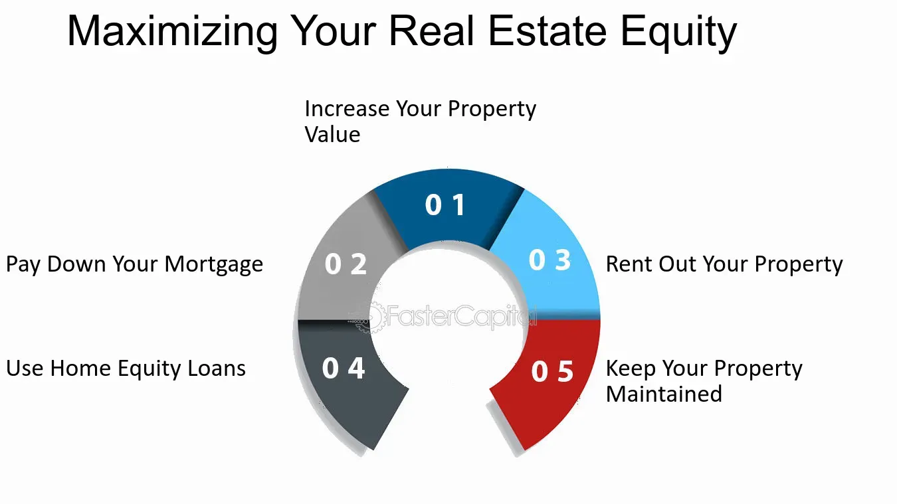

## Table of Contents

## What is real estate net worth and why is it important?

Real estate net worth is the total value of all the properties you own minus any debts or mortgages you have on those properties. It's like figuring out how much money you would have if you sold all your properties and paid off everything you owe on them. This number can help you see how much your real estate investments are really worth.

Knowing your real estate net worth is important because it gives you a clear picture of your financial health. It helps you make smart decisions about buying or selling properties, and it can show you if you're making progress toward your financial goals. Plus, it's useful for planning things like retirement or getting a loan, because lenders often want to know your net worth before they lend you money.

## How can beginners start building their real estate net worth?

Beginners can start building their real estate net worth by first saving up for a down payment. This might mean setting aside a little money each month from their paycheck or finding ways to earn extra cash. Once they have enough saved, they can look for a property to buy. It's important to choose a property that they can afford and that has the potential to increase in value over time. A good place to start might be a small, affordable home or even a rental property that can generate income.

After buying their first property, beginners should focus on paying down the mortgage as quickly as possible. This will reduce the amount of interest they pay over time and increase their equity in the property. They can also look for ways to improve the property, like fixing up the kitchen or adding a new bathroom, which can boost its value. As they build equity, they might consider using it to buy more properties, slowly growing their real estate portfolio and increasing their net worth.

## What are the key factors that influence the value of a property?

The value of a property can be affected by many things. One big [factor](/wiki/factor-investing) is where the property is located. If it's in a good neighborhood with good schools, shops, and parks nearby, the property will usually be worth more. Another factor is the size and condition of the property. A bigger house in good shape will be worth more than a smaller one that needs a lot of repairs. The economy can also play a role. When the economy is doing well, property values tend to go up, but when it's not doing so great, values might go down.

Another important thing that influences property value is the demand for homes in that area. If a lot of people want to live there, the prices will go up. On the other hand, if not many people are interested, the prices might stay the same or even drop. Interest rates can also affect property values. When interest rates are low, more people can afford to buy homes, which can push up prices. But when rates are high, fewer people can buy, which might lower prices. All these factors together help decide how much a property is worth.

## How can one effectively analyze the market to identify profitable real estate investments?

To effectively analyze the market for profitable real estate investments, start by looking at the big picture. Check out the overall health of the economy in the area you're interested in. Look at things like job growth, unemployment rates, and new businesses moving in. These signs can tell you if the area is growing and if property values might go up in the future. Also, pay attention to the real estate market trends. Are prices going up or down? How long do homes usually stay on the market before they sell? This information can help you decide if it's a good time to buy.

Next, dive into the specifics of the neighborhoods you're considering. Look at the average home prices, how fast properties sell, and the rental rates if you're thinking about buying a rental property. Talk to local real estate [agents](/wiki/agents) and property managers to get their insights on what's happening in the market. They can tell you about upcoming developments or changes that might affect property values. Use online tools and real estate websites to gather data on recent sales and property listings. By combining all this information, you can spot trends and find neighborhoods that are likely to be profitable investments.

## What are the common financing options available for purchasing real estate?

When you want to buy a house or other property, there are several ways to get the money you need. The most common way is to get a mortgage from a bank or a mortgage lender. A mortgage is a loan where you borrow money to buy the property, and you pay it back over time with interest. There are different types of mortgages, like fixed-rate mortgages where the [interest rate](/wiki/interest-rate-trading-strategies) stays the same, and adjustable-rate mortgages where the interest rate can change. You usually need to put down a down payment, which is a part of the purchase price you pay upfront, and the mortgage covers the rest.

Another option is to get a home equity loan or a home equity line of credit (HELOC) if you already own a home. These loans let you borrow money using the value of your current home as collateral. A home equity loan gives you a lump sum of money, while a HELOC works more like a credit card, letting you borrow money as you need it. Some people also use personal loans or borrow money from family and friends to buy property. Each of these options has its own pros and cons, so it's important to think about what will work best for your situation.

## How can leveraging debt help in maximizing real estate net worth?

Leveraging debt means using borrowed money to buy things, like real estate, to help grow your wealth. When you use a mortgage to buy a property, you only need to pay a down payment, and the rest is covered by the loan. This lets you control a big asset with a small amount of your own money. If the property goes up in value, your net worth goes up too, because you own the whole property, not just the part you paid for.

The key is that the property's value grows faster than the cost of the debt. For example, if you buy a house and it goes up in value, you can sell it later for more money than you paid. After paying off the mortgage, you keep the profit. This can help you buy more properties and keep growing your real estate net worth. But you have to be careful because if the property's value goes down or you can't pay the mortgage, you could lose money or even the property itself.

## What role does property management play in maintaining and increasing net worth?

Property management is really important for keeping your real estate net worth strong and helping it grow. Good property managers take care of your properties and make sure they stay in good shape. They fix things when they break, keep the place clean, and make sure everything works well. This helps keep the value of your property high because people want to live in or rent a place that is well taken care of. If your property is a rental, a good manager will also find good tenants and collect rent on time, which gives you a steady income and helps you pay off any loans you might have on the property.

Property managers also help increase your net worth by making smart choices about your property. They can suggest ways to improve the property, like adding new features or making it more energy-efficient, which can make it worth more money. They also keep an eye on the local real estate market and can tell you when it's a good time to sell or buy more properties. By taking care of the day-to-day stuff and making smart decisions, a good property manager can help your real estate investments do well and grow your net worth over time.

## How can tax strategies be used to enhance real estate net worth?

Using smart tax strategies can really help grow your real estate net worth. One way is by taking advantage of tax deductions. When you own a rental property, you can deduct things like mortgage interest, property taxes, and the costs of repairs and maintenance from your taxable income. This means you pay less in taxes, which leaves you with more money to put back into your properties or to save for buying more. Another strategy is called depreciation, where you can claim a portion of the property's value as an expense each year, even though the actual value might be going up. This reduces your taxable income and can save you a lot of money over time.

Another important tax strategy is using a 1031 exchange, which lets you sell one property and buy another without paying taxes on the profit right away. This can help you keep more money in your pocket to reinvest in bigger or better properties. For example, if you sell a small rental house and use the money to buy a bigger apartment building, you can grow your real estate portfolio without losing a big chunk of your profit to taxes. By understanding and using these tax strategies, you can keep more of your money working for you, which can lead to a bigger real estate net worth over time.

## What are the advanced strategies for real estate portfolio diversification?

One advanced strategy for real estate portfolio diversification is to invest in different types of properties. Instead of just buying single-family homes, you might also look into multi-family units, commercial properties like office buildings or retail spaces, and even industrial properties like warehouses. Each type of property can react differently to economic changes, so having a mix can help protect your net worth if one type of property goes down in value. For example, if the rental market for single-family homes slows down, your commercial properties might still be doing well, balancing out your overall portfolio.

Another strategy is to spread your investments across different geographic areas. Instead of buying all your properties in one city or state, you could invest in properties in different regions or even different countries. This can help you take advantage of growth in different markets and reduce the risk that comes from being too focused on one area. If the economy in one region struggles, your properties in another region might still be doing well, helping to keep your portfolio strong. By diversifying both by property type and location, you can build a more resilient and potentially more profitable real estate portfolio.

## How can technology and data analytics be utilized to optimize real estate investments?

Technology and data analytics can really help you make better choices when you're investing in real estate. By using special software and tools, you can look at a lot of information about properties, like how much they cost, how fast they sell, and what people are paying for rent in different areas. This can help you find good deals and see which neighborhoods are growing and might be good places to buy. You can also use technology to keep track of your properties and see how they're doing over time. This can help you make smart decisions about when to fix things up, when to raise the rent, or when to sell.

Another way technology helps is by making it easier to manage your properties. There are apps and programs that can help you find and talk to tenants, collect rent, and keep everything organized. This can save you time and money, and make sure your properties are always taken care of. Plus, with data analytics, you can predict what might happen in the future, like if property values will go up or down. This can help you plan ahead and make choices that will grow your real estate net worth over time.

## What are the risks associated with real estate investment and how can they be mitigated?

Real estate investment can be a great way to make money, but it also comes with some risks. One big risk is that property values can go down. If the economy gets bad or something happens in the neighborhood, the price of your property might drop, and you could lose money if you need to sell. Another risk is that you might not be able to find good tenants or they might not pay their rent on time. This can make it hard to pay your mortgage and other bills. Also, owning a property means you have to spend money on repairs and upkeep, which can be more than you expected.

You can lower these risks by doing your homework before you buy. Look at the market and the neighborhood to make sure it's a good place to invest. Try to have some money saved up for emergencies, so you can cover the costs if something goes wrong. It's also a good idea to have insurance on your property to protect you from big problems like fires or floods. Another way to reduce risk is by not putting all your money into one property. If you can, buy different kinds of properties in different places. This way, if one investment doesn't do well, you still have others that might be doing okay. By being careful and planning ahead, you can make your real estate investments safer and more likely to grow your net worth.

## How can one plan for long-term wealth accumulation through real estate?

To plan for long-term wealth accumulation through real estate, start by setting clear goals for what you want to achieve. Maybe you want to buy a home to live in, or maybe you want to build a portfolio of rental properties that will give you a steady income when you retire. Whatever your goals are, make a plan for how you'll reach them. Save up for down payments, learn about the real estate market, and think about how much risk you're willing to take. It's also a good idea to work with a financial advisor who can help you make smart choices and keep your plan on track.

Once you start investing, focus on growing your wealth over time. Buy properties that have the potential to increase in value and generate income. Pay off your mortgages as quickly as you can to build equity and reduce the amount of interest you pay. Consider using strategies like leveraging debt wisely and taking advantage of tax benefits to maximize your returns. Keep an eye on the market and be ready to adjust your plan if things change. By staying focused on your long-term goals and making smart decisions along the way, you can build a strong real estate portfolio that will help you accumulate wealth over the years.

## References & Further Reading

[1]: ["Advances in Financial Machine Learning"](https://www.amazon.com/Advances-Financial-Machine-Learning-Marcos-ebook/dp/B079KLDW21) by Marcos Lopez de Prado

[2]: ["Evidence-Based Technical Analysis: Applying the Scientific Method and Statistical Inference to Trading Signals"](https://www.amazon.com/Evidence-Based-Technical-Analysis-Scientific-Statistical/dp/0470008741) by David Aronson

[3]: ["Machine Learning for Algorithmic Trading"](https://github.com/stefan-jansen/machine-learning-for-trading) by Stefan Jansen

[4]: ["Quantitative Trading: How to Build Your Own Algorithmic Trading Business"](https://www.amazon.com/Quantitative-Trading-Build-Algorithmic-Business/dp/1119800064) by Ernest P. Chan

[5]: Geltner, D., Miller, N. G., Clayton, J., & Eichholtz, P. (2013). ["Commercial Real Estate Analysis and Investments."](https://www.researchgate.net/publication/245702364_Commercial_Real_Estate_Analysis_and_Investments) South-Western Educational Publishing.

[6]: Tsatsaronis, K., & Zhu, H. (2004). ["What Drives Housing Price Dynamics: Cross-Country Evidence."](https://www.bis.org/publ/qtrpdf/r_qt0403f.pdf) BIS Quarterly Review. 

[7]: Pardo, R. (2011). ["Design, Testing, and Optimization of Trading Systems."](https://onlinelibrary.wiley.com/doi/book/10.1002/9781119196969) Wiley.