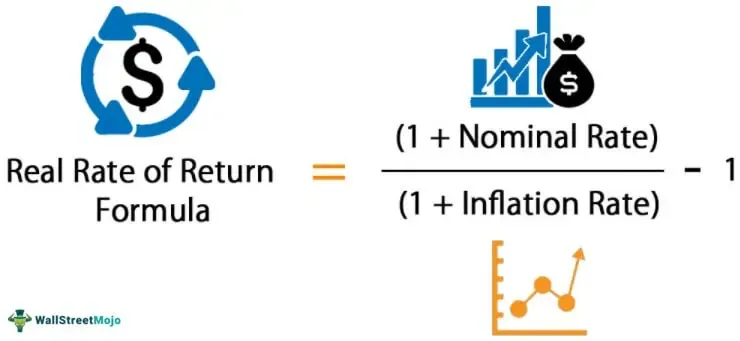

## Table of Contents

## What is the real rate of return and why is it important for retirement planning?

The real rate of return is the amount of money you earn on an investment after taking away the effects of inflation. Inflation means that the price of things goes up over time, so the money you earn might not be worth as much in the future. The real rate of return helps you understand how much your money will really grow over time. For example, if you earn 5% on your investment but inflation is 2%, your real rate of return is only 3%.

Understanding the real rate of return is very important for retirement planning because it helps you figure out how much money you will actually have when you retire. If you only look at the nominal rate of return (the rate before inflation), you might think you have more money than you really do. By using the real rate of return, you can make better plans for how much you need to save and invest now to have enough money later. This way, you can make sure your savings will last throughout your retirement, even as the cost of living goes up.

## How does inflation affect the real rate of return on retirement savings?

Inflation can make the real rate of return on your retirement savings go down. When you save money for retirement, you might earn some interest or see your investments grow. But if inflation is high, the prices of things you need to buy, like food and housing, will go up too. This means the money you earn might not be able to buy as much in the future as it can now. For example, if your savings grow by 4% in a year but inflation is 3%, your real rate of return is only 1%.

This is important because it affects how much money you will have when you retire. If you don't think about inflation, you might think you're saving enough, but the value of your money could be less than you expect. To plan for a good retirement, you need to look at the real rate of return and try to save and invest in a way that keeps up with or beats inflation. This way, you can make sure you have enough money to live on, even as prices go up over time.

## What are the basic investment options available for retirement savings?

There are several basic investment options for retirement savings that you can consider. One common option is a 401(k) plan, which is often offered by employers. With a 401(k), you can put some of your salary into the plan before taxes, and your employer might even match some of your contributions. Another option is an Individual Retirement Account (IRA), which you can open on your own. There are two main types of IRAs: Traditional IRAs, where you can deduct your contributions from your taxes now, and Roth IRAs, where you pay taxes now but can take out the money tax-free in retirement.

Another investment option is an annuity, which is a contract with an insurance company that can provide you with a steady income in retirement. You can buy an annuity with a lump sum or through regular payments. There are also mutual funds, which are a way to invest in a mix of stocks, bonds, and other assets. Mutual funds can help spread out your risk because they include many different investments. Finally, you might consider investing in real estate, either by buying property directly or through a real estate investment trust (REIT). Each of these options has its own benefits and risks, so it's important to think about what fits best with your retirement goals and how much risk you're comfortable taking.

## How can diversification help in maximizing the real rate of return?

Diversification means spreading your money across different types of investments. This can help you maximize the real rate of return because it reduces the risk of losing a lot of money if one investment does badly. For example, if you put all your money in one company's stock and that company does poorly, you could lose a lot. But if you spread your money across stocks, bonds, and maybe even real estate, a bad performance in one area might be balanced out by good performance in another. This way, you're more likely to keep [earning](/wiki/earning-announcement) money even when some investments go down.

By diversifying, you also give yourself a better chance to take advantage of different opportunities in the market. Different types of investments do well at different times. For example, when the stock market is doing great, your stocks might grow a lot, but when the economy is shaky, bonds might be safer and still give you some return. By having a mix of investments, you can keep your money growing over time, which helps fight against inflation and keeps your real rate of return higher. So, diversification is a smart way to manage risk and aim for a better real rate of return in your retirement savings.

## What role do fees and taxes play in the real rate of return, and how can they be minimized?

Fees and taxes can lower your real rate of return on your retirement savings. Fees are charges you pay for managing your investments, like the cost of running a mutual fund or an IRA. Taxes are what you pay to the government on your earnings, either when you put money into your investments or when you take it out. Both fees and taxes take away from the money you earn, which means your savings won't grow as much over time. If you don't think about fees and taxes, you might end up with less money than you planned for when you retire.

To minimize fees, you can look for low-cost investment options, like index funds, which usually have lower fees than actively managed funds. It's also smart to check the fees of any financial advisor or service you use and see if you can find cheaper options. For taxes, you can use tax-advantaged accounts like 401(k)s or IRAs. With a Traditional IRA or 401(k), you can lower your taxes now by putting money in before you pay taxes on it. With a Roth IRA, you pay taxes now but don't have to pay taxes on the money when you take it out in retirement. By being smart about fees and taxes, you can keep more of your money working for you and increase your real rate of return.

## How can one balance risk and return when planning for retirement?

Balancing risk and return when planning for retirement means finding a good mix of investments that can grow your money but also keep it safe. You want to earn enough to keep up with inflation and have enough to live on when you retire. But you also don't want to lose your savings if the market goes down. So, you need to think about how much risk you're okay with. If you're young and have many years until retirement, you might be able to take more risk because you have time to recover from any losses. But if you're closer to retirement, you might want to be safer and put more money in things like bonds that are less likely to lose value.

One way to balance risk and return is by diversifying your investments. This means spreading your money across different types of investments, like stocks, bonds, and maybe real estate. If one type of investment does badly, the others might do well and help balance it out. Another way is to adjust your investments as you get closer to retirement. When you're young, you might put more money in stocks because they can grow a lot over time. As you get older, you can slowly move more money into safer investments like bonds. This way, you can keep your money growing but also protect it as you need it more for retirement.

## What are some advanced investment strategies to enhance the real rate of return?

One advanced investment strategy to enhance the real rate of return is called dollar-cost averaging. This means you invest a fixed amount of money at regular times, no matter if the market is up or down. By doing this, you buy more shares when prices are low and fewer when prices are high. Over time, this can help you pay less on average for your investments and get a better return. It also helps you avoid trying to guess when the market will go up or down, which can be hard to do right.

Another strategy is to use asset allocation and rebalancing. This means you decide how much of your money to put in different types of investments, like stocks, bonds, and real estate. You might start with a mix that fits your risk level and how long you have until retirement. But over time, some investments might grow more than others, changing your mix. Rebalancing means you sell some of the investments that have grown a lot and buy more of the ones that haven't, to get back to your original mix. This can help you keep the right balance of risk and return and make sure your investments stay in line with your retirement goals.

A third strategy is tax-loss harvesting. This means selling investments that have lost value to use those losses to lower your taxes. You can use these losses to offset any gains you made from other investments, which can save you money on taxes. After selling, you can buy similar investments to keep your portfolio the same but now with a tax advantage. This can help you keep more of your money working for you and increase your real rate of return over time.

## How does the timing of withdrawals affect the real rate of return in retirement?

The timing of withdrawals can really affect how much money you have in retirement. If you take money out of your retirement savings when the market is down, you might have to sell your investments for less than they're worth. This can hurt your savings because you'll have less money left to grow over time. Also, if you take out too much money too early, you might run out of money before you die. So, it's important to think about when you take money out and how much you take out.

One way to manage this is by using a strategy called the "4% rule." This rule says you can take out 4% of your savings in the first year of retirement and then adjust that amount for inflation each year after that. This can help make sure your money lasts a long time. Another way is to have some of your money in safer investments like bonds, so you can take money out of those when the market is down and give your other investments time to recover. By planning your withdrawals carefully, you can help keep your real rate of return higher and make sure your savings last throughout your retirement.

## What impact do different asset allocation models have on the real rate of return?

Different asset allocation models can change how much money you earn over time. If you put more money in stocks, you might earn a lot more, but it's also riskier because the stock market can go up and down a lot. If you put more money in bonds, it's usually safer, but you might not earn as much. The right mix depends on how much risk you're okay with and how long you have until you retire. If you're young, you might want more stocks to grow your money over time. If you're closer to retirement, you might want more bonds to keep your money safe.

The real rate of return is how much your money grows after taking away inflation. If you have a lot of stocks and they do well, your real rate of return can be higher because your money grows faster than inflation. But if the market goes down, your real rate of return can be lower or even negative if you lose money. By changing your asset allocation over time, like putting more in bonds as you get older, you can help protect your money and still earn enough to keep up with inflation. This way, you can make sure your savings last through your retirement.

## How can annuities and other insurance products be used to secure a higher real rate of return?

Annuities and other insurance products can help you get a higher real rate of return by giving you a steady income in retirement. An annuity is a contract with an insurance company where you pay them money now, and they promise to pay you back over time. This can help you plan your money better because you know how much you'll get each month. Some annuities, like fixed annuities, give you a set amount of money each month. This can help you keep up with inflation if the payments are enough to cover the rising cost of living. Other annuities, like variable annuities, let you invest in the market, which can grow your money faster but is also riskier.

Another way insurance products can help is by protecting you from losing a lot of money if the market goes down. Some insurance products, like certain types of life insurance or long-term care insurance, can give you money if you need it for big expenses in retirement. This can help you keep your retirement savings safe because you won't have to take money out of your investments when they're down. By using these products wisely, you can make sure your money lasts longer and grows more, even after inflation takes its toll.

## What are the effects of economic cycles on maximizing the real rate of return for retirement?

Economic cycles can make it harder or easier to get a good real rate of return on your retirement savings. During good times, when the economy is growing, the stock market often goes up too. This can help your investments grow faster than inflation, giving you a higher real rate of return. But when the economy is in a downturn, the stock market might go down, and your investments could lose value. If you need to take money out of your savings during a bad time, you might have to sell your investments for less than they're worth, which can hurt your real rate of return and make it harder to keep up with inflation.

To deal with economic cycles, you can use different strategies to protect your retirement savings. One way is to have a mix of investments, like stocks and bonds, so if one type of investment does badly, the other might do better. This can help keep your money growing even when the economy is not doing well. Another way is to be ready to change your investments as the economy changes. If you think a downturn is coming, you might want to put more money in safer investments like bonds. By planning ahead and being flexible, you can help make sure your savings last through all the ups and downs of the economy and keep your real rate of return as high as possible.

## How can one use financial planning tools and software to optimize the real rate of return?

Financial planning tools and software can help you keep track of your money and make better choices about where to put it. These tools let you see all your investments in one place, so you can see how they're doing and if they're growing faster than inflation. You can use them to try out different ways of saving and investing to see what gives you the best real rate of return. For example, you can play around with different mixes of stocks and bonds to find the right balance of risk and return for you. These tools can also help you plan when to take money out of your savings so you don't run out of money too soon.

Another way financial planning software helps is by showing you how fees and taxes affect your savings. You can use these tools to see how much money you're losing to fees and find cheaper options that can help you keep more of your money. They can also show you how to use tax-advantaged accounts like 401(k)s or IRAs to lower your taxes and keep your money growing. By using these tools, you can make smart choices that help you get the best real rate of return on your retirement savings.

## What is the Real Rate of Return?

The real rate of return is a key concept in finance that provides a more accurate measure of an investment's value by accounting for the erosion of purchasing power due to inflation. Understanding the difference between nominal and real rates of return is essential for investors, particularly those planning for retirement.

To begin with, the nominal rate of return refers to the percentage increase in your investment without adjusting for any changes in the price level. It is a straightforward calculation that simply accounts for the growth of your initial investment over a given period. However, nominal rates can be misleading because they do not account for inflation's impact on the actual value of the returns.

In contrast, the real rate of return adjusts the nominal rate to reflect inflation, thereby providing a clearer picture of the investment's true gain in purchasing power. The formula to calculate the real rate of return is typically represented as:

$$
\text{Real Rate of Return} = \frac{1 + \text{Nominal Rate}}{1 + \text{Inflation Rate}} - 1
$$

In many cases, especially when rates are low, a simplified approximation can be used:

$$
\text{Real Rate of Return} \approx \text{Nominal Rate} - \text{Inflation Rate}
$$

Inflation significantly impacts investment returns, as it reduces the purchasing power of money. For instance, if you earn a nominal return of 8% on your investment, but the inflation rate is 3%, the real rate of return would be approximately 5%. This adjustment is crucial in assessing the true value generated by the investment.

For retirement planning, the real rate of return holds special significance. Retirees rely on their savings to generate income for living expenses over many years. If inflation is not factored into long-term planning, the purchasing power of their income could diminish, potentially jeopardizing their financial security. By focusing on the real rate of return, investors can make more informed decisions about how much they need to save and how to allocate their portfolios to achieve a sustainable income that keeps pace with inflation over time. 

Understanding the real rate of return lets investors evaluate their strategies more effectively, ensuring that their investment outcomes meet both nominal growth targets and real purchasing power objectives.

## References & Further Reading

[1]: Bodie, Z., Kane, A., & Marcus, A. J. (2014). ["Investments"](https://books.google.com/books/about/EBOOK_Investments_Global_edition.html?id=BMsvEAAAQBAJ). McGraw-Hill Education.

[2]: Fabozzi, F. J. (2015). ["Bond Markets, Analysis, and Strategies"](https://books.google.com/books/about/Bond_Markets_Analysis_and_Strategies_ten.html?id=bQpNEAAAQBAJ). Pearson.

[3]: Kipnis, H. (2018). ["Building Winning Algorithmic Trading Systems, + Website: A Trader's Journey From Data Mining to Monte Carlo Simulation to Live Trading"](https://www.amazon.com/Building-Winning-Algorithmic-Trading-Systems/dp/1118778987). Wiley.

[4]: Poterba, J. M., Venti, S. F., & Wise, D. A. (2007). ["The Changing Landscape of Pensions in the United States"](https://www.nber.org/system/files/working_papers/w13381/w13381.pdf). National Bureau of Economic Research.

[5]: Shiller, R. J. (2005). ["Irrational Exuberance"](https://www.jstor.org/stable/j.ctt1287kz5). Princeton University Press.