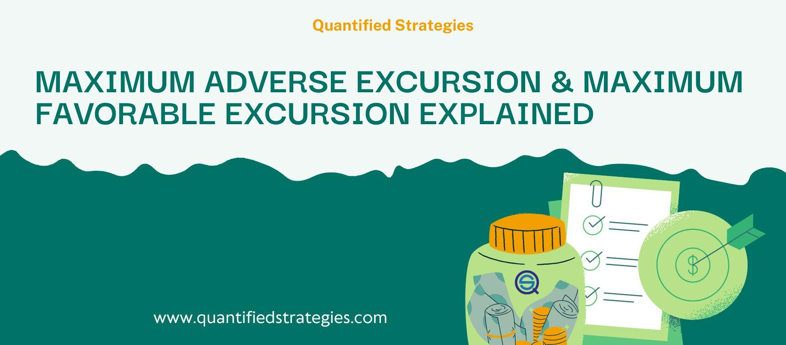

Maximum Adverse Excursion (MAE) is a pivotal concept in algorithmic trading that measures the largest loss a trading position incurs before it either closes or becomes profitable. Introduced by John Sweeney, this concept plays a significant role in helping traders set optimal stop-loss levels through the analysis of historical drawdown data. MAE helps quantify the maximum amount an asset's price can move adversely against a trader's position. This information is crucial for assessing risk and making informed decisions about where to place stop-loss orders, with the aim to minimize potential losses without stifling profit opportunities.

The concept of MAE extends beyond theoretical analysis and is actively used to enhance the practical application of trading strategies. By thoroughly understanding historical drawdowns, traders can optimize their risk management approaches—ensuring stop losses are neither too restrictive, causing premature exits, nor too lenient, risking excessive losses. The utility of MAE is prominent in algorithmic trading environments where precision and data-driven decisions are essential.



This article explores MAE's definition, its importance in algorithmic trading, and practical ways to incorporate it into trading strategies effectively. By adopting MAE as a foundational tool, traders can better navigate market fluctuations, enhance the robustness of their trading systems, and ultimately improve their profitability.

## Table of Contents

## Understanding Maximum Adverse Excursion (MAE)

Maximum Adverse Excursion (MAE) is an essential concept in evaluating trading strategies, particularly for assessing risk and determining optimal stop-loss levels. It describes the maximum loss a trading position can endure from the entry point until it either turns profitable or is closed. Understanding this metric is vital for traders who aim to manage risks effectively and optimize their trading strategies.

To quantify MAE, consider the price movements of an asset after a trading position is entered. MAE measures the extent to which an asset's price moves against the trader's position. For long positions, this involves tracking the lowest price point reached during the trade relative to the entry price. Conversely, for short positions, the MAE is the highest price point above the entry. Mathematically, for a long position, MAE can be expressed as:

$$
\text{MAE} = \min(P_t - P_e)
$$

Where $P_t$ is the price at time $t$ during the trade, and $P_e$ is the entry price. For short positions, the formula is:

$$
\text{MAE} = \max(P_t - P_e)
$$

MAE is more than a theoretical measure; it is a practical tool essential for traders who wish to anticipate and understand past and potential drawdowns. By analyzing MAE, traders gain insights into the worst-case scenarios their strategies might encounter, facilitating informed decisions about setting stop-loss levels. Moreover, MAE aids in establishing an empirical basis for evaluating the reliability of trading strategies under various market conditions, ultimately contributing to more robust and resistant trading frameworks.

## The Importance of MAE in Algorithmic Trading

Maximum Adverse Excursion (MAE) is invaluable in [algorithmic trading](/wiki/algorithmic-trading), offering a methodical approach to optimize risk management. It serves as a lens through which traders can scrutinize historical drawdown patterns, allowing for more informed decision-making. By examining MAE, traders gain a clearer understanding of their trading strategy's resilience, particularly in relation to stop-loss placements.

One key aspect of MAE's utility is its ability to help evaluate stop-loss effectiveness. A stop-loss order is essential to mitigate risk by automatically closing a position when a predetermined price threshold is breached. However, setting stop-loss levels requires a balance: too tight, and the trader may [exit](/wiki/exit-strategy) positions prematurely; too loose, and they could incur significant losses. MAE provides historical data insights, indicating how much an asset's price has moved adversely before reversing or the position closing. This enables traders to calibrate their stop-loss orders judiciously, neither overly restrictive nor excessively lenient.

Furthermore, MAE analysis assists traders in refining their strategies to minimize potential losses. By identifying patterns where trades failed to recover, traders can adjust their positions or alter their strategies before encountering similar scenarios. This proactive strategy refinement is crucial for adapting to market dynamics and maintaining capital preservation.

Ultimately, MAE equips algorithmic traders with the analytical rigor needed to enhance their trading strategies, minimizing risks without impeding the opportunity for profits.

## Calculating Maximum Adverse Excursion

To calculate Maximum Adverse Excursion (MAE) for a trade, it is essential to identify the maximum loss experienced from the entry point before the position either turns profitable or is closed. This calculation is crucial for both long and short positions as it provides insights into the adverse price movements that the position can encounter, thereby informing effective risk management strategies.

For long positions, MAE is computed by determining the difference between the entry price and the lowest price point achieved during the trade's duration. This measurement can be expressed mathematically as:

$$
\text{MAE}_{\text{long}} = \text{Entry Price} - \text{Lowest Price}
$$

In this formula, a positive MAE value indicates the scale of adverse movement against the initial long position before the market conditions improve or the trade is closed.

Conversely, for short positions, MAE involves calculating the difference between the highest price point reached during the trade and the entry price. The formula for calculating MAE in a short position is:

$$
\text{MAE}_{\text{short}} = \text{Highest Price} - \text{Entry Price}
$$

Here, a positive MAE value again signifies the extent to which the market moved unfavorably against the initial short position before any recovery becomes evident or the trade concludes.

To automate the calculation of MAE for multiple trades, the following Python code snippet serves as an illustrative guide. It calculates MAE for both long and short positions from a dataset containing entry prices and high/low prices during trades:

```python
def calculate_mae(entry_price, high_price, low_price, position_type):
    if position_type == 'long':
        mae = entry_price - low_price
    elif position_type == 'short':
        mae = high_price - entry_price
    else:
        raise ValueError("position_type must be either 'long' or 'short'")
    return mae

# Example usage:
trades = [
    {'entry_price': 100, 'high_price': 110, 'low_price': 90, 'type': 'long'},
    {'entry_price': 200, 'high_price': 220, 'low_price': 180, 'type': 'short'}
]

for trade in trades:
    mae = calculate_mae(trade['entry_price'], trade['high_price'], trade['low_price'], trade['type'])
    print(f"Trade MAE for {trade['type']} position: {mae}")
```

Such automation aids traders in comprehensively analyzing an extensive dataset to better understand the drawdown patterns of their trading strategies, thereby optimizing risk management bars and potentially enhancing trade profitability.

## Integrating MAE into Trading Strategies

Maximum Adverse Excursion (MAE) is a valuable tool that traders incorporate into their trading strategies to improve decision-making and risk management. By analyzing MAE, traders can determine the most strategic stop-loss points. Stop-loss is a critical mechanism that minimizes potential losses while maintaining the possibility for trades to become profitable. In traditional trading, setting stop-loss points too tightly can result in trades being closed prematurely, missing out on potential gains. Conversely, setting them too loosely results in larger, unnecessary losses. MAE provides a precise measure based on historical data, guiding traders in setting optimal stop-loss levels.

Regularly assessing MAE enables traders to dynamically adjust their risk levels. This adaptability is essential as market conditions are seldom static. By examining historical performance, traders gain insights into how market conditions have influenced previous trades and adjust accordingly to mitigate risks. MAE ensures that the risk management strategy is aligned with ongoing market developments, enhancing the resilience and effectiveness of trading operations.

Additionally, the strategic use of MAE alongside Maximum Favorable Excursion (MFE) is beneficial. While MAE measures the maximum potential loss of a position, MFE tracks the largest positive movement a trade experiences before closing. By evaluating MAE and MFE together, traders can identify the trade-off between risk and reward, refining their strategies to optimize profit-taking opportunities. This combination aids traders in not only managing and reducing losses but also in maximizing potential returns by recognizing advantageous exit points for profitable trades.

The integration of MAE into trading algorithms can be illustrated through Python, where traders can programmatically determine stop-loss levels based on historical MAE data. Here's a simplified snippet to illustrate how such integration might be operationalized:

```python
def calculate_mae(trades):
    mae_list = []
    for trade in trades:
        entry_price = trade['entry_price']
        min_price = min(trade['price_movements'])
        mae = entry_price - min_price
        mae_list.append(mae)
    return mae_list

def integrate_mae(trades, dynamic_stop_loss=False):
    mae_values = calculate_mae(trades)
    for trade, mae in zip(trades, mae_values):
        optimal_stop_loss = trade['entry_price'] - mae
        if dynamic_stop_loss:
            adjusted_stop_loss = adjust_stop_loss_based_on_market(mae)
            trade['stop_loss'] = adjusted_stop_loss
        else:
            trade['stop_loss'] = optimal_stop_loss

def adjust_stop_loss_based_on_market(mae):
    # Complex logic to adjust stop loss based on expected conditions
    return mae * 1.1  # Example adjustment factor

# Example usage
trades = [{'entry_price': 100, 'price_movements': [102, 98, 97, 101, 99]},
          {'entry_price': 200, 'price_movements': [205, 203, 195, 198, 202]}]

integrate_mae(trades, dynamic_stop_loss=True)
print(trades)
```

In this example, `calculate_mae()` computes the MAE for each trade, and `integrate_mae()` uses these values to set an optimal stop-loss. The function `adjust_stop_loss_based_on_market()` demonstrates how stop-loss can be dynamically adjusted based on anticipated market conditions. By incorporating MAE into trading strategies, traders are well-equipped to make informed decisions that balance potential profit with acceptable levels of risk, thereby enhancing the overall effectiveness of their trading endeavors.

## How Much MAE is Considered Optimal?

Determining the optimal value for Maximum Adverse Excursion (MAE) is a nuanced task that depends largely on the specific trading strategy and market conditions in which it is employed. There is no uniform MAE value that is universally considered optimal because trading strategies vary widely in terms of risk tolerance, market [volatility](/wiki/volatility-trading-strategies), and intended financial outcomes.

A lower MAE generally suggests more accurate trade execution with less risk exposure, implying that a position moves against the trader less before becoming profitable. This can be indicative of a robust strategy where trades are entered at more opportune times or where stop-loss levels are well-optimized. However, setting the MAE too low can prematurely close positions that might have turned profitable if given more room to fluctuate.

Traders should analyze and compare their MAE values across different strategies to fine-tune their stop-loss placements. This comparative analysis can involve examining past trade data under various market conditions to identify patterns where MAE values align closely with successful outcomes. For instance, using programming tools like Python, traders can automate the calculation and comparison process. Here is a basic example of how one might calculate MAE for a series of trades using Python:

```python
def calculate_mae(trades):
    mae_values = []
    for trade in trades:
        entry_price = trade['entry_price']
        price_movements = trade['price_movements']
        if trade['type'] == 'long':
            adverse_excursion = min(price_movements) - entry_price
        else:
            adverse_excursion = entry_price - max(price_movements)
        mae_values.append(abs(adverse_excursion))
    return mae_values

# Example of trades data
trades = [
    {'type': 'long', 'entry_price': 100, 'price_movements': [102, 98, 100, 105]},
    {'type': 'short', 'entry_price': 150, 'price_movements': [152, 149, 151, 147]},
]

mae_values = calculate_mae(trades)
print(mae_values)
```

Through such analyses, traders can establish more reliable stop-loss thresholds that better correspond to their strategy's expected performance. It's crucial for traders to adapt dynamically, adjusting MAE parameters based on comprehensive evaluations involving historical performance and evolving market conditions. This adaptive approach ensures that trading strategies remain flexible and responsive to changes, thus optimizing overall effectiveness.

## Conclusion

Maximum Adverse Excursion (MAE) plays an essential role in managing risk and boosting the effectiveness of algorithmic trading strategies. It provides traders with valuable insights into historical loss patterns that are crucial for setting optimal stop-loss levels. By doing so, MAE enables traders to make informed decisions, which are vital for controlling risk and enhancing the potential for positive outcomes. 

Incorporating MAE into trading frameworks ensures that strategies are robust, effectively minimizing unexpected losses while maximizing potential returns. This metric allows traders to assess how much an asset’s price can move against their positions, helping them to avoid premature exits and allowing trades the opportunity to recover and yield profits. 

Moreover, by systematically analyzing MAE, traders can refine and adjust their strategies over time, ensuring that they remain effective under varying market conditions. Emphasizing MAE in trading algorithms, therefore, lays the groundwork for disciplined and data-driven decision-making processes, which are essential for long-term success in algorithmic trading. 

In conclusion, MAE is not merely a metric but a strategic tool that, when effectively applied, transforms the approach to risk management and trade optimization. Its systematic integration into trading strategies provides a framework for traders to both safeguard their investments and enhance their profit potential.

## Frequently Asked Questions (FAQs)

Who introduced the concept of MAE in trading? John Sweeney was instrumental in bringing Maximum Adverse Excursion (MAE) to the forefront as a valuable tool for traders, primarily focusing on understanding and enhancing the performance of trading strategies by determining effective stop-loss placements.

How is MAE calculated? MAE is calculated by identifying the largest adverse price movement against a trading position from its entry point until the trade either becomes profitable or is closed. For a long position, MAE is the maximum drop from the entry price to the lowest price level reached during the trade duration. Conversely, for a short position, it is the maximum rise from the entry price to the highest price level observed while the position is open. The calculation can be expressed as follows:
- For a long position:  
  \[ \text{MAE} = \text{Entry Price} - \min(\text{Price})
$$
- For a short position:  
  \[ \text{MAE} = \max(\text{Price}) - \text{Entry Price}
$$

Why is a significant data sample important for MAE calculations? A comprehensive data sample is crucial for obtaining accurate and reliable MAE calculations. A large sample size allows traders to capture a variety of market conditions, reducing the chance of outliers distorting the analysis and leading to more robust conclusions about optimal stop-loss levels. The diverse historical data provides a better understanding of the market's adverse price movements, leading to improved risk management and more informed strategic decisions.

## References & Further Reading

[1]: Sweeney, J. (1992). ["Maximum Adverse Excursion: An Expanded Measurement of Risk."](https://analyzingalpha.com/maximum-adverse-excursion) Technical Analysis of Stocks & Commodities Magazine.

[2]: ["Advances in Financial Machine Learning"](https://www.amazon.com/Advances-Financial-Machine-Learning-Marcos/dp/1119482089) by Marcos Lopez de Prado

[3]: Aronson, D. (2007). ["Evidence-Based Technical Analysis: Applying the Scientific Method and Statistical Inference to Trading Signals."](https://www.amazon.com/Evidence-Based-Technical-Analysis-Scientific-Statistical/dp/0470008741) Wiley.

[4]: Chan, E. (2009). ["Quantitative Trading: How to Build Your Own Algorithmic Trading Business."](https://github.com/ftvision/quant_trading_echan_book) Wiley.

[5]: Jansen, S. (2020). ["Machine Learning for Algorithmic Trading."](https://github.com/stefan-jansen/machine-learning-for-trading) Packt Publishing.