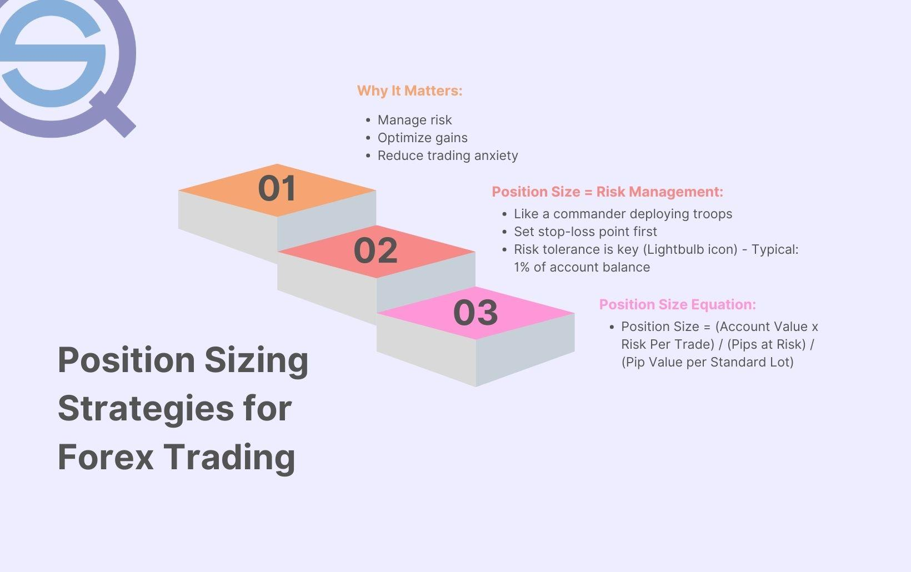

## Table of Contents

## What is a position size in trading?

Position size in trading refers to the amount of a particular asset, like stocks or currency, that a trader buys or sells. It's important because it helps traders manage their risk and decide how much money they want to put into a trade. For example, if you have $10,000 to invest and you decide to use 10% of it for a single trade, your position size would be $1,000.

Choosing the right position size is key to successful trading. If the position size is too big, you might lose a lot of money if the trade goes wrong. If it's too small, you might not make enough profit even if the trade goes well. Traders often use tools like the risk-reward ratio to figure out the best position size for their trades. This way, they can balance the potential gains against the possible losses.

## Why is it important to set a maximum dollar position size in backtesting?

Setting a maximum dollar position size in backtesting is important because it helps traders see how their strategy would work with real money. When you backtest, you're looking at how your trading plan would have done in the past. If you don't set a limit on how much money you can use for each trade, the results might look too good to be true. By setting a maximum dollar position size, you make sure the backtest is more realistic and shows how your strategy would actually perform with the money you have.

This also helps in managing risk. If you let the backtest use as much money as it wants for each trade, it might show big profits but also big losses. By setting a cap on the position size, you can see if your strategy can still make money while keeping the risk under control. This way, you get a better idea of whether your trading plan is safe and effective for the amount of money you're willing to risk.

## How do you calculate the maximum dollar position size for a trade?

To calculate the maximum dollar position size for a trade, you need to think about how much money you're willing to risk. First, decide on a percentage of your total trading capital that you're okay with losing on a single trade. A common choice is 1% to 2% of your total money. If you have $10,000 to trade with and you choose a 1% risk, that means you're willing to lose $100 on one trade.

Next, you figure out the position size based on how much you're willing to lose and the stop-loss level for your trade. The stop-loss is the price at which you'll sell if the trade goes against you. If you're trading a stock that's at $50 and you set a stop-loss at $45, that's a $5 difference per share. To find the maximum number of shares you can buy, divide the amount you're willing to risk ($100) by the stop-loss difference ($5). This gives you 20 shares. So, with $10,000 in total capital and a 1% risk, your maximum dollar position size for this trade would be 20 shares times the current stock price of $50, which equals $1,000.

## What factors should be considered when determining the maximum dollar position size?

When figuring out the maximum dollar position size, one key thing to think about is how much money you're okay with losing on a single trade. This is called your risk per trade, and it's often set as a small percentage of your total trading money, like 1% or 2%. If you have $10,000 to trade with and you choose a 1% risk, that means you're ready to lose $100 on one trade. This helps keep your trading safe because you're not betting too much on any one trade.

Another thing to consider is where you'll set your stop-loss. The stop-loss is the price at which you'll sell if the trade goes the wrong way. The difference between the price you buy at and your stop-loss price helps you figure out how many shares or how much of the asset you can buy. For example, if you're buying a stock at $50 and your stop-loss is at $45, that's a $5 difference. If you're okay with losing $100, you can buy 20 shares ($100 divided by $5). So, your maximum dollar position size would be 20 shares times $50, which equals $1,000. This way, you can control how much you're risking while still trying to make a profit.

## How does the maximum dollar position size affect the risk management of a trading strategy?

The maximum dollar position size is a big part of keeping your trading safe. It helps you decide how much money you want to risk on each trade. If you set a limit on how much you can spend on one trade, you won't lose too much money if things go wrong. For example, if you have $10,000 and you only want to risk 1% on a trade, that's just $100. This way, even if the trade doesn't work out, you still have most of your money left to try again.

This limit also helps you stick to your trading plan. When you know how much you can spend, you can make better choices about when to buy and sell. It stops you from getting too excited and spending too much on one trade. By keeping your position sizes small, you can trade more often and have more chances to make money without risking too much at once. This makes your overall trading strategy safer and more likely to succeed over time.

## Can the maximum dollar position size be adjusted during backtesting, and if so, how?

Yes, you can change the maximum dollar position size while you're [backtesting](/wiki/backtesting) your trading strategy. Backtesting is when you test your trading plan using past data to see how it would have worked. If you find that your strategy is losing too much money or not making enough, you can try different position sizes to see if it helps. You might start with a small position size, like 1% of your total money, and then try 2% or even 0.5% to see what works best.

To adjust the position size during backtesting, you'll need to use the software or tool you're using for backtesting. Most trading platforms let you set and change the position size easily. You can run the backtest again with the new position size and compare the results. This way, you can find the best position size that keeps your risk low but still lets you make good profits.

## What are the common mistakes traders make when setting the maximum dollar position size in backtesting?

One common mistake traders make when setting the maximum dollar position size in backtesting is using too large a position size. They might think that bigger is better and set a high percentage of their capital for each trade, like 5% or even 10%. This can make the backtest look really good because it shows big profits, but it's not realistic. In real trading, using such a large position size would be very risky and could lead to big losses if just a few trades go wrong.

Another mistake is not adjusting the position size at all during backtesting. Traders might set a position size once and then stick with it without trying different sizes to see what works best. But backtesting is all about testing different scenarios to find what's most effective. By trying different position sizes, like 1%, 2%, or even 0.5%, traders can see how their strategy performs under various risk levels. This helps them find a balance between risk and reward that suits their trading style and goals.

## How does the choice of asset class influence the maximum dollar position size in backtesting?

The type of asset you're trading, like stocks, [forex](/wiki/forex-system), or cryptocurrencies, can change how you set your maximum dollar position size in backtesting. Different assets have different levels of risk and volatility. For example, stocks might be less risky than cryptocurrencies, so you might feel okay using a bigger position size for stocks. On the other hand, if you're trading something like forex or crypto, which can go up and down a lot, you might want to use a smaller position size to keep your risk lower.

When you backtest, you need to think about how the asset's price moves. If an asset is really volatile, like some cryptocurrencies, a small change in price could mean a big loss if your position size is too large. So, you might choose a smaller position size to make sure you don't lose too much money in your backtest. But if you're trading something more stable, like certain stocks or bonds, you might be able to use a bigger position size because the risk of big losses is lower. This helps you find a position size that works well with the specific asset you're trading.

## What are the differences in setting maximum dollar position sizes between forex, stocks, and futures in backtesting?

When you're backtesting forex trades, you need to think about how the currency pairs move. Forex markets can be pretty volatile, so you might want to use a smaller position size to keep your risk low. For example, if you're trading with $10,000, you might only risk 0.5% to 1% per trade because the prices can change a lot in a short time. This helps you avoid big losses in your backtest and gives you a more realistic idea of how your strategy would work in real trading.

For stocks, the situation is a bit different. Stocks can be less volatile than forex, so you might feel okay using a slightly bigger position size. If you're backtesting with the same $10,000, you might risk 1% to 2% per trade. Stocks usually don't jump around as much as forex, so a bigger position size might still be safe. But you still need to be careful and make sure your backtest shows how your strategy would work with real money.

Futures trading is another story. Futures can be very volatile, just like forex, but they also come with leverage, which means you can control a big position with a small amount of money. Because of this, you might want to use an even smaller position size when backtesting futures, maybe just 0.5% or less of your total money. This helps manage the high risk that comes with futures trading. By keeping your position size small, you can see if your strategy can make money without risking too much.

## How can historical volatility be used to optimize the maximum dollar position size in backtesting?

Historical volatility is how much an asset's price has moved up and down in the past. When you're backtesting your trading strategy, you can use this information to decide on the best maximum dollar position size. If an asset has been really jumpy, with big price swings, you might want to use a smaller position size. This keeps your risk low because big moves in the price could mean big losses. On the other hand, if the asset's price has been pretty steady, you might feel okay using a bigger position size because the risk of losing a lot of money is smaller.

By looking at how much the price has moved in the past, you can set your position size in a way that matches the asset's risk level. For example, if you're backtesting with $10,000 and the asset has high historical volatility, you might only risk 0.5% of your money on each trade. But if the asset is less volatile, you might risk 1% or even 2%. This helps you find a position size that works well with the asset you're trading, making your backtest more realistic and helping you manage your risk better.

## What advanced statistical methods can be applied to refine the maximum dollar position size during backtesting?

One advanced statistical method you can use to refine the maximum dollar position size during backtesting is called the Value at Risk (VaR) model. This method helps you figure out the most you could lose on a trade over a certain time period with a certain level of confidence. For example, if your VaR is $100 at a 95% confidence level, it means there's only a 5% chance you'll lose more than $100 in a given time. By using VaR, you can set your position size so that even if things go wrong, your losses won't be too big. This way, you can adjust your position size based on how much risk you're willing to take.

Another method is using Monte Carlo simulations. This involves running your trading strategy many times with different random price movements to see how it would perform under different scenarios. By doing this, you can see how different position sizes affect your strategy's performance and risk. If you find that a certain position size leads to too many big losses in the simulations, you can lower it to make your strategy safer. On the other hand, if the position size seems too small and you're not making enough profit, you might increase it a bit. Monte Carlo simulations help you find the sweet spot where your position size balances risk and reward.

## How do regulatory constraints affect the maximum dollar position size in professional trading environments?

Regulatory constraints can change how much money professional traders can use for each trade. These rules are made by groups like the SEC or CFTC to keep the trading world safe and fair. For example, some rules might say you can't use more than a certain amount of your money for one trade, or they might limit how much you can borrow to trade. If you're a professional trader, you have to follow these rules, so you might need to make your position sizes smaller than you would if you were trading on your own.

These limits help stop traders from taking too much risk and losing a lot of money. By making sure traders don't bet too much on one trade, the rules help keep the market stable. If you're backtesting your trading strategy, you need to think about these rules too. You might need to set your maximum dollar position size lower in your backtest to make sure it's realistic and follows the regulations. This way, you can see how your strategy would really work in a professional trading environment.

## How do you determine the maximum dollar position size in backtesting?

Determining the maximum dollar position size during backtesting is pivotal for optimizing [algorithmic trading](/wiki/algorithmic-trading) strategies. The position size must align with the overall trading strategy's risk tolerance, understanding historical market conditions, and accounting for transaction costs.

One primary consideration for establishing the maximum position size is the strategy's capability to endure drawdowns while maintaining risk-adjusted returns. A drawdown is the decline from a peak to a trough during a specific period, which represents potential losses. The maximum position size should minimize the probability of significant capital erosion during such drawdowns.

Incorporating financial metrics like the Sharpe ratio and Sortino ratio can provide valuable guidance for determining position size. The Sharpe ratio measures the strategy's return relative to its risk, calculated as:

$$
\text{Sharpe Ratio} = \frac{E[R] - R_f}{\sigma_R}
$$

where $E[R]$ is the expected return of the strategy, $R_f$ is the risk-free rate, and $\sigma_R$ is the standard deviation of the strategy's excess return over the risk-free rate. A higher Sharpe ratio indicates better risk-adjusted returns, suggesting that a larger position size may be feasible within the strategy's risk tolerance.

The Sortino ratio refines this concept by differentiating between harmful [volatility](/wiki/volatility-trading-strategies) (downside risk) and overall volatility. It's calculated as:

$$
\text{Sortino Ratio} = \frac{E[R] - R_f}{\sigma_D}
$$

where $\sigma_D$ denotes the standard deviation of downside returns. By focusing solely on negative fluctuations, the Sortino ratio can aid in adjusting position sizes that are more sensitive to downward movements, enhancing the strategy's resilience against adverse conditions.

Moreover, traders should consider transaction costs as these can significantly affect net returns, especially for strategies involving frequent trading. Accurately estimating such costs ensures the position size computations remain realistic and sustainable over time.

When devising position sizing rules, one might also account for the Kelly Criterion, which provides a mathematical approach to determining the optimal size of bets or positions. While commonly used in betting and gambling, the same principles can be adapted to trading:

$$
f^* = \frac{bp - q}{b}
$$

where $f^*$ is the fraction of the capital to wager, $b$ is the odds received on the wager, $p$ is the probability of winning, and $q$ is the probability of losing.

In conclusion, determining the maximum dollar position size in backtesting involves a comprehensive analysis of risk metrics, market conditions, and cost considerations. Employing these metrics effectively can significantly enhance a strategy's robustness and its ability to generate consistent returns. By doing so, traders can contribute to the longevity and success of their algorithmic trading strategies.

## References & Further Reading

[1]: ["Quantitative Trading: How to Build Your Own Algorithmic Trading Business"](https://www.amazon.com/Quantitative-Trading-Build-Algorithmic-Business/dp/0470284889) by Ernest P. Chan

[2]: Bergstra, J., Bardenet, R., Bengio, Y., & Kégl, B. (2011). ["Algorithms for Hyper-Parameter Optimization."](https://dl.acm.org/doi/10.5555/2986459.2986743) Advances in Neural Information Processing Systems 24.

[3]: ["Advances in Financial Machine Learning"](https://www.amazon.com/Advances-Financial-Machine-Learning-Marcos/dp/1119482089) by Marcos Lopez de Prado

[4]: ["Machine Learning for Algorithmic Trading"](https://github.com/stefan-jansen/machine-learning-for-trading) by Stefan Jansen

[5]: ["Evidence-Based Technical Analysis: Applying the Scientific Method and Statistical Inference to Trading Signals"](https://www.amazon.com/Evidence-Based-Technical-Analysis-Scientific-Statistical/dp/0470008741) by David Aronson