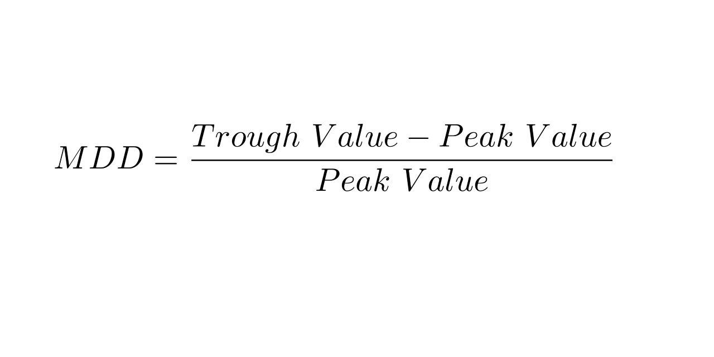

In the world of finance and investment, understanding and managing risk is paramount. Investors employ a range of financial metrics to evaluate and assess the risk associated with trading strategies. Among these metrics, 'maximum drawdown' is widely regarded as a critical measure, particularly in the context of algorithmic trading, where fast-paced decisions and precise risk assessments are essential.

Maximum drawdown quantifies the largest observed loss from a portfolio's peak value before a new peak is achieved. This metric is vital because it not only reflects the historical volatility and risk associated with an investment strategy but also informs future decision-making and risk management strategies.



For algorithmic traders, effectively managing drawdowns is a fundamental aspect of strategy development. The ability to anticipate and limit losses can mean the difference between long-term profitability and unsustainable risk exposures. By understanding maximum drawdown, algorithmic traders can set realistic stop-loss orders, optimize their algorithms for balanced risk and return, and ensure more consistent, reliable performance.

In this article, we explore the significance of maximum drawdown in assessing investment risk in algo trading. We examine how this metric informs decision-making processes and guides risk management strategies, ultimately supporting the goal of achieving sustainable financial success.

## Table of Contents

## Understanding Financial Metrics in Investment

Financial metrics provide a quantitative basis for making investment decisions, serving as essential tools in evaluating performance, risk, and potential returns. These metrics form the foundation upon which investors can assess the effectiveness of different investment opportunities and strategy implementations.

One of the primary metrics is Return on Investment (ROI), which measures the gain or loss generated relative to the amount of money invested. It's calculated as:

$$
\text{ROI} = \left( \frac{\text{Net Profit}}{\text{Cost of Investment}} \right) \times 100
$$

This metric provides investors with a straightforward way to gauge the efficiency of an investment, indicating how much profit can be expected from each dollar invested.

Volatility is another key metric, representing the degree of variation in the price of a financial instrument over time. It is typically measured using standard deviation or variance, and higher [volatility](/wiki/volatility-trading-strategies) indicates higher risk and potential for significant price swings. In quantitative terms, volatility ($\sigma$) can be expressed as:

$$
\sigma = \sqrt{\frac{\sum (R_i - \bar{R})^2}{N}}
$$

where $R_i$ is each return in the dataset, $\bar{R}$ is the average return, and $N$ is the number of returns.

Beta ($\beta$) measures an investment's sensitivity to market movements, indicating how much a security's price will change in response to a change in the market index. A beta greater than 1 suggests that the investment is more volatile than the market, while a beta less than 1 indicates lower volatility.

The Sharpe Ratio, developed by Nobel laureate William F. Sharpe, is used to understand the return of an investment compared to its risk. It is calculated by:

$$
\text{Sharpe Ratio} = \frac{\text{Average Return of the Investment} - \text{Risk-Free Rate}}{\text{Standard Deviation of Investment Return}}
$$

This ratio helps investors determine if they are receiving adequate returns for the level of risk they are assuming.

Maximum drawdown is another vital metric, indicating the largest drop from a peak to a trough in a portfolio's value over a specific period. It quantifies the risk of a portfolio by identifying potential losses. This metric is particularly crucial for investors engaged in high-frequency or [algorithmic trading](/wiki/algorithmic-trading), where understanding potential declines is vital for risk management.

Each of these metrics offers insights into different aspects of market behavior and investment performance. Comprehending them enables investors to construct and manage diversified portfolios effectively, aligning with their risk tolerance and investment goals. Through analyzing these metrics, investors can devise strategies that optimize for risk and return, ensuring more robust investment performance over time.

## Basics of Maximum Drawdown

Maximum drawdown (MDD) is a key metric for assessing the risk inherent in investment portfolios. It calculates the maximum loss a portfolio would have experienced by measuring the largest single drop from a peak to a trough over a specified time period. This metric provides a tangible representation of potential financial loss, making it a valuable tool for investors seeking to evaluate the historical risk of their investments.

The formula for calculating maximum drawdown is as follows:

$$
\text{MDD} = \frac{\text{Peak Value} - \text{Trough Value}}{\text{Peak Value}} \times 100\%
$$

This formula allows investors to express drawdowns as a percentage of the peak value, thus offering a clear perspective on potential losses relative to the highest valuation of a portfolio.

Historically, maximum drawdown has been instrumental in helping investors grasp the extent of risk associated with significant declines in their portfolio's value. By understanding the worst-case losses their investments have experienced, investors are better equipped to set acceptable levels of risk. This is particularly critical when forming risk management strategies, as it provides a benchmark for understanding potential future losses and aids in the allocation of investment resources to mitigate such risks.

In high-frequency and algorithmic trading environments, maximum drawdown is even more significant. These strategies often involve rapid trading and substantial volumes, which can lead to volatile market exposures. Thus, understanding potential drawdowns allows traders to make data-driven decisions about acceptable loss thresholds and to adjust their trading algorithms accordingly.

For algorithmic trading, where automated systems execute trades based on pre-set criteria, integrating maximum drawdown into risk models is essential. It lets traders adjust algorithms proactively to prevent excessive losses and refine strategies to keep the balance between risk and returns. Maximum drawdown effectively ensures that trading strategies remain robust under adverse market conditions, contributing to the sustainable success of trading endeavors.

## Significance of Maximum Drawdown in Algo Trading

Algorithmic trading, or algo trading, employs sophisticated algorithms to execute trades based on predetermined rules and criteria. This approach leverages the speed and precision of computers to execute large volumes of trades within fractions of a second. However, this fast-paced environment inherently involves substantial risk, making effective risk management strategies essential. One of the critical risk metrics for algorithmic traders is maximum drawdown.

Maximum drawdown (MDD) quantifies the largest decline in a portfolio's value from its peak to its lowest point over a certain period. It serves as a key indicator of downside risk and helps traders assess potential losses. In the context of algorithmic trading, understanding maximum drawdown is crucial due to the following reasons:

1. **Risk Visualization**: Maximum drawdown provides traders with a clear visualization of the potential risk in their trading strategies. By examining historical drawdown data, traders can identify periods of significant loss and analyze the conditions that led to these declines. This analysis helps in understanding the vulnerability of their strategies to adverse market movements.

2. **Strategy Adjustments**: With insights gained from drawdown analysis, traders can set more informed stop-loss orders. Stop-loss orders are pre-set instructions to sell a security once it reaches a certain price, designed to cap potential losses. By aligning these orders with observed drawdown patterns, traders can mitigate risks and protect their investments from severe downturns.

3. **Algorithm Refinement**: Understanding maximum drawdown assists traders in refining their algorithms to strike an optimal balance between risk and return. Algorithms can be modified to incorporate parameters that minimize drawdowns while still achieving satisfactory returns. This may involve adjusting position sizes, trade frequency, or the conditions under which trades are executed.

Consider a basic Python example to simulate and calculate the maximum drawdown from a series of portfolio returns, helping an algorithmic trader to refine their trading system:

```python
import numpy as np

def calculate_max_drawdown(returns):
    cumulative_returns = np.cumprod(1 + returns) - 1
    peak = np.maximum.accumulate(cumulative_returns)
    drawdowns = peak - cumulative_returns
    max_drawdown = np.max(drawdowns)
    return max_drawdown

# Example returns (daily percentage change)
portfolio_returns = np.array([0.01, -0.02, 0.015, -0.03, 0.007, -0.005, 0.02])

max_drawdown_value = calculate_max_drawdown(portfolio_returns)
print(f"Maximum Drawdown: {max_drawdown_value:.2%}")
```

In this example, the code calculates the maximum drawdown from a given series of portfolio returns, helping traders assess the depth of potential losses. By incorporating this metric into their analysis, algorithmic traders can make strategic refinements aimed at reducing risk.

4. **Optimizing for Risk and Return**: The ability to analyze maximum drawdown allows algo traders to optimize their strategies with a more comprehensive understanding of risk-adjusted performance. Evaluating maximum drawdown in conjunction with other metrics like the Sharpe Ratio or Sortino Ratio enables traders to construct portfolios that are more resilient to market fluctuations, ultimately aiming for more stable long-term returns.

In summary, acknowledging and understanding maximum drawdown is fundamental for algorithmic traders. It enhances their ability to manage risk proactively and adjust strategies to adapt to evolving market conditions, thereby supporting informed decision-making aimed at achieving consistent financial outcomes.

## Managing Investment Risk through Algo Trading Strategies

Effective risk management is essential for the success of algorithmic trading strategies. One of the key tools for achieving this is the analysis of maximum drawdown, which helps in crafting strategies that are mindful of risk. Maximum drawdown evaluates the greatest peak-to-trough decline in a portfolio's value, thus providing insight into potential losses during adverse market conditions.

To design risk-aware strategies, traders incorporate maximum drawdown analysis. By thoroughly understanding how much a strategy could potentially lose, traders can determine acceptable risk levels. This analysis is especially beneficial when developing high-frequency trading algorithms, as it prepares them for scenarios that may lead to significant drawdowns.

A practical approach to evaluating maximum drawdown is through [backtesting](/wiki/backtesting) strategies using historical data. Backtesting simulates how a trading strategy would have performed in the past, allowing for an assessment of potential maximum drawdowns under similar market conditions. The insights gained from backtesting enable traders to refine their algorithms, ensuring they are robust enough to handle potential risks.

In addition to maximum drawdown, traders can use risk-adjusted performance metrics like the Sortino Ratio. The Sortino Ratio modifies the Sharpe Ratio by considering only the downside volatility, focusing on negative returns rather than total volatility. This provides a more targeted view of risk related to negative market movements. The Sortino Ratio is defined as:

$$
\text{Sortino Ratio} = \frac{R_p - R_f}{\sigma_d}
$$

where $R_p$ is the expected portfolio return, $R_f$ is the risk-free rate, and $\sigma_d$ is the downside deviation (volatility of negative returns). Using the Sortino Ratio alongside maximum drawdown offers a comprehensive view of a strategy's risk-adjusted performance.

By effectively balancing risk and reward, traders can achieve more consistent and reliable outcomes. This balance is crucial in algo trading, where the primary objective is to optimize returns while minimizing potential losses. Strategies that adeptly manage this balance are more likely to succeed and adapt to dynamic market conditions.

In conclusion, incorporating maximum drawdown analysis into algorithmic trading enhances risk management. Traders who effectively manage maximum drawdown, backtest strategies, and use performance metrics like the Sortino Ratio can create robust trading systems that optimize for both risk and reward, leading to sustained success in the financial markets.

## Conclusion

Incorporating financial metrics like maximum drawdown into investment analysis plays a crucial role in enhancing risk management. For algorithmic traders, understanding drawdown aids in maintaining a balanced approach between risk and return. By analyzing maximum drawdown data, traders are better equipped to make informed decisions, allowing them to implement protective measures that shield their portfolios from excessive loss. This insight is vital, especially given the rapid market movements encountered in algorithmic trading.

Employing maximum drawdown effectively supports the overarching goal of achieving long-term financial success. By focusing on this metric, investors and traders can optimize their strategies to align with desired risk profiles, ensuring they capitalize on opportunities while safeguarding against adverse scenarios. Adaptability is essential; investors should continuously refine their strategies to respond to dynamic market conditions. By doing so, they can enhance their risk-adjusted returns and ensure the sustainability of their investment portfolios over time.

## References & Further Reading

[1]: Bergstra, J., Bardenet, R., Bengio, Y., & Kégl, B. (2011). ["Algorithms for Hyper-Parameter Optimization."](https://papers.nips.cc/paper/4443-algorithms-for-hyper-parameter-optimization) Advances in Neural Information Processing Systems 24.

[2]: ["Advances in Financial Machine Learning"](https://www.amazon.com/Advances-Financial-Machine-Learning-Marcos/dp/1119482089) by Marcos Lopez de Prado

[3]: ["Evidence-Based Technical Analysis: Applying the Scientific Method and Statistical Inference to Trading Signals"](https://www.amazon.com/Evidence-Based-Technical-Analysis-Scientific-Statistical/dp/0470008741) by David Aronson

[4]: ["Machine Learning for Algorithmic Trading"](https://github.com/stefan-jansen/machine-learning-for-trading) by Stefan Jansen

[5]: ["Quantitative Trading: How to Build Your Own Algorithmic Trading Business"](https://www.amazon.com/Quantitative-Trading-Build-Algorithmic-Business/dp/1119800064) by Ernest P. Chan