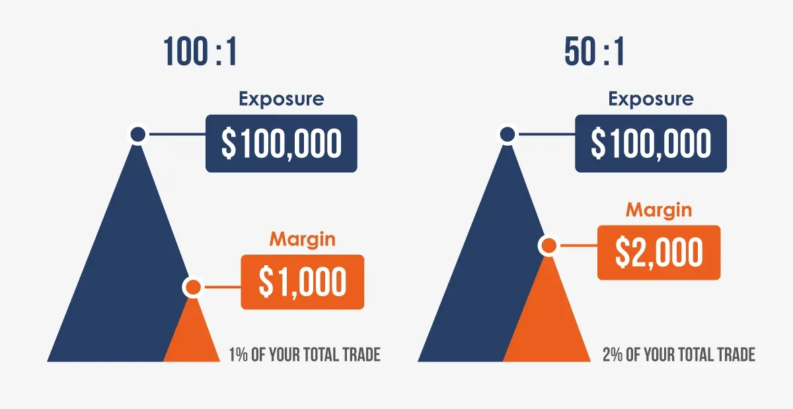

## Table of Contents

## What is leverage in financial terms?

Leverage in financial terms means using borrowed money to increase the potential return on an investment. Imagine you want to buy a house but don't have enough money. You can take a loan from the bank to buy it. If the value of the house goes up, you make more money than if you had only used your own money. This is because you're controlling a bigger asset with less of your own cash.

However, leverage can be risky. If the value of the house goes down, you could lose more money than you initially invested. This is because you still have to pay back the loan, even if the asset's value drops. So, while leverage can amplify your gains, it can also magnify your losses. It's a powerful tool that needs to be used carefully.

## How does leverage affect investment returns?

Leverage can make your investment returns bigger. If you borrow money to invest, you can buy more of an asset than you could with just your own money. For example, if you use leverage to buy stocks and the stock price goes up, you make more money than if you had only used your own money. This is because you're controlling a larger amount of the stock with less of your own cash. So, when the stock price rises, your profit is bigger because you own more of it.

But leverage can also make your losses bigger. If the stock price goes down, you lose more money than you would have if you had only used your own money. This is because you still have to pay back the loan, even if the stock's value drops. So, if the stock price falls, your loss is bigger because you owe money on the loan. Leverage can be a powerful tool, but it's important to be careful because it can make both your wins and your losses much larger.

## What are the basic types of leverage?

There are three main types of leverage: financial leverage, operating leverage, and combined leverage. Financial leverage is when you use borrowed money to buy things like houses or stocks. It's like using a loan to make an investment. If the investment goes up in value, you make more money than if you had just used your own money. But if it goes down, you can lose more money because you still have to pay back the loan.

Operating leverage is different. It's about how a business uses fixed costs to make more money. Fixed costs are things like rent or salaries that don't change no matter how much the business sells. If a business can sell a lot more without spending much more money, it can make a lot more profit. This is operating leverage. It's risky because if sales go down, the business still has to pay those fixed costs.

Combined leverage is just what it sounds like—it's a mix of financial and operating leverage. A company might use both borrowed money and fixed costs to try to make more profit. It's the most risky because it combines the risks of both types of leverage. If things go well, the company can make a lot of money, but if things go badly, the losses can be big.

## Can you explain the concept of maximum leverage?

Maximum leverage is the highest amount of borrowed money you can use for an investment. It's like the biggest loan you can get to buy something. Every investment has a limit on how much you can borrow. This limit depends on things like the rules of the investment and how much risk the lender is willing to take. If you use the maximum leverage, you're using the most borrowed money possible to try to make more money from your investment.

But using maximum leverage is very risky. If the investment does well, you can make a lot of money because you're controlling a big asset with a small amount of your own cash. But if the investment goes down in value, you can lose a lot more money than you started with. This is because you still have to pay back the loan, even if the asset's value drops. So, while maximum leverage can help you make big profits, it can also lead to big losses if things don't go as planned.

## What are the risks associated with using maximum leverage?

Using maximum leverage means borrowing as much money as you can to make an investment. It's like using the biggest loan possible to buy something. The main risk is that if the investment goes down in value, you can lose a lot more money than you started with. This is because you still have to pay back the loan, even if what you bought is now worth less. If you can't pay back the loan, you might have to sell the investment at a loss or face other financial problems.

Another risk is that using maximum leverage can make your investment very sensitive to small changes in the market. Even a little drop in the value of your investment can lead to big losses because you borrowed so much money. This can be stressful and might make you want to sell your investment at the wrong time, which could make your losses even bigger. So, while maximum leverage can help you make big profits, it also makes your investment much riskier.

## How do different financial instruments use leverage?

Different financial instruments use leverage in various ways to help investors make more money from their investments. For example, with stocks, you can use margin trading. This means you borrow money from your broker to buy more stocks than you could with just your own money. If the stock price goes up, you make more profit because you own more shares. But if the stock price goes down, you can lose more money because you still have to pay back the loan. Another example is options, which are contracts that give you the right to buy or sell an asset at a certain price. Options can be used with leverage because you only need to pay a small amount, called a premium, to control a much larger amount of the asset.

In the world of real estate, leverage is often used through mortgages. When you buy a house, you might not have enough money to pay for it all at once, so you take out a mortgage. This lets you control a big asset, like a house, with a small amount of your own money. If the value of the house goes up, you make more money when you sell it. But if the value goes down, you can lose money because you still have to pay back the mortgage. Another financial instrument that uses leverage is futures contracts. These are agreements to buy or sell an asset at a future date for a set price. Futures use leverage because you only need to put down a small amount of money, called margin, to control a much larger amount of the asset. If the price moves in your favor, you can make a big profit, but if it moves against you, you can lose a lot of money.

## What is the difference between financial leverage and operating leverage?

Financial leverage is when you use borrowed money to make an investment. It's like taking a loan to buy a house or stocks. If the value of what you bought goes up, you make more money than if you had only used your own money. But if the value goes down, you can lose more money because you still have to pay back the loan. So, financial leverage can make your profits bigger, but it can also make your losses bigger.

Operating leverage is different. It's about how a business uses fixed costs to make more money. Fixed costs are things like rent or salaries that stay the same no matter how much the business sells. If a business can sell a lot more without spending much more money, it can make a lot more profit. This is operating leverage. It's risky because if sales go down, the business still has to pay those fixed costs. So, operating leverage can help a business make more money if things go well, but it can also lead to big losses if things don't go as planned.

## How can one calculate the maximum leverage for an investment?

To calculate the maximum leverage for an investment, you need to know how much money you can borrow compared to how much of your own money you are using. This is often called the leverage ratio. For example, if you are buying a house, the bank might let you borrow up to four times the amount of money you have saved for a down payment. So, if you have $50,000 saved, the bank might let you borrow up to $200,000. This means your maximum leverage ratio is 4:1, because you are borrowing four times the amount of money you are putting in yourself.

Different types of investments have different rules about how much you can borrow. For stocks, brokers might let you borrow up to 50% of the value of the stocks you want to buy. This means if you want to buy $10,000 worth of stocks, you might only need to put in $5,000 of your own money, and the broker will lend you the other $5,000. So, your maximum leverage ratio for stocks would be 2:1. Always check the specific rules and limits for the investment you are interested in, because these can change and affect how much you can borrow.

## What are some strategies to safely use maximum leverage?

Using maximum leverage safely means being careful and having a good plan. One way to do this is by setting stop-loss orders. This means you decide ahead of time to sell your investment if it drops to a certain price. This can help you avoid big losses because you'll sell before things get too bad. Another strategy is to keep some money aside, called a cash reserve. This money can help you pay back your loans if your investment goes down in value. It's like having a safety net so you don't get into too much trouble.

Another important thing is to understand the investment you're making. If you know a lot about the stock or the house you're buying, you can make better decisions. It's also a good idea to spread out your investments, which is called diversification. Instead of putting all your money into one thing, you can invest in different things. This way, if one investment goes down, the others might still be okay. By being careful, having a plan, and knowing what you're doing, you can use maximum leverage more safely.

## Can you provide examples of successful use of maximum leverage in business?

One example of successful use of maximum leverage in business is the story of Sam Walton and Walmart. When Sam Walton started Walmart, he used a lot of borrowed money to open new stores. He believed that if he could keep prices low and sell a lot of products, he could pay back the loans and make a profit. This strategy worked well for him. By using maximum leverage, Walton was able to grow Walmart quickly and become one of the biggest retailers in the world. His success shows how using borrowed money can help a business grow fast if everything goes well.

Another example is Elon Musk and Tesla. When Tesla was starting out, Musk used a lot of debt to build factories and produce electric cars. He knew that making cars was expensive, but he also believed that if Tesla could make great cars, people would buy them. By using maximum leverage, Musk was able to get the money he needed to grow Tesla. Even though it was risky, his plan worked, and Tesla became a very successful company. This shows that using a lot of borrowed money can help a business succeed if the business has a good plan and can make it work.

## How does regulatory environment affect the use of maximum leverage?

The rules set by governments and financial regulators can change how much money businesses and investors can borrow. These rules are made to keep the financial system safe and to stop people from taking too much risk. For example, if the rules say you can only borrow up to 50% of the value of your investment, you can't use as much leverage as you might want. This means you have to be more careful with your money and can't take as big of risks. The regulatory environment can make it harder to use maximum leverage, but it also helps to protect everyone from big losses.

Different countries have different rules about leverage. In some places, the rules might be strict, which means businesses and investors can't borrow as much money. In other places, the rules might be more relaxed, allowing for more borrowing. These differences can affect where businesses choose to operate and invest. For example, a company might decide to start a new project in a country with more relaxed rules so they can use more leverage to grow faster. But they also have to be aware that more leverage means more risk, and they need to be ready to handle that risk carefully.

## What are advanced techniques for managing risks associated with maximum leverage?

One advanced technique for managing the risks of using maximum leverage is called hedging. Hedging is like buying insurance for your investment. You can use other financial tools, like options or futures, to protect yourself if the value of your investment goes down. For example, if you've borrowed a lot of money to buy stocks, you might buy an option that lets you sell those stocks at a certain price. This way, if the stock price drops, you can still sell at the higher price you set with the option, which helps you avoid big losses. Hedging can be complicated, but it's a smart way to reduce the risks of using a lot of borrowed money.

Another technique is called stress testing. This means you look at what could happen to your investment in different bad situations. You might ask, "What if the stock market crashes?" or "What if interest rates go up a lot?" By thinking about these scenarios, you can plan ahead and know what to do if things go wrong. Stress testing helps you be ready for the worst and can make you feel more confident about using maximum leverage. It's like practicing for a big game, so you know how to handle whatever comes your way.

Using a mix of different investments, called diversification, is also a good way to manage risk. If you put all your money into one thing and it goes down, you could lose everything. But if you spread your money across different types of investments, like stocks, bonds, and real estate, you're less likely to lose everything at once. Diversification helps you balance the risks of using maximum leverage because even if one investment goes down, the others might still be okay. It's like not putting all your eggs in one basket, which can help you sleep better at night knowing your money is safer.

## What is Understanding Financial Leverage?

Financial leverage is a financial strategy that involves using borrowed funds to potentially increase the return on investment. By borrowing capital, investors and companies can amplify both potential gains and losses. This concept is widely utilized across various financial settings, enabling entities to enhance their investment capacity beyond their current capital reserves.

### How Leverage Works

Leverage works by allowing investors or companies to access more funds than they currently possess, effectively multiplying their buying power. For instance, if an investor wants to purchase $100,000 worth of stocks but only has $20,000, by utilizing leverage, they can borrow the remaining $80,000. This borrowing can be done through various instruments, such as margin loans in stock trading, loans in real estate, or issuing bonds in corporate finance.

The mechanics of leverage can be expressed mathematically. If you invest an amount $E$ (equity) and borrow an amount $D$ (debt), the total investment amount becomes $I = E + D$. The return on the investment, assuming a rate of return $r$, would be $r \times I$. The leverage effect becomes apparent when calculating the return on equity (ROE), which is:

$$
\text{ROE} = r \times I - (D \times \text{interest rate}) / E
$$

The use of leverage can substantially increase ROE if the return on total investment $r \times I$ exceeds the cost of debt.

### Advantages of Financial Leverage

1. **Increased Returns**: Leverage can significantly magnify the returns on investments. When investments perform well, the gains for investors employing leverage are substantially higher compared to unleveraged positions.

2. **Access to Larger Investments**: By borrowing funds, investors and companies can participate in larger investment opportunities than their capital would initially allow, enabling diversification and growth.

### Risks Associated with Financial Leverage

While leverage can increase potential returns, it also entails heightened risks. The key risks include:

1. **Amplified Losses**: Just as leverage can magnify gains, it can also amplify losses. If the investment's return falls below the cost of borrowing, the financial impact on equity is disproportionately negative.

2. **Increased Financial Obligation**: Borrowing involves obligations to pay interest and, eventually, the principal amount. Failure to meet these obligations can lead to financial distress or insolvency, particularly in volatile market conditions.

3. **Impact on Financial Ratios**: High leverage can negatively affect financial ratios such as the debt-to-equity ratio (D/E), a key measure of financial leverage that compares the company's total liabilities to shareholder equity. A high D/E ratio may signal potential financial instability to investors and creditors.

### Examples of Financial Leverage in Practice

1. **Corporate Finance**: Companies often use debt to finance expansion projects or acquisitions, leveraging their equity to take on larger ventures. The use of bonds or bank loans allows firms to increase their capital base and achieve growth.

2. **Personal Investments**: Individuals frequently use leverage to purchase real estate through mortgages, enabling them to invest in property by making a down payment and borrowing the rest.

In summary, financial leverage is a double-edged sword that can enhance investment returns but also significantly increase the associated risks. Proper assessment of the company's or individual's ability to manage these risks is crucial when employing leverage as part of an investment strategy. Key metrics like the debt-to-equity ratio provide insights into the potential impact of leverage on financial health and balance sheets, guiding informed decision-making.

## References & Further Reading

[1]: Bernstein, P. L. (1992). ["Capital Ideas: The Improbable Origins of Modern Wall Street,"](https://archive.org/details/capitalideasimpr0000bern) John Wiley & Sons.

[2]: [Bodie, Z., Kane, A., & Marcus, A. J. (2014).](https://www.mheducation.com/highered/product/Investments-Bodie.html) "Investments," McGraw-Hill Education.

[3]: ["Algorithmic and High-Frequency Trading"](https://assets.cambridge.org/97811070/91146/frontmatter/9781107091146_frontmatter.pdf) by Álvaro Cartea, Sébastien Jaimungal, & José Penalva.

[4]: ["Leverage: How Cheap Money Will Destroy the World"](https://www.amazon.com/Leverage-Cheap-Money-Destroy-World/dp/1118122844) by Karl Denninger.

[5]: Fabozzi, F. J. (2008). ["Handbook of Finance, Volume I: Financial Markets and Instruments,"](https://download.e-bookshelf.de/download/0000/5719/88/L-G-0000571988-0015243212.pdf) Wiley.

[6]: Brunnermeier, M. K., & Pedersen, L. H. (2009). ["Market Liquidity and Funding Liquidity,"](https://www.nber.org/papers/w12939) Review of Financial Studies, 22(6), 2201-2238.

[7]: Adrian, T., & Shin, H. S. (2010). ["Liquidity and Leverage,"](https://www.sciencedirect.com/science/article/pii/S1042957308000764) Journal of Financial Intermediation, 19(3), 418-437.