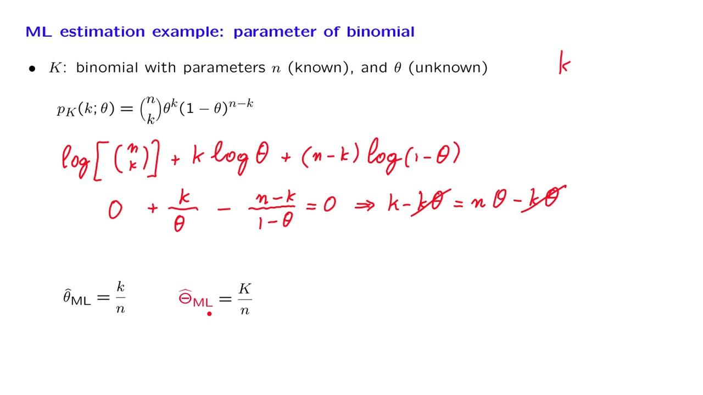

## Table of Contents

## What is a maximum likelihood estimator (MLE)?

A maximum likelihood estimator (MLE) is a way to find the best value for a parameter in a statistical model. Imagine you have a bunch of data and you want to guess a number that makes your model fit the data well. The MLE helps you pick the number that makes it most likely that you would get the data you have. It's like trying different keys in a lock until you find the one that fits perfectly.

To use MLE, you start by writing down a formula that describes how likely it is to get your data for any given value of the parameter. This formula is called the likelihood function. Then, you change the value of the parameter until you find the one that makes the likelihood function as big as possible. This value is your MLE. It's a popular method because it often gives good results, but it can be tricky if your data is complicated or if you don't have enough of it.

## How does the maximum likelihood estimator work?

The maximum likelihood estimator (MLE) is a way to find the best guess for a number in a math model that makes the model fit your data really well. Imagine you have a bunch of data, like the heights of people, and you want to guess the average height. The MLE helps you find the average height that makes it most likely you would get the exact heights you measured. To do this, you start by making a formula that says how likely it is to get your data for any guess of the average height. This formula is called the likelihood function.

Once you have the likelihood function, you change your guess for the average height until you find the guess that makes the likelihood function as big as possible. This guess is your MLE. It's like trying different keys in a lock until you find the one that fits perfectly. The MLE is popular because it often gives good results, but it can be tricky if your data is complicated or if you don't have enough of it. In those cases, you might need other methods to help you find the best guess.

## What is the difference between maximum likelihood estimation and other estimation methods like method of moments?

Maximum likelihood estimation (MLE) and the method of moments are two different ways to find the best guess for numbers in a math model. MLE tries to find the guess that makes it most likely to get the exact data you have. It does this by making a special formula called the likelihood function, and then changing the guess until the formula gets as big as possible. This method is really good when you have a lot of data and the math model is not too complicated. But, if the data is tricky or you don't have enough of it, MLE can be hard to use.

The method of moments, on the other hand, looks at the average, spread, and other patterns in your data. It then tries to match these patterns with the patterns you would expect from the math model. Instead of using a likelihood function, the method of moments uses equations to find the guess that makes the patterns in the data match the patterns in the model as closely as possible. This method can be easier to use than MLE because it doesn't need as much math, but it might not always give the best guess, especially if the data is complicated or the model is not a good fit for the data.

## Can you explain the likelihood function used in MLE?

The likelihood function is a key part of maximum likelihood estimation (MLE). It's like a special recipe that tells you how likely it is to get your data if you pick a certain guess for the numbers in your math model. Imagine you're trying to guess the average height of people in a room. The likelihood function would tell you how likely it is to measure the exact heights you got if your guess for the average height is correct. You write down this function based on what you know about the math model and your data.

Once you have the likelihood function, you change your guess for the numbers in the model until you find the guess that makes the function as big as possible. This guess is your MLE. It's like trying different keys in a lock until you find the one that fits perfectly. The bigger the likelihood function gets, the more likely it is that your guess is the right one for your data. So, you keep tweaking your guess until the likelihood function reaches its highest point, and that's when you know you've found the best guess for your model.

## How do you calculate the maximum likelihood estimate for a given dataset?

To calculate the maximum likelihood estimate (MLE) for a given dataset, you start by setting up a likelihood function. This function shows how likely it is to get your data if you pick a certain guess for the numbers in your math model. Imagine you're trying to guess the average height of people in a room. The likelihood function would tell you how likely it is to measure the exact heights you got if your guess for the average height is correct. You write down this function based on what you know about the math model and your data.

Once you have the likelihood function, you change your guess for the numbers in the model until you find the guess that makes the function as big as possible. This guess is your MLE. It's like trying different keys in a lock until you find the one that fits perfectly. The bigger the likelihood function gets, the more likely it is that your guess is the right one for your data. So, you keep tweaking your guess until the likelihood function reaches its highest point, and that's when you know you've found the best guess for your model.

## What are the assumptions required for maximum likelihood estimation to be valid?

Maximum likelihood estimation (MLE) works well when you believe your data comes from a certain kind of math model. The main thing you need to assume is that your data follows this model, like thinking all the heights you measured come from a normal bell-shaped curve. If your data doesn't really fit the model you picked, then your MLE guess might not be the best one. Also, you need to assume that each piece of data you have is picked by chance, and that one piece of data doesn't affect another. This is called independence. If the data points are not independent, like if people in a family are more likely to have similar heights, then your MLE might not work as well.

Another important thing to think about is how much data you have. MLE usually gives better guesses when you have a lot of data. If you only have a little bit of data, your MLE guess might not be very accurate. Also, the math model you use for MLE should be able to explain your data well. If the model is too simple or too complicated, your MLE guess might not be the best one. So, before using MLE, make sure your data fits the model, the data points are independent, and you have enough data to make a good guess.

## What are the advantages of using maximum likelihood estimation?

Maximum likelihood estimation (MLE) is really helpful because it often gives you the best guess for the numbers in your math model. When you have a lot of data and your model fits the data well, MLE can find the guess that makes it most likely you would get the exact data you have. This makes your model really good at explaining your data. Also, MLE is based on a clear idea: you pick the guess that makes the data most likely. This makes it easy to understand and explain to others why you picked a certain guess.

Another good thing about MLE is that it works well with many different kinds of math models and data. Whether you're guessing the average height of people or trying to predict the weather, MLE can help you find the best numbers for your model. It's also easy to use computers to do the math for MLE, which means you can quickly find the best guess even with a lot of data. But remember, MLE works best when you have enough data and when the data fits the model you picked. If not, you might need to use other methods to help you find the best guess.

## What are the limitations or potential pitfalls of maximum likelihood estimation?

Maximum likelihood estimation (MLE) can be tricky to use if you don't have enough data. When you don't have a lot of data, your guess for the numbers in your math model might not be very accurate. This is because MLE needs a good amount of data to work well. If the data you have doesn't really fit the model you picked, your MLE guess might not be the best one. It's like trying to fit a square peg into a round hole; if the model doesn't match the data, the guess won't be right.

Another problem with MLE is that it can be hard to use if the math model is too complicated. When the model has a lot of numbers to guess, finding the best guess can be like trying to find a needle in a haystack. Also, if the data points are not picked by chance or if one piece of data affects another, MLE might not work well. This is called not being independent. So, before using MLE, make sure your data fits the model, you have enough data, and the data points are picked by chance and don't affect each other.

## How does the sample size affect the performance of maximum likelihood estimators?

The size of your sample, or how much data you have, really matters when you're using maximum likelihood estimators (MLE). When you have a lot of data, MLE works really well. It can find the best guess for the numbers in your math model because it has enough information to figure out what those numbers should be. It's like having a big puzzle with lots of pieces; it's easier to see the whole picture and find where each piece fits.

But if you don't have a lot of data, your MLE guess might not be very accurate. With a small sample, there's not enough information for MLE to find the best guess. It's like trying to solve a puzzle with only a few pieces; you can't really tell what the picture is supposed to be. So, having a big sample size helps MLE give you a good guess, but a small sample size can make it hard for MLE to work well.

## Can you provide an example of applying MLE to a real-world dataset?

Imagine you work at a school and you want to guess the average height of all the students. You measure the heights of 100 students and use maximum likelihood estimation (MLE) to find the best guess for the average height. First, you assume that the heights of the students follow a normal bell-shaped curve. This means you think the heights are spread out in a certain way around the average height. You then make a special formula, called the likelihood function, that shows how likely it is to get the exact heights you measured if you pick a certain guess for the average height.

With the likelihood function set up, you start changing your guess for the average height until you find the guess that makes the function as big as possible. This guess is your MLE for the average height of the students. Let's say you find that the MLE guess for the average height is 165 cm. This means that, out of all the possible guesses for the average height, 165 cm makes it most likely that you would get the exact heights you measured. So, you can use 165 cm as your best guess for the average height of all the students at the school.

## How do you assess the efficiency and consistency of a maximum likelihood estimator?

The efficiency of a maximum likelihood estimator (MLE) tells you how good it is at guessing the right number in your math model. Imagine you're trying to guess the average height of students at a school. An efficient MLE would give you a guess that's very close to the real average height most of the time. To check how efficient your MLE is, you can compare it to other guessing methods, like the method of moments. If the MLE guess is closer to the real number and has less spread around it, then it's more efficient. But, efficiency can depend on how much data you have and how well your data fits the model you picked.

The consistency of an MLE means that as you get more and more data, your guess should get closer and closer to the real number. It's like getting more pieces of a puzzle; the more pieces you have, the clearer the picture becomes. To check if your MLE is consistent, you can see what happens when you use more data. If your guess keeps getting better and closer to the real number as you add more data, then your MLE is consistent. This is really important because it means you can trust your MLE guess more when you have a lot of data.

## What advanced techniques can be used to improve the performance of MLE in complex models?

When you're dealing with complex models, sometimes regular maximum likelihood estimation (MLE) can be tough to use. One way to make it easier is to use something called "Expectation-Maximization" (EM) algorithm. This method helps you find the best guess for your model even when some of your data is missing or hidden. It works by making a guess, then figuring out what the missing data might be, and then using that to make a better guess. You keep doing this back and forth until you find the best guess. EM can be really helpful when your model has a lot of numbers to guess or when the data is tricky.

Another cool technique is called "Markov Chain Monte Carlo" (MCMC). This method is like taking a random walk through all the possible guesses for your model. It helps you explore all the different guesses and see which ones make your data most likely. MCMC is good for complex models because it can handle a lot of numbers to guess and can even work when your model is not a perfect fit for your data. By using these advanced techniques, you can make your MLE work better with complex models and get a more accurate guess for the numbers in your model.

## What is Understanding Maximum Likelihood Estimation (MLE)?

Maximum Likelihood Estimation (MLE) is a fundamental statistical approach employed for parameter estimation within probability distributions. The central premise of MLE is to identify parameter values that maximize the probability—or likelihood—of the observed data given a particular statistical model. This method is pivotal for creating robust statistical models that accurately reflect the underlying data patterns.

In the context of MLE, the likelihood function $L(\theta)$ is central. It is defined based on a given set of observed data $x_1, x_2, \ldots, x_n$ and a corresponding statistical model parameterized by $\theta$. The goal of MLE is to determine the parameter $\theta$ that maximizes this likelihood function. Formally, this is represented as:

$$
\hat{\theta} = \underset{\theta}{\arg\max} \ L(\theta \mid x_1, x_2, \ldots, x_n)
$$

where $\hat{\theta}$ is the maximum likelihood estimate of the parameter.

In the sphere of [algorithmic trading](/wiki/algorithmic-trading), MLE is utilized to refine models that predict asset returns, identify market trends, and adjust algorithmic parameters for optimal trading strategy execution. This is achieved by constructing a likelihood function based on historical market data, such as price or return series. For example, if one assumes the returns of an asset follow a normal distribution, the likelihood function could be built using the probability density function of the normal distribution. The task then becomes identifying the mean and standard deviation that maximize this function for the given data.

By leveraging MLE, traders can construct and fine-tune models that more accurately capture financial market behaviors. Optimizing models through precise parameter estimation can significantly enhance trading decision-making, potentially increasing the profitability and robustness of trading algorithms against market [volatility](/wiki/volatility-trading-strategies).

In summary, Maximum Likelihood Estimation is an effective statistical tool for parameter fitting, offering key benefits in modeling, optimizing, and refining algorithmic trading strategies. Through careful construction and maximization of the likelihood function, MLE provides a systematic approach to enhancing the reliability and performance of trading models.

## References & Further Reading

[1]: Myung, I. J. (2003). ["Tutorial on Maximum Likelihood Estimation."](https://www.sciencedirect.com/science/article/pii/S0022249602000287) Journal of Mathematical Psychology.

[2]: ["The Elements of Statistical Learning: Data Mining, Inference, and Prediction"](https://link.springer.com/book/10.1007/978-0-387-84858-7) by Trevor Hastie, Robert Tibshirani, and Jerome Friedman.

[3]: Hamilton, J. D. (1994). ["Time Series Analysis."](https://press.princeton.edu/books/hardcover/9780691042893/time-series-analysis) Princeton University Press.

[4]: Luenberger, D. G. (1997). ["Investment Science."](https://www.amazon.com/Investment-Science-David-G-Luenberger/dp/0199740089) Oxford University Press.

[5]: ["Numerical Recipes: The Art of Scientific Computing"](https://assets.cambridge.org/97805218/80688/frontmatter/9780521880688_frontmatter.pdf) by William H. Press, Saul A. Teukolsky, William T. Vetterling, and Brian P. Flannery.