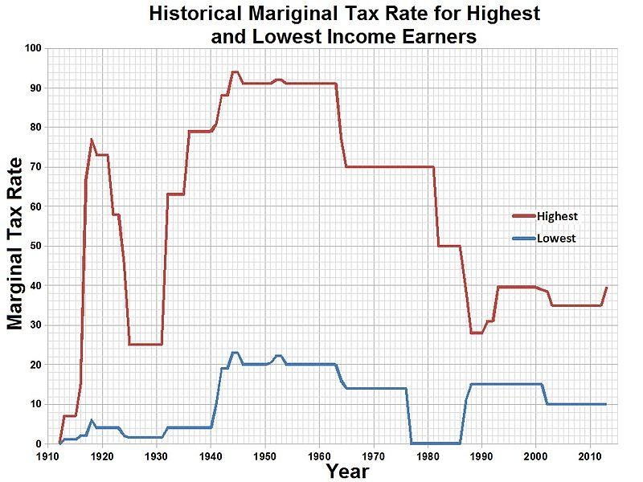

## Table of Contents

## What is a maximum wage?

A maximum wage is a limit on how much money someone can earn in a year. It's like a ceiling that stops people from making more money than a certain amount, no matter how hard they work or how successful they are. Governments or organizations might set a maximum wage to try to make things fairer, so the difference between the highest and lowest earners isn't too big.

Some people think a maximum wage is a good idea because it can help reduce inequality. If the top earners can't make too much more than everyone else, it might mean more money for everyone else, like through taxes or better wages for lower-paid workers. But others worry that a maximum wage could make it hard to reward people for doing really well or working really hard. They think it might stop people from trying their best if they know they can't earn more than a certain amount.

## Why is the concept of a maximum wage proposed?

The concept of a maximum wage is proposed mainly to reduce the big gap between the rich and the poor. Some people think it's not fair that a few people earn a lot more money than everyone else. By setting a limit on how much anyone can earn, a maximum wage could help make things more equal. If the very rich can't earn more than a certain amount, they might have to pay more in taxes, which could then be used to help people who earn less.

Another reason for proposing a maximum wage is to change how companies pay their top people. Sometimes, bosses and CEOs get paid a lot more than their workers, even if the company isn't doing that well. A maximum wage could make companies think more about paying everyone fairly, not just the people at the top. This could lead to better wages for everyone and might make the workplace feel more like a team.

## How does a maximum wage differ from a minimum wage?

A maximum wage and a minimum wage are two different ideas about how much people should earn. A minimum wage is the lowest amount of money someone can be paid for their work. It's like a floor that stops people from being paid too little. Governments set a minimum wage to make sure workers can afford basic things like food and a place to live. It helps protect workers from being paid unfairly low wages.

On the other hand, a maximum wage is the highest amount of money someone can earn. It's like a ceiling that stops people from [earning](/wiki/earning-announcement) too much. Some people think a maximum wage could help make things more equal by limiting how much the richest people can earn. This could mean more money for everyone else, maybe through higher taxes on the rich. While a minimum wage aims to help the lowest earners, a maximum wage focuses on limiting the highest earners to reduce the gap between rich and poor.

## What are the potential economic impacts of implementing a maximum wage?

Implementing a maximum wage could have several effects on the economy. One big impact might be on how much people want to work. If people know they can't earn more than a certain amount, they might not work as hard or take on extra jobs. This could mean less work gets done overall, which could slow down the economy. Also, businesses might have a harder time finding and keeping the best workers if they can't offer higher pay. This could make it tough for companies to grow and do well.

Another effect could be on how money is shared in the economy. With a maximum wage, the very rich wouldn't be able to keep earning more and more. This could mean more money for everyone else, maybe through higher taxes on the rich. If the government uses this extra money to help people who earn less, it could make things more equal. But it could also mean less money for the rich to spend or invest, which might slow down parts of the economy that depend on their spending.

Overall, a maximum wage could change how the economy works in big ways. It might make things more equal, but it could also make people work less and make it harder for businesses to grow. It's a tricky balance, and different people might see the impacts differently depending on what they care about most.

## Are there any countries or regions that have tried implementing a maximum wage?

Some places have tried to limit how much people can earn, but not many have used a strict maximum wage like a hard limit on yearly earnings. One example is the United States during World War II. The government set limits on salaries to stop companies from competing too much for workers when many were needed for the war effort. It wasn't exactly a maximum wage for everyone, but it was a way to control how much certain people could earn.

Another example is in Switzerland, where people voted on a proposal in 2013 to limit the pay of company bosses to no more than 12 times the salary of their lowest-paid worker. This idea, called the "1:12 initiative," didn't pass, but it shows that some places have thought about ways to limit how much the top earners can make compared to others. While these examples aren't full maximum wage systems, they show that the idea has been considered in different ways around the world.

## How might a maximum wage affect income inequality?

A maximum wage could help reduce income inequality by putting a limit on how much the richest people can earn. If the very rich can't make more than a certain amount, the gap between them and everyone else might get smaller. This could mean more money for people who earn less, maybe through higher taxes on the rich. If the government uses this extra money to help lower-paid workers, it could make things more equal. For example, the money could go towards better public services or higher wages for those at the bottom.

However, a maximum wage could also have some downsides. If people know they can't earn more than a certain amount, they might not work as hard or take on extra jobs. This could mean less work gets done overall, which might slow down the economy. Also, businesses might have a harder time finding and keeping the best workers if they can't offer higher pay. This could make it tough for companies to grow and do well, which might not help reduce income inequality in the long run. So, while a maximum wage could make things more equal in some ways, it could also have other effects that might make it harder to close the income gap.

## What are the arguments in favor of a maximum wage?

One big reason people like the idea of a maximum wage is that it could help make things more fair. Right now, some people earn a lot more money than others, and this big difference can make life hard for those who don't earn much. If there's a limit on how much anyone can earn, the very rich won't be able to keep getting richer and richer. This could mean more money for everyone else, maybe through higher taxes on the rich. The government could use this extra money to help people who earn less, like by making public services better or giving workers higher wages. This could make the gap between rich and poor smaller, which many people think is a good thing.

Another reason some people support a maximum wage is that it could change how companies pay their top people. Right now, bosses and CEOs often get paid a lot more than their workers, even if the company isn't doing that well. A maximum wage could make companies think more about paying everyone fairly, not just the people at the top. This could lead to better wages for everyone and might make the workplace feel more like a team. If companies pay their workers more fairly, it could help reduce the big difference between what the highest and lowest earners make, which could make the economy work better for everyone.

## What are the arguments against a maximum wage?

One big worry about a maximum wage is that it could make people not want to work as hard. If you know you can't earn more than a certain amount, you might not try as hard or take on extra jobs. This could mean less work gets done, which might slow down the whole economy. Also, businesses might have a hard time finding and keeping the best workers if they can't offer higher pay. If companies can't pay more to get the best people, it could be tough for them to grow and do well.

Another problem with a maximum wage is that it might not be fair to everyone. Some people think that if you work really hard or do a great job, you should be able to earn more money. A maximum wage could stop people from being rewarded for doing well. This could make people feel like their hard work doesn't matter, which might make them unhappy or less likely to try their best. Plus, it could be hard to decide what the right maximum wage should be, and different people might think it's too high or too low.

## How would a maximum wage be enforced?

To enforce a maximum wage, the government would need to keep track of how much money people earn. They could do this by making companies report how much they pay their workers. If someone earns more than the maximum wage, the government might take away the extra money through taxes. This would mean that no matter how much a person earns in a year, they would only get to keep up to the maximum amount. The government could also check people's bank accounts and other records to make sure they are not hiding money or getting paid in secret ways.

There could be rules and fines for companies that break the maximum wage law. If a company pays someone more than the limit, they might have to pay a big fine or face other punishments. This would make companies think twice before paying too much. The government might also set up a special group to watch over how much people earn and make sure everyone follows the rules. This group could look into any reports of people earning too much and take action to stop it.

## What industries or sectors might be most affected by a maximum wage?

The industries that might be most affected by a maximum wage are those where people can earn a lot of money, like finance and technology. In finance, people like bankers and traders often make big bonuses on top of their regular pay. If there's a maximum wage, these bonuses might have to be smaller or go away completely. This could make it hard for banks to keep their best workers. In technology, top engineers and executives can also earn a lot. A maximum wage could mean they can't get paid as much as they used to, which might make them look for jobs in other countries where they can earn more.

Another sector that could be hit hard by a maximum wage is sports and entertainment. Top athletes, actors, and musicians often make millions of dollars a year. If there's a limit on how much they can earn, they might not want to work as hard or could even leave the country to make more money somewhere else. This could mean fewer big stars in movies, sports, and music, which could change what people watch and enjoy. These industries rely a lot on big pay to attract the best talent, so a maximum wage could really shake things up.

## How could a maximum wage policy be designed to minimize negative impacts?

To make a maximum wage policy work without causing too many problems, it's important to think about how to keep people motivated to work hard. One way to do this could be to let people earn more than the maximum wage, but only if they put the extra money into things like retirement funds or charity. This way, people can still feel rewarded for doing well, but the money doesn't just go into their pockets. Another idea is to make the maximum wage higher for certain jobs that are really important or hard to fill. This could help keep the best workers in those jobs, like doctors or engineers, without making the gap between rich and poor too big.

Another thing to consider is how to make sure companies don't find ways around the maximum wage rules. The government could set up a group to watch over how much people earn and make sure everyone follows the rules. They could also make the rules clear and easy to understand, so companies know what they can and can't do. If a company breaks the rules, they could face big fines or other punishments. This would make companies think twice before trying to pay people too much. By being smart about how the policy is set up and enforced, a maximum wage could help make things more fair without causing too many problems for the economy.

## What are the long-term societal implications of a maximum wage?

A maximum wage could change society in big ways over time. If there's a limit on how much people can earn, it might make things more equal. The rich wouldn't be able to keep getting richer and richer, and this could mean more money for everyone else. The government could use the extra money from higher taxes on the rich to help people who earn less. This could lead to better schools, hospitals, and other public services, making life better for a lot of people. It might also make people feel like the system is fairer, which could help bring people together and reduce anger about big differences in wealth.

But there could also be some problems. If people know they can't earn more than a certain amount, they might not work as hard or take on extra jobs. This could slow down the economy because less work gets done. Also, businesses might have a hard time finding the best workers if they can't offer higher pay. This could make it tough for companies to grow and do well, which might mean fewer jobs and less money for everyone. So, while a maximum wage could make things more equal, it could also make the economy weaker in the long run.

## References & Further Reading

[1]: Bergstra, J., Bardenet, R., Bengio, Y., & Kégl, B. (2011). ["Algorithms for Hyper-Parameter Optimization."](https://papers.nips.cc/paper/4443-algorithms-for-hyper-parameter-optimization) Advances in Neural Information Processing Systems 24.

[2]: ["Advances in Financial Machine Learning"](https://www.amazon.com/Advances-Financial-Machine-Learning-Marcos/dp/1119482089) by Marcos Lopez de Prado

[3]: ["Evidence-Based Technical Analysis: Applying the Scientific Method and Statistical Inference to Trading Signals"](https://www.amazon.com/Evidence-Based-Technical-Analysis-Scientific-Statistical/dp/0470008741) by David Aronson

[4]: ["Machine Learning for Algorithmic Trading"](https://github.com/stefan-jansen/machine-learning-for-trading) by Stefan Jansen

[5]: ["Quantitative Trading: How to Build Your Own Algorithmic Trading Business"](https://www.amazon.com/Quantitative-Trading-Build-Algorithmic-Business/dp/1119800064) by Ernest P. Chan