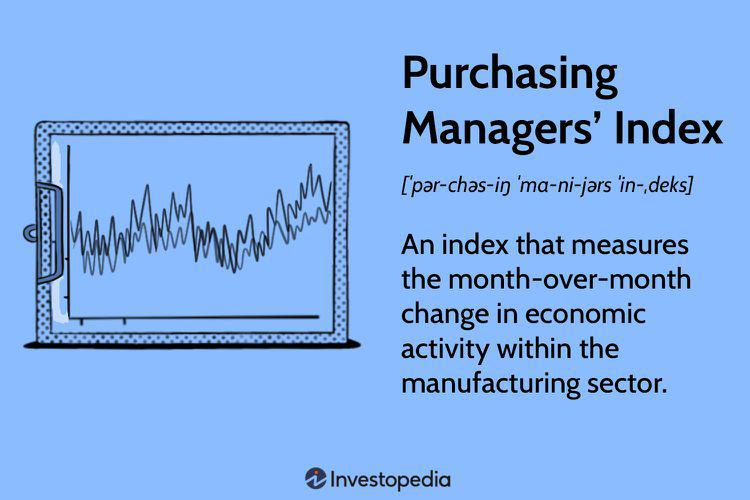

The real estate market plays a crucial role in the global economy, influencing everything from individual wealth to national economic stability. Its significance is underscored by its vast market size and its impact on industries such as construction, banking, and insurance. Real estate is not only a valuable asset but also a key driver of economic growth through its contributions to employment and GDP.

Mortgage indices are essential tools for understanding the dynamics of the real estate market. These indices, which track various mortgage-related data, serve as indicators of housing market trends and overall economic health. By analyzing mortgage indices, investors and policymakers can forecast market movements and make informed decisions. Among these, the Mortgage Bankers Association (MBA) Purchase Index is particularly noteworthy. This index specifically measures the volume of mortgage loan applications for home purchases, providing a snapshot of housing demand and consumer confidence in the market.

In recent years, algorithmic trading has emerged as a transformative force in real estate investment. By leveraging advanced computational methods, traders can analyze large datasets and execute trades with precision and speed that were previously impossible. This has not only increased the efficiency of real estate markets but has also opened new avenues for investment strategies.

The purpose of this article is to explore the intersection of mortgage indices like the MBA Purchase Index and algorithmic trading in real estate investments. We aim to provide a comprehensive understanding of how these tools and strategies enhance the capabilities of investors and contribute to a more dynamic and sustainable real estate market. Through this exploration, we will uncover the potential risks and considerations associated with these practices, ultimately offering insights into the future of real estate investment.

## Table of Contents

## Understanding Mortgage Indices

Mortgage indices are crucial tools used to gauge and interpret the dynamics of the real estate market. Fundamentally, these indices quantify various aspects of the mortgage sector, providing insights into trends such as loan application volume, interest rate changes, and refinancing activity. Mortgage indices act as economic indicators, helping to predict future economic activity and reflecting the financial health of the housing sector. They serve both private investors and policymakers by offering data-driven insights required for informed decision-making.

### Definition and Explanation of Mortgage Indices

Mortgage indices are statistical measures that track mortgage lending activity over time. They are constructed using data from loan applications, accepted loans, mortgage rates, and other relevant financial figures. An index reflects the movements within the mortgage market, providing a benchmark for assessing conditions and trends. Mortgage indices are often expressed in percentage terms or as a composite number, representing either aggregate activity or specific segments of the market.

### Mortgage Indices as Economic Indicators

Mortgage indices are powerful economic indicators for several reasons. First, they reflect consumer demand for home purchases, which is directly linked to broader economic conditions such as employment rates and consumer confidence. An increase in mortgage applications, for instance, often signals greater consumer willingness to invest in real estate, suggesting economic growth. Conversely, a decline might imply economic contraction or tighter lending conditions. Furthermore, mortgage indices can help forecast housing market trends, providing early warnings of potential bubbles or downturns.

### Different Types of Mortgage Indices

Several types of mortgage indices are utilized by various stakeholders. Prominent among them is the Mortgage Bankers Association (MBA) Purchase Index, which measures the [volume](/wiki/volume-trading-strategy) of mortgage loan applications for home purchases. Other types include the MBA Refinance Index, which monitors refinancing activity, and the Freddie Mac Primary Mortgage Market Survey (PMMS), providing data on average mortgage rates.

Each index serves a unique purpose. The MBA Purchase Index, for example, is a leading indicator of housing market activity, offering a glimpse into future home sales volume. It calculates the number of mortgage applications based on a sample of mortgage bankers, commercial banks, and thrifts.

### Importance of Mortgage Indices for Investors and Policymakers

Mortgage indices are invaluable for investors seeking to understand real estate market trends and evaluate investment opportunities. They facilitate market timing and risk assessment, aiding in the strategic allocation of resources. Policymakers also rely on these indices to guide economic policy decisions. Fluctuations in mortgage indices can influence monetary policy, prompting adjustments to interest rates or housing regulations to stabilize economic conditions. By analyzing these indices, policymakers can better address housing market challenges and promote sustainable economic growth.

In summary, mortgage indices are indispensable tools for capturing and forecasting the state of the mortgage market. They provide critical insights that influence decision-making processes for both investors and policymakers, contributing to the efficient functioning of the real estate sector.

## Exploring the MBA Purchase Index

The Mortgage Bankers Association (MBA) Purchase Index is a key economic indicator within the housing market sector, providing insights into mortgage loan applications for home purchases. It serves as a vital tool for analysts, investors, and policymakers to assess the demand and activity within the housing market.

The MBA Purchase Index is calculated based on the weekly mortgage applications submitted by large mortgage lenders. Mortgage data is gathered and analyzed to represent changes in the demand for home purchases across the United States. Each week, the index is released as part of the MBA's Weekly Mortgage Applications Survey, where it is expressed as a normalized number adjusted for seasonal variations to provide a more accurate reflection of market conditions. The formula for the index can be summarized as:

$$
\text{MBA Purchase Index} = \left( \frac{\text{Current Period Applications}}{\text{Base Period Applications}} \right) \times 100
$$

The index is crucial in identifying trends within the housing market. As a leading indicator, it offers foresight into future home sales activity and economic shifts by reflecting consumer sentiment and financial accessibility. A rising index often predicts increased real estate transactions, contributing to economic growth, while a declining index may signal a slowdown, affecting various economic sectors like construction and retail.

One of the strengths of the MBA Purchase Index lies in its real-time measurement of home purchasing demand, allowing stakeholders to react to market changes with agility. Additionally, the seasonal adjustment accounts for inherent fluctuations like holiday periods, making the data more reliable across different times of the year.

However, the MBA Purchase Index also presents limitations. It relies heavily on data from large lenders and might not fully represent smaller lending institutions or private transactions, potentially skewing the overall market picture. Moreover, being a weekly index, it can exhibit high variability, which might be misleading without considering longer-term trends.

In summary, the MBA Purchase Index is an essential tool for understanding housing market dynamics, highlighting consumer demand, and predicting economic health. Despite its limitations, it remains a critical component for decision-making within real estate and financial sectors.

## Algorithmic Trading in Real Estate

Algorithmic trading, a method of executing orders using automated pre-programmed trading instructions accounting for variables such as time, price, and volume, has revolutionized financial markets. Its application extends beyond traditional equity markets to real estate investment, where it plays an increasingly influential role. By harnessing sophisticated algorithms, investors can make data-driven decisions, optimize trading strategies, and ultimately gain a competitive edge in the market.

In real estate investment, [algorithmic trading](/wiki/algorithmic-trading) is transforming how transactions are conducted, primarily through automation and enhanced data analysis. Algorithms can swiftly process vast amounts of data, identifying patterns and trends that might elude human analysts. This capability is particularly beneficial in real estate, where market conditions and property values fluctuate constantly. By employing algorithms, investors can execute trades based on predictive models rather than relying on conventional, often slower, decision-making processes.

Several types of algorithms are utilized in real estate mortgage trading. Rule-based algorithms, for instance, execute trades based on a fixed set of criteria, such as changes in mortgage indices or fluctuations in interest rates. Machine learning algorithms, on the other hand, adapt by learning from new data inputs, thereby improving over time. These algorithms can analyze historical data to predict future trends, making them invaluable for forecasting mortgage rate movements.

The advantages of algorithmic trading for real estate investors are manifold. Automation reduces the need for manual intervention, lowering the risk of human error and increasing efficiency. Algorithms also enable high-frequency trading, which can boost [liquidity](/wiki/liquidity-risk-premium) and provide more opportunities to capitalize on market inefficiencies. Additionally, by implementing algorithmic strategies, investors can diversify their portfolios more effectively, spreading risk across various property types and geographical locations. 

For real estate investors willing to adopt technology-driven approaches, algorithmic trading offers the potential for enhanced returns and greater insights into market dynamics. With ever-advancing technologies, the integration of algorithmic trading in real estate continues to grow, promising to reshape the landscape of property investment in the coming years.

## The Interplay Between MBA Purchase Index and Algo Trading

Traders increasingly rely on the Mortgage Bankers Association (MBA) Purchase Index as a crucial input in algorithmic trading strategies focused on the real estate market. This index offers a standardized measure of mortgage application activity, serving as a proxy for assessing housing market trends and consumer purchasing intentions. By integrating this data into algorithms, traders can gain insights into future housing market movements, thereby influencing investment decisions.

**Predictive Analytics and Data Interpretation Using the Index**

Algorithmic trading systems use predictive analytics to extract meaningful insights from the MBA Purchase Index. These analytics involve statistical techniques to identify patterns and correlate the index with broader economic indicators. Traders typically employ [machine learning](/wiki/machine-learning) models to process historical data from the index, aiming to forecast future property price trends and market demand fluctuations. Commonly used models include linear regression, neural networks, and support vector machines. For example, a linear regression might look like:

$$
y = \beta_0 + \beta_1 \times \text{MBA\_Index} + \epsilon
$$

where $y$ denotes an economic variable of interest, $\beta_0$ is the intercept, $\beta_1$ is the coefficient for the MBA Purchase Index, and $\epsilon$ is the error term. Traders tune these models by adjusting parameters and selecting features that best predict outcomes.

**Examples of Trading Models that Incorporate the MBA Purchase Index**

Several trading models have successfully incorporated the MBA Purchase Index:

1. **Mean Reversion Models**: These models predict that economic variables will return to their historical averages over time. If the index indicates unusually high activity, the model may forecast an eventual drop, suggesting a sell strategy before prices correct.

2. **Trend-Following Models**: These models exploit the momentum in mortgage application trends as indicated by the MBA Purchase Index. Using moving averages and other momentum-based signals, these models generate buy or sell recommendations aligned with observed trends.

3. **Macro-Factor Models**: By integrating the MBA Purchase Index with macroeconomic factors such as employment rates and GDP growth, these models offer comprehensive insights. They assist traders in making strategies that account for broader economic influences.

**Case Studies or Examples of Success Stories**

A notable example involves a [hedge fund](/wiki/hedge-fund-trading-strategies) utilizing the MBA Purchase Index in its quantitative strategy, which led to significant returns during a volatile housing market period. By aligning the fund's trading algorithm with index fluctuations, the fund outperformed peers by accurately predicting market downturns and upturns. Similarly, real estate investment firms have integrated the index into their decision-making processes, allowing them to adjust property portfolios ahead of market movements effectively.

Such success stories highlight the efficacy of using the MBA Purchase Index in conjunction with algorithmic trading strategies. By leveraging predictive analytics and data-driven models, traders can make informed decisions, potentially leading to favorable investment outcomes in the real estate market.

## Risk and Considerations

Algorithmic trading in mortgages involves using advanced mathematical models and high-frequency trading systems to capitalize on movements in the housing market. However, this approach is not devoid of risks. One significant risk is the impact of volatile market conditions on trading strategies. When the market experiences sudden fluctuations, algorithmic models may fail to adapt swiftly, potentially leading to significant financial losses. Algorithms designed for stable market environments may not perform well under stress, necessitating the development of robust models capable of handling extreme [volatility](/wiki/volatility-trading-strategies) and unexpected events.

Regulatory considerations are another critical aspect for algorithmic traders in mortgages. The financial sector is heavily regulated, and these regulations continue to evolve as the market and technology progress. Traders must comply with a myriad of rules set by entities such as the Securities and Exchange Commission (SEC) and Commodity Futures Trading Commission (CFTC) in the United States. Ensuring compliance involves adhering to guidelines on market manipulation, insider trading, and maintaining transparency in trading activities. Algorithmic traders must implement systems to ensure their operations are within legal boundaries and keep abreast of any regulatory changes that may affect their strategies.

Risk management strategies are essential for investors utilizing mortgage indices in their algorithmic trading. Effective risk management involves not only diversifying trading portfolios but also implementing stop-loss orders, which automatically sell assets when they reach a certain price threshold. This can mitigate potential losses during sudden market downturns. Additionally, scenario analysis and stress testing models can be employed to predict and prepare for adverse market conditions. By incorporating these risk management tools, investors can safeguard their investments against unforeseen market movements, while leveraging the predictive power of mortgage indices to inform their trading decisions.

## Conclusion: The Future of Real Estate Investment

The MBA Purchase Index plays a crucial role in real estate investments by serving as a reliable indicator of housing market activity. This index provides investors with insights into the demand for home purchase applications, enabling them to gauge market sentiment and make informed decisions. Its use in algorithmic trading further underscores its importance, as traders leverage this data to develop models that can predict short to medium-term trends in real estate markets. By analyzing the MBA Purchase Index alongside other economic indicators, investors can enhance their decision-making processes and optimize their portfolios.

Looking ahead, several trends are poised to shape the future of algorithmic trading in real estate. The integration of [artificial intelligence](/wiki/ai-artificial-intelligence) and machine learning models is expected to bring about a new era of precision and speed in trade execution. These technologies can process vast datasets beyond traditional indices, incorporating non-traditional data sources like social media sentiment and geospatial analysis. Additionally, quantum computing may offer enhanced computational power, allowing the development of complex trading algorithms that could further refine predictive accuracy.

Technology continues to evolve the landscape of real estate markets by increasing transparency and accessibility. Blockchain, for example, is being explored to facilitate secure and efficient property transactions. Augmented and virtual reality applications provide potential buyers with immersive viewing experiences, shifting traditional market dynamics. Furthermore, the Internet of Things (IoT) is enhancing property management by enabling real-time tracking of environmental conditions and property analytics.

The sustainable growth of real estate investments using indices like the MBA Purchase Index depends on continuous innovation in data collection and analysis. As technology advances, the ability to access and interpret diverse datasets will become increasingly vital. The combination of robust indices and cutting-edge technology promises a future where real estate investment strategies are not only more precise but also more aligned with broader economic and societal trends. Policymakers, investors, and technologists will need to collaborate to foster an environment that supports both innovation and stability, ensuring sustainable growth in real estate investments.

## References & Further Reading

[1]: ["Mortgage Bankers Association (MBA) - Research and Economics"](https://www.mba.org/news-and-research/research-and-economics) - Explore comprehensive data on mortgage applications, including the MBA Purchase Index.

[2]: Lopez de Prado, M. (2018). ["Advances in Financial Machine Learning"](https://www.amazon.com/Advances-Financial-Machine-Learning-Marcos/dp/1119482089) - This book investigates into machine learning techniques applicable to finance and trading, including real estate markets.

[3]: Aronson, D. (2006). ["Evidence-Based Technical Analysis: Applying the Scientific Method and Statistical Inference to Trading Signals"](https://www.amazon.com/Evidence-Based-Technical-Analysis-Scientific-Statistical/dp/0470008741) - This resource provides insights into technical analysis methods that support data-driven trading strategies.

[4]: ["Mortgage Bankers Association's Weekly Mortgage Applications Survey"](https://www.mba.org/news-and-research/research-and-economics/single-family-research/weekly-applications-survey) - The survey includes detailed reports on the MBA Purchase Index and is a key resource for understanding market dynamics.

[5]: Chan, E. P. (2009). ["Quantitative Trading: How to Build Your Own Algorithmic Trading Business"](https://github.com/ftvision/quant_trading_echan_book) - This book covers the establishment and operation of an algorithmic trading business, relevant to real estate markets.

[6]: Jansen, S. (2020). ["Machine Learning for Algorithmic Trading"](https://github.com/stefan-jansen/machine-learning-for-trading) - A valuable guide on implementing machine learning algorithms in trading strategies, applicable to real estate investments and mortgage indices.