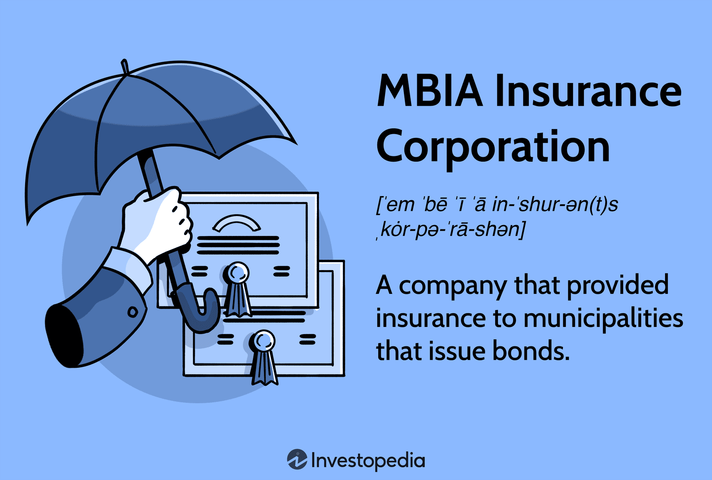

MBIA Insurance Corporation is a prominent entity within the financial industry, renowned for its provision of financial guarantee insurance. Established to insure municipal bonds, MBIA plays a critical role in enhancing the creditworthiness of these bonds, thereby bolstering investor confidence and facilitating lower borrowing costs for municipalities. By offering insurance on municipal bonds, MBIA effectively assures investors of the fulfillment of interest and principal payments, significantly impacting bond ratings. This function has become increasingly vital in the financial markets, particularly during times of economic uncertainty.

Financial services encompass a broad spectrum of products and functions that are essential to economic stability and growth. Among these, algorithmic trading has emerged as a revolutionary force, utilizing complex mathematical models and high-speed data processing to execute trades. Algorithmic trading analyzes markets to identify and capitalize on trading opportunities, often in fractions of a second. The intersection of this digital innovation with traditional financial services presents new dimensions and challenges that merit exploration.



This article aims to explore the intersection of MBIA Insurance and algorithmic trading within financial services. It is essential to comprehend the intricacies of financial guarantee insurance to appreciate the full spectrum of its implications for modern financial markets. Financial guarantee insurance serves as a pivotal mechanism to mitigate risk, particularly in the municipal bond market. 

Key themes of this article include an examination of MBIA Insurance Corporation's historical and current roles, the rise and significance of algorithmic trading, and the integration of these two domains in shaping the future of financial services. Consideration will also be given to how credit ratings are influenced by MBIA and the role of strategic adaptation in maintaining relevance and resilience in a rapidly evolving financial landscape. Understanding these complexities will provide insight into the advancing frontiers of financial services, influenced heavily by technological innovations and traditional insurance mechanisms.

## Table of Contents

## Understanding MBIA Insurance Corporation

MBIA Insurance Corporation, established in 1973, emerged as a pivotal entity within the financial sector, primarily due to its focus on providing municipal bond insurance. Originally founded as the Municipal Bond Insurance Association, MBIA's creation was spurred by the necessity to insure municipal bonds, which are debt securities issued by municipalities to fund public projects. By offering insurance, MBIA played a crucial role in enhancing the creditworthiness of these bonds, thereby making them more attractive to investors. This insurance effectively guaranteed the timely payment of principal and interest, mitigating the risk for bondholders.

Throughout its history, MBIA has been integral to bolstering confidence in the municipal bond market. The company's insurance services significantly influenced bond ratings, as insurance from a financially robust guarantor like MBIA could elevate a bond's credit rating. Higher ratings generally resulted in lower borrowing costs for municipalities, facilitating public infrastructure development and other essential services.

The 2008 global financial crisis posed substantial challenges for MBIA. As the crisis unfolded, the company faced significant financial strains due to its exposure to structured finance products, including mortgage-backed securities. The widespread default of these products necessitated substantial claim payouts. MBIA was forced to undergo significant restructuring, including splitting its municipal bond insurance and structured finance divisions to stabilize its operations.

Currently, MBIA Insurance Corporation has adapted to the transformed financial landscape, with a refocused commitment towards municipal bond insurance. The restructuring efforts have enabled MBIA to maintain a presence in the market, albeit with more conservative underwriting practices and a renewed emphasis on risk management. The company continues to offer municipal bond insurance, aiding municipalities in obtaining favorable financing terms, though its influence and market share have contracted in comparison to its pre-crisis stature.

MBIA's evolution exemplifies the resilience and adaptability required within the financial services industry. As a major player in the municipal bond insurance sector, MBIA's past and present efforts underscore the importance of financial guarantee insurance in facilitating public finance and economic growth.

## Financial Services and Algorithmic Trading

Financial services are a cornerstone of the modern economy, encompassing a broad range of services, including banking, investment, insurance, and more. These services facilitate the efficient management, investment, and transfer of money. By providing access to capital and credit, they enable businesses to fund operations and expansion, promote consumer spending, and support government projects.

Algorithmic trading is a technology-driven strategy that uses computer algorithms to execute financial market trades at speeds and frequencies that humans cannot achieve. Its inclusion in financial markets has grown significantly due to its ability to process a vast amount of data rapidly and execute trades within milliseconds. Algorithmic trading capitalizes on mathematical models and complex algorithms to make trading decisions, often taking advantage of minute price discrepancies or market inefficiencies.

This trading method has drastically reshaped investment strategies, allowing traders and financial institutions to implement more sophisticated market viewpoints. By analyzing large datasets within seconds, algorithms can identify profitable opportunities across global markets and execute strategies that range from simple mean reversion and trend-following to more advanced statistical [arbitrage](/wiki/arbitrage). This technological breakthrough has democratized some aspects of trading, granting both institutional and retail investors better opportunities for profit.

The benefits of [algorithmic trading](/wiki/algorithmic-trading) are numerous. It offers increased transaction speeds and accuracy, reduced transaction costs due to low human intervention, and the ability to backtest strategies using historical data. Additionally, by removing the emotional bias inherent in human trading, algorithms can execute trades based solely on quantitative factors, thereby potentially increasing the profitability and consistency of trades.

Despite its advantages, algorithmic trading presents significant challenges. Market [liquidity](/wiki/liquidity-risk-premium) can be strained during periods of high-frequency trading, potentially leading to increased [volatility](/wiki/volatility-trading-strategies). Flash crashes—sudden, deep, and quick market price declines—also pose risks, as they can be triggered by algorithms reacting to market changes. Regulators and market participants continue to work on addressing and mitigating these risks, ensuring that algorithmic trading contributes positively to market transparency and stability.

Technology and automation have transformed financial services, making them more accessible and efficient. Automation reduces the cost of transactions and operations, while technology enhances the ability to analyze market trends, behaviors, and risks with greater precision. As technology continues to evolve, further integration of [machine learning](/wiki/machine-learning) and [artificial intelligence](/wiki/ai-artificial-intelligence) in financial services is expected, leading to more adaptive and responsive financial systems. In this rapidly changing landscape, firms that leverage these technological advancements will likely find themselves at the forefront of financial innovation and efficiency.

## MBIA's Role in Modern Financial Services

MBIA Insurance Corporation plays a vital part in modern financial services by enhancing the security and attractiveness of municipal bonds. Municipal bonds are debt securities issued by local governments or their agencies to finance public projects such as schools, roads, and hospitals. These bonds are critical for infrastructure development but can present risks for investors. MBIA mitigates these risks through insurance that guarantees bondholders receive scheduled interest and principal payments even if the issuer defaults. This insurance improves the creditworthiness of municipal bonds, making them more appealing to a broader range of investors and potentially reducing the borrowing costs for issuers by enabling a higher credit rating from agencies like Moody's and Standard & Poor's.

MBIA's integration with modern financial practices extends to algorithmic trading, which increasingly relies on sophisticated quantitative models that process vast amounts of data to make trading decisions at high speed. By certifying the credit quality of insured bonds, MBIA provides a distinct data point that can feed into these algorithmic models. Algorithms can use MBIA-backed bonds, with their reduced risk profiles, to optimize portfolio construction, risk management, and pricing strategies, ensuring that the automated processes remain aligned with investment goals while managing risk effectively.

Regarding credit ratings, MBIA's influence is significant. Credit ratings serve as an essential tool for investors to measure the risk profile of various securities. The backing of MBIA often means an enhanced credit rating for municipal bonds, as the insurer's guarantee adds a layer of security that reassures investors. This enhancement can lead to an increase in the bonds' marketability and liquidity, making them an attractive choice for both individual and institutional investors.

Numerous case studies exemplify the impact of MBIA-backed municipal bonds. For instance, consider a city issuing bonds to fund new school constructions. With MBIA's insurance, the bonds could achieve a higher credit rating than they would have on the city's credit strength alone. Consequently, the city might secure lower interest rates, translating to substantial savings over the life of the bonds. Such enhanced bonds see a greater demand in the market, confirming MBIA's pivotal role in municipal finance.

MBIA has also made strategic adaptations to navigate the evolving financial landscape. Post-2008 financial crisis, MBIA faced significant challenges, requiring a reassessment of its business model and risk management strategies. Recent efforts have included strengthening its capital reserves, refining underwriting criteria, and embracing technology to aid in risk assessment and operational efficiency. These measures reflect MBIA's readiness to align with technological advancements and regulatory changes that shape the financial services industry.

In summary, MBIA Insurance Corporation remains a cornerstone in modern financial services by fortifying municipal bonds, aiding investment strategies within algorithmic trading, and strategically evolving to maintain its influence in a rapidly changing financial environment.

## The Future of MBIA in Algorithmic Trading

MBIA Insurance Corporation, a pivotal player in financial guarantee insurance, stands at the crossroads of innovation and tradition as it contemplates its future interactions with algorithmic trading. With rapid technological advancements reshaping industries, MBIA has significant opportunities to integrate these technologies into its operations, particularly in risk assessment and management.

Algorithmic trading, characterized by the use of complex algorithms to automatically execute trades, offers potential synergies with MBIA's insurance models. By leveraging algorithmic models, MBIA can enhance its ability to assess risks associated with financial guarantees more accurately. Algorithms could be designed to process vast amounts of data, including historical bond performance, market trends, and economic indicators, thereby enabling MBIA to make more informed decisions regarding the underwriting process. An example of a risk assessment algorithm might involve statistical models such as logistic regression, which can predict the probability of a bond default based on multiple risk factors.

```python
import numpy as np
from sklearn.linear_model import LogisticRegression

# Sample training data (features: interest rates, debt ratio; label: default probability)
X_train = np.array([[0.02, 0.4], [0.03, 0.6], [0.05, 0.5], [0.07, 0.7]])
y_train = np.array([0, 0, 1, 1])

# Create and train logistic regression model
model = LogisticRegression()
model.fit(X_train, y_train)

# Predict default probability for new data
X_new = np.array([[0.04, 0.5]])
default_prob = model.predict_proba(X_new)[:, 1]
print("Predicted default probability:", default_prob)
```

The insurance and trading industries are on the cusp of several technological advancements, such as blockchain technologies, artificial intelligence (AI), and machine learning techniques. Blockchain can provide transparency and security in transactional data, which could enhance MBIA's operational efficiencies. AI and machine learning offer predictive analytics capabilities that can improve the accuracy of risk assessments, enhancing MBIA's ability to underwrite insurance with a higher degree of precision.

MBIA is expected to innovate by pursuing strategic partnerships with technology firms specializing in fintech innovations. Such alliances could result in the development of bespoke algorithmic tools tailored to the specific needs of financial guarantee insurance. Moreover, MBIA might explore the incorporation of big data analytics to track and respond to emerging trends in financial markets, positioning itself as a forward-thinking entity in the industry.

Conclusively, MBIA's potential paths forward amidst technological growth involve a comprehensive embrace of modern technologies to optimize its core operations. By integrating algorithmic trading strategies and advanced data analytics, MBIA not only advances its risk assessment capabilities but also solidifies its role in contemporary financial services. As the financial landscape continues to evolve, MBIA's adaptability and strategic foresight will determine its success in navigating and capitalizing on these technological transformations.

## Conclusion

The foray into the intersection of MBIA Insurance Corporation and algorithmic trading has revealed a significant blend of traditional financial services with modern technological advancements. MBIA has played a pivotal role in enhancing the credit ratings and marketability of municipal bonds through its insurance products, fundamentally influencing investment strategies.

As the financial industry continues to be reshaped by algorithms and automation, the seamless integration of these technologies with traditional financial practices is essential. Algorithmic trading, with its ability to process and analyze vast amounts of data, offers both unprecedented opportunities and challenges in terms of risk management and strategic investment. MBIA’s potential engagement with such technologies could redefine its existing paradigms, allowing for more sophisticated risk assessments and strategic maneuvering.

The sustainability and evolution of financial guarantee services, exemplified by MBIA, depend on their agility and adaptability in a rapidly changing environment. It's crucial for market players to remain informed about advancements in financial technologies to sustain their relevance and competitive advantage.

Acknowledging the complexity of these evolving systems highlights MBIA's capacity to adapt and innovate amidst the ongoing technological revolution. Stakeholders are encouraged to embrace change to strategically leverage new tools and methodologies presented by cutting-edge technologies in finance. As MBIA navigates future challenges, its continued success will be a testament to its commitment to innovation, providing a blueprint for others in the industry to emulate.

## References & Further Reading

[1]: Dodd, R. (2007). ["Subprime: Tentacles of a Crisis."](https://www.imf.org/external/pubs/ft/fandd/2007/12/pdf/dodd.pdf) Finance & Development, December 2007.

[2]: Fang, C., Francis, B., & Hasan, I. (2012). ["Effects of Credit Rating Agency Downgrades."](https://onlinelibrary.wiley.com/doi/10.1111/j.1475-6803.2012.01320.x) Journal of Banking & Finance.

[3]: ["MBIA Inc."](https://www.mbia.com/) Bloomberg.

[4]: Lo, A. W. (2017). ["Adaptive Markets: Financial Evolution at the Speed of Thought."](https://www.amazon.com/Adaptive-Markets-Financial-Evolution-Thought/dp/0691135142) Princeton University Press.

[5]: Narang, R. K. (2009). ["Inside the Black Box: The Simple Truth About Quantitative Trading."](https://onlinelibrary.wiley.com/doi/book/10.1002/9781118267738) Wiley.