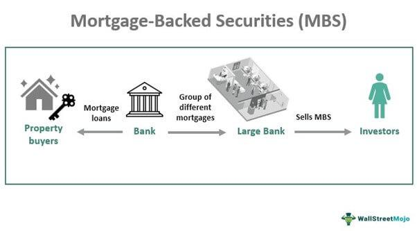

Mortgage-backed securities (MBS) are unique financial instruments that play a crucial role in financial markets, offering a mechanism through which investors can gain exposure to the real estate sector. Structurally, an MBS represents a collection of mortgage loans, bundled together to form an investment product. Investors in MBS receive periodic payments derived from the principal and interest payments made by homeowners on their mortgages. This makes MBS an attractive investment for those seeking steady income streams, although they come with their own set of risks.

This article examines the concept of MBS pool numbers, key identifiers for navigating the complex landscape of mortgage-backed securities. Understanding these numbers is vital for investors and market participants in terms of trading and valuation. MBS pool numbers provide critical information about the underlying mortgage loans, influencing investment strategies and valuations.



Incorporating electronic trading platforms and algorithmic trading into the MBS market has significantly changed how these securities are traded. These technological advances enable efficient data analysis, allowing traders to make better-informed investment decisions and execute trades with increased precision. Algorithmic trading involves the use of complex algorithms to analyze data sets, including MBS pool numbers, to identify patterns and predict future trends.

Historically, mortgage-backed securities have been central to the functioning of financial markets, notably playing a role in the 2008 financial crisis. Understanding the mechanics behind MBS, including the significance of pool numbers, is essential for participants aiming to navigate these markets effectively. As digital trading continues to evolve, the role of MBS in financial markets is likely to grow, further emphasizing the importance of understanding pool numbers for investment success.

## Table of Contents

## What Are MBS Pool Numbers?

Mortgage-backed securities (MBS) pool numbers are unique identifiers assigned to pools of mortgage loans that have been grouped to create a single MBS. These numbers are critical for both identifying and retrieving specific information about the loans contained within a security. Typically, a pool number will consist of digits that reference the issuing entity, the year of issuance, and the sequence of the pool. They serve multiple functions, especially in helping investors and traders monitor the characteristics, performance, and other granular details of an MBS.

Understanding MBS pool numbers allows market participants to obtain essential data such as interest rates, the geographical location of the properties, and the types of loans included within the pool. This information is indispensable for making informed investment choices. For instance, if an investor needs to evaluate the risk profile of a mortgage-backed security, they can use the pool number to access data that informs them about the credit quality, default rates, and prepayment speeds of the loans in the pool.

The unique nature of each pool number also assists in ensuring that traders and investors can differentiate between various securities, thereby providing clarity and reducing the likelihood of errors in transactions. This capability is particularly important as MBS can have varying structures and risk characteristics. By offering a straightforward method for sorting and analyzing these financial instruments, pool numbers enable the effective management of portfolios and support transparency in the MBS trading process.

Moreover, as the financial industry increasingly adopts electronic trading systems, the precise identification offered by pool numbers becomes even more integral. These numbers facilitate the integration of MBS data into electronic trading platforms, thus allowing for accurate pricing, assessment, and trading algorithm execution. As such, MBS pool numbers are not just identifiers, but essential tools for navigating the complexities of mortgage-backed securities markets.

## How MBS Pools Are Created

Mortgage-backed securities (MBS) pools are created by aggregating a group of mortgage loans with similar characteristics into a consolidated investment vehicle. This process begins when banks and financial institutions originate mortgage loans, which they subsequently sell to either government-sponsored enterprises (GSEs) like Fannie Mae and Freddie Mac or private entities. These entities then bundle these individual loans into pools based on certain shared characteristics such as interest rates, loan maturities, and credit quality.

Once these pools are formed, they are structured into mortgage-backed securities, each assigned a unique pool number for identification and tracking purposes. This unique identifier allows investors to gain insights into the specific characteristics of the underlying mortgage loans. The pooling process is critical because it transforms individual mortgage loans, which may vary significantly in terms of risk and yield, into a standardized financial product that can be traded in the secondary market.

The creation of MBS pools can be illustrated through a simplified example: Suppose a financial institution has issued 100 mortgage loans, each with different terms and conditions. This institution can segregate these loans into groups based on similar characteristics—say, 30-year fixed-rate mortgages with an [interest rate](/wiki/interest-rate-trading-strategies) between 3% and 4%. These similar loans are grouped together into a pool, assigned a pool number, and then sold as a single MBS to investors.

The sale of MBS can enhance [liquidity](/wiki/liquidity-risk-premium) in the mortgage market by allowing the originating institutions to offload risk and replenish their capital to issue new loans. It also provides diversification benefits to investors, as they can invest in a broad pool of mortgages rather than a single loan. Additionally, the standardization brought about by pooling facilitates the application of [algorithmic trading](/wiki/algorithmic-trading) strategies, where large datasets, including pool numbers, are analyzed to identify profitable trading opportunities.

Overall, the creation of MBS pools is a crucial step in the securitization process, allowing for the generation of investable securities from individual mortgage loans and providing a mechanism for risk distribution across a wider pool of investors.

## Understanding the Importance of Pool Numbers

Mortgage-backed securities (MBS) pool numbers are pivotal in the financial markets because they provide more than mere identification; they offer detailed insights into the characteristics of the security. Each pool number corresponds to a specific set of mortgage loans bundled together, providing essential information for traders and investors. These identifiers allow quick access to granular data, such as interest rates, geographical distribution, and the types of mortgages contained within the pool.

This comprehensive information is critical for assessing both the risk and potential value of an MBS. For example, a trader looking at a specific pool number can determine the average interest rate of the loans within the pool. Such insights can be used to evaluate the expected return on investment compared to other securities with different characteristics.

Geographical data linked to pool numbers can also significantly impact risk assessment. Mortgages concentrated in areas with fluctuating real estate markets might present higher risks, which can affect the pricing and attractiveness of the MBS to investors. Understanding the specific types of mortgages, such as fixed-rate or adjustable-rate, helps investors gauge the security's susceptibility to interest rate changes.

By leveraging the detailed data provided by MBS pool numbers, traders can refine their strategies to better assess the expected performance and associated risks of these securities. This ability to access and analyze specific information quickly is particularly advantageous in today's fast-paced trading environment, where rapid, data-driven decisions are paramount.

## MBS Pool Numbers vs. CUSIP Numbers

While both MBS pool numbers and CUSIP numbers serve as identifiers for financial securities, their functions and the type of information they convey differ significantly. CUSIP numbers—an acronym for the Committee on Uniform Securities Identification Procedures—are alphanumeric codes that uniquely identify financial instruments in the United States. These codes aid in the seamless transfer and settlement of securities by providing a standardized method of identification. CUSIP numbers are widely utilized across equity and fixed-income markets and are essential for activities such as trading, clearing, and settlement.

A typical CUSIP number consists of nine characters, where the first six characters uniquely identify the issuer, the next two characters denote the type of security, and the final character is a check digit used for validation purposes. For instance, a CUSIP number might look like "38259P508". Through CUSIP look-ups, detailed information about a security—such as its issuer, type, and specific characteristics—can be accessed, which is invaluable for financial analysts and traders.

In contrast, MBS pool numbers function more specifically in the mortgage-back securities market. These numbers are crucial for traders and investors who need immediate insights into the particular characteristics of an MBS. An MBS pool number represents a single pool of mortgage loans aggregated into a security, allowing market participants to identify and analyze the specific mortgages included, their geographic distribution, the interest rates, and other relevant data. This immediate level of detail enables assessments of prepayment risks, default risks, and overall performance potential, enhancing decision-making for investments in MBS.

In summary, while CUSIP numbers are universal identifiers used across various financial instruments and are critical for standard transactions, MBS pool numbers cater specifically to the mortgage-backed securities market, offering detailed insights required for specialized trading and investment strategies.

## Algorithmic Trading and MBS

Algorithmic trading, also known as automated trading, utilizes pre-programmed instructions and sophisticated algorithms to trade securities at speeds beyond human capability. This has significantly transformed the trading of securities, including mortgage-backed securities (MBS). Leveraging algorithmic trading enables market participants to process substantial amounts of data, identify patterns, and execute trades more quickly and efficiently.

MBS pool numbers are used within these algorithms to glean critical information about the pools of mortgage loans that constitute a mortgage-backed security. These numbers are unique identifiers that help traders access specific data regarding interest rates, credit quality, geographical distribution, and other mortgage characteristics. With this granularity, algorithms can assess the potential performance and risks associated with a given MBS.

One key advantage of algorithmic trading with MBS is the ability to exploit price inefficiencies and predict market trends. Algorithms can be coded to continually monitor MBS prices and assess factors such as interest rate movements, prepayment risks, and credit fluctuations in real-time. For example, an algorithm may employ a simple moving average strategy to identify buy and sell signals based on historical price data and MBS pool attributes:

```python
def simple_moving_average(prices, window):
    return sum(prices[-window:]) / window

# Example usage
prices = [100, 102, 104, 103, 105]
print(simple_moving_average(prices, 3))  # Output: 104.0
```

Moreover, [machine learning](/wiki/machine-learning) models can be implemented to analyze historical data and improve predictive capabilities. These models can learn from patterns in MBS pool numbers to generate insights for decision-making processes. The introduction of neural networks and other AI techniques has further enhanced the capacity for pattern recognition and predictive accuracy.

It is crucial for traders to accurately interpret MBS pool numbers, as they offer insights into the underlying loans' quality and expected future cash flows. Effective algorithmic strategies incorporating these numbers enhance trade execution and profitability by reducing latency and optimizing decision-making in the volatile MBS market.

As algorithmic trading continues to evolve, the role of precise and comprehensive data, such as MBS pool numbers, is increasingly pivotal in gaining a competitive edge in the financial markets.

## Risks and Considerations

Mortgage-backed securities (MBS) are complex financial instruments that expose investors to a range of risks, primarily prepayment and interest rate risks. An understanding of these risks is crucial for making informed investment decisions.

Prepayment risk arises when borrowers pay off their mortgages ahead of schedule, typically when interest rates fall, leading to refinancing. When prepayments occur, investors receive their principal back sooner than expected, which can result in a loss of interest income. MBS pool numbers provide detailed information on the composition of the pool, such as loan maturity dates and interest rates, which can help investors assess the likelihood of prepayments.

Interest rate risk is another significant [factor](/wiki/factor-investing) affecting MBS performance. Changes in interest rates can alter the expected cash flows of an MBS, impacting its price and yield. As interest rates rise, the value of existing MBS often falls due to the higher opportunity cost of newer, higher-yielding investments. Conversely, when interest rates decline, prepayment risk increases, as borrowers are more likely to refinance. By analyzing MBS pool numbers, investors can evaluate the sensitivity of an MBS to interest rate fluctuations and anticipate potential changes in its value.

To effectively manage these risks, investors can leverage MBS pool numbers to track specific data points such as the weighted-average coupon (WAC), the weighted-average maturity (WAM), and the loan-to-value (LTV) ratios of the underlying mortgages. These parameters offer insights into the financial characteristics of the mortgage pool, which can be crucial for forecasting the MBS's performance under different market conditions.

For instance, using Python, one can analyze data from MBS pool numbers to model prepayment speeds under various interest rate scenarios. This can involve Monte Carlo simulations or other quantitative techniques to predict outcomes based on historical data.

```python
import numpy as np

# Example of modeling prepayment risk
def simulate_prepayment_risk(pool_data, interest_rate_scenario):
    # pool_data: hypothetical pool data array (e.g., WAC, WAM, LTV)
    # interest_rate_scenario: array with potential future interest rate changes
    prepayment_speeds = []

    for rate_change in interest_rate_scenario:
        adjusted_speed = np.mean(pool_data) * (1 + rate_change)
        prepayment_speeds.append(adjusted_speed)

    return prepayment_speeds

# Example usage with hypothetical data
interest_rate_scenario = [-0.01, 0.0, 0.01, 0.02]  # scenarios of rate changes
pool_data = [0.045, 0.076, 0.062]  # hypothetical WACs of the pool

result = simulate_prepayment_risk(pool_data, interest_rate_scenario)
print(result)
```

Investment strategies can be adjusted accordingly based on the results, helping investors mitigate risks associated with MBS holdings. By thoroughly analyzing MBS pool numbers, investors can gain a clearer view of the risks involved and make more strategic decisions in relation to their risk tolerance and market expectations.

## Conclusion

Mortgage-backed securities (MBS) pool numbers are indispensable in the domain of trading and investment in these financial instruments. As unique identifiers, they serve as gateways to detailed information about the mortgage loans bundled within a specific MBS. This comprehensive dataset is vital for both assessing the intrinsic characteristics and predicting the performance of the securities.

In the rapidly evolving landscape of algorithmic trading, the importance of MBS pool numbers has grown significantly. Traders utilize these identifiers to obtain critical datasets such as interest rates, types of mortgages, and geographical [dispersion](/wiki/dispersion-trading). By feeding these parameters into trading algorithms, investors can optimize their trading strategies and gain a competitive edge. An algorithm might, for instance, scan through hundreds of pool numbers to identify securities likely to outperform based on historical data and current market conditions.

Moreover, understanding MBS pool numbers enables investors to better navigate associated risks, such as prepayment and interest rate risks. By diligently analyzing the characteristics revealed by pool numbers, traders can make more informed predictions about how different market scenarios might impact the value of an MBS.

In conclusion, MBS pool numbers are not merely identifiers but are keys to unlocking a wealth of information that can greatly influence investment outcomes. Mastering the insights provided by these numbers enhances the ability to execute successful trades, particularly in an era where algorithmic precision defines market success.

## References & Further Reading

[1]: Fabozzi, F. J. (2001). ["The Handbook of Mortgage-Backed Securities,"](https://academic.oup.com/book/7943) 6th Edition. Oxford University Press.

[2]: Vink, D., & Fabozzi, F. J. (2013). ["Credit Risk in European Securitizations: The Role of Issuer Convention in Pricing Residual Tranche."](https://paperswithbacktest.com/wiki/dollar-roll-definition-mechanism) The Journal of Fixed Income.

[3]: Gorton, G. B. (2010). ["Slapped by the Invisible Hand: The Panic of 2007."](https://papers.ssrn.com/sol3/papers.cfm?abstract_id=1401882) Oxford University Press.

[4]: Lopez de Prado, M. (2018). ["Advances in Financial Machine Learning."](https://www.amazon.com/Advances-Financial-Machine-Learning-Marcos/dp/1119482089) Wiley.

[5]: Fama, E. F., & French, K. R. (1993). ["Common risk factors in the returns on stocks and bonds."](https://www.sciencedirect.com/science/article/pii/0304405X93900235) Journal of Financial Economics, 33(1), 3-56.

[6]: Hull, J. C. (2012). ["Options, Futures, and Other Derivatives."](https://www.semanticscholar.org/paper/Options%2C-Futures%2C-and-Other-Derivatives-Hull/89bdee500c8623864fc9eb7a471546aa713acc44) 9th Edition. Pearson.

[7]: Moser, J. T., & Fabozzi, F. J. (1995). ["Mortgage-backed securities: Products, structuring, and analytical techniques."](https://archive.org/details/mortgagebackedse0000fabo) Probus Publishing. 

[8]: Aronson, D. R. (2007). ["Evidence-Based Technical Analysis: Applying the Scientific Method and Statistical Inference to Trading Signals."](https://onlinelibrary.wiley.com/doi/book/10.1002/9781118268315) Wiley.