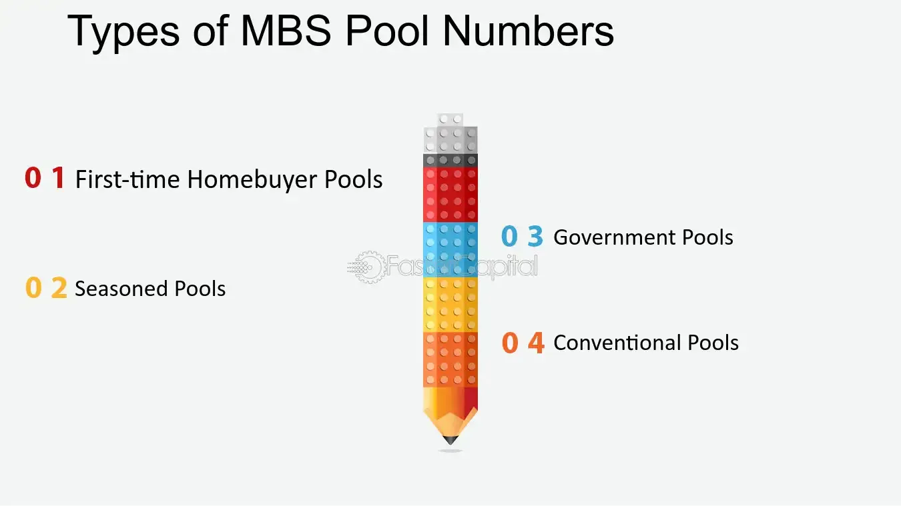

## Table of Contents

## What are MBS Pool Numbers?

MBS Pool Numbers are unique identifiers given to groups of mortgage-backed securities (MBS). When banks and other lenders make home loans, they can sell these loans to investors. These loans are bundled together into pools, and each pool gets its own special number. This number helps keep track of the pool and makes it easier for investors to buy and sell parts of these pools.

These numbers are important because they help everyone involved know exactly which loans are in which pool. This makes the buying and selling process smoother and more organized. Without these numbers, it would be hard to manage all the different loans and pools, and it could lead to confusion and mistakes. So, MBS Pool Numbers play a big role in making the mortgage-backed securities market work well.

## How are MBS Pool Numbers assigned?

MBS Pool Numbers are given out by organizations like Fannie Mae, Freddie Mac, or Ginnie Mae. These groups take many home loans and put them together into a pool. Then, they give each pool a special number. This number is like a name tag for the pool, so everyone knows which loans are in it. The number is made up of letters and numbers, and it's different for every pool.

When a new pool is made, the organization looks at the type of loans in the pool and decides on a number that fits. They use a system to make sure no two pools have the same number. This way, investors can easily find and keep track of the pools they are interested in. It's like giving each pool its own unique ID, which helps keep everything organized and clear.

## What is the significance of MBS Pool Numbers in mortgage-backed securities?

MBS Pool Numbers are really important in the world of mortgage-backed securities. They act like a special code that helps everyone know exactly which loans are in which pool. When banks and lenders make home loans, they can sell these loans to investors. But to do this, they need to group the loans together into pools. Each pool gets its own MBS Pool Number, which makes it easy to keep track of everything. Without these numbers, it would be hard to know which loans are where, and that could cause a lot of confusion and mistakes.

These numbers also help make buying and selling parts of these pools easier for investors. When investors want to buy a piece of a pool, they can use the MBS Pool Number to find exactly what they're looking for. This makes the whole process smoother and more organized. So, MBS Pool Numbers play a big role in keeping the mortgage-backed securities market working well, making sure everyone knows what's going on and can do their business without any mix-ups.

## How do MBS Pool Numbers help in tracking mortgage-backed securities?

MBS Pool Numbers are like special codes that help keep track of mortgage-backed securities. When banks and lenders make home loans, they can sell these loans to investors. But to do this, they need to group the loans together into pools. Each pool gets its own MBS Pool Number, which makes it easy to know exactly which loans are in which pool. This way, everyone involved can see where each loan is and make sure everything is in the right place.

These numbers also make it easier for investors to buy and sell parts of these pools. When an investor wants to buy a piece of a pool, they can use the MBS Pool Number to find exactly what they're looking for. This makes the whole process smoother and more organized. So, MBS Pool Numbers are really important because they help keep the mortgage-backed securities market working well, making sure everyone knows what's going on and can do their business without any mix-ups.

## What is the structure of an MBS Pool Number?

An MBS Pool Number is made up of letters and numbers that work together to create a unique code for each pool of mortgage-backed securities. The structure usually starts with a few letters that show which organization made the pool, like "FN" for Fannie Mae or "GN" for Ginnie Mae. After the letters, there are numbers that help to tell one pool from another. This mix of letters and numbers makes sure every pool has its own special name.

The numbers part of the MBS Pool Number can be different lengths, but it's always made to be unique. For example, if Fannie Mae made a pool, the number might look like "FN123456". The "FN" tells you it's from Fannie Mae, and "123456" is the special number for that pool. This way, everyone can easily find and keep track of the pools they are interested in, making the whole system work smoothly.

## Can MBS Pool Numbers be reused, and if so, under what conditions?

MBS Pool Numbers are usually not reused because they need to be unique to keep track of different pools of mortgage-backed securities. If a number was used again, it could cause confusion and mix-ups. Imagine if two different pools had the same number - it would be hard to know which loans were in which pool. So, organizations like Fannie Mae, Freddie Mac, and Ginnie Mae make sure each pool gets a new, special number that hasn't been used before.

However, in very rare cases, an MBS Pool Number might be reused if the original pool is completely paid off and closed. This means all the loans in that pool are gone, and the number is no longer needed. Even then, reusing a number is done very carefully to avoid any mistakes. But most of the time, it's safer and easier to just use a brand new number for each new pool.

## How do investors use MBS Pool Numbers to manage their portfolios?

Investors use MBS Pool Numbers to keep track of the different pools of mortgage-backed securities they own. Each pool has its own special number, which makes it easy for investors to know exactly which loans are in each pool. This helps them see how their investments are doing and make smart choices about buying or selling parts of these pools. For example, if an investor wants to check how well a certain pool is performing, they can use the MBS Pool Number to find that pool quickly and look at its details.

By using these numbers, investors can also keep their portfolios organized. They can group their investments by different types of pools, like those from Fannie Mae or Ginnie Mae, and manage them more easily. This way, they can see at a glance which parts of their portfolio are doing well and which might need some changes. MBS Pool Numbers make it simpler for investors to handle their investments and make sure they are making the best decisions for their money.

## What are the common issues or errors associated with MBS Pool Numbers?

Sometimes, mistakes can happen with MBS Pool Numbers. One common issue is when the wrong number is used by mistake. This can happen if someone types in the number incorrectly or if there's a mix-up with similar numbers. If the wrong number is used, it can lead to confusion about which loans are in which pool. This can make it hard for investors to keep track of their investments and can cause problems when buying or selling parts of the pools.

Another problem can happen if two pools end up with the same number, even though they are supposed to be unique. This is rare, but if it does happen, it can cause a big mess. Everyone involved might get confused about which pool is which, and it can lead to mistakes in tracking and managing the securities. To avoid these issues, organizations like Fannie Mae, Freddie Mac, and Ginnie Mae are very careful when they assign the numbers and double-check to make sure each pool has its own special number.

## How do MBS Pool Numbers interact with other identifiers in the financial system?

MBS Pool Numbers work together with other identifiers in the financial system to keep everything organized. For example, each loan in a pool has its own loan number, and these loan numbers are linked to the MBS Pool Number. This connection helps everyone know exactly which loans are in which pool. Also, MBS Pool Numbers are used with CUSIP numbers, which are special codes for securities. When an investor buys a part of a pool, they use both the MBS Pool Number and the CUSIP number to make sure they are getting the right piece of the pool.

These different identifiers help make the whole system run smoothly. For instance, when banks report information about the loans, they use the loan numbers and the MBS Pool Numbers to make sure the data is correct. This way, everyone can trust that the information they are looking at is accurate. By working together, these identifiers help keep track of all the different parts of mortgage-backed securities, making it easier for investors to manage their investments and for the market to work well.

## What regulatory requirements are associated with MBS Pool Numbers?

MBS Pool Numbers have to follow rules set by groups like Fannie Mae, Freddie Mac, and Ginnie Mae. These rules make sure that each pool of mortgage-backed securities gets a unique number. This helps keep everything organized and stops mix-ups. The rules also say that the numbers need to be used in a certain way, like making sure they are easy to read and understand. This helps everyone in the financial world know exactly which loans are in which pool.

Regulators also check that the MBS Pool Numbers are used correctly. They make sure that the numbers are not reused unless a pool is completely paid off and closed. This is important because reusing numbers can cause confusion and mistakes. The rules also help make sure that investors can trust the information they see about the pools. By following these rules, the whole system stays clear and works well, helping everyone from banks to investors manage mortgage-backed securities properly.

## How has the use of MBS Pool Numbers evolved with technological advancements?

The use of MBS Pool Numbers has changed a lot thanks to new technology. In the past, keeping track of these numbers was done by hand, which could lead to mistakes and take a long time. But now, with computers and special software, everything is much easier and faster. Banks and investors can quickly look up MBS Pool Numbers and see all the details about the loans in each pool. This makes it simpler to buy and sell parts of the pools and helps keep everything organized.

Technology has also made it possible to use MBS Pool Numbers in new ways. For example, with online systems, investors can now see real-time updates about their investments. This means they can make better decisions about buying or selling. Also, special computer programs can help check the numbers to make sure they are unique and used correctly. This helps avoid mistakes and keeps the whole system running smoothly. So, technology has really helped make MBS Pool Numbers more useful and reliable for everyone in the mortgage-backed securities market.

## What are the future trends or potential changes expected in the management of MBS Pool Numbers?

In the future, the way MBS Pool Numbers are managed might change a lot because of new technology. One big trend could be using [artificial intelligence](/wiki/ai-artificial-intelligence) (AI) and [machine learning](/wiki/machine-learning) to help keep track of these numbers. These smart tools could check the numbers automatically to make sure they are unique and used correctly. This would help avoid mistakes and make everything run smoother. Also, with more people using online systems, MBS Pool Numbers might be used in even more ways. For example, investors could get instant updates about their pools and make quicker decisions about buying or selling.

Another change might come from new rules and regulations. As the financial world keeps changing, the rules about MBS Pool Numbers might need to change too. This could mean stricter rules to make sure the numbers are used properly and to stop any mix-ups. Also, as more types of loans and securities are created, the system for giving out MBS Pool Numbers might need to be updated. This would help keep up with all the new kinds of pools being made. Overall, the future of MBS Pool Numbers will likely involve more technology and new rules to keep the mortgage-backed securities market working well.

## References & Further Reading

[1]: Fabozzi, F. J. (2001). ["The Handbook of Mortgage-Backed Securities,"](https://academic.oup.com/book/7943) 6th Edition. Oxford University Press.

[2]: Vink, D., & Fabozzi, F. J. (2013). ["Credit Risk in European Securitizations: The Role of Issuer Convention in Pricing Residual Tranche."](https://paperswithbacktest.com/wiki/dollar-roll-definition-mechanism) The Journal of Fixed Income.

[3]: Gorton, G. B. (2010). ["Slapped by the Invisible Hand: The Panic of 2007."](https://papers.ssrn.com/sol3/papers.cfm?abstract_id=1401882) Oxford University Press.

[4]: Lopez de Prado, M. (2018). ["Advances in Financial Machine Learning."](https://www.amazon.com/Advances-Financial-Machine-Learning-Marcos/dp/1119482089) Wiley.

[5]: Fama, E. F., & French, K. R. (1993). ["Common risk factors in the returns on stocks and bonds."](https://www.sciencedirect.com/science/article/pii/0304405X93900235) Journal of Financial Economics, 33(1), 3-56.

[6]: Hull, J. C. (2012). ["Options, Futures, and Other Derivatives."](https://www.semanticscholar.org/paper/Options%2C-Futures%2C-and-Other-Derivatives-Hull/89bdee500c8623864fc9eb7a471546aa713acc44) 9th Edition. Pearson.

[7]: Moser, J. T., & Fabozzi, F. J. (1995). ["Mortgage-backed securities: Products, structuring, and analytical techniques."](https://archive.org/details/mortgagebackedse0000fabo) Probus Publishing. 

[8]: Aronson, D. R. (2007). ["Evidence-Based Technical Analysis: Applying the Scientific Method and Statistical Inference to Trading Signals."](https://onlinelibrary.wiley.com/doi/book/10.1002/9781118268315) Wiley.