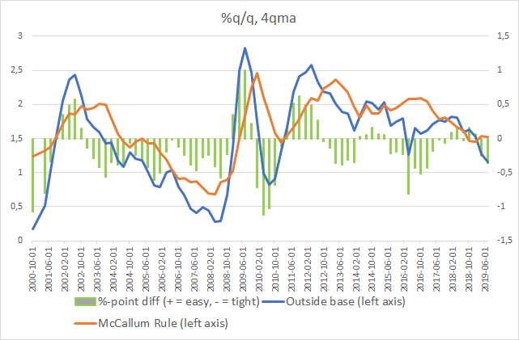

## Table of Contents

## What is the McCallum Rule?

The McCallum Rule is a monetary policy guideline named after economist Bennett McCallum. It suggests a way for central banks to set the growth rate of the money supply to help control inflation and support economic growth. Instead of focusing on interest rates like other rules, the McCallum Rule looks at the amount of money in the economy. It suggests that the central bank should adjust the money supply based on the difference between the desired and actual levels of nominal GDP, which is the total value of goods and services produced in an economy, adjusted for inflation.

The rule works by setting a target growth rate for the money supply. If the economy is growing faster than expected and inflation is rising, the central bank would slow down the growth of the money supply. On the other hand, if the economy is growing slower than expected or if there's a risk of deflation, the central bank would increase the growth rate of the money supply. By doing this, the McCallum Rule aims to keep the economy stable and prevent big swings in inflation or economic activity. It's a simple yet effective way to guide monetary policy decisions.

## Who developed the McCallum Rule?

The McCallum Rule was developed by an economist named Bennett McCallum. He came up with this rule to help central banks manage the economy by controlling the amount of money in circulation. Instead of focusing on interest rates like other rules, the McCallum Rule looks at how fast the money supply should grow.

McCallum's idea was to set a target for the growth of the money supply based on the difference between what the economy is actually doing and what it should be doing. If the economy is growing too fast and prices are going up too much, the central bank should slow down the money supply growth. If the economy is not growing enough or prices are falling, the central bank should speed up the money supply growth. This helps keep the economy stable and prevents big changes in inflation or economic activity.

## What is the purpose of the McCallum Rule in monetary policy?

The McCallum Rule helps central banks control the amount of money in the economy to keep things stable. It does this by setting a target for how fast the money supply should grow. The rule looks at the difference between what the economy is actually doing and what it should be doing. If the economy is growing too fast and prices are going up a lot, the central bank slows down the growth of the money supply. If the economy is not growing enough or prices are falling, the central bank speeds up the money supply growth.

By doing this, the McCallum Rule helps prevent big swings in inflation or economic activity. It's a simple way for central banks to make decisions about the money supply. Instead of focusing on interest rates like other rules, the McCallum Rule looks at the total value of goods and services produced in the economy, adjusted for inflation. This helps keep the economy on track and makes sure that the money supply grows at the right pace.

## How does the McCallum Rule differ from the Taylor Rule?

The McCallum Rule and the Taylor Rule are both ways to guide central banks in making decisions about the economy, but they focus on different things. The McCallum Rule looks at the amount of money in the economy and how fast it should grow. It sets a target for the money supply based on how the economy is doing compared to how it should be doing. If the economy is growing too fast and prices are going up a lot, the central bank slows down the money supply. If the economy is not growing enough or prices are falling, the central bank speeds up the money supply. This helps keep the economy stable and prevents big changes in inflation or economic activity.

On the other hand, the Taylor Rule focuses on interest rates instead of the money supply. It suggests that the central bank should set interest rates based on how far inflation is from its target and how far the economy is from its full potential. If inflation is too high or the economy is growing too fast, the central bank raises interest rates. If inflation is too low or the economy is not growing enough, the central bank lowers interest rates. The Taylor Rule is more about controlling inflation and economic growth through interest rates, while the McCallum Rule is more about controlling the money supply to achieve the same goals.

## What are the key components of the McCallum Rule?

The McCallum Rule is a way for central banks to decide how fast the money supply should grow. It looks at the difference between what the economy is actually doing and what it should be doing. If the economy is growing too fast and prices are going up a lot, the central bank slows down the money supply. If the economy is not growing enough or prices are falling, the central bank speeds up the money supply. This helps keep the economy stable and prevents big changes in inflation or economic activity.

The main idea behind the McCallum Rule is to use the money supply to control the economy. It does this by setting a target for how fast the money supply should grow based on the total value of goods and services produced in the economy, adjusted for inflation. This is different from other rules, like the Taylor Rule, which focus on interest rates. The McCallum Rule is a simple way for central banks to make decisions about the money supply to keep the economy on track.

## How is the McCallum Rule implemented in practice?

The McCallum Rule helps central banks decide how fast the money supply should grow. They look at the difference between what the economy is actually doing and what it should be doing. If the economy is growing too fast and prices are going up a lot, the central bank slows down the money supply. If the economy is not growing enough or prices are falling, the central bank speeds up the money supply. This helps keep the economy stable and prevents big changes in inflation or economic activity.

In practice, central banks use the McCallum Rule by setting a target for how fast the money supply should grow. They do this based on the total value of goods and services produced in the economy, adjusted for inflation. If the actual growth of the economy is different from what they expect, they adjust the money supply to get back on track. This means they might print more money or take money out of circulation to control the economy. The McCallum Rule is a simple way for central banks to make decisions about the money supply to keep the economy stable.

## What are the advantages of using the McCallum Rule?

The McCallum Rule helps central banks keep the economy stable by focusing on the money supply. It's easy to understand and use because it sets a clear target for how fast the money supply should grow. This means central banks can quickly see if they need to add or take away money from the economy to keep things on track. By looking at the total value of goods and services produced, adjusted for inflation, the McCallum Rule helps prevent big swings in the economy and keeps inflation under control.

Another advantage is that the McCallum Rule doesn't rely on interest rates like other rules, such as the Taylor Rule. This can be helpful because interest rates can be influenced by many things, and it's not always clear how they will affect the economy. By focusing on the money supply, the McCallum Rule gives central banks a more direct way to manage the economy. It's like having a simpler tool that can be used more effectively to keep the economy growing at a steady pace.

## What are the criticisms or limitations of the McCallum Rule?

One criticism of the McCallum Rule is that it can be hard to measure the money supply accurately. The money supply can change in ways that are hard to track, like when people use different kinds of money or when banks change how much money they lend. This makes it tricky for central banks to know exactly how much money is out there and how fast it's growing. If the central bank doesn't have the right numbers, it might make the wrong decisions about the money supply, which could cause problems for the economy.

Another limitation is that the McCallum Rule doesn't take into account other things that can affect the economy, like interest rates or what's happening in other countries. The economy is complicated, and just focusing on the money supply might not be enough to keep everything stable. If the central bank only looks at the money supply, it might miss other important signs that the economy is in trouble. This could lead to inflation or a slowdown that the McCallum Rule doesn't see coming.

## Can you provide an example of how the McCallum Rule has been applied in a real-world scenario?

The McCallum Rule has been used by central banks to guide their decisions about the money supply. One example is when a central bank in a small country wanted to keep its economy growing at a steady pace. They used the McCallum Rule to set a target for how fast the money supply should grow based on the total value of goods and services produced in the country, adjusted for inflation. When they saw that the economy was growing faster than expected and prices were going up, they slowed down the growth of the money supply to cool things down. This helped keep inflation under control and prevented the economy from overheating.

Another example is when a central bank faced a situation where the economy was not growing enough and there was a risk of prices falling. They used the McCallum Rule to decide that they needed to speed up the growth of the money supply. By adding more money into the economy, they were able to boost spending and help the economy start growing again. This helped prevent a slowdown and kept the economy on track. These examples show how the McCallum Rule can be a useful tool for central banks to manage the money supply and keep the economy stable.

## How does the McCallum Rule influence inflation and economic growth?

The McCallum Rule helps central banks control inflation and support economic growth by setting a target for how fast the money supply should grow. If the economy is growing too fast and prices are going up a lot, the central bank slows down the money supply. This helps to cool down the economy and keep inflation under control. By doing this, the McCallum Rule prevents the economy from overheating and keeps prices from rising too quickly.

On the other hand, if the economy is not growing enough or if prices are falling, the central bank uses the McCallum Rule to speed up the money supply. This means they add more money into the economy to boost spending and help the economy start growing again. By doing this, the McCallum Rule helps prevent a slowdown and keeps the economy on track. It's a simple way for central banks to make decisions about the money supply to keep the economy stable and growing at a steady pace.

## What modifications have been proposed to enhance the effectiveness of the McCallum Rule?

One modification to make the McCallum Rule work better is to include other important economic indicators, like interest rates and what's happening in other countries. The economy is complicated, and just looking at the money supply might not be enough. By adding these other factors, central banks can get a fuller picture of what's going on and make better decisions about the money supply. This can help them react more quickly to changes in the economy and keep things stable.

Another idea is to use better ways to measure the money supply. It can be hard to know exactly how much money is out there because people use different kinds of money and banks change how much they lend. If central banks can find more accurate ways to track the money supply, they can make more precise adjustments. This could help them avoid making mistakes that might cause problems for the economy. By improving how they measure the money supply, central banks can use the McCallum Rule more effectively to control inflation and support economic growth.

## How does the McCallum Rule fit into the broader context of monetary policy frameworks?

The McCallum Rule is a part of a bigger picture in how central banks manage the economy through monetary policy. It's one of many tools that central banks use to keep the economy stable and growing at a steady pace. The McCallum Rule focuses on the money supply, which is different from other tools like the Taylor Rule that focus on interest rates. By setting a target for how fast the money supply should grow, the McCallum Rule helps central banks control inflation and support economic growth. It's like a simple guide that tells central banks when to add or take away money from the economy based on how things are going.

In the world of monetary policy, the McCallum Rule fits in by offering a straightforward way to manage the money supply. It's not the only tool, but it's an important one that central banks can use alongside other methods. For example, while the McCallum Rule looks at the money supply, other policies might look at interest rates, exchange rates, or even direct lending to banks. By using the McCallum Rule, central banks can make quick and clear decisions about the money supply to keep the economy on track. It's like having a simple tool in a toolbox full of different ways to manage the economy.

## What is the McCallum Rule and how can it be understood?

The McCallum Rule, formulated by Bennett T. McCallum in the late 20th century, is a guide for setting targets for the monetary base, crucial for influencing economic activity. This rule is founded on the principles of the Equation of Exchange, expressed as:

$$
MV = PY
$$

where $M$ represents the money supply, $V$ is the velocity of money, $P$ denotes the price level, and $Y$ stands for real GDP. The Quantity Theory of Money postulates that changes in the money supply have direct proportional effects on nominal GDP ($PY$), assuming a constant velocity of money in the short run.

The McCallum Rule leverages this equation by focusing on setting a monetary base target that aligns with the desired growth rate for nominal GDP. The formula to determine the monetary base target involves estimating the long-run average growth rate of real GDP and the long-run target inflation rate. Mathematically, the rule can be expressed as:

$$
\Delta M_t = \Delta Y^*_t + \Delta P^*_t - \Delta V_t
$$

where:
- $\Delta M_t$ is the growth rate of the monetary base,
- $\Delta Y^*_t$ is the target growth rate of real GDP,
- $\Delta P^*_t$ is the targeted inflation rate,
- $\Delta V_t$ is the change in the velocity of money.

The key components of the McCallum Rule involve setting the desired growth rate for nominal GDP, which combines both the target real GDP growth and the targeted inflation rate. Adjustments are made by considering discrepancies between actual economic performance and targets. These adjustments allow central banks to respond proactively to economic conditions.

The rule's emphasis on the monetary base differentiates it from other policy frameworks. By concentrating on controlling the quantity of money rather than targeting interest rates directly, the McCallum Rule provides central banks with a quantitative mechanism for promoting sustainable economic growth, while also considering the variations in money velocity over time.

## What are the differences between the McCallum Rule and the Taylor Rule?

The McCallum Rule and the Taylor Rule are two prominent frameworks in the domain of monetary policy, each offering distinct approaches to achieving economic stability. The McCallum Rule is centered on adjusting the monetary base, which directly relates to the supply of money in the economy. It involves setting a target for the monetary base by considering the expected growth rate of nominal GDP and the long-term average velocity of money. This approach is derived from the Quantity Theory of Money, primarily focusing on ensuring sustainable economic growth through careful control of the monetary base.

On the other hand, the Taylor Rule is structured around the manipulation of interest rates. It uses a formula where the central bank sets the nominal [interest rate](/wiki/interest-rate-trading-strategies) based on the current rate of inflation, the deviation of inflation from its target, and the deviation of real GDP from potential GDP. The Taylor Rule is often expressed as:

$$
i_t = r_t + \pi_t + 0.5(\pi_t - \pi^*) + 0.5(y_t - \bar{y})
$$

Where:
- $i_t$ is the nominal interest rate.
- $r_t$ is the real equilibrium rate of interest.
- $\pi_t$ is the rate of inflation.
- $\pi^*$ is the target inflation rate.
- $y_t$ is the logarithm of real GDP.
- $\bar{y}$ is the logarithm of potential GDP.

While the McCallum Rule dictates adjustments to the monetary base through instruments such as open market operations, the Taylor Rule guides interest rate decisions based on economic conditions, particularly inflation deviations and output gaps. This fundamental difference indicates that the McCallum Rule is more direct in influencing the money supply, whereas the Taylor Rule indirectly impacts the economy by altering borrowing costs through interest rates.

Understanding the divergence between these two rules is essential for appreciating how central banks select among various policy tools. The choice between the McCallum and Taylor rules can reflect the different priorities and macroeconomic conditions faced by central banks. For instance, in an environment where controlling money supply is deemed more crucial, a central bank may lean towards the McCallum Rule. Conversely, if stabilizing inflation rates is of higher concern, the Taylor Rule might be preferred. Thus, these differing objectives and mechanisms underscore the nuanced approach required in monetary policymaking.

## What is the Application of the McCallum Rule in Monetary Policy?

Central banks employ the McCallum Rule as a strategic tool to determine necessary adjustments to the monetary base, primarily through mechanisms such as open market operations. The rule is instrumental in evaluating and predicting economic outcomes by facilitating proactive policy adjustments under various economic conditions.

The McCallum Rule is particularly valuable during periods of economic crisis due to its emphasis on targeting the monetary base rather than just interest rates, which are often at or near zero in such scenarios. During these times, traditional monetary policy tools may lose their efficacy, but the McCallum Rule provides an alternative by focusing on the quantities of money supplied rather than the cost of borrowing.

The rule operates within the framework of the Equation of Exchange from the Quantity Theory of Money, represented as $MV = PY$, where $M$ is the monetary base, $V$ is the velocity of money, $P$ is the price level, and $Y$ is real GDP. The McCallum Rule modifies this classic equation to establish a target growth rate for the monetary base, taking into consideration the desired growth rate for nominal GDP and the discrepancy between actual and target economic growth rates.

In practice, the McCallum Rule sets the growth rate of the monetary base using a formula:

$$
\Delta M_t = \Delta \text{GDP}_t + \Delta V_t - \text{gap}_t - \Delta p_t
$$

Here, $\Delta M_t$ is the monetary base growth rate, $\Delta \text{GDP}_t$ is the target growth rate for nominal GDP, $\Delta V_t$ represents changes in the velocity of money, $\text{gap}_t$ signifies the difference between actual and target GDP growth, and $\Delta p_t$ adjusts for variations in inflation.

By utilizing this approach, central banks can project the monetary base required to achieve predetermined economic goals, thereby fostering a more stable economic environment. The rule's ability to predict economic outcomes through such quantitative methods enables central banks to take timely actions to counteract economic downturns or inflationary pressures.

The effectiveness of the McCallum Rule during economic crises has been analyzed, showing that it can provide clear advantages over other monetary rules. Its quantitative nature allows for a consistent policy during uncertain times, thereby enhancing the credibility of central banks' actions in maintaining economic stability. This makes the McCallum Rule a versatile and robust component in the toolkit of policymakers.

## What are the implications for algorithmic trading?

The McCallum Rule's insights prove instrumental in the field of [algorithmic trading](/wiki/algorithmic-trading), particularly due to its core principles regarding monetary policy and macroeconomic indicators. By providing a systematic approach to setting targets for the monetary base, the rule assists traders in constructing algorithms that can anticipate the policy moves of central banks.

At its heart, the McCallum Rule centers around setting the growth rate of the monetary base to foster nominal GDP growth, thus enabling algorithmic traders to integrate these economic predictors into their systems. The insights derived from the McCallum Rule allow traders to refine predictive models that [factor](/wiki/factor-investing) in the expected behavior of central banks regarding changes in the money supply.

The McCallum Rule is composed of elements that include the velocity of money, nominal GDP growth, and adjustments for discrepancies between actual and targeted economic growth. By understanding these components, algorithmic traders can create sophisticated models, potentially using Python, to enhance their decision-making processes. For instance, when predicting central bank moves, traders can incorporate the McCallum Rule's formula:

$$
\Delta M = \Delta P + \Delta Y - V
$$

where:

- $\Delta M$ is the target growth rate of the monetary base.
- $\Delta P$ is the rate of inflation.
- $\Delta Y$ is the target real GDP growth.
- $V$ is the change in the velocity of money.

In their algorithms, traders could simulate scenarios based upon this formula. For example, by linking inflation data and GDP growth expectations, algorithms might predict central bank adjustments to the monetary base, thus suggesting optimal trading strategies. 

Moreover, the insights from the McCallum Rule provide a basis for tactical adjustments. Traders can derive signals from potential policy shifts inferred from the rule, thus allowing them to modulate their investment portfolios accordingly. With real-time market data and predictive models based on the McCallum framework, traders are better equipped to anticipate market conditions induced by monetary policy moves.

In conclusion, by integrating the McCallum Rule into algorithmic models, traders can enhance their capacity to predict central bank policies and respond to anticipated changes in economic conditions. This enhances not only the effectiveness of trading strategies but also helps in risk management by aligning trades with macroeconomic trends. As algorithmic trading continues to evolve, understanding and leveraging principles like those of the McCallum Rule will remain integral to maintaining a competitive edge in the financial markets.

## References & Further Reading

[1]: McCallum, Bennett T. (1988). ["Robustness Properties of a Rule for Monetary Policy."](https://www.sciencedirect.com/science/article/pii/0167223188900115) Carnegie-Rochester Conference Series on Public Policy, 29, 173-203. 

[2]: Taylor, John B. (1993). ["Discretion versus Policy Rules in Practice."](https://web.stanford.edu/~johntayl/Onlinepaperscombinedbyyear/1993/Discretion_versus_Policy_Rules_in_Practice.pdf) Carnegie-Rochester Conference Series on Public Policy, 39, 195-214.

[3]: ["The Taylor Rule and the Transformation of Monetary Policy."](https://www.kansascityfed.org/documents/541/pdf-rwp07-11.pdf) Economics Working Paper Archive at WUSTL, Taylor, John B.

[4]: Svensson, Lars E.O. (1999). ["Inflation Targeting as a Monetary Policy Rule."](https://www.sciencedirect.com/science/article/pii/S0304393299000070) Journal of Monetary Economics, 43(3), 607-654.

[5]: Clarida, Richard, Galí, Jordi, & Gertler, Mark. (1999). ["The Science of Monetary Policy: A New Keynesian Perspective."](https://www.jstor.org/stable/2565488) Journal of Economic Literature, 37(4), 1661-1707.

[6]: ["Monetary Policy Rules"](https://www.federalreserve.gov/monetarypolicy/policy-rules-and-how-policymakers-use-them.htm) edited by John B. Taylor

[7]: ["Monetary Policy, Inflation, and the Business Cycle: An Introduction to the New Keynesian Framework and Its Applications"](https://archive.org/details/monetarypolicyin0000gali) by Jordi Galí