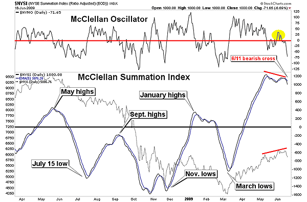

## Table of Contents

## What is the McClellan Oscillator?

The McClellan Oscillator is a tool used in the stock market to help people understand how the market is doing. It looks at the difference between the number of stocks going up and the number of stocks going down over a certain period of time. This difference is then put through a special math formula to create a number that can be positive or negative. A positive number means more stocks are going up, which might mean the market is doing well. A negative number means more stocks are going down, which might mean the market is not doing so well.

People use the McClellan Oscillator to try to guess what the market might do next. If the number is very high or very low, it might mean the market is about to change direction. For example, if the number is very high and then starts to go down, it might mean the market will start to go down soon. Traders and investors watch these numbers to help them decide when to buy or sell stocks. It's like a signal that helps them make better choices in the stock market.

## How is the McClellan Oscillator calculated?

The McClellan Oscillator is calculated using two main steps. First, you need to find out the difference between the number of stocks that went up and the number of stocks that went down on a given day. This is called the "net advances." To get a smoother picture, you look at the net advances over several days, usually 19 days. You add up the net advances for the last 19 days and then divide by 19 to get an average. This average is called the "19-day exponential moving average" (EMA) of net advances.

Next, you do the same thing but over a shorter period, usually 39 days. You add up the net advances for the last 39 days and then divide by 39 to get another average, which is called the "39-day exponential moving average" of net advances. To get the McClellan Oscillator, you subtract the 39-day EMA from the 19-day EMA. The result is a number that can be positive or negative. A positive number means more stocks are going up, and a negative number means more stocks are going down. This helps people see trends in the stock market and make better decisions.

## What does the McClellan Oscillator measure?

The McClellan Oscillator measures the difference between the number of stocks that are going up and the number of stocks that are going down in the stock market. It uses a special math formula to turn this difference into a number that can be positive or negative. A positive number means more stocks are going up, which might mean the market is doing well. A negative number means more stocks are going down, which might mean the market is not doing so well.

People use the McClellan Oscillator to try to understand what the market might do next. If the number is very high or very low, it might mean the market is about to change direction. For example, if the number is very high and then starts to go down, it might mean the market will start to go down soon. Traders and investors watch these numbers to help them decide when to buy or sell stocks. It's like a signal that helps them make better choices in the stock market.

## What is the significance of the McClellan Oscillator in market analysis?

The McClellan Oscillator is important in market analysis because it helps people understand what the stock market is doing. It looks at how many stocks are going up and how many are going down, and turns this information into a number. If the number is positive, it means more stocks are going up, which might mean the market is doing well. If the number is negative, it means more stocks are going down, which might mean the market is not doing so well. This helps traders and investors see if the market is strong or weak.

People also use the McClellan Oscillator to guess what the market might do next. If the number is very high or very low, it might mean the market is about to change direction. For example, if the number is very high and then starts to go down, it might mean the market will start to go down soon. This can help traders and investors decide when to buy or sell stocks. By watching the McClellan Oscillator, they can make better choices and maybe make more money in the stock market.

## How can the McClellan Oscillator be used to identify market trends?

The McClellan Oscillator helps people see what the stock market is doing by looking at how many stocks are going up and how many are going down. It turns this information into a number that can be positive or negative. A positive number means more stocks are going up, which might mean the market is doing well. A negative number means more stocks are going down, which might mean the market is not doing so well. By watching this number over time, people can see if the market is getting stronger or weaker.

People can also use the McClellan Oscillator to guess what the market might do next. If the number is very high or very low, it might mean the market is about to change direction. For example, if the number is very high and then starts to go down, it might mean the market will start to go down soon. Traders and investors watch these numbers to help them decide when to buy or sell stocks. By paying attention to the McClellan Oscillator, they can make better choices and maybe make more money in the stock market.

## What is the Summation Index?

The Summation Index is a tool used in the stock market to help people understand how the market is doing over time. It's like a running total of the McClellan Oscillator. The McClellan Oscillator looks at how many stocks are going up and how many are going down on a given day, and turns this information into a number. The Summation Index adds up all these numbers from the McClellan Oscillator day after day. If the total is going up, it might mean the market is getting stronger. If the total is going down, it might mean the market is getting weaker.

People use the Summation Index to see the bigger picture of the stock market. It helps them understand long-term trends, not just what's happening today. For example, if the Summation Index is going up over several weeks or months, it might mean the market is in a good, upward trend. If it's going down over that time, it might mean the market is in a bad, downward trend. Traders and investors watch the Summation Index to help them decide when to buy or sell stocks, looking at the overall health of the market over time.

## How is the Summation Index derived from the McClellan Oscillator?

The Summation Index is like a running total of the McClellan Oscillator. The McClellan Oscillator looks at how many stocks are going up and how many are going down on a given day and turns this into a number. To get the Summation Index, you start with a base number, usually zero, and then add the value of the McClellan Oscillator for each new day. If the McClellan Oscillator is positive, you add that number to your total. If it's negative, you subtract it. This way, the Summation Index keeps a running count of how the market is doing over time.

People use the Summation Index to see the bigger picture of the stock market. It helps them understand long-term trends, not just what's happening today. For example, if the Summation Index is going up over several weeks or months, it might mean the market is in a good, upward trend. If it's going down over that time, it might mean the market is in a bad, downward trend. Traders and investors watch the Summation Index to help them decide when to buy or sell stocks, looking at the overall health of the market over time.

## What insights does the Summation Index provide about market breadth?

The Summation Index gives people a good idea about how many stocks are doing well or not so well in the market. It's like a running total of the McClellan Oscillator, which looks at the difference between stocks going up and stocks going down each day. By adding up these daily numbers, the Summation Index shows if more stocks are going up over time or if more stocks are going down. This helps people see the overall health of the market, not just what's happening today. If the Summation Index is going up, it means more stocks are doing well, which might mean the market is strong. If it's going down, it means more stocks are doing poorly, which might mean the market is weak.

People use the Summation Index to understand long-term trends in the market. It's like looking at a big picture instead of just a small part. For example, if the Summation Index keeps going up over several weeks or months, it might mean the market is in a good, upward trend. This can help traders and investors feel more confident about buying stocks. On the other hand, if the Summation Index keeps going down over time, it might mean the market is in a bad, downward trend. This can help traders and investors decide if it's a good time to sell their stocks or wait for a better time to buy. By watching the Summation Index, people can make better choices about when to buy or sell in the stock market.

## How can traders use the Summation Index to make investment decisions?

Traders can use the Summation Index to see if the stock market is getting stronger or weaker over time. The Summation Index is like a running total of the McClellan Oscillator, which looks at how many stocks are going up and how many are going down each day. If the Summation Index is going up, it means more stocks are doing well, which might be a good sign for the market. Traders might see this as a signal to buy stocks because it could mean the market is in a good, upward trend. On the other hand, if the Summation Index is going down, it means more stocks are doing poorly, which might be a bad sign for the market. Traders might see this as a signal to sell their stocks or wait for a better time to buy.

By watching the Summation Index, traders can make better choices about when to buy or sell in the stock market. For example, if the Summation Index has been going up for several weeks or months, traders might feel more confident about buying stocks because it shows a strong, long-term trend. If the Summation Index starts to go down after being high, it might mean the market is about to change direction, and traders might want to sell their stocks before the market goes down. The Summation Index helps traders see the bigger picture of the market, not just what's happening today, so they can make smarter investment decisions.

## What are common misinterpretations or pitfalls when using the McClellan Oscillator and Summation Index?

People sometimes make mistakes when using the McClellan Oscillator and Summation Index because they might think these tools can predict the future of the stock market perfectly. But they can't. These tools are just helpers that show what's been happening in the market, not what will happen next. For example, if the McClellan Oscillator is very high or very low, it might mean the market could change direction soon, but it's not a sure thing. Traders might buy or sell stocks too quickly based on these signals and end up losing money if the market doesn't change the way they thought it would.

Another common mistake is not looking at other information along with the McClellan Oscillator and Summation Index. These tools are useful, but they don't tell the whole story by themselves. Traders should also look at other things like news about the economy, company reports, and other market indicators. If someone only uses the McClellan Oscillator and Summation Index without considering other factors, they might miss important signs that could affect their investment decisions. It's like trying to understand a book by only reading a few pages instead of the whole thing.

## How do the McClellan Oscillator and Summation Index complement other technical indicators?

The McClellan Oscillator and Summation Index are like helpers that work well with other tools traders use to understand the stock market. They look at how many stocks are going up or down, which helps traders see if the market is strong or weak. Other tools, like moving averages, can show the overall direction of the market over time. By using the McClellan Oscillator and Summation Index along with moving averages, traders get a fuller picture of what's happening in the market. For example, if the McClellan Oscillator is high and the moving average is going up, it might be a good time to buy stocks.

Another important tool is the Relative Strength Index (RSI), which shows if stocks are overbought or oversold. The McClellan Oscillator and Summation Index can help confirm what the RSI is showing. If the RSI says a stock is overbought and the McClellan Oscillator is very high, it might mean the market is about to go down. By looking at both, traders can feel more confident in their decisions. Using these tools together helps traders make smarter choices by understanding different parts of the market at the same time.

## Can you provide case studies or examples where the McClellan Oscillator and Summation Index accurately predicted market movements?

In early 2016, the McClellan Oscillator and Summation Index were used to predict a market turnaround. The McClellan Oscillator had been very negative for several weeks, showing that more stocks were going down than up. But then, the Oscillator started to climb, suggesting that the market might be about to change direction. At the same time, the Summation Index, which had been falling, began to rise. This combination of signals indicated that the market was likely to start going up soon. Sure enough, the stock market began a strong upward trend in the following months, confirming the predictions made by these indicators.

Another example happened in late 2018. The McClellan Oscillator was showing very low numbers, indicating that the market was weak and more stocks were going down than up. The Summation Index was also dropping, which suggested a long-term downward trend. Many traders saw these signs and decided to sell their stocks before the market fell even more. Just as the indicators predicted, the market did indeed go down sharply at the end of the year. Traders who paid attention to the McClellan Oscillator and Summation Index were able to avoid big losses by selling their stocks in time.

## How do you calculate the McClellan Summation Index?

The McClellan Summation Index is derived from the cumulative total of the McClellan Oscillator's daily values, which indicate the market's breadth. It is primarily based on advance-decline data—a measure of the number of advancing stock issues minus the number of declining ones. 

The calculation involves two critical components: the exponential moving averages (EMAs) over 19 and 39 days. These moving averages smooth out the data from the advance-decline line, creating a responsive yet stable measure that helps traders avoid being misled by short-term market fluctuations.

First, the McClellan Oscillator is determined using the difference between the 19-day EMA and the 39-day EMA of the daily advance-decline data:

$$
\text{McClellan Oscillator} = \text{EMA}_{19}(\text{Advances} - \text{Declines}) - \text{EMA}_{39}(\text{Advances} - \text{Declines})
$$

Once the McClellan Oscillator values are obtained, the Summation Index is simply the cumulative sum of these oscillator values over time:

$$
\text{Summation Index} = \sum_{t=1}^{n} \text{McClellan Oscillator}_t
$$

In practice, a positive Summation Index indicates a period where advancing issues are dominant, suggesting increasing market strength. Conversely, a negative index suggests that declining issues are prevailing, hinting at potential market weaknesses. The amplitude of the index's deviations from zero can further reflect the intensity of market sentiment shifts, enabling traders to deduce ongoing trends and adjust their strategies accordingly.

## References & Further Reading

[1]: Pring, M. J. (2002). ["Technical Analysis Explained: The Successful Investor's Guide to Spotting Investment Trends and Turning Points"](https://www.amazon.com/Technical-Analysis-Explained-Fifth-Successful/dp/0071825177). McGraw-Hill Education.

[2]: McClellan, T., & McClellan, S. (2003). ["McClellan Financial Publications"](https://cmtassociation.org/presenter/sherman-mcclellan/). Available at McClellan Financial Publications.

[3]: Kirkpatrick, C. D., & Dahlquist, J. R. (2010). ["Technical Analysis: The Complete Resource for Financial Market Technicians"](https://books.google.com/books/about/Technical_Analysis.html?id=62-9CgAAQBAJ). FT Press.

[4]: Brown, D. (1999). ["Encyclopedia of Technical Market Indicators."](https://www.amazon.com/Encyclopedia-Technical-Market-Indicators-Second/dp/0070120579) McGraw-Hill Education.

[5]: Pardo, R. (1992). ["Design, Testing, and Optimization of Trading Systems."](https://www.semanticscholar.org/paper/Design%2C-Testing%2C-and-Optimization-of-Trading-Pardo-Kaufman/bf9f052bee67ff179c04815f90edefdeba5a8046) Wiley Trading.