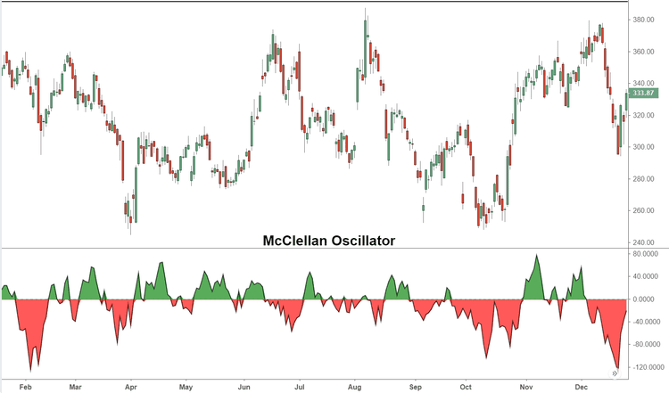

## Table of Contents

## What is the McClellan Oscillator?

The McClellan Oscillator is a tool used in the stock market to help people understand how the market is doing. It looks at how many stocks are going up and how many are going down each day. By doing this, it gives a number that can show if the market is getting stronger or weaker. This number can help traders decide if it's a good time to buy or sell stocks.

The way it works is by taking the difference between the number of advancing stocks and the number of declining stocks. Then, it uses a special math formula to smooth out the daily changes and make the results easier to understand. People who use the McClellan Oscillator watch for certain levels or patterns in the numbers to predict what the market might do next. It's like a helpful guide that can give clues about future market movements.

## Who created the McClellan Oscillator and when?

The McClellan Oscillator was created by Sherman and Marian McClellan in the early 1960s. They were a husband and wife team who wanted to find a better way to understand the stock market. Sherman had a background in engineering, and Marian was good at math. Together, they came up with this tool to help traders see the market's ups and downs more clearly.

The McClellan Oscillator became popular because it gave traders a new way to look at the market's health. By using this tool, people could see patterns and trends that were not easy to spot before. It helped them make smarter choices about when to buy or sell stocks. Over time, many traders started using the McClellan Oscillator as part of their daily work.

## What data is used to calculate the McClellan Oscillator?

The McClellan Oscillator uses data from the stock market to figure out its value. It looks at how many stocks are going up and how many are going down each day. This is called the "advance/decline data." The difference between the number of advancing stocks and the number of declining stocks is the starting point for the calculation.

Then, this difference goes through a special math formula. The formula uses two moving averages to smooth out the daily changes and make the results easier to understand. One moving average is shorter, and the other is longer. By subtracting the longer moving average from the shorter one, the McClellan Oscillator gives a number that shows the market's strength or weakness. This number can help traders see patterns and make decisions about buying or selling stocks.

## How is the McClellan Oscillator calculated?

The McClellan Oscillator is calculated using the difference between the number of stocks that go up and the number of stocks that go down each day. This difference is called the "net advances." To make the results smoother and easier to understand, the net advances are put through a special math formula. This formula uses two moving averages: a shorter one and a longer one. The shorter moving average is usually calculated over 19 days, and the longer one over 39 days.

To get the McClellan Oscillator value, you subtract the longer moving average from the shorter moving average. This gives a number that can be positive or negative. A positive number means more stocks are going up than down, which can show the market is getting stronger. A negative number means more stocks are going down than up, which can show the market is getting weaker. Traders watch these numbers to see patterns and help them decide when to buy or sell stocks.

## What does a positive value of the McClellan Oscillator indicate?

A positive value of the McClellan Oscillator means that more stocks are going up than going down. This shows that the market is getting stronger. When traders see a positive number, it can be a sign that it might be a good time to buy stocks because the market's overall direction is upward.

Traders often use the McClellan Oscillator to spot trends and make decisions. If the positive value keeps getting bigger, it can mean the market's strength is growing even more. But, they also need to be careful because even a positive number doesn't always mean the market will keep going up forever. It's just one tool among many that traders use to understand the market better.

## What does a negative value of the McClellan Oscillator indicate?

A negative value of the McClellan Oscillator means that more stocks are going down than going up. This shows that the market is getting weaker. When traders see a negative number, it can be a sign that it might be a good time to sell stocks or be careful about buying new ones because the market's overall direction is downward.

Traders use the McClellan Oscillator to spot trends and make decisions. If the negative value keeps getting bigger, it can mean the market's weakness is growing even more. But, it's important to remember that even a negative number doesn't always mean the market will keep going down forever. It's just one tool among many that traders use to understand the market better.

## How can the McClellan Oscillator be used to identify market trends?

The McClellan Oscillator helps people see market trends by showing if more stocks are going up or down each day. If the number is positive and getting bigger, it means the market is getting stronger and more stocks are going up. This can be a sign of an upward trend, and traders might think about buying stocks. On the other hand, if the number is negative and getting smaller, it means the market is getting weaker and more stocks are going down. This can be a sign of a downward trend, and traders might think about selling stocks or being careful about buying new ones.

Traders also look at the McClellan Oscillator to see if the market is about to change direction. If the number goes from positive to negative, it might mean the market is going to start going down after being up. If it goes from negative to positive, it might mean the market is going to start going up after being down. These changes can help traders get ready for what might happen next in the market. By watching the McClellan Oscillator over time, traders can spot patterns and use them to make better decisions about when to buy or sell stocks.

## What is the significance of the zero line in the McClellan Oscillator?

The zero line in the McClellan Oscillator is very important because it shows if the market is balanced. When the McClellan Oscillator is at zero, it means the same number of stocks are going up as going down. This balance can tell traders that the market might be getting ready to change direction. If the number was positive before and now it's at zero, it might mean the market is going to start going down. If it was negative before and now it's at zero, it might mean the market is going to start going up.

Traders watch the zero line to see these changes. When the McClellan Oscillator crosses the zero line, it can be a sign that the market trend is about to switch. A move from below zero to above zero can mean the market is getting stronger and might start an upward trend. A move from above zero to below zero can mean the market is getting weaker and might start a downward trend. By keeping an eye on the zero line, traders can get ready for these changes and make better decisions about buying or selling stocks.

## How does the McClellan Oscillator help in predicting market turning points?

The McClellan Oscillator helps predict market turning points by showing when the market might change direction. It does this by looking at how many stocks are going up compared to how many are going down each day. When the oscillator moves from a positive number to a negative number, it can mean the market is about to start going down. On the other hand, if it moves from a negative number to a positive number, it can mean the market is about to start going up. These changes, or "crosses" of the zero line, are what traders watch closely to spot when the market might turn.

Traders use the McClellan Oscillator to get ready for these turning points. If the oscillator has been negative and starts moving up towards zero, traders might get ready to buy stocks because they think the market could start going up soon. If it has been positive and starts moving down towards zero, traders might get ready to sell stocks because they think the market could start going down soon. By watching these changes, traders can make better choices about when to buy or sell, helping them take advantage of the market's ups and downs.

## What are the common divergences observed with the McClellan Oscillator?

Common divergences with the McClellan Oscillator happen when the oscillator and the market's price move in different ways. A bullish divergence is when the market's price is going down, but the McClellan Oscillator is going up. This can mean the market might start going up soon, even though it's going down right now. Traders see this as a sign that the market could be getting ready to turn around and start an upward trend.

A bearish divergence is the opposite. It happens when the market's price is going up, but the McClellan Oscillator is going down. This can mean the market might start going down soon, even though it's going up right now. Traders see this as a sign that the market could be getting ready to turn around and start a downward trend. By watching for these divergences, traders can get a heads-up about possible changes in the market's direction.

## How can the McClellan Oscillator be used in conjunction with other technical indicators?

The McClellan Oscillator can be used with other technical indicators to get a better picture of what the market is doing. One common way is to use it with moving averages. For example, if the McClellan Oscillator shows a positive number and the market's price is above its moving average, it can mean the market is strong and might keep going up. But if the oscillator is negative and the price is below the moving average, it can mean the market is weak and might keep going down. By looking at both, traders can feel more sure about their decisions.

Another way is to use the McClellan Oscillator with the Relative Strength Index (RSI). The RSI helps show if a stock is overbought or oversold. If the McClellan Oscillator is positive and the RSI is high, it might mean the market is overbought and could go down soon. If the oscillator is negative and the RSI is low, it might mean the market is oversold and could go up soon. By using these two indicators together, traders can see when the market might be ready to change direction.

## What are the limitations and potential pitfalls of using the McClellan Oscillator?

The McClellan Oscillator can be a helpful tool, but it has some limits. One big problem is that it can give false signals. This means it might say the market is going to go up or down, but then it doesn't happen. Traders need to be careful and not rely on the oscillator alone. They should use it with other tools to make sure they're making the best choices. Also, the McClellan Oscillator can be slow to react to quick changes in the market. If the market suddenly goes up or down a lot, the oscillator might not show this right away, which can make it hard to make fast decisions.

Another thing to watch out for is that the McClellan Oscillator is based on the whole market, not just one stock. This means it might not be as useful for someone who is only looking at one stock. The oscillator can show what's happening in the big picture, but it might not tell you everything you need to know about a specific stock. Traders should remember this and use other tools to look at individual stocks. By knowing these limits and being careful, traders can use the McClellan Oscillator in a smarter way.

## What is the McClellan Oscillator?

The McClellan Oscillator is a market breadth indicator that evaluates the difference between advancing and declining stocks on a stock exchange. Originating from the work of Sherman and Marian McClellan, this tool is instrumental in analyzing market momentum and identifying potential shifts in trend direction. Designed to gauge overbought or oversold market conditions, the McClellan Oscillator is vital for traders seeking to predict trend reversals with greater accuracy.

Central to the McClellan Oscillator's functionality are exponential moving averages (EMAs), which provide a dynamic measure of market velocity. Specifically, the oscillator is based on the 19-day and 39-day EMAs of the daily difference between advancing and declining issues. The formula to calculate the McClellan Oscillator is as follows:

$$
\text{McClellan Oscillator} = \text{EMA}_{19}(\text{Advances} - \text{Declines}) - \text{EMA}_{39}(\text{Advances} - \text{Declines})
$$

This tool interprets market breadth by comparing the number of stocks moving higher to those moving lower, offering a comprehensive view of market movements. By assessing the rate at which either advancing or declining issues dominate, traders can use the McClellan Oscillator to confirm ongoing market trends or to anticipate potential reversals.

The oscillator's ability to reflect underlying market sentiment makes it an integral component for understanding market movements. Traders rely on the McClellan Oscillator to corroborate other indicators and refine their trading strategies, ensuring decisions are informed by both [momentum](/wiki/momentum) and breadth analysis. By offering insights into the market's holistic movement patterns, the McClellan Oscillator helps traders navigate complex trading environments with greater precision.

## How do you calculate the McClellan Oscillator?

The McClellan Oscillator is an essential market breadth indicator, computed using two exponential moving averages (EMAs), specifically the 19-day EMA and the 39-day EMA. To calculate the McClellan Oscillator, traders first need to track the daily advance-decline data on a stock exchange. This data represents the number of advancing stocks minus the number of declining stocks, providing a snapshot of market sentiment on a given day.

The next step involves calculating the 19-day EMA and the 39-day EMA of the advance-decline data. The formula for an exponential moving average is:

$$
\text{EMA}_t = \alpha \times (\text{Price}_t) + (1 - \alpha) \times \text{EMA}_{t-1}
$$

where $\alpha = \frac{2}{n+1}$, and $n$ is the number of days over which the EMA is calculated. For the McClellan Oscillator, $n$ would be 19 for the shorter EMA and 39 for the longer EMA.

Once the EMAs are determined, the McClellan Oscillator is found by subtracting the 39-day EMA from the 19-day EMA:

$$
\text{McClellan Oscillator} = \text{EMA}_{19} - \text{EMA}_{39}
$$

This calculation reveals the difference in momentum between the short-term and long-term trends of the advance-decline [statistics](/wiki/bayesian-statistics), offering traders insights into short-term market trends and potential shifts. Through this methodology, the McClellan Oscillator provides a day-to-day view of market movement, essential for identifying potential market shifts.

A Python code snippet to calculate the EMA and McClellan Oscillator can further illustrate this concept:

```python
def calculate_ema(data, period):
    alpha = 2 / (period + 1)
    ema = [data[0]]  # Initialize with the first data point
    for price in data[1:]:
        ema.append(alpha * price + (1 - alpha) * ema[-1])
    return ema

def calculate_mcclellan_oscillator(advance_decline_data):
    ema_19 = calculate_ema(advance_decline_data, 19)
    ema_39 = calculate_ema(advance_decline_data, 39)
    mcclellan_oscillator = [ema_19[i] - ema_39[i] for i in range(min(len(ema_19), len(ema_39)))]
    return mcclellan_oscillator

# Example usage:
advance_decline_data = [100, 110, 105, 115, 120, 125, 130]  # Sample advance-decline data
oscillator_values = calculate_mcclellan_oscillator(advance_decline_data)
print(oscillator_values)
```

Understanding these calculations and their applications is crucial for effectively leveraging the McClellan Oscillator in trading strategies. By maintaining a clear view of its construction, traders can harness the power of this indicator to identify potential market reversals and trends.

## References & Further Reading

[1]: Sherman, T., & Marian, B. (1970). ["The McClellan Oscillator: An Introduction."](https://www.mcoscillator.com/books_video/details/patternsforprofit/) StockCharts.com.

[2]: Gayed, M. (2013). ["Intermarket Analysis and Investing: Integrating Economic, Fundamental, and Technical Trends."](https://www.amazon.com/Intermarket-Analysis-Investing-Integrating-Fundamental/dp/1481959611) FT Press.

[3]: Appel, G., & Hitschler, F. (2005). ["Technical Analysis: Power Tools for Active Investors"](https://books.google.com/books/about/Technical_Analysis.html?id=RFYIAAAACAAJ) by Gerald Appel.

[4]: Pring, M. J. (2002). ["Technical Analysis Explained: The Successful Investor's Guide to Spotting Investment Trends and Turning Points"](https://www.amazon.com/Technical-Analysis-Explained-Fifth-Successful/dp/0071825177) McGraw-Hill Education. 

[5]: Murphy, J. J. (1999). ["Technical Analysis of the Financial Markets: A Comprehensive Guide to Trading Methods and Applications"](https://archive.org/details/technicalanalysi0000murp) New York Institute of Finance.