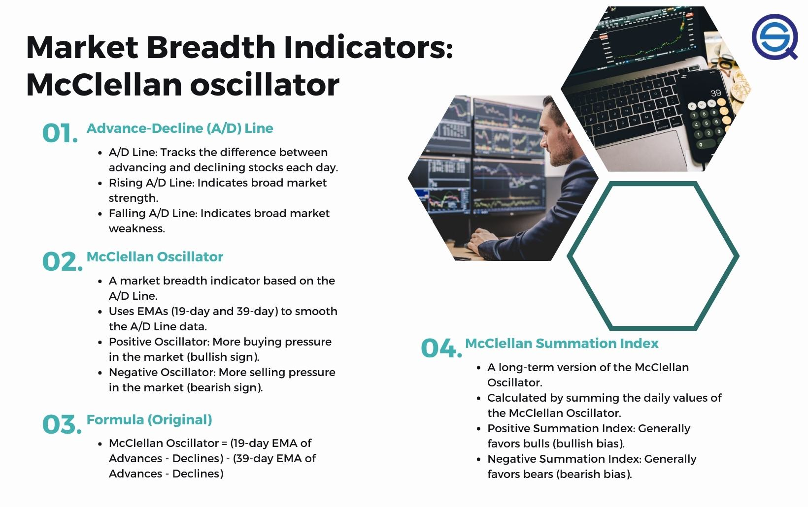

Understanding stock market indicators is crucial for traders and investors looking to navigate the volatile markets successfully. Traders often rely on these tools to make informed decisions and maximize their return on investment while managing risk. One such indicator that has proven valuable in analyzing market breadth is the McClellan Summation Index. This index serves as a powerful tool in assessing the underlying strength or weakness of stock market movements, offering insights into general market sentiment beyond what is visible through price patterns alone.

The McClellan Summation Index is an extension of the McClellan Oscillator, a well-respected measure of market breadth that was developed by Sherman and Marian McClellan. By aggregating daily values from the McClellan Oscillator, this index provides a cumulative measure that can reveal intermediate to long-term trends and potential reversals in the market. It serves as a barometer of market sentiment, where readings above certain thresholds indicate bullish tendencies, while those below signal bearish conditions. Such information can be vital for forecasting market directions and timing trades effectively.



In this article, we will explore the multifaceted applications of the McClellan Summation Index in technical analysis, highlighting how it aids traders in navigating complex market dynamics. Furthermore, we will discuss its role in algorithmic trading strategies—a domain where systematic approaches and the integration of technical indicators continue to gain traction. Traders and analysts will find value in understanding how to leverage this indicator for successful market predictions, potentially leading to more strategic investment outcomes.

## Table of Contents

## What is the McClellan Summation Index?

The McClellan Summation Index (MSI) serves as a pivotal tool in technical analysis, offering a nuanced view of market breadth by expanding upon the foundations laid by the McClellan Oscillator. Developed by Sherman and Marian McClellan, this index is constructed by summing the daily values of the McClellan Oscillator, thereby creating a cumulative measure that reflects the underlying market sentiment over time.

The core principle of the McClellan Summation Index is to provide insights into the balance between advancing and declining issues within a market. By accumulating the McClellan Oscillator values each trading day, the MSI provides a more comprehensive picture of market trends, particularly in assessing the strength or weakness of a market move. This accumulative nature allows the index to smooth out short-term fluctuations, thereby focusing on intermediate to long-term trends.

Mathematically, the McClellan Summation Index is expressed as follows:

$$
\text{MSI}(t) = \text{MSI}(t-1) + \text{Oscillator}(t)
$$

Where:
- $\text{MSI}(t)$ is the McClellan Summation Index at day $t$,
- $\text{MSI}(t-1)$ is the value of the index on the previous day, and
- $\text{Oscillator}(t)$ is the McClellan Oscillator value on day $t$.

A positive reading on the MSI indicates a stronger presence of advancing issues compared to declining ones, suggesting positive market [momentum](/wiki/momentum). Conversely, a negative reading points to a dominance of declining issues, hinting at a negative trend in market sentiment. This ability to gauge overall market sentiment over extended periods renders the McClellan Summation Index particularly effective in identifying potential trend reversals and persistent market movements.

It is important to note the thresholds commonly associated with the MSI. A reading exceeding +1,000 is generally interpreted as a bullish sign, while a value below -1,000 typically signifies bearish conditions. These thresholds, while not absolute, help traders and analysts categorize the broader market phase, aiding in their navigation of both bullish and bearish cycles.

## How the McClellan Summation Index Works

The McClellan Summation Index operates on a straightforward calculation methodology designed to capture the cumulative market sentiment over a given period. The process begins with the McClellan Oscillator, which is derived from the difference between two exponential moving averages (EMAs) of advancing and declining issues on the stock exchange. Specifically, the McClellan Oscillator is calculated as the difference between a 19-day EMA and a 39-day EMA of the daily advance-decline data.

To compute the McClellan Summation Index, the daily values of the McClellan Oscillator are consecutively added to form a cumulative total. This accumulation of data provides a broader view of the market's underlying sentiment and helps in recognizing longer-term trends and potential turning points.

The interpretation of the McClellan Summation Index is rooted in specific numerical thresholds that signal market bias. A reading of the Summation Index above +1,000 typically indicates a bullish bias, suggesting strong market breadth and the likelihood of an upward trend. Conversely, a reading below -1,000 signals a bearish outlook, often preceding downward market movements.

Significantly, traders pay close attention to readings approaching or surpassing levels like +1,900. Such high values may signify the inception of extensive bull markets, indicating robust and sustained buying pressure. These thresholds are not just arbitrary numbers; they are derived from historical market data and provide quantitative signals that traders use to make informed decisions about market positioning.

In summary, the McClellan Summation Index, with its cumulative calculation and established interpretative levels, serves as a vital tool for assessing market breadth and predicting significant market events. Its methodology allows traders to quantify sentiment effectively and adjust their strategies in alignment with emerging trends.

## Technical Analysis and the McClellan Summation Index

The McClellan Summation Index (MSI) serves as a potent tool in technical analysis, offering insights that extend beyond basic price movements to unveil broader market trends. By encapsulating market breadth—a measure of the number of stocks participating in a market trend—the MSI provides a nuanced view of market conditions that can indicate either overbought or oversold states.

At its core, the MSI is a cumulative measure derived from the McClellan Oscillator values. This characteristic allows it to smooth out short-term market fluctuations, providing a clearer picture of intermediate to long-term market trends. For instance, it often serves as a signal for technical analysts to identify overbought conditions when the index reaches high positive values or oversold conditions when the values are significantly negative. These conditions help analysts predict potential market reversals, adding depth to their understanding and leading to more informed trading decisions.

The index is typically used in conjunction with other technical indicators, such as Moving Averages or the Relative Strength Index (RSI), to refine trading strategies. This multi-faceted approach allows analysts to correlate breadth data provided by the MSI with price and trend information from other indicators, forming a well-rounded picture of market dynamics. Such integration helps in validating signals and lessening the likelihood of false readings, thus enabling traders to execute more precise entries and exits in the market.

In addition to providing signals of market conditions, the McClellan Summation Index can be programmed into [algorithmic trading](/wiki/algorithmic-trading) systems. Traders and quantitative analysts use historical data to backtest trading strategies involving the MSI, ensuring that they remain robust and effective across different market environments. This practice also aids in optimizing the parameters for the MSI in alignment with specific trading goals, be it capturing long-term growth or managing short-term market [volatility](/wiki/volatility-trading-strategies).

In summary, the McClellan Summation Index is valued for its ability to distill broad market dynamics into actionable insights, complementing other technical analysis tools to enhance trading effectiveness. By recognizing overbought and oversold conditions, the index arms traders with the capacity to anticipate reversals and position themselves advantageously within the market.

## Algorithmic Trading with the McClellan Summation Index

Algorithmic traders increasingly rely on the McClellan Summation Index to automate and enhance trading strategies. This dependence stems from the index's ability to provide a systematic approach to identifying market trends and turning points, critical components in the development of algorithms aimed at forecasting financial markets.

To integrate the McClellan Summation Index into algorithmic trading, traders often begin by constructing algorithms that incorporate the index as a key indicator of market breadth. These algorithms can systematically analyze historical data to detect bullish or bearish signals, based on predetermined thresholds such as readings above +1,000 indicating bullish biases and readings below -1,000 indicating bearish tendencies.

One of the key benefits of utilizing the McClellan Summation Index in algorithmic trading is the capability to backtest strategies. Backtesting involves running the trading algorithm using historical market data to assess its performance, allowing traders to fine-tune their algorithms based on observed results. This process ensures the trading strategy is robust and capable of responding to various market conditions.

Here's a simple Python example demonstrating how one might calculate the McClellan Summation Index using historical data for [backtesting](/wiki/backtesting):

```python
import numpy as np
import pandas as pd

# Load historical data
data = pd.read_csv('market_data.csv')  # Assume this file contains NYSE advance/decline data

# Calculate the daily McClellan Oscillator
n_short = 19
n_long = 39

ema_short = data['advances'].ewm(span=n_short, adjust=False).mean() - data['declines'].ewm(span=n_short, adjust=False).mean()
ema_long = data['advances'].ewm(span=n_long, adjust=False).mean() - data['declines'].ewm(span=n_long, adjust=False).mean()

mcclellan_oscillator = ema_short - ema_long

# Calculate McClellan Summation Index
mcclellan_summation_index = np.cumsum(mcclellan_oscillator)

# Append to the dataframe
data['McClellan Summation Index'] = mcclellan_summation_index

# Implement a simple trading strategy
def trading_signal(index_value):
    if index_value > 1000:
        return 'Buy'
    elif index_value < -1000:
        return 'Sell'
    else:
        return 'Hold'

data['Signal'] = data['McClellan Summation Index'].apply(trading_signal)

print(data[['Date', 'McClellan Summation Index', 'Signal']])
```

This rudimentary approach calculates the McClellan Oscillator and the McClellan Summation Index, generating trading signals based on the index's values. While this example uses a simplified strategy, it highlights the ease with which algorithmic traders can incorporate this index into more complex trading systems.

By leveraging the McClellan Summation Index, algorithmic traders can develop strategies tailored to various trading environments, allowing for more responsive and adaptive trading models. As financial markets continue to evolve, the strategic use of such indicators will remain crucial for maintaining a competitive edge in algorithmic trading.

## Applications in Various Markets

The McClellan Summation Index, while initially developed for equity markets, possesses inherent adaptability that supports its application across various asset classes, including cryptocurrencies. Its versatility stems from the universal concept of market breadth that the index measures, allowing it to provide valuable insights into market momentum and potential turning points, regardless of the type of asset. 

When applied to cryptocurrencies, traders should recognize the distinct volatility and [liquidity](/wiki/liquidity-risk-premium) characteristics that differentiate this market from traditional equities. Cryptocurrencies often experience more dramatic price fluctuations and trends that may not align with the benchmarks established for stock markets. Thus, it is crucial to adjust the parameters and thresholds employed in computing the McClellan Summation Index for more effective application in [cryptocurrency](/wiki/cryptocurrency) trading. This might involve recalibrating the levels that signify bullish or bearish trends. For example, the threshold values of +1,000 or -1,000, typical in equity markets, might need customization to match the volatility profile of specific cryptocurrencies.

The adaptability of the McClellan Summation Index extends beyond cryptocurrencies to encompass other markets such as commodities and [forex](/wiki/forex-system). Each market demands unique parameter adjustments to accurately reflect its specific trading dynamics and investor behavior. For instance, the forex market, with its round-the-clock trading and response to geopolitical factors, may require different sensitivity settings to capture genuine market signals without the noise of currency fluctuations.

Here is a basic Python framework to illustrate how one might adjust the index parameters for a specific market:

```python
def calculate_mcclellan_oscillator(advances, declines):
    adv_ema = calculate_ema(advances)
    dec_ema = calculate_ema(declines)
    return adv_ema - dec_ema

def calculate_mcclellan_summation_index(oscillator_values):
    return sum(oscillator_values)

# Example of parameter adjustments for a cryptocurrency market
def adjusted_thresholds(asset_class):
    if asset_class == 'crypto':
        return {'bullish': 1500, 'bearish': -1500}
    elif asset_class == 'forex':
        return {'bullish': 800, 'bearish': -800}
    else:
        return {'bullish': 1000, 'bearish': -1000}

# Calculate adjusted index thresholds for a given market
market = 'crypto'
thresholds = adjusted_thresholds(market)
print(f"Adjusted Bullish Threshold: {thresholds['bullish']}")
print(f"Adjusted Bearish Threshold: {thresholds['bearish']}")
```

By customizing the parameters, traders can ensure that the McClellan Summation Index is appropriately tuned for accurate application across diverse markets. This adaptability is key to leveraging the index’s potential to provide comprehensive insights into market sentiment and trend direction, thus aiding in more robust trading strategies.

## Conclusion

The McClellan Summation Index remains a crucial tool for traders and technical analysts aiming to enhance their market strategies. This indicator provides valuable insights into market breadth, crucial for predicting potential reversals and identifying significant trends. By aggregating daily values from the McClellan Oscillator, the Summation Index offers a comprehensive view of market sentiment, which can be instrumental in determining the overall direction of financial markets.

As markets continually evolve, with new asset classes such as cryptocurrencies gaining prominence, traders and analysts must adapt their strategies to effectively leverage the McClellan Summation Index. The adaptability of this index across different markets underscores its versatility and relevance in today's dynamic trading environment. Traders should not only monitor the traditional equity markets but also consider adjusting the parameters of the McClellan Summation Index to suit the unique characteristics of other asset classes. 

By continually refining their approaches, traders can better anticipate significant market movements and adjust their strategies accordingly. This proactive standpoint ensures that the McClellan Summation Index remains an indispensable part of a trader's analytical toolkit, providing a deeper understanding of market dynamics and potential future trends.

## References & Further Reading

[1]: McClellan, S., & McClellan, M. (2003). ["Patterns for Profit."](https://www.mcoscillator.com/books_video/details/patternsforprofit/) McClellan Financial Publications.

[2]: Colby, R. W. (2003). ["The Encyclopedia of Technical Market Indicators."](https://archive.org/details/encyclopediaofte00colb) McGraw-Hill.

[3]: Murphy, J. J. (1999). ["Technical Analysis of the Financial Markets."](https://drive.google.com/file/d/1OcDrGakDhaejT7J7xGEE3HHKy7xmrafy/preview) New York Institute of Finance.

[4]: Pring, M. (2002). ["Technical Analysis Explained: The Successful Investor's Guide to Spotting Investment Trends and Turning Points."](https://www.amazon.com/Technical-Analysis-Explained-Fifth-Successful/dp/0071825177) McGraw-Hill.

[5]: Achelis, S. B. (2001). ["Technical Analysis from A to Z."](https://archive.org/details/technicalanalysi00ache) McGraw-Hill.