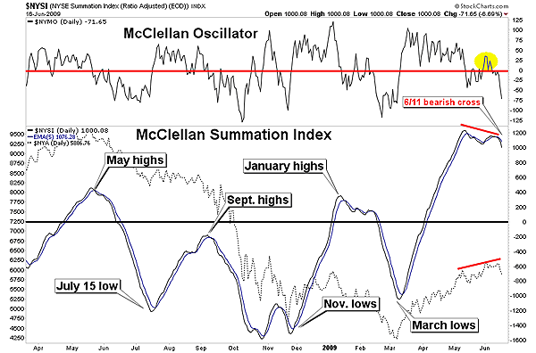

## Table of Contents

## What is the McClellan Summation Index?

The McClellan Summation Index is a technical analysis tool used by investors to understand the overall direction of the stock market. It is calculated using the difference between the number of advancing and declining stocks on a daily basis, which is known as the McClellan Oscillator. The Summation Index adds up these daily values to provide a cumulative measure, helping traders see longer-term trends in market breadth.

This index can help investors spot when the market might be getting too bullish or too bearish. If the Summation Index is rising, it suggests that more stocks are advancing than declining over time, which could mean the market is getting stronger. On the other hand, if the index is falling, it indicates that more stocks are declining, suggesting the market might be weakening. By watching these trends, investors can make more informed decisions about when to buy or sell stocks.

## Who developed the McClellan Summation Index?

The McClellan Summation Index was developed by Sherman and Marian McClellan. They are a husband-and-wife team who worked together to create this tool for analyzing the stock market. Sherman McClellan was a former Navy lieutenant who used his mathematical skills to develop the index, while Marian McClellan contributed her insights and research to refine the tool.

The McClellans introduced their Summation Index in the early 1970s. They wanted to create a way for investors to see the overall health of the stock market by looking at how many stocks were going up or down each day. By adding up these daily changes, the Summation Index helps investors understand longer-term trends in the market, making it easier to decide when to buy or sell stocks.

## How is the McClellan Summation Index calculated?

The McClellan Summation Index is calculated using the McClellan Oscillator. The McClellan Oscillator is found by taking the difference between the number of stocks that went up and the number of stocks that went down each day. This difference is then smoothed out using two different moving averages. One moving average is usually set to 19 days, and the other is set to 39 days. The McClellan Oscillator is the result of subtracting the longer 39-day moving average from the shorter 19-day moving average.

To get the McClellan Summation Index, you start with a base value, often zero, and then add the daily value of the McClellan Oscillator to it. Each day, you take the previous day's Summation Index value and add the current day's McClellan Oscillator value to it. This creates a running total that shows the cumulative effect of the daily changes in market breadth. By looking at this total, investors can see if the market is getting stronger or weaker over time.

## What is the significance of the McClellan Summation Index in market analysis?

The McClellan Summation Index is an important tool for people who want to understand what's happening in the stock market. It helps them see if more stocks are going up or down over time. By adding up the daily changes between advancing and declining stocks, the Summation Index gives a big picture view of the market's health. If the index is going up, it means that more stocks are getting better, which could be a sign that the market is getting stronger. On the other hand, if the index is going down, it shows that more stocks are doing worse, which might mean the market is getting weaker.

Investors use the McClellan Summation Index to help them decide when to buy or sell stocks. If the index is going up and it's high, it might be a good time to buy because the market looks strong. But if the index is going down and it's low, it might be a good time to sell because the market might be getting ready for a downturn. By watching the Summation Index, investors can get a better idea of the market's direction and make smarter choices about their investments.

## How does the McClellan Summation Index differ from the McClellan Oscillator?

The McClellan Summation Index and the McClellan Oscillator are both tools used to understand the stock market, but they work a bit differently. The McClellan Oscillator looks at the difference between the number of stocks going up and the number going down each day. It uses two moving averages to smooth out this difference and show short-term changes in the market. If more stocks are going up, the Oscillator will show a positive number, and if more are going down, it will show a negative number.

On the other hand, the McClellan Summation Index takes the daily values of the McClellan Oscillator and adds them up over time. This gives a running total that shows longer-term trends in the market. If the Summation Index is going up, it means the market has been getting stronger over time, and if it's going down, the market has been getting weaker. So, while the Oscillator is good for seeing quick changes, the Summation Index helps investors see the bigger picture and make decisions based on longer trends.

## Can you explain how to interpret the values of the McClellan Summation Index?

The McClellan Summation Index helps investors understand if the stock market is getting stronger or weaker over time. If the Summation Index is going up, it means that more stocks have been going up than going down over time. This can be a sign that the market is getting stronger and might be a good time to buy stocks. On the other hand, if the Summation Index is going down, it means that more stocks have been going down than going up. This can be a sign that the market is getting weaker and might be a good time to sell stocks.

People also look at the actual numbers of the McClellan Summation Index to get more information. If the number is high and positive, it means the market has been very strong for a while. If the number is low and negative, it means the market has been weak for a while. By watching these numbers, investors can see if the market is reaching new highs or new lows, which can help them decide when to make changes to their investments.

## What are the typical signals generated by the McClellan Summation Index?

The McClellan Summation Index gives investors important signals about the stock market. One key signal is when the index crosses above zero. This means that more stocks have been going up than going down over time, and it can be a sign that the market is getting stronger. Investors might see this as a good time to buy stocks because the market looks like it's improving. Another important signal is when the index crosses below zero. This means that more stocks have been going down than going up, and it can be a sign that the market is getting weaker. Investors might see this as a good time to sell stocks because the market might be heading for a downturn.

Another signal to watch for is when the McClellan Summation Index reaches very high or very low levels. If the index gets to a very high positive number, it means the market has been very strong for a long time. This might be a sign that the market is getting overbought, and a correction could be coming soon. On the other hand, if the index gets to a very low negative number, it means the market has been very weak for a long time. This might be a sign that the market is getting oversold, and a rebound could be on the way. By paying attention to these signals, investors can make better decisions about when to buy or sell stocks.

## How can the McClellan Summation Index be used to predict market trends?

The McClellan Summation Index can help people guess where the stock market might be heading by looking at how many stocks are going up or down over time. When the index is going up, it means that more stocks have been getting better, which can be a sign that the market is getting stronger. If the index goes above zero, it's a good signal that the market might keep getting better, and it could be a good time to buy stocks. On the other hand, if the index is going down, it means that more stocks have been getting worse, which can be a sign that the market is getting weaker. If the index goes below zero, it's a warning that the market might keep getting worse, and it could be a good time to sell stocks.

Another way the McClellan Summation Index can help predict market trends is by looking at how high or low the numbers get. If the index reaches a very high positive number, it means the market has been very strong for a long time. This might mean the market is getting too excited and could be ready for a small drop, which is called a correction. If the index reaches a very low negative number, it means the market has been very weak for a long time. This might mean the market is getting too down and could be ready for a small rise, which is called a rebound. By watching these numbers, people can get a better idea of when the market might change direction and make smarter choices about their investments.

## What are some common pitfalls or misconceptions about using the McClellan Summation Index?

One common pitfall when using the McClellan Summation Index is relying on it too much without looking at other information. The index is just one tool, and it doesn't tell the whole story about the stock market. People can make mistakes if they only use the Summation Index to make decisions without looking at things like company news, economic reports, or other market indicators. It's important to use the index along with other tools to get a full picture of what's happening in the market.

Another misconception is thinking that the McClellan Summation Index can predict the future perfectly. While it can give signals about market trends, it's not a crystal ball. The index can help show if the market is getting stronger or weaker over time, but it can't tell exactly when the market will go up or down. People need to remember that the stock market can be unpredictable, and the Summation Index is just one piece of the puzzle to help make better guesses about what might happen next.

## How does the McClellan Summation Index perform during different market conditions?

The McClellan Summation Index can help people understand how the stock market is doing in different situations. When the market is going up, or in a bull market, the Summation Index usually goes up too. This is because more stocks are going up than going down, which makes the index show a positive number. If the index keeps going up and gets to a very high number, it might mean the market is getting too excited and could be ready for a small drop. But if the index is just starting to go up and crosses above zero, it can be a good sign that the market will keep getting better, and it might be a good time to buy stocks.

On the other hand, when the market is going down, or in a bear market, the Summation Index usually goes down too. This happens because more stocks are going down than going up, which makes the index show a negative number. If the index keeps going down and gets to a very low number, it might mean the market is getting too down and could be ready for a small rise. If the index is just starting to go down and crosses below zero, it can be a warning that the market will keep getting worse, and it might be a good time to sell stocks. By watching how the Summation Index changes during different market conditions, people can get a better idea of what to do with their investments.

## What are some advanced techniques for integrating the McClellan Summation Index with other indicators?

One advanced way to use the McClellan Summation Index is to combine it with other market indicators like the Relative Strength Index (RSI) or the Moving Average Convergence Divergence (MACD). For example, if the Summation Index is going up and the RSI is also showing that the market is not overbought, it can be a strong sign that the market will keep getting better. This can give people more confidence to buy stocks. On the other hand, if the Summation Index is going down and the MACD is showing a bearish signal, it can be a strong warning that the market will keep getting worse. This can help people decide it's a good time to sell stocks.

Another technique is to use the Summation Index with volume indicators like the On-Balance Volume (OBV). If the Summation Index is going up and the OBV is also going up, it means that the market is getting stronger and more people are buying stocks. This can be a good time to invest. But if the Summation Index is going down and the OBV is also going down, it means the market is getting weaker and more people are selling stocks. This can be a sign to get out of the market. By looking at the Summation Index along with these other indicators, people can get a better idea of what's happening in the market and make smarter choices about their investments.

## How has the effectiveness of the McClellan Summation Index evolved with changes in market dynamics over the years?

The McClellan Summation Index has been a useful tool for understanding the stock market since it was created in the early 1970s. Over the years, the way the market works has changed a lot, with more technology and faster trading. Even with these changes, the Summation Index has stayed helpful because it looks at how many stocks are going up or down over time. This basic idea still works well, even when the market gets more complicated. But, people have to be careful because the market can be more unpredictable now, and the Summation Index might not catch every quick change.

As the market has grown and changed, people have started using the McClellan Summation Index along with other new tools and indicators. This helps them get a better picture of what's happening in the market. For example, they might use it with things like the Relative Strength Index or volume indicators to see if the market is getting too excited or too down. By combining the Summation Index with these other tools, people can make smarter choices about when to buy or sell stocks, even as the market keeps changing.

## What is the McClellan Summation Index?

The McClellan Summation Index (MSI) serves as a pivotal tool in technical analysis, offering a nuanced view of market breadth by expanding upon the foundations laid by the McClellan Oscillator. Developed by Sherman and Marian McClellan, this index is constructed by summing the daily values of the McClellan Oscillator, thereby creating a cumulative measure that reflects the underlying market sentiment over time.

The core principle of the McClellan Summation Index is to provide insights into the balance between advancing and declining issues within a market. By accumulating the McClellan Oscillator values each trading day, the MSI provides a more comprehensive picture of market trends, particularly in assessing the strength or weakness of a market move. This accumulative nature allows the index to smooth out short-term fluctuations, thereby focusing on intermediate to long-term trends.

Mathematically, the McClellan Summation Index is expressed as follows:

$$
\text{MSI}(t) = \text{MSI}(t-1) + \text{Oscillator}(t)
$$

Where:
- $\text{MSI}(t)$ is the McClellan Summation Index at day $t$,
- $\text{MSI}(t-1)$ is the value of the index on the previous day, and
- $\text{Oscillator}(t)$ is the McClellan Oscillator value on day $t$.

A positive reading on the MSI indicates a stronger presence of advancing issues compared to declining ones, suggesting positive market [momentum](/wiki/momentum). Conversely, a negative reading points to a dominance of declining issues, hinting at a negative trend in market sentiment. This ability to gauge overall market sentiment over extended periods renders the McClellan Summation Index particularly effective in identifying potential trend reversals and persistent market movements.

It is important to note the thresholds commonly associated with the MSI. A reading exceeding +1,000 is generally interpreted as a bullish sign, while a value below -1,000 typically signifies bearish conditions. These thresholds, while not absolute, help traders and analysts categorize the broader market phase, aiding in their navigation of both bullish and bearish cycles.

## References & Further Reading

[1]: McClellan, S., & McClellan, M. (2003). ["Patterns for Profit."](https://www.mcoscillator.com/books_video/details/patternsforprofit/) McClellan Financial Publications.

[2]: Colby, R. W. (2003). ["The Encyclopedia of Technical Market Indicators."](https://archive.org/details/encyclopediaofte00colb) McGraw-Hill.

[3]: Murphy, J. J. (1999). ["Technical Analysis of the Financial Markets."](https://drive.google.com/file/d/1OcDrGakDhaejT7J7xGEE3HHKy7xmrafy/preview) New York Institute of Finance.

[4]: Pring, M. (2002). ["Technical Analysis Explained: The Successful Investor's Guide to Spotting Investment Trends and Turning Points."](https://www.amazon.com/Technical-Analysis-Explained-Fifth-Successful/dp/0071825177) McGraw-Hill.

[5]: Achelis, S. B. (2001). ["Technical Analysis from A to Z."](https://archive.org/details/technicalanalysi00ache) McGraw-Hill.