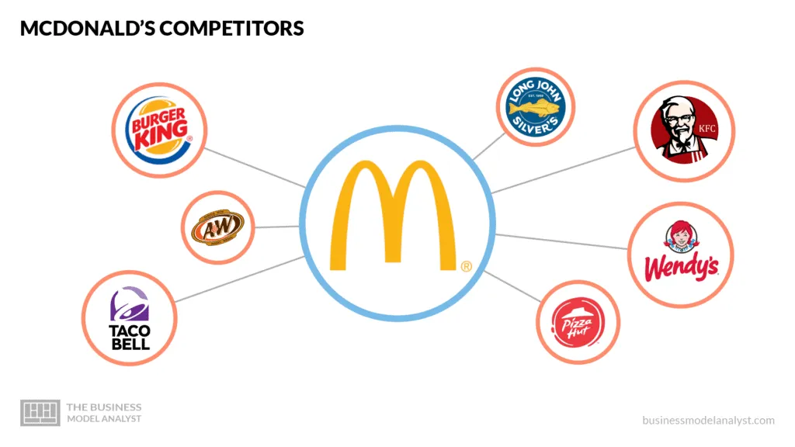

## Table of Contents

## What are some well-known competitors of McDonald's?

McDonald's has many competitors in the fast food industry. Some of the most well-known ones are Burger King, Wendy's, and KFC. These restaurants are popular all over the world and offer similar types of food like burgers, fries, and chicken.

Burger King is famous for its flame-grilled burgers and the Whopper sandwich. Wendy's is known for its square burgers and frosty desserts. KFC specializes in fried chicken and has a unique recipe that many people enjoy. All these places try to attract customers with good food and special deals.

In addition to these, there are also other big names like Subway, Taco Bell, and Domino's. Subway focuses on sandwiches and healthier options. Taco Bell offers Mexican-inspired fast food like tacos and burritos. Domino's is well-known for its pizza and quick delivery service. Each of these competitors brings something different to the table, trying to stand out in the busy fast food market.

## How do McDonald's competitors differ in terms of menu offerings?

McDonald's competitors have different types of food on their menus. Burger King is known for its flame-grilled burgers, especially the Whopper. They also have chicken sandwiches and fries, but their burgers are what make them special. Wendy's is famous for its square burgers and fresh beef. They also have a popular frosty dessert that many people love. KFC, on the other hand, focuses on fried chicken. Their menu includes different kinds of chicken meals, and they are known for their unique recipe that people enjoy.

Other competitors like Subway, Taco Bell, and Domino's offer different kinds of food too. Subway is all about sandwiches and tries to offer healthier options with fresh veggies and different bread choices. Taco Bell brings Mexican-inspired fast food to the table, with items like tacos, burritos, and nachos. They often have fun and creative menu items. Domino's is known for its pizza, offering a variety of toppings and quick delivery service. Each of these places tries to stand out by offering something different from what McDonald's has on its menu.

## What are the main business strategies of McDonald's top competitors?

Burger King, one of McDonald's top competitors, focuses on offering flame-grilled burgers, which is different from McDonald's method of cooking. They use ads that often compare their burgers to McDonald's, trying to show that theirs are better. Burger King also tries to attract customers with deals and promotions, like the "Whopper Detour" campaign where they offered a cheap Whopper if customers ordered it near a McDonald's. They also work on making their restaurants more modern and easy to use, with things like digital menus and ordering kiosks.

Wendy's is another big competitor. They focus on fresh, never-frozen beef for their burgers, which they say makes them taste better. Wendy's also uses social media a lot to connect with customers and make funny comments about other fast food places, including McDonald's. They offer deals and new menu items to keep people interested. KFC, on the other hand, is all about their special fried chicken recipe. They try to keep their menu simple but tasty, and they often have deals like the "Bucket for a Buck" to attract customers. KFC also works on making their restaurants more modern and comfortable, so people want to eat there.

These strategies help Burger King, Wendy's, and KFC stand out from McDonald's. They each try to offer something different, whether it's the way they cook their food, the deals they offer, or how they use technology and social media. By focusing on these things, they hope to attract customers who might choose them over McDonald's.

## How do the pricing strategies of McDonald's competitors compare to McDonald's?

Burger King, Wendy's, and KFC have pricing strategies that are pretty similar to McDonald's. They all offer meals at different price points to attract different kinds of customers. For example, Burger King and McDonald's both have value menus with items that cost around a dollar. Wendy's also has a value menu, but they focus on making their burgers seem like a better deal because they use fresh beef. KFC's pricing is a bit different because they focus on chicken, but they still have deals like the "Bucket for a Buck" to keep prices low and attract customers.

These competitors also use special promotions and deals to compete with McDonald's. Burger King often has deals like the "Whopper Detour" where they offer a cheap Whopper if you order it near a McDonald's. Wendy's runs promotions like "4 for $4" deals, which give you a good amount of food for a low price. KFC might offer discounts on their famous buckets of chicken. All these strategies help Burger King, Wendy's, and KFC keep their prices competitive with McDonald's, trying to win over customers with good deals and tasty food.

## What is the market share of McDonald's compared to its main competitors?

McDonald's is the biggest fast food chain in the world. They have a big part of the market, around 20% in the United States. This means that out of every 100 fast food meals sold, about 20 are from McDonald's. Their main competitors, like Burger King, Wendy's, and KFC, have smaller shares of the market. Burger King has about 5% of the market, Wendy's has around 3%, and KFC has about 4%. These numbers show that McDonald's is way ahead of its competitors in the fast food business.

Even though McDonald's has a big lead, its competitors are still important in the market. Burger King, Wendy's, and KFC each have their own special things that attract customers. For example, Burger King is known for its flame-grilled burgers, Wendy's for its fresh beef, and KFC for its fried chicken. These differences help them keep their own customers and sometimes take customers away from McDonald's. But overall, McDonald's still has the biggest share of the market and is the leader in the fast food industry.

## How do customer demographics vary between McDonald's and its competitors?

McDonald's attracts a wide range of customers. Families with kids often go to McDonald's because they have a play area and special meals for children. Young adults and teenagers like it too because it's quick and cheap. McDonald's also has a lot of older customers who enjoy the familiar taste of their food. They have something for everyone, which helps them attract all kinds of people.

Burger King, Wendy's, and KFC have different kinds of customers. Burger King gets a lot of young adults and teenagers who like their flame-grilled burgers. They also attract people who want a quick meal but might be looking for something a bit different from McDonald's. Wendy's customers are often a bit older and might care more about the quality of the food. They like the fresh beef and the frosty desserts. KFC has a lot of families and groups of friends who enjoy their fried chicken. Each of these places has its own special group of customers who like what they offer.

## What are the key strengths and weaknesses of McDonald's competitors?

Burger King's key strength is their flame-grilled burgers, which many people enjoy because they taste different from McDonald's. They also have good deals and use funny ads to attract customers. But, Burger King's weakness is that they are not as big as McDonald's, so they don't have as many restaurants around the world. This means some people might choose McDonald's just because it's easier to find.

Wendy's strength is their fresh, never-frozen beef. This makes their burgers taste good and attracts customers who care about food quality. They also use social media well to connect with people and make them laugh. However, Wendy's weakness is that they are smaller than McDonald's too. They don't have as many locations, which can make it harder for them to reach as many customers. Plus, their menu can be a bit more expensive than some other fast food places.

KFC's biggest strength is their famous fried chicken. People love the taste, and KFC often has good deals on buckets of chicken. They also try to make their restaurants nice places to eat. But, KFC's weakness is that they focus mostly on chicken, so if someone wants a burger or something else, they might go to McDonald's instead. Also, like Burger King and Wendy's, KFC is smaller than McDonald's and doesn't have as many locations around the world.

## How have McDonald's competitors adapted to changes in consumer preferences?

McDonald's competitors have changed their menus to fit what people want now. More people want healthy food, so places like Subway started offering more salads and veggies. They also let you choose what goes in your sandwich, so you can make it healthier. Burger King and Wendy's added more chicken options because people are eating less red meat. They also made their menus clearer, showing how many calories are in each item. This helps people pick food that is better for them.

These fast food places also use technology more now. They have apps where you can order food and get deals. This makes it easier for people who are busy. They also have touch screens in their restaurants where you can order without talking to anyone. This is good for people who want to get their food quickly. Social media is big too. Wendy's, for example, uses funny posts to talk to customers and show they understand what people like now. All these changes help Burger King, Wendy's, and KFC keep up with what people want today.

## What role does digital innovation play among McDonald's competitors?

Digital innovation is really important for McDonald's competitors like Burger King, Wendy's, and KFC. They use apps where you can order food and get special deals. This makes it easy for people who are busy or want to save money. They also have touch screens in their restaurants where you can order your food without talking to anyone. This is good for people who want to get their food quickly and without waiting in line.

Social media is another big part of digital innovation for these fast food places. Wendy's, for example, uses funny posts to talk to customers and show they understand what people like now. This helps them connect with younger people who spend a lot of time online. By using technology like apps, touch screens, and social media, Burger King, Wendy's, and KFC can keep up with what people want and make their customers happy.

## How do sustainability practices differ among McDonald's and its competitors?

McDonald's and its competitors like Burger King, Wendy's, and KFC all try to be more sustainable, but they do it in different ways. McDonald's works on reducing waste by using less plastic and recycling more. They also try to use more sustainable food sources, like cage-free eggs and responsibly sourced fish. McDonald's has set goals to reduce greenhouse gas emissions and use more renewable energy in their restaurants. They want to show that they care about the environment and are trying to make a difference.

Burger King, Wendy's, and KFC also focus on sustainability, but they each have their own special ways of doing it. Burger King has promised to use more renewable energy and reduce their carbon footprint. They also try to use more sustainable packaging, like switching to paper straws. Wendy's works on reducing waste and using more sustainable food sources, like switching to cage-free eggs too. They also focus on reducing water use in their restaurants. KFC tries to reduce waste by using less packaging and recycling more. They also work on using more sustainable food, like chicken raised without antibiotics. Each of these places tries to be more sustainable in their own way, but they all want to make the world a better place.

## What are the global expansion strategies of McDonald's competitors?

Burger King, Wendy's, and KFC all want to grow bigger around the world, just like McDonald's. They do this by opening new restaurants in different countries. Burger King tries to go to places where they think people will like their flame-grilled burgers. They also make deals with local businesses to help them open new restaurants faster. Wendy's looks for countries where people want fresh, good-quality food. They start with big cities and then spread out to smaller places. KFC focuses on countries where people love chicken. They often work with local partners to make sure their food fits what people in those places like to eat.

These fast food places also change their menus to fit different countries. Burger King might add local flavors to their burgers in some places. Wendy's might offer different kinds of bread or toppings that people in that country enjoy. KFC often changes their chicken recipes a bit to match local tastes. They all try to make their food feel familiar to people in new places. By doing this, they hope to attract more customers and grow their business around the world.

## How do franchise models and ownership structures vary among McDonald's competitors?

McDonald's competitors like Burger King, Wendy's, and KFC use franchise models to grow their businesses, but they do it a bit differently. Burger King has a lot of franchisees, which means they let other people open and run their restaurants. They give these franchisees help with things like training and marketing. Burger King also has some restaurants that they own themselves, but most are run by franchisees. Wendy's also uses a franchise model, but they have fewer company-owned restaurants than Burger King. They focus on helping their franchisees make money and grow their businesses. KFC is similar, with most of their restaurants run by franchisees. They work closely with these franchisees to make sure the food and service are good everywhere.

The ownership structures of these competitors can be different too. Burger King is owned by Restaurant Brands International, which also owns other fast food places. This big company helps Burger King grow and do well. Wendy's is a bit different because it's mostly owned by its founder's family and some big investors. They work to keep the business strong and focused on what makes Wendy's special. KFC is part of Yum! Brands, which owns other big fast food chains too. Yum! Brands helps KFC with things like new ideas and technology. Each of these companies has its own way of making sure their franchisees and restaurants do well.

## References & Further Reading

[1]: Bergstra, J., Bardenet, R., Bengio, Y., & Kégl, B. (2011). ["Algorithms for Hyper-Parameter Optimization."](https://dl.acm.org/doi/10.5555/2986459.2986743) Advances in Neural Information Processing Systems 24.

[2]: ["Advances in Financial Machine Learning"](https://www.amazon.com/Advances-Financial-Machine-Learning-Marcos/dp/1119482089) by Marcos Lopez de Prado

[3]: ["Evidence-Based Technical Analysis: Applying the Scientific Method and Statistical Inference to Trading Signals"](https://www.amazon.com/Evidence-Based-Technical-Analysis-Scientific-Statistical/dp/0470008741) by David Aronson

[4]: ["Machine Learning for Algorithmic Trading"](https://github.com/stefan-jansen/machine-learning-for-trading) by Stefan Jansen

[5]: ["Quantitative Trading: How to Build Your Own Algorithmic Trading Business"](https://www.amazon.com/Quantitative-Trading-Build-Algorithmic-Business/dp/1119800064) by Ernest P. Chan