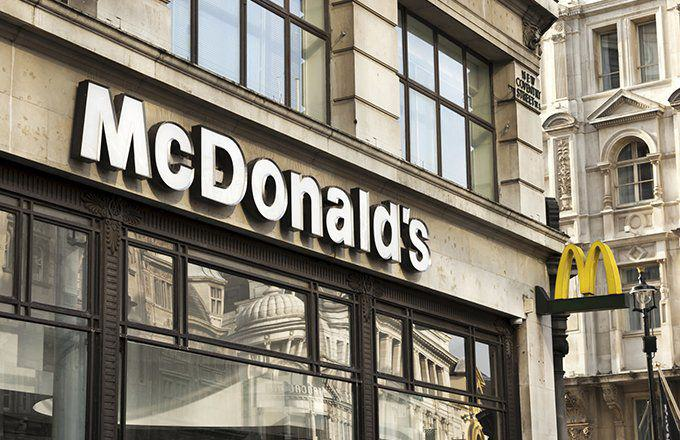

The fast-food industry is a dynamic and highly competitive market, with major players like McDonald's at the forefront. Founded in 1940, McDonald's has set the benchmark for efficiency and scale, making it a household name globally. This sector's appeal can largely be attributed to its ability to evolve with changing consumer preferences and technological advancements. In recent years, technology has not only transformed operational aspects but also the ways investors and analysts assess these businesses. One significant technological development is algorithmic trading, which automates investment decisions through advanced algorithms that analyze vast datasets.

Algorithmic trading has revolutionized the financial markets by making investment processes more efficient and data-driven. By employing complex algorithms, investors can swiftly evaluate stocks, like those of McDonald's and its rivals, based on real-time data and market trends. This innovation enables stakeholders to make more informed decisions, optimizing their portfolios with increased accuracy and speed. Such trading strategies are essential for navigating the unpredictable market landscape of the fast-food industry, where fluctuations in consumer behavior and competition can have immediate effects on stock performance.



This article examines how McDonald's and its competitors are adapting to this evolving market environment. It looks at the historical development of McDonald's, the strategies employed by its key competitors, and the pivotal role algorithmic trading plays in shaping investment strategies. By understanding these interrelated elements, stakeholders can gain deeper insights into the complexities of investing in the fast-paced world of fast-food industry stocks, identifying opportunities for growth and innovation. The fast-food industry continues to thrive by embracing change, and those who leverage these insights stand to benefit in an increasingly interconnected global market.

## Table of Contents

## The Fast Food Industry Landscape

The global fast-food industry has witnessed remarkable growth, driven by shifting consumer preferences and the increasing influence of globalization. This sector is predominantly led by major corporations such as McDonald's, Burger King, and KFC, each strategically sustaining their market presence through distinctive approaches.

Historically, McDonald's has focused on consistency and efficiency, incorporating a franchising model that mirrors its foundational Speedee Service System established in the mid-20th century. Burger King differentiates itself with flame-grilled burgers and innovative marketing that often directly challenges competitors. KFC, as part of Yum Brands, pursues aggressive global expansion and menu diversification to cater to varied taste preferences across different regions.

The emergence of fast-casual brands such as Chipotle and Subway has added layers of complexity to the industry. These brands capitalize on shifting consumer preferences towards healthier and customizable meal options. Chipotle, for instance, emphasizes organic ingredients and sustainability, while Subway offers customizable sandwich options that appeal to health-conscious consumers seeking quick-service meals.

Market trends highlight a consumer base increasingly interested in convenience without sacrificing quality, ushering in a demand for fast food that aligns with modern health and environmental considerations. This evolution in consumer behavior challenges traditional fast-food players to adapt by incorporating healthier options and sustainable practices.

Competitive strategies are manifold, ranging from menu innovations and franchise efficiency to leveraging digital technology for improved customer engagement. The fast-food industry is further complicated by the need to respond to local tastes while maintaining a global brand identity. Consequently, navigating this industry involves a multifaceted understanding of diverse consumer demands and agile adaptation to market dynamics.

Through strategic maneuvers and embrace of digital innovations, key industry players continue to reinforce their positions in this fast-evolving landscape, balancing the scales between traditional fast-food offerings and modern consumer expectations.

## A Closer Look at McDonald's

McDonald's, founded in 1940 by Richard and Maurice McDonald in San Bernardino, California, significantly transformed the fast-food industry with the introduction of its Speedee Service System. This system was designed to improve efficiency and ensure consistency in product delivery, laying the foundation for the company's future success. The Speedee Service System's innovative approach prioritized speed, low prices, and high [volume](/wiki/volume-trading-strategy), revolutionizing the dining experience by catering to an increasingly mobile and time-pressed public.

Today, McDonald's operates over 39,000 locations worldwide and has become a cultural icon synonymous with fast food. The brand's global reach is supported by sophisticated marketing campaigns that reinforce its image and menu innovations tailored to regional tastes. For example, McDonald's has adjusted offerings in different countries to include menu items such as the McSpicy Paneer in India and the Teriyaki Burger in Japan, catering to local preferences while maintaining global brand consistency.

Technological adaptation is a cornerstone of McDonald's strategy, as the company continually explores new ways to enhance customer experience. Recent initiatives include the introduction of healthier menu options like salads and fruit, aiming to attract health-conscious consumers. Furthermore, McDonald's has embraced digital technology, incorporating mobile ordering systems and self-service kiosks to streamline the ordering process and reduce wait times for customers. These advancements demonstrate McDonald's commitment to staying ahead in a competitive market by meeting the evolving needs of its clientele.

Financially, McDonald's holds a dominant position in the global market, underpinned by robust market capitalization. This financial strength is largely driven by strategic acquisitions and continuous innovation. McDonald's acquisition of Dynamic Yield, a tech company specializing in personalization and decision logic, exemplifies its strategy to enhance customer interaction through tailored digital experiences. Such strategic moves not only improve customer satisfaction but also drive sales and profitability by leveraging data analytics and [machine learning](/wiki/machine-learning) to optimize sales processes and customer engagement.

In summary, McDonald's maintains its leadership in the fast-food industry by consistently adapting to changing consumer preferences and technological advancements. The company's ability to innovate in menu offerings, embrace technological integration, and strategically manage its global operations ensures its continued success and influence as a global fast-food giant.

## Key Competitors in the Fast-Food Arena

Burger King, a significant contender to McDonald's, is renowned for its distinct flame-grilled cooking method, which differentiates its offerings. The brand has successfully implemented innovative marketing strategies to capture consumer attention. An example is the "Whopper Detour" campaign, which ingeniously encouraged customers to order a Whopper for just one cent when within 600 feet of a McDonald’s location, thereby increasing mobile app downloads.

Wendy’s sets itself apart with a commitment to quality ingredients, emphasizing fresh, never frozen beef across its menu. This focus on quality is complemented by an adept use of social media, where Wendy’s has gained a formidable presence through its witty and engaging interactions, further strengthening its brand image among younger consumers.

Yum Brands holds a diverse portfolio, including KFC, Taco Bell, and Pizza Hut, and is marked by a strategic emphasis on global expansion. The company leverages this diverse array by tailoring its menu offerings to cater to regional tastes and preferences, thus maximizing its market presence. The diversification strategy allows Yum Brands to mitigate risks and capitalize on various consumer markets.

Subway and Chipotle are notable for their health-centric and customizable meal options, addressing the growing consumer demand for healthier food choices. Subway’s marketing highlights the ability to build personalized subs, while Chipotle emphasizes its commitment to sourcing fresh and ethically sourced ingredients, both of which appeal to health-conscious customers seeking ethical consumption.

Starbucks, albeit primarily a coffeehouse, competes indirectly in the fast-food landscape by offering quick-service food options that attract a similar customer base. Its expansion into breakfast and lunch options, complemented by an extensive beverage menu, positions Starbucks as a versatile competitor. Starbucks strategically enhances its customer experience through the integration of digital technology, including mobile ordering and a robust loyalty program.

## Algorithmic Trading in the Fast Food Sector

Algorithmic trading has become an essential tool for investors in the fast-food sector, providing a methodical approach to evaluating securities and making investment decisions. By leveraging quantitative models and computer algorithms, stakeholders can process vast amounts of market data rapidly and make informed decisions. This method capitalizes on the ability to recognize patterns, predict market movements, and execute trades at speeds unattainable through manual processes.

The application of [algorithmic trading](/wiki/algorithmic-trading) in the fast-food sector, particularly among major players like McDonald's and its competitors, allows investors to react swiftly to market dynamics. The complex algorithms take into account a range of variables, including historical price data, trading volumes, and recent news events related to market trends and company-specific performance indicators. This comprehensive evaluation aids investors in understanding the nuances affecting stock prices, whether from external economic shifts or internal business strategies.

For example, algorithms may incorporate machine learning models to predict how an announcement—such as McDonald's introducing a new menu item—would affect share price. This could involve analyzing historical data to identify similar events and the resultant stock movements, effectively quantifying the potential impact of such business maneuvers.

Python, often used in developing these algorithms, enables [backtesting](/wiki/backtesting) of strategies through libraries such as `pandas` for data manipulation and `numpy` for numerical operations. Here is a simple Python code snippet illustrating the basic structure for backtesting a moving average crossover strategy, which could be adapted to evaluate fast-food stocks:

```python
import pandas as pd

# Assume df is a DataFrame containing historical stock data with a 'Close' column
df['Short_MA'] = df['Close'].rolling(window=20).mean()
df['Long_MA'] = df['Close'].rolling(window=50).mean()

df['Signal'] = 0
df['Signal'][20:] = np.where(df['Short_MA'][20:] > df['Long_MA'][20:], 1, 0)

df['Position'] = df['Signal'].diff()
```

This algorithm calculates short-term and long-term moving averages, generating buy signals when the short-term average rises above the long-term average. Investors can tailor the algorithm's parameters based on company performance metrics or market conditions, adjusting investment strategies accordingly.

Algorithmic trading also enhances risk management by providing real-time data analysis. This capability is crucial in the fast-paced and competitive environment of the fast-food industry, where timely responses to market changes can significantly affect investment outcomes. Stakeholders equipped with these advanced tools can achieve a higher degree of market foresight and agility, maintaining a competitive edge in their investment strategies.

## Competitive Strategies and Market Adaptation

To remain competitive, fast-food giants employ a range of strategies encompassing menu innovation, franchising, and strategic marketing to meet evolving consumer preferences and market demands.

Burger King has demonstrated adaptability through its bold marketing campaigns and introduction of plant-based options, catering to growing consumer interest in healthier and sustainable food choices. The promotion of products like the Impossible Whopper, which uses plant-based patties, illustrates Burger King's commitment to diversifying its menu offerings and appealing to a more health-conscious audience. By aligning its product development with current dietary trends, Burger King strengthens its brand appeal and market position.

McDonald's, with its vast global presence, leverages its strong supply chain to maintain operational efficiency and product consistency across all locations. The company has embraced technological advancements to enhance customer experience and streamline operations. Mobile ordering apps and self-service kiosks are key innovations that McDonald's has implemented to improve service speed and convenience, aligning with contemporary consumer expectations for quick and efficient service. These technological integrations not only boost customer satisfaction but also provide valuable data analytics that inform McDonald's strategic decisions.

The fast-food industry relies heavily on data analytics to understand consumer behavior and preferences. Companies like McDonald's and Burger King use these insights to craft personalized marketing strategies and engage customers effectively. Data-driven decision-making enables these brands to anticipate market trends, optimize their menu, and enhance customer engagement initiatives, ensuring sustained market relevance amidst intense competition.

In conclusion, fast-food giants must continuously adapt their strategies to stay competitive in a dynamic market. By focusing on menu innovation, technological integration, and data analytics, companies can effectively respond to consumer demands and maintain their market leadership.

## Conclusion

The fast-food industry remains a battleground of innovation and adaptation, with powerhouses like McDonald's perpetually adjusting their strategies to secure their market position. In this highly competitive environment, algorithmic trading emerges as a crucial tool for both investors and analysts. By deploying sophisticated algorithms to analyze vast datasets, algorithmic trading offers valuable insights into the performance and potential of fast-food stocks. This capability empowers investors to make informed, strategic decisions rapidly, often giving them a competitive edge.

A comprehensive understanding of the fast-food industry's competitive landscape, paired with a robust application of technology, equips stakeholders to effectively tackle the sector's inherent challenges. Technologies such as mobile ordering, self-service kiosks, and data analytics are not just tools for operational efficiency but also pivotal elements that shape consumer engagement and satisfaction.

Looking forward, innovation remains a key driver of industry evolution. Consumer trends, including a preference for healthier options and tech-enhanced service experiences, suggest that companies will need to continuously innovate to meet expectations. Simultaneously, the strategic use of advanced trading technologies, like algorithmic trading, will likely be instrumental in assessing market movements and investment potential. Thus, the fusion of market insights garnered through technology and the agility to adapt to ever-changing consumer preferences will sculpt the future of fast-food investments. This intersection of innovation and strategic technological application will define the industry's trajectory in the years to come.

## References & Further Reading

[1]: Bergstra, J., Bardenet, R., Bengio, Y., & Kégl, B. (2011). ["Algorithms for Hyper-Parameter Optimization."](https://dl.acm.org/doi/10.5555/2986459.2986743) Advances in Neural Information Processing Systems 24.

[2]: ["Advances in Financial Machine Learning"](https://www.amazon.com/Advances-Financial-Machine-Learning-Marcos/dp/1119482089) by Marcos Lopez de Prado

[3]: ["Evidence-Based Technical Analysis: Applying the Scientific Method and Statistical Inference to Trading Signals"](https://www.amazon.com/Evidence-Based-Technical-Analysis-Scientific-Statistical/dp/0470008741) by David Aronson

[4]: ["Machine Learning for Algorithmic Trading"](https://github.com/stefan-jansen/machine-learning-for-trading) by Stefan Jansen

[5]: ["Quantitative Trading: How to Build Your Own Algorithmic Trading Business"](https://www.amazon.com/Quantitative-Trading-Build-Algorithmic-Business/dp/1119800064) by Ernest P. Chan