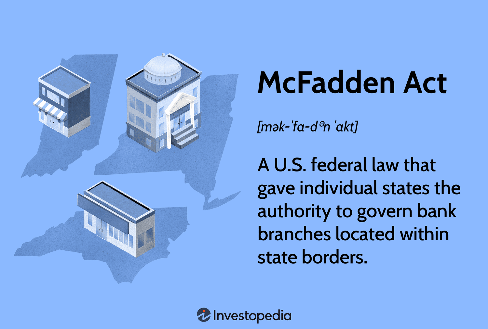

Financial legislation plays a crucial role in maintaining the stability and integrity of banking systems worldwide. These regulations are designed to safeguard financial stability, protect consumers, and ensure a fair banking environment by preventing systemic risks and fostering competition. Over the decades, legislative frameworks have evolved in response to economic changes, financial innovations, and market crises, providing necessary oversight and guidance to financial institutions.

One historically significant piece of financial legislation in the United States is the McFadden Act of 1927. This act was enacted during a time when the U.S. banking system was fraught with instability due to the complex interplay between nationwide economies and local banking operations. The purpose of the McFadden Act was to regulate interstate banking activities, fortifying the role of national banks by allowing them to operate branches within the state to the same extent that state-chartered banks could. While it sought to curb monopolistic practices and enhance the stability of the banking sector, the act also inadvertently restricted the geographical expansion of banks, which for many years limited the competitive landscape of the American financial system.

In contrast to traditional banking regulations like the McFadden Act, which focused primarily on the physical presence and operation of banks, modern financial markets have been increasingly influenced by technological advancements such as algorithmic trading (algo trading). Algorithmic trading utilizes complex algorithms and vast computing power to execute trades at speeds and frequencies far beyond human capability. The rise of algo trading has significantly impacted financial markets by enhancing market liquidity and efficiency, though it has also introduced new challenges such as increased market volatility and the potential for systemic risk.

The purpose of this article is to explore the intersection of financial legislation, particularly the McFadden Act, and the evolution of algo trading. By examining this relationship, we strive to understand how historical regulatory frameworks have both shaped and been challenged by technological advancements, and what this means for future financial market stability and regulation.

## Table of Contents

## Understanding the McFadden Act

The McFadden Act, enacted in 1927, emerged from the necessity to address regulatory inconsistencies within the United States banking sector during the early 20th century. At its core, the Act sought to standardize the branching activities of national banks and align them more closely with their state-chartered counterparts. Before the McFadden Act, national banks faced significant restrictions concerning branching, leading to competitive disadvantages compared to state banks, which often enjoyed greater autonomy regulated by state-specific laws.

The key provisions of the McFadden Act centered around granting national banks the ability to establish branches within the same city where they were already operating. This harmonization meant that national banks could engage in intracity branching if permissible by state law for state banks, thus creating an equitable environment for different types of banking institutions. Consequently, the Act helped stabilize the banking landscape by promoting a level of uniformity and fairness, allowing national banks to compete more effectively.

Despite its fundamental reformations, the McFadden Act introduced limitations, particularly in its treatment of interstate banking activities. The Act did not extend branching privileges beyond individual state borders, effectively limiting banks to operate solely within state confines. This restriction prevented the formation of interstate banking networks that could have potentially increased the resilience and competitiveness of U.S. banks, especially during economic downturns or regional financial crises.

Critics of the McFadden Act have often pointed out its failure to foresee the future trajectory of banking that demanded more flexibility across state boundaries as commerce and industry expanded at a national level. By cementing the locality of banking operations, the Act inadvertently contributed to a fragmented banking system, where efficiency and economies of scale were not fully realized until the latter half of the 20th century, notably with the introduction of subsequent legislative reforms like the Riegle-Neal Interstate Banking and Branching Efficiency Act of 1994.

In the context of modern banking, the limitations of the McFadden Act illustrate a historical hesitance to embrace integrated financial systems that align with the technological and economic advancements of the present day. While it served a pivotal role in setting the groundwork for banking regulation, its restrictive scope on interstate banking required considerable legislative evolution to address the needs of an increasingly interconnected economy.

## Evolution of Banking Regulation

The evolution of banking regulation in the United States has been marked by significant legislative efforts following the McFadden Act, responding to an increasingly dynamic economic environment and advancements in financial technologies. The McFadden Act, enacted in 1927, initially focused on branching restrictions for national banks, setting a foundation for future regulatory measures. 

Financial legislation has evolved considerably to keep pace with changing economic landscapes and financial innovation. A key turning point was the enactment of the Glass-Steagall Act in 1933, which sought to restore public confidence in the banking system by separating commercial banking from investment banking. This act aimed to curb the excessive risk-taking that contributed to the Great Depression. Although many of its provisions were repealed by the Gramm-Leach-Bliley Act in 1999, the Glass-Steagall Act established enduring principles in financial regulation, emphasizing the need for safeguarding the banking system from speculative activities.

The 21st century saw further regulatory advancements with the introduction of the Dodd-Frank Wall Street Reform and Consumer Protection Act in 2010, a comprehensive response to the 2008 financial crisis. The Dodd-Frank Act addressed systemic risks by imposing stricter oversight on financial institutions, enhancing consumer protection, and establishing the Financial Stability Oversight Council (FSOC) to monitor systemic risks. Particularly, it introduced mechanisms for the liquidation of failing financial firms deemed too big to fail, aiming to prevent future taxpayer-funded bailouts.

The evolution of banking regulation has been significantly influenced by technological advancements. The rise of digital banking, fintech innovations, and digital currencies necessitated adaptive regulatory frameworks to manage emerging risks. Technology has compelled regulators to address cybersecurity threats, data privacy, and the operational risks associated with digital trading platforms. For instance, the emergence of algorithmic and high-frequency trading has prompted regulatory bodies to implement measures ensuring market integrity and fairness.

Technology's role in shaping new banking regulations is underscored by initiatives like the introduction of the Basel III framework, developed by the Basel Committee on Banking Supervision in response to the deficiencies exposed during the financial crisis. Basel III emphasized higher capital requirements, improved risk management, and enhanced banking sector transparency, illustrating a regulatory shift towards accommodating complex financial instruments and digital transactions.

Overall, the trajectory of banking regulation reflects a consistent struggle to balance the facilitation of financial innovation with the imperative to maintain stability and protect consumers. As technology continues to evolve, regulations will likely need to adapt further, embracing new mechanisms to safeguard the financial system against unforeseen challenges.

## Algo Trading: Transforming Financial Markets

Algorithmic trading, often referred to as algo trading, involves using computer programs to execute trading orders at speeds and frequencies that are impossible for human traders. These programs follow a predefined set of instructions or algorithms to place trades, which can involve timing, price, quantity, or any mathematical model. The emergence of algo trading has been a pivotal development in financial markets, facilitating higher efficiency and [liquidity](/wiki/liquidity-risk-premium).

The rise of algo trading has significantly improved market efficiency by narrowing bid-ask spreads and providing liquidity to otherwise less active market segments. However, an increase in trading [volume](/wiki/volume-trading-strategy) has not come without disruptions. One significant implication of algo trading is its impact on market [volatility](/wiki/volatility-trading-strategies). While it can lead to smoother price discovery, the high speeds and volumes associated with trading algorithms can also exacerbate price swings during periods of market stress. The phenomenon is particularly evident in high-frequency trading ([HFT](/wiki/high-frequency-trading-strategies)), where trades are executed at microsecond intervals.

Regulatory concerns about algo trading primarily focus on market manipulation, systemic risk, and fairness. High-frequency traders may exploit millisecond-level advantages over others, raising questions about market fairness. Regulators worry about "quote stuffing," where large numbers of orders are placed and quickly canceled to create latency and confuse slower participants. Efforts to mitigate these risks include implementing circuit breakers to halt trading during extreme volatility and introducing minimum resting times for orders to dampen the advantages of speed exploitation.

The 2010 Flash Crash exemplifies the profound impact algo trading can have on market stability. On May 6, 2010, the US stock market experienced a rapid and deep decline in prices, with the Dow Jones Industrial Average briefly plunging about 1,000 points before rebounding within minutes. Investigations revealed that [algorithmic trading](/wiki/algorithmic-trading) activities, including an aggressive sell algorithm by a mutual fund, interacted with HFT strategies, triggering a cascade of orders and price movements. This incident highlighted the need for refined regulatory frameworks to prevent similar occurrences and ensure robust market mechanisms.

In conclusion, while algorithmic trading has transformed financial markets by enhancing trading efficiency and contributing to liquidity, it also presents significant regulatory challenges. The balance between technological advancement and market integrity remains a key focus for regulators aiming to safeguard against systemic anomalies.

## Interconnection between Financial Legislation and Algo Trading

Financial legislation plays a pivotal role in addressing the complexities and challenges introduced by algorithmic trading (algo trading). As a transformative force in financial markets, algo trading has brought about increased market efficiency but also heightened volatility and regulatory concerns. 

Existing financial legislation attempts to address these concerns by setting frameworks to ensure the fair and transparent functioning of markets. Regulators such as the U.S. Securities and Exchange Commission (SEC) and the Commodity Futures Trading Commission (CFTC) have established guidelines to monitor algo trading activities, focusing on preventing market manipulation and ensuring liquidity.

Regulators play a crucial role in maintaining market integrity by implementing measures to ensure trades are executed transparently and efficiently. This involves oversight of digital trading platforms where most algo trading activities occur. For instance, the SEC's Regulation National Market System (Reg NMS) seeks to ensure that investors receive the best price executions by mandating how trades are prioritized and routed.

Specific regulations aimed at monitoring and controlling algo trading practices include the European Union's Markets in Financial Instruments Directive II (MiFID II). This regulation requires firms engaged in algo trading to have proper risk controls and systems in place to prevent disorderly trading conditions. Furthermore, it demands pre-trade transparency and comprehensive reporting to enable regulators to monitor trades effectively.

With the rapid advancement of technology, financial legislation must continually evolve. Future trends indicate a shift towards more sophisticated regulatory frameworks that incorporate real-time data analytics and [machine learning](/wiki/machine-learning) to detect anomalies and potential abuses in trading activities. The development of such tools would enhance regulators' ability to react promptly to irregular market behaviors, minimizing risks associated with high-frequency and algo trading.

As algorithmic trading continues to integrate with emerging technologies like [artificial intelligence](/wiki/ai-artificial-intelligence) (AI) and blockchain, regulatory updates may focus on embedding technological solutions within regulatory oversight processes. Predictive analytics and AI could foresee market disruptions, allowing for proactive regulatory measures.

In conclusion, the interconnection between financial legislation and algo trading underscores a dynamic regulatory landscape. As trading technologies evolve, so too must the regulatory frameworks, ensuring they remain robust and capable of safeguarding the integrity of financial markets. Continued collaboration between market participants and regulators will be essential in adapting to these technological advancements while preserving market stability and fairness.

## Current and Future Challenges in Financial Regulation

Financial regulation is constantly navigating the challenges of balancing innovation with market stability. The rapid evolution of financial technologies, including the rise of algorithmic trading, presents regulators with the daunting task of ensuring the resilience and integrity of financial markets while promoting innovation. 

One of the primary challenges is to reconcile traditional financial legislation with the complexities introduced by modern trading technologies. Traditional regulations were designed in an era of physical banking transactions, and their frameworks are not always compatible with the fluid, technology-driven trading environments of today. For instance, high-frequency trading and its associated practices such as spoofing and layering raise concerns about market manipulation, which existing regulations may not fully address. Regulators are thus faced with the necessity to update regulatory frameworks that can safeguard market integrity without stifling technological advances.

Globalization further complicates the regulatory landscape. Financial markets and institutions now operate on a global scale, transcending national borders. This interconnectedness necessitates a coordinated approach to regulation, as disparate national regulations can lead to regulatory [arbitrage](/wiki/arbitrage), where firms exploit differences between countries to circumvent stricter regulations. Algorithmic trading, with its cross-border operations, exacerbates this issue, challenging regulators to harmonize rules internationally while respecting national interests.

Looking to the future, financial regulation must evolve in tandem with technological advancements. This evolution may involve the incorporation of advanced technologies such as artificial intelligence and machine learning into regulatory practices, enabling more effective monitoring and analysis of trading activities. Regulations might also shift towards principles-based frameworks that provide flexibility in adapting to technological change rather than rigid rules that rapidly become obsolete.

Predictive analytics and real-time monitoring could become staples of future regulatory strategies, allowing for proactive rather than reactive oversight. Such measures would enable regulators to identify emerging risks and intervene before they manifest fully. Furthermore, the rise of fintech and decentralized finance calls for new kinds of regulatory frameworks that can accommodate novel financial instruments and business models while protecting consumers and market integrity.

In conclusion, the future of financial regulation will likely involve a dynamic interplay between innovation and regulation, with a focus on creating a stable yet adaptive regulatory environment. This approach aims to foster a secure and efficient global financial ecosystem capable of supporting continuous technological advancement without sacrificing market stability.

## Conclusion

The relationship between the McFadden Act, subsequent banking regulations, and algorithmic trading highlights the dynamic nature of financial legislation and its critical role in maintaining market stability. The McFadden Act of 1927 was foundational in shaping the early structure of the U.S. banking system, imposing restrictions on interstate banking that reflected an era concerned with local control and financial stability. Over time, the evolution of financial regulations, influenced by landmark legislation such as the Glass-Steagall Act and the Dodd-Frank Act, has depicted a legislative journey towards accommodating new financial complexities and technological changes.

Similarly, the emergence of algorithmic trading represents a significant shift in financial markets, characterized by rapid advancements in technology and increased market efficiency and volatility. This evolution necessitates robust regulatory frameworks that address the unique challenges of digital and high-frequency trading. Despite the constraints of early regulations like the McFadden Act, modern legislation seeks to balance the pursuit of innovation with the imperative of market stability.

Adaptive financial legislation is increasingly crucial in today's globalized and technologically advanced market environment. As financial markets evolve, regulations must remain flexible to address emerging challenges and leverage new opportunities. The role of regulation, therefore, extends beyond imposing restrictions; it involves fostering a secure and efficient financial ecosystem that promotes innovation, ensures market integrity, and protects investors. Policymakers must anticipate future changes, ensuring that financial legislation evolves in tandem with technological advancements to support sustainable market growth.

## References & Further Reading

[1]: ["The McFadden Act of 1927"](https://www.federalreservehistory.org/essays/mcfadden-act) - Federal Reserve History

[2]: Meltzer, A. H. (2003). ["A History of the Federal Reserve, Volume 1: 1913-1951"](https://www.amazon.com/History-Federal-Reserve-1913-1951/dp/0226520005) - University of Chicago Press

[3]: ["The Crisis of 2008 and Financial Reform"](https://corpgov.law.harvard.edu/2010/11/20/the-financial-panic-of-2008-and-financial-regulatory-reform/) by John B. Taylor & John F. Cogan

[4]: Benos, E., Brugler, J., Hjalmarsson, E., & Zikes, F. (2018). ["The Role of High-Frequency Trading in Market Volatility."](https://www.bankofengland.co.uk/working-paper/2015/interactions-among-high-frequency-traders) Bank of England Working Paper

[5]: ["An Introduction to High-Frequency Finance"](https://www.sciencedirect.com/book/9780122796715/an-introduction-to-high-frequency-finance) by Ramazan Gençay, Michel Dacorogna, Ulrich A. Müller, Richard B. Olsen, & Olivier Pictet

[6]: Regnault, H., & Gupta, R. (2020). ["Financial Markets Volatility and Performance in Times of Crisis: Efficient Algorithms to Assess Market Risk"](https://link.springer.com/article/10.1007/s00484-024-02805-3) - Springer

[7]: Hull, J. (2017). ["Options, Futures, and Other Derivatives"](https://books.google.com/books/about/Options_Futures_and_Other_Derivatives_eB.html?id=2iopDwAAQBAJ) - Pearson

[8]: Federal Reserve Bank of Chicago. (1996). ["The Riegle-Neal Interstate Banking and Branching Efficiency Act of 1994"](https://www.govinfo.gov/content/pkg/COMPS-288/pdf/COMPS-288.pdf)