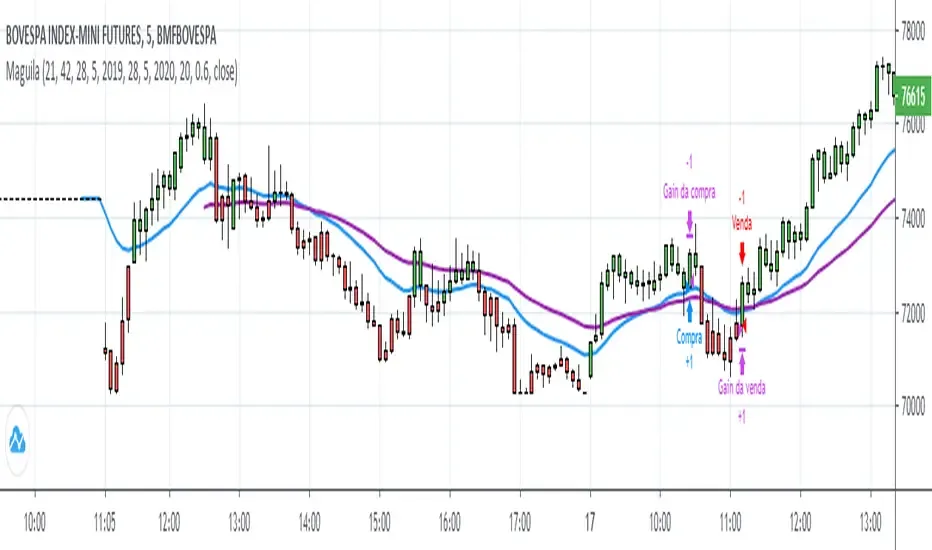

## Table of Contents

## What is the McGinley Dynamic Indicator?

The McGinley Dynamic Indicator is a technical analysis tool used by traders to help them make better decisions when buying or selling stocks. It was created by John McGinley and is designed to follow the market's price more closely than traditional moving averages. The indicator adjusts its speed based on how fast the market is moving, so it can keep up with quick changes in price. This makes it a useful tool for traders who want to stay on top of market trends.

The McGinley Dynamic Indicator works by using a formula that takes into account the previous day's indicator value, the current price, and a smoothing constant. This formula helps the indicator to adapt to the market's speed, making it more responsive than a simple moving average. Traders often use this indicator to identify potential entry and exit points for their trades, helping them to buy low and sell high. By following the market more closely, the McGinley Dynamic Indicator can help traders make more informed decisions.

## Who developed the McGinley Dynamic Indicator and when?

The McGinley Dynamic Indicator was developed by John McGinley. He created this tool to help traders follow the stock market more closely.

John McGinley wanted to make a better moving average that could keep up with fast changes in the market. He came up with the McGinley Dynamic Indicator to do just that, and it has been used by traders ever since.

## How does the McGinley Dynamic Indicator differ from traditional moving averages?

The McGinley Dynamic Indicator is different from traditional moving averages because it changes its speed to match the market's speed. Traditional moving averages, like simple moving averages, use a fixed number of days to calculate their values. This means they can be slow to react to big changes in the market. The McGinley Dynamic Indicator, on the other hand, uses a special formula that makes it faster or slower depending on how the market is moving.

This ability to adapt makes the McGinley Dynamic Indicator more useful for traders who want to keep up with quick changes in stock prices. For example, if the market suddenly starts moving fast, the McGinley Dynamic Indicator will speed up to follow the trend more closely. Traditional moving averages would take longer to catch up, which could cause traders to miss out on important buying or selling opportunities. By being more responsive, the McGinley Dynamic Indicator helps traders make better decisions based on the latest market movements.

## What is the formula used to calculate the McGinley Dynamic Indicator?

The McGinley Dynamic Indicator uses a special formula to figure out its value. The formula is: MD(t) = MD(t-1) + (Price(t) - MD(t-1)) / (k * (Price(t) / MD(t-1))^4), where MD(t) is today's McGinley Dynamic value, MD(t-1) is yesterday's value, Price(t) is today's price, and k is a constant number, usually set to 0.6.

This formula helps the McGinley Dynamic Indicator to change its speed based on how fast the market is moving. If the market price changes a lot, the indicator will speed up to keep up with the market. If the market is moving slowly, the indicator will also move slowly. This makes the McGinley Dynamic Indicator more useful than traditional moving averages, which always move at the same speed no matter what the market is doing.

## Can you explain the key components of the McGinley Dynamic Indicator formula?

The McGinley Dynamic Indicator formula has a few key parts that make it work. The first part is MD(t), which stands for today's McGinley Dynamic value. This is what we're trying to figure out. The second part is MD(t-1), which is yesterday's McGinley Dynamic value. We use this to help calculate today's value. The third part is Price(t), which is today's price of the stock or asset we're looking at. This is important because it tells us how the market is moving right now.

The last part of the formula is k, which is a constant number usually set to 0.6. This number helps to smooth out the indicator's movements. The formula puts all these parts together like this: MD(t) = MD(t-1) + (Price(t) - MD(t-1)) / (k * (Price(t) / MD(t-1))^4). This formula makes the McGinley Dynamic Indicator change its speed based on how fast the market is moving. If the market is moving quickly, the indicator will speed up to keep up. If the market is moving slowly, the indicator will also move slowly. This makes it more useful than traditional moving averages, which always move at the same speed.

## How is the McGinley Dynamic Indicator applied in technical analysis?

The McGinley Dynamic Indicator is used in technical analysis to help traders make better decisions about when to buy or sell stocks. It works by following the market's price more closely than traditional moving averages. Traders look at the McGinley Dynamic Indicator to see if it's going up or down. If the indicator is going up, it might mean the stock price will go up too, so traders might want to buy. If the indicator is going down, it could mean the stock price will go down, so traders might want to sell.

Traders also use the McGinley Dynamic Indicator to find good times to enter or exit trades. For example, if the indicator crosses above the current price, it might be a good time to buy. If it crosses below the current price, it might be a good time to sell. By using the McGinley Dynamic Indicator, traders can make more informed decisions and try to buy low and sell high. This can help them make more money and avoid losing money on bad trades.

## What are the default settings for the McGinley Dynamic Indicator and can they be adjusted?

The default setting for the McGinley Dynamic Indicator is a constant value called 'k', which is usually set to 0.6. This number helps the indicator to smoothly follow the market's price. Traders can use this default setting to start, but they might want to change it to fit their own trading style or the specific market they are looking at.

Yes, the settings for the McGinley Dynamic Indicator can be adjusted. Traders can change the value of 'k' to make the indicator move faster or slower. If they want the indicator to react more quickly to market changes, they can use a smaller number for 'k'. If they want it to be smoother and slower, they can use a larger number. By adjusting 'k', traders can make the McGinley Dynamic Indicator work better for their own trading needs.

## How does the McGinley Dynamic Indicator adapt to market volatility?

The McGinley Dynamic Indicator is really good at adapting to how fast the market is moving. It uses a special formula that changes its speed based on the market's speed. If the market is moving quickly, the indicator will speed up to keep up with it. If the market is moving slowly, the indicator will also move slowly. This makes it different from traditional moving averages, which always move at the same speed no matter what the market is doing.

Because the McGinley Dynamic Indicator can adapt to market volatility, it helps traders make better decisions. When the market is going up and down a lot, the indicator will follow these changes closely. This means traders can see the latest trends and decide when to buy or sell based on what's happening right now. By being more responsive to the market's ups and downs, the McGinley Dynamic Indicator gives traders a useful tool to help them trade more effectively.

## What are the advantages of using the McGinley Dynamic Indicator over other indicators?

The McGinley Dynamic Indicator has some big advantages over other indicators. One of the main advantages is that it can change its speed to match how fast the market is moving. This means it can keep up with quick changes in the market better than traditional moving averages. Traditional moving averages always move at the same speed, so they can be slow to react to big changes. The McGinley Dynamic Indicator, on the other hand, speeds up when the market is moving fast and slows down when the market is moving slowly. This makes it a better tool for traders who want to stay on top of the latest market trends.

Another advantage of the McGinley Dynamic Indicator is that it helps traders make better decisions about when to buy or sell stocks. Because it follows the market's price more closely, traders can use it to find good times to enter or exit trades. For example, if the indicator is going up, it might be a good time to buy because the stock price could go up too. If the indicator is going down, it might be a good time to sell because the stock price could go down. By using the McGinley Dynamic Indicator, traders can make more informed decisions and try to buy low and sell high, which can help them make more money and avoid losing money on bad trades.

## Are there any limitations or criticisms of the McGinley Dynamic Indicator?

While the McGinley Dynamic Indicator has many benefits, it also has some limitations. One big limitation is that it can be hard to set the right value for the constant 'k'. This number helps the indicator move smoothly, but if it's too high or too low, the indicator might not work well. Traders need to try different values to see what works best for them, which can take time and effort.

Another criticism of the McGinley Dynamic Indicator is that it can give false signals. Sometimes, the indicator might suggest buying or selling a stock, but the market might not follow through. This can lead to traders making bad decisions and losing money. Because of this, it's important for traders to use the McGinley Dynamic Indicator along with other tools and their own research to make the best decisions.

## How can the McGinley Dynamic Indicator be used in conjunction with other technical indicators?

The McGinley Dynamic Indicator can be used with other technical indicators to help traders make better decisions. One way to do this is by using it with the Relative Strength Index (RSI). The RSI helps traders see if a stock is overbought or oversold. If the McGinley Dynamic Indicator is going up and the RSI is below 30, it might be a good time to buy because the stock could be oversold and ready to go up. If the McGinley Dynamic Indicator is going down and the RSI is above 70, it might be a good time to sell because the stock could be overbought and ready to go down.

Another way to use the McGinley Dynamic Indicator with other tools is by looking at it with moving averages. For example, traders can use the McGinley Dynamic Indicator along with a simple moving average. If the McGinley Dynamic Indicator crosses above the simple moving average, it might be a good time to buy because the stock could be starting to go up. If the McGinley Dynamic Indicator crosses below the simple moving average, it might be a good time to sell because the stock could be starting to go down. By using the McGinley Dynamic Indicator with other indicators, traders can get a better picture of what the market is doing and make smarter trading decisions.

## Can you provide a case study or example of the McGinley Dynamic Indicator in action?

Let's look at a case study of how the McGinley Dynamic Indicator can be used in trading. Imagine a trader named Sarah who is looking at the stock of a tech company. She notices that the stock price has been going up and down a lot lately, so she decides to use the McGinley Dynamic Indicator to help her make a decision. She sets the constant 'k' to 0.6 and starts watching the indicator. Over the next few days, she sees that the McGinley Dynamic Indicator is moving closely with the stock price, speeding up when the price jumps and slowing down when it's more stable. This helps Sarah see the latest trends in the market.

One day, Sarah sees that the McGinley Dynamic Indicator crosses above the current stock price. She knows from her research that this might be a good time to buy because the stock could be starting to go up. She also checks the Relative Strength Index (RSI) and sees that it's below 30, which means the stock might be oversold. Feeling confident, Sarah decides to buy the stock. A few days later, the stock price does start to go up, just like the McGinley Dynamic Indicator suggested. Sarah is happy with her decision and uses the indicator again to help her know when to sell. By using the McGinley Dynamic Indicator along with other tools, Sarah was able to make a smart trading decision and make some money.

## What is the McGinley Dynamic Indicator?

The McGinley Dynamic Indicator is a sophisticated technical analysis tool that aims to resolve the lagging issues commonly associated with traditional moving averages, such as the Simple Moving Average (SMA) and the Exponential Moving Average (EMA). Traditional moving averages often fail to quickly adapt to market changes in velocity, resulting in signals that may not accurately reflect the current market environment. This lag can lead to delayed responses to market trends, making them potentially less effective in volatile conditions.

Developed by John R. McGinley, a notable market technician, the indicator dynamically adjusts its calculations based on the speed at which the market is moving. This automatic adjustment is crucial for providing a smoother and more responsive moving average line. By adapting to market speed, the McGinley Dynamic Indicator reduces the likelihood of false signals and more accurately tracks market trends.

The core of the McGinley Dynamic Indicator is its unique formula, which is designed to minimize discrepancies between the indicator and the actual price, thereby offering a more credible and real-time analysis of market trends. Unlike traditional moving averages that apply a fixed period calculation, the McGinley Dynamic introduces a variable component that adjusts based on the market's velocity:

$$

\text{McGinley Dynamic} = \text{previous value} + \left( \frac{\text{price} - \text{previous value}}{k \times \left( \frac{\text{price}}{\text{previous value}} \right)^2} \right) 
$$

Here, $k$ is a constant that determines the speed of the adjustment. This modification allows the indicator to remain close to the underlying price during rapid market shifts, offering traders a more reliable tool for trend analysis. By automatically smoothing out the market fluctuations, the McGinley Dynamic provides a less erratic view of price movement compared to traditional moving averages, making it particularly valuable for traders who need to make timely decisions.

## What are the mechanics of the McGinley Dynamic Indicator?

The McGinley Dynamic Indicator integrates an automatic adjustment [factor](/wiki/factor-investing) to address the shortcomings of traditional moving averages, particularly their susceptibility to lag in rapidly changing market conditions. This dynamic adjustment is central to the indicator's effectiveness, allowing it to better align with real-time price movements and thus enhance the accuracy of market trend analyses.

The core mechanism of the McGinley Dynamic involves a formula that adapts to changes in market speed, reducing the divergences or "leeway" that might otherwise occur in price readings. This adaptability is critical in minimizing the unstable fluctuations, commonly referred to as "whipsaws," which are prevalent when using standard moving averages in volatile markets.

Unlike Exponential Moving Averages (EMAs) or Simple Moving Averages (SMAs), where lag is a persistent issue, the McGinley Dynamic includes a weighted smoothing factor. This factor not only enhances the responsiveness of the indicator but also ensures that it adheres more closely to price movements, providing traders with a more reliable signal for identifying market trends.

The mathematical representation of the McGinley Dynamic Indicator is as follows:

$$

MG(t) = MG(t-1) + \frac{(Price(t) - MG(t-1))}{N \times \left(\frac{Price(t)}{MG(t-1)}\right)^4}
$$

Where:
- $MG(t)$ is the McGinley Dynamic Indicator value at time $t$.
- $Price(t)$ is the current price at time $t$.
- $MG(t-1)$ is the McGinley Dynamic Indicator value at time $t-1$.
- $N$ is a constant that determines the speed of adjustment (similar to a time period in moving averages).

This equation emphasizes the automatic nature of the adjustment factor, accounting for how quickly the price is diverging from the moving average itself, and thus adjusting more significantly when market conditions become turbulent. Such adaptability is particularly beneficial for [algorithmic trading](/wiki/algorithmic-trading) environments, allowing traders to respond more effectively to market dynamics. By incorporating this indicator, traders can gain a nuanced understanding of market trends, reducing the risks associated with lag and enhancing decision-making accuracy.

## How does the McGinley Dynamic compare to traditional moving averages?

Traditional moving averages, such as Simple Moving Averages (SMA) and Exponential Moving Averages (EMA), are widely used in technical analysis to estimate the direction of asset prices. However, they have inherent limitations, primarily lag and sensitivity to volatile market conditions. The McGinley Dynamic Indicator addresses these drawbacks by offering a more adaptive approach.

The SMA is calculated by taking the arithmetic mean of a set number of prices, often resulting in significant lag during rapidly changing market conditions. Conversely, the EMA gives more weight to recent prices, attempting to reduce lag but often leading to increased sensitivity to market [volatility](/wiki/volatility-trading-strategies) and false signals.

The McGinley Dynamic Indicator distinguishes itself through its unique feature of dynamic adjustment to market speed. This indicator incorporates a smoothing constant within its formula that automatically tweaks its sensitivity based on the market's velocity. The equation for the McGinley Dynamic Indicator is as follows:

$$

MD_i = MD_{i-1} + \left( \frac{\text{Price} - MD_{i-1}}{k \times \left(\frac{\text{Price}}{MD_{i-1}}\right)^4} \right) 
$$

Here, $MD_i$ represents the McGinley Dynamic value at the current period, $MD_{i-1}$ is the value from the previous period, "Price" is the current price, and $k$ is an adjustable constant. This formula allows the McGinley Dynamic to closely follow price movements and dynamically modulate its smoothing factor, effectively mitigating lag without the drawback of excessive sensitivity typical of EMAs.

In volatile market conditions, where SMAs and EMAs might lag or generate inaccurate signals, the McGinley Dynamic Indicator rapidly adjusts its response, offering traders a more reliable gauge of trend direction. This characteristic makes it particularly beneficial in markets with frequent price fluctuations, providing traders with a tool that maintains accuracy without being overly reactive to short-term volatility spikes. Consequently, the McGinley Dynamic is regarded as a more responsive and reliable tool to navigate the complexities of modern trading environments.

## What are the pros and cons of the McGinley Dynamic Indicator?

The McGinley Dynamic Indicator presents several advantages and disadvantages that traders should consider when integrating it into their strategies. Among the primary benefits is its ability to significantly reduce lag compared to traditional moving averages such as the Simple Moving Average (SMA) and the Exponential Moving Average (EMA). This reduced lag enables the McGinley Dynamic Indicator to track price movements more closely and accurately, providing a real-time representation of market trends. In fast-paced markets, where quick decision-making is crucial, the indicator's heightened sensitivity comes into play. It dynamically adjusts to changes in market speed, allowing traders to react promptly to new information and capitalize on short-term trading opportunities.

However, some drawbacks accompany these benefits. The complexity of the McGinley Dynamic Indicator's formula can be a hurdle for those accustomed to more straightforward moving averages. This complexity makes it less intuitive and could require an additional learning curve for traders unfamiliar with its mechanics. The formula includes an automatic adjustment factor, making it adaptive but also intricate. Here is an outline of the formula:

$$

\text{MDI} = \frac{(\text{Previous MDI} \times (\text{Lookback} - 1)) + \text{Price}}{\text{Lookback} \times (\frac{\text{Price}}{\text{Previous MDI}})^{0.6} + 1} 
$$

This complexity can deter traders seeking simplicity in their technical analysis tools. Moreover, there is a risk of over-reliance on the McGinley Dynamic Indicator without sufficient complementary analysis. Exclusive dependence on any single indicator can lead to misjudgments, especially if the indicator alone is not corroborated by other analytical tools or market signals.

Therefore, while the McGinley Dynamic Indicator offers significant advantages in terms of responsiveness and accuracy, traders should be mindful of its complexity and avoid relying solely on it for decision-making. Balancing its use with additional analysis can mitigate its drawbacks and enhance its efficacy in various trading environments.

## References & Further Reading

[1]: McGinley, J. R. (1997). ["A Better Moving Average"](https://www.investopedia.com/articles/forex/09/mcginley-dynamic-indicator.asp) in "Technical Analysis of Stocks & Commodities," Technical Analysis, Inc.

[2]: Poser, Steven W. (2003). ["Applying Elliott Wave Theory Profitably"](https://www.amazon.com/Applying-Elliott-Wave-Theory-Profitably/dp/0471420077) Wiley Trading.

[3]: Kirkpatrick, C. D., & Dahlquist, J. R. (2009). ["Technical Analysis: The Complete Resource for Financial Market Technicians"](https://ptgmedia.pearsoncmg.com/images/9780134137049/samplepages/9780134137049.pdf) FT Press.

[4]: Appel, G. (2005). ["Technical Analysis: Power Tools for Active Investors"](https://www.amazon.com/Technical-Analysis-Power-Active-Investors/dp/0132930048) FT Press.

[5]: Pring, M. J. (1991). ["Technical Analysis Explained"](https://archive.org/details/technicalanalysi00prin) McGraw-Hill Education.