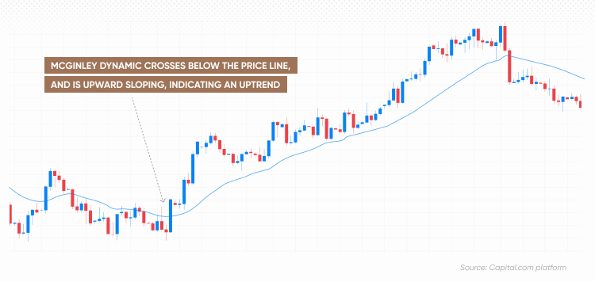

## Table of Contents

## What is the McGinley Dynamic Indicator?

The McGinley Dynamic Indicator is a technical analysis tool used by traders to help them follow the trend of a stock or other financial instrument more accurately. It was created by John McGinley in the 1990s. Unlike traditional moving averages, which can lag behind price movements, the McGinley Dynamic adjusts more quickly to changes in price. This makes it useful for traders who want to stay closer to the current market trend.

The indicator works by using a formula that takes into account the speed of price changes. This means it can speed up or slow down depending on how fast the price is moving. When the price moves quickly, the McGinley Dynamic will adjust faster to keep up with the trend. When the price moves slowly, it will adjust more slowly. This dynamic nature helps traders see the trend more clearly and make better trading decisions.

## Who developed the McGinley Dynamic Indicator and when?

John McGinley developed the McGinley Dynamic Indicator. He created it in the 1990s. John McGinley wanted to make a tool that could follow the price of stocks better than other tools at the time.

The McGinley Dynamic Indicator is special because it changes speed based on how fast the price is moving. This helps traders see the trend of a stock more clearly and make better choices about when to buy or sell.

## How does the McGinley Dynamic Indicator differ from traditional moving averages?

The McGinley Dynamic Indicator is different from traditional moving averages because it adjusts faster to price changes. Traditional moving averages, like the simple moving average or the exponential moving average, can lag behind the price. This means they might not show the current trend as quickly as the McGinley Dynamic. The McGinley Dynamic uses a special formula that looks at how fast the price is moving. If the price moves quickly, the indicator will adjust quickly too. If the price moves slowly, the indicator will adjust more slowly. This makes it easier for traders to see the trend of a stock more clearly.

Another way the McGinley Dynamic Indicator is different is that it aims to stay closer to the actual price of the stock. Traditional moving averages can sometimes be far away from the current price, especially when the price is moving quickly. The McGinley Dynamic tries to solve this problem by always trying to catch up to the price. This can help traders make better decisions about when to buy or sell a stock. By staying closer to the price, the McGinley Dynamic can show the trend more accurately and in real-time.

## What is the formula used to calculate the McGinley Dynamic Indicator?

The McGinley Dynamic Indicator uses a special formula to follow the price of a stock more closely. The formula is: MD = MD_prev + (Price - MD_prev) / (K * (Price / MD_prev)^4), where MD is the McGinley Dynamic value, MD_prev is the previous McGinley Dynamic value, Price is the current price of the stock, and K is a constant that you can change. The K value helps control how fast the indicator reacts to price changes. A common value for K is 0.6, but you can use different numbers to make the indicator more or less sensitive.

This formula makes the McGinley Dynamic different from other moving averages. It looks at how fast the price is moving and adjusts itself to stay closer to the price. If the price moves quickly, the McGinley Dynamic will change quickly too. If the price moves slowly, the indicator will change more slowly. This helps traders see the trend of the stock more clearly and make better decisions about when to buy or sell.

## How can the McGinley Dynamic Indicator be applied in trading?

The McGinley Dynamic Indicator can be used by traders to follow the trend of a stock more easily. When the price of a stock is above the McGinley Dynamic line, it might be a good time to buy the stock because it could mean the price is going up. If the price is below the McGinley Dynamic line, it might be a good time to sell or not buy the stock because the price could be going down. Traders can use this indicator to see if the stock is in an uptrend or a downtrend and make their trading decisions based on that.

Traders can also use the McGinley Dynamic Indicator to set their stop-loss orders. A stop-loss order helps traders limit their losses if the price of the stock goes down. They can set the stop-loss just below the McGinley Dynamic line. If the price falls below this line, it might mean the trend is changing, and the stop-loss order will help protect their money. By using the McGinley Dynamic Indicator, traders can make better choices about when to buy, sell, or hold a stock, and manage their risk more effectively.

## What are the key parameters of the McGinley Dynamic Indicator and how do they affect its behavior?

The main parameter of the McGinley Dynamic Indicator is the constant K. This number helps control how quickly the indicator reacts to changes in the price of a stock. If you use a small number for K, like 0.6, the indicator will move faster to keep up with the price. If you use a bigger number, the indicator will move more slowly. Traders can change the K value to make the indicator more or less sensitive to price changes, depending on what they need.

The other key parameter is the starting value of the McGinley Dynamic, which is usually set to the first price in the data series. This starting point affects how the indicator behaves at the beginning of the chart. As the price changes, the McGinley Dynamic uses the formula to adjust itself. The formula takes into account the current price and the previous McGinley Dynamic value to calculate the new value. By using these parameters, the McGinley Dynamic can follow the price of a stock more closely than traditional moving averages, helping traders see the trend more clearly.

## Can the McGinley Dynamic Indicator be used in conjunction with other technical indicators?

Yes, the McGinley Dynamic Indicator can be used with other technical indicators to help traders make better decisions. For example, traders might use it with the Relative Strength Index (RSI) to see if a stock is overbought or oversold. If the price is above the McGinley Dynamic and the RSI is high, it might be a good time to sell. If the price is below the McGinley Dynamic and the RSI is low, it might be a good time to buy. By using both indicators together, traders can get a better idea of the trend and the strength of the stock's price movement.

Another way to use the McGinley Dynamic Indicator is with the Moving Average Convergence Divergence (MACD). The MACD helps traders see if the trend is getting stronger or weaker. If the McGinley Dynamic shows the price is in an uptrend and the MACD line crosses above the signal line, it could be a strong signal to buy. If the McGinley Dynamic shows the price is in a downtrend and the MACD line crosses below the signal line, it could be a strong signal to sell. Using the McGinley Dynamic with other indicators can give traders more information to help them make smarter trading choices.

## What are the potential advantages of using the McGinley Dynamic Indicator over other trend-following indicators?

The McGinley Dynamic Indicator has some important advantages over other trend-following indicators. One big advantage is that it follows the price of a stock more closely. Other moving averages can lag behind the price, which means they might not show the current trend as quickly. The McGinley Dynamic uses a special formula that looks at how fast the price is moving. This means it can speed up or slow down to keep up with the price better. Traders like this because it helps them see the trend more clearly and make better decisions about when to buy or sell.

Another advantage of the McGinley Dynamic Indicator is that it can be adjusted to fit different trading styles. Traders can change the K value in the formula to make the indicator more or less sensitive to price changes. This means they can make it work better for their own trading needs. For example, if a trader wants the indicator to react quickly to price changes, they can use a smaller K value. If they want it to react more slowly, they can use a bigger K value. This flexibility makes the McGinley Dynamic a useful tool for many different kinds of traders.

## What are the limitations or criticisms of the McGinley Dynamic Indicator?

One limitation of the McGinley Dynamic Indicator is that it can sometimes give false signals. This means it might show that the price is going up or down when it actually isn't. This can happen because the indicator tries to follow the price very closely, and sometimes the price can move in a way that tricks the indicator. Traders need to be careful and use other tools along with the McGinley Dynamic to make sure they are making good decisions.

Another criticism is that the McGinley Dynamic Indicator can be hard to understand for some people. The formula used to calculate it is more complicated than the formulas used for simple moving averages. This can make it harder for beginners to use and understand. Also, the need to choose the right K value can be tricky. If the K value is not set correctly, the indicator might not work as well as it could.

## How does the McGinley Dynamic Indicator perform in different market conditions?

The McGinley Dynamic Indicator works well in different market conditions, but it can be especially helpful in fast-moving markets. When the price of a stock is changing quickly, the McGinley Dynamic can keep up better than other moving averages. It uses a special formula that makes it speed up or slow down depending on how fast the price is moving. This means it can show the trend more clearly in a fast market, helping traders make better decisions about when to buy or sell.

In slow-moving or sideways markets, the McGinley Dynamic Indicator might not be as helpful. When the price isn't changing much, the indicator can give false signals. It might show that the price is going up or down when it's actually just staying the same. Traders need to be careful in these conditions and use other tools along with the McGinley Dynamic to make sure they are making good decisions.

## What are some common strategies that incorporate the McGinley Dynamic Indicator?

One common strategy that uses the McGinley Dynamic Indicator is [trend following](/wiki/trend-following). Traders watch the price of a stock and the McGinley Dynamic line to see if the stock is in an uptrend or a downtrend. If the price is above the McGinley Dynamic line, it might be a good time to buy the stock because it could mean the price is going up. If the price is below the McGinley Dynamic line, it might be a good time to sell or not buy the stock because the price could be going down. This strategy helps traders follow the trend and make better decisions about when to buy or sell.

Another strategy is using the McGinley Dynamic Indicator with other indicators, like the Relative Strength Index (RSI) or the Moving Average Convergence Divergence (MACD). For example, if the price is above the McGinley Dynamic and the RSI is high, it might be a good time to sell because the stock could be overbought. If the price is below the McGinley Dynamic and the RSI is low, it might be a good time to buy because the stock could be oversold. By using the McGinley Dynamic with other indicators, traders can get a better idea of the trend and the strength of the stock's price movement, helping them make smarter trading choices.

## How can one optimize the settings of the McGinley Dynamic Indicator for specific assets or timeframes?

To optimize the settings of the McGinley Dynamic Indicator for specific assets or timeframes, you need to focus on the K value in the formula. The K value controls how quickly the indicator reacts to price changes. For fast-moving assets or shorter timeframes, you might want to use a smaller K value, like 0.6 or even lower. This makes the indicator move faster to keep up with quick price changes. For slower-moving assets or longer timeframes, you might want to use a bigger K value, like 0.8 or higher. This makes the indicator move more slowly, which can help reduce false signals in a less volatile market.

It's also important to test different K values to see what works best for the asset you are trading. You can do this by looking at past price data and seeing how the McGinley Dynamic Indicator would have performed with different K values. This is called [backtesting](/wiki/backtesting). By trying out different settings, you can find the K value that gives you the best results for your specific asset or timeframe. Remember, what works well for one asset might not work as well for another, so it's good to keep testing and adjusting as needed.

## What is the McGinley Dynamic Indicator?

The McGinley Dynamic Indicator is a sophisticated technical analysis tool formulated by John R. McGinley to address some of the deficiencies found in conventional moving averages like the Simple Moving Average (SMA) and the Exponential Moving Average (EMA). Traditional moving averages often suffer from a significant lag and are frequently slow to adapt to rapid changes in market conditions. This is where the McGinley Dynamic stands out: it is designed to mold itself to the speed of the market, allowing traders to extract a more continuous and realistic understanding of price movements.

Unlike standard moving averages, which calculate the average of past price data over a fixed period, the McGinley Dynamic employs a unique formula that automatically adjusts itself relative to market speed. This characteristic is crucial in minimizing false signals that are prevalent with traditional moving averages, especially during volatile market conditions when price trends can shift rapidly.

The formula for the McGinley Dynamic can be described as follows:

$$

MD_{t} = MD_{t-1} + \left( \frac{\text{Price}_t - MD_{t-1}}{k \cdot \left(\frac{\text{Price}_t}{MD_{t-1}}\right)^4} \right)
$$

Where:
- $MD_{t}$ is the McGinley Dynamic value at the current period.
- $MD_{t-1}$ is the McGinley Dynamic value for the previous period.
- $\text{Price}_t$ is the current price.
- $k$ is a constant that determines the speed of adjustment, typically set to a value such as 10 or 20.

This equation showcases the adaptability of the McGinley Dynamic as it integrates a scaling [factor](/wiki/factor-investing) that responds to the degree of divergence between the current price and the preceding dynamic line. The result is a smoother transition that reduces noise while aligning more closely with true market conditions. This mechanism not only provides a clearer view of market trends but also enhances traders' ability to make timely and informed decisions. By addressing the primary weakness of lag in traditional moving averages, the McGinley Dynamic Indicator presents an innovative solution that helps traders achieve a more accurate analysis reflective of real-time market dynamics.

## What are the mechanics of the McGinley Dynamic Indicator?

The McGinley Dynamic Indicator distinguishes itself through its adaptive mechanism designed to reduce the lag typically associated with traditional moving averages. At the core of this innovation is a variable component that effectively adjusts to changes in market speed, providing a more immediate reflection of price action.

### Mathematical Foundation

The McGinley Dynamic is calculated using a formula that introduces a specific constant, allowing the moving average to dynamically align with price movements. The formula is expressed as follows:

$$
\text{McGinley Dynamic} = \text{MD}_{t-1} + \frac{(\text{Price}_t - \text{MD}_{t-1})}{N \times (\frac{\text{Price}_t}{\text{MD}_{t-1}})^{4}}
$$

Where:
- $\text{MD}_{t-1}$ refers to the McGinley Dynamic value from the previous period.
- $\text{Price}_t$ is the current price.
- $N$ is a constant usually set to 10, which determines the sensitivity of the indicator to price movements.

### Adaptive Characteristics

Key to understanding the McGinley Dynamic Indicator's effectiveness is its adaptive characteristic, which accounts for varying market velocities. In periods of high [volatility](/wiki/volatility-trading-strategies), the formula's constant allows the indicator to closely track rapid price changes, effectively 'hugging' the price data. This minimizes the lag observed in simple and exponential moving averages, which are inherently slower to respond to sudden market shifts due to their fixed calculation periods.

### Practical Implications

The ability of the McGinley Dynamic to align closely with price movements results in a more accurate representation of current market conditions. This feature enhances the capability of traders to analyze trends, offering a moving average that adjusts almost naturally in response to real-time market conditions. The smoothing effect provided by this dynamic approach reduces noise and false signals, promoting a clearer view of market trends and supporting more informed trading decisions. 

By understanding the mechanics behind the McGinley Dynamic Indicator, traders gain access to a tool that more effectively navigates the fluctuations inherent in fast-paced trading environments.

## How does the McGinley Dynamic compare to traditional moving averages?

Traditional moving averages, such as the Simple Moving Average (SMA) and the Exponential Moving Average (EMA), are fundamental tools in technical analysis used to smooth price data and identify trends. However, these averages are often criticized for their inherent lag and sensitivity to market volatility. The lag arises because both SMA and EMA rely on historical price data to generate their averages, resulting in a delayed reaction to current price movements. This can lead to late signals and potentially suboptimal trading decisions, especially in rapidly changing markets.

The McGinley Dynamic Indicator introduces a unique approach to address these shortcomings. It incorporates a dynamic adjustment mechanism that responds to changes in market speed. This feature allows the indicator to align more closely with the actual price movements, providing a more accurate reflection of current market conditions. The central innovation of the McGinley Dynamic lies in its formula, which can be expressed as follows:

$$
\text{MDI}_t = MDI_{t-1} + \left( \frac{\text{Price}_t - MDI_{t-1}}{N \times \left( \frac{\text{Price}_t}{MDI_{t-1}} \right)^4} \right)
$$

In this equation, $\text{MDI}_t$ represents the McGinley Dynamic Indicator at time $t$, $\text{Price}_t$ is the closing price at time $t$, $MDI_{t-1}$ is the indicator value at the previous time period, and $N$ is a smoothing factor set by the user. The formula's unique feature is the dynamic adjustment of the denominator, which includes a power of four term to emphasize the market's speed.

By automatically adjusting for the market's velocity, the McGinley Dynamic Indicator reduces lag and minimizes false signals that commonly affect traditional moving averages in volatile conditions. This makes it especially useful in fast-paced trading environments, where quick reaction times and accurate trend signals are crucial. The indicator's ability to dynamically respond to market fluctuations ensures that it does not just lag behind but actively reflects the market's present state, thus enhancing traders' decision-making processes.

## How can McGinley Dynamic be implemented in algo trading?

Algorithmic traders can seamlessly integrate the McGinley Dynamic Indicator into their trading strategies to enhance performance and accuracy. One of the key strengths of the McGinley Dynamic lies in its ability to adjust in real-time according to market velocity, which significantly reduces the lag often associated with simple and exponential moving averages. This makes it particularly advantageous for [algorithmic trading](/wiki/algorithmic-trading) systems that require fast, responsive indicators to make split-second decisions based on real-time market data.

The McGinley Dynamic is designed to smooth out price data, thereby minimizing the impact of short-term volatility and noise. This feature is crucial for algorithmic strategies, which often seek to exploit small, rapid price movements. By reducing noise, the indicator helps trading algorithms discern genuine market trends from erratic, short-term fluctuations, thereby improving the reliability of trading signals.

Moreover, the indicator’s capacity to dynamically adjust itself in response to changing market conditions allows algorithms to maintain a higher level of precision. This adaptability ensures that trading systems are not only aware of the current market trend but are also capable of reacting instantly to changes in trend direction. The mathematical foundation of the McGinley Dynamic can be expressed as:

$$
MDI_t = MDI_{t-1} + \left( \frac{\text{Price}_t - MDI_{t-1}}{N \times \left( \frac{\text{Price}_t}{\text{Price}_{t-1}} \right)^4} \right)
$$

Where $MDI_t$ is the McGinley Dynamic Indicator value at time $t$, $\text{Price}_t$ represents the price at time $t$, and $N$ is the smoothing factor.

Here is a Python example demonstrating how the McGinley Dynamic Indicator might be implemented within an algorithmic trading context:

```python
def calculate_mcg_dynamic(prices, N=10):
    mcg_dynamic = [prices[0]]
    for i in range(1, len(prices)):
        m_prev = mcg_dynamic[-1]
        price = prices[i]
        adjustment = (price - m_prev) / (N * (price / prices[i-1])**4)
        mcg_dynamic.append(m_prev + adjustment)
    return mcg_dynamic

# Example usage with a list of price data
prices = [1.2, 1.18, 1.22, 1.25, 1.28, 1.26]
mcg_dynamic_values = calculate_mcg_dynamic(prices)
```

This responsiveness and adaptability make the McGinley Dynamic Indicator particularly useful in environments characterized by high-frequency trading ([HFT](/wiki/high-frequency-trading-strategies)). Traders leveraging HFT strategies can deploy this indicator to execute trades with a higher confidence level due to its ability to closely track actual market prices without being misled by the noise typical of fast-paced markets.

In summary, the McGinley Dynamic Indicator, with its capacity to deliver timely and accurate insights, can significantly boost the effectiveness of algorithmic trading systems. By enhancing the precision and reliability of trade signals, it enables traders to navigate complex trading environments with a competitive edge.

## References & Further Reading

McGinley, J. R. (1997). "A Better Moving Average" in *Technical Analysis of Stocks & Commodities* provides a comprehensive overview of the McGinley Dynamic Indicator. John R. McGinley designed this indicator to address the shortcomings of traditional moving averages by introducing a mechanism that adjusts based on market speed. This fundamental innovation reduces lag and improves trend analysis, particularly in volatile markets.

Kirkpatrick, C. D., & Dahlquist, J. R. (2009). *Technical Analysis: The Complete Resource for Financial Market Technicians* details a variety of technical analysis tools and offers an in-depth understanding of the McGinley Dynamic Indicator's role within this broader context. The book explores how integrating dynamic indicators can enhance the effectiveness of trading strategies by providing more accurate trend signals.

For those seeking practical insights into moving averages and technical analysis strategies, Investopedia hosts a range of articles that cover the conceptual and practical aspects of these tools. These articles provide traders with essential knowledge about the advantages and limitations of various moving averages, including the McGinley Dynamic Indicator, and offer guidance on effectively incorporating these tools into trading strategies.

