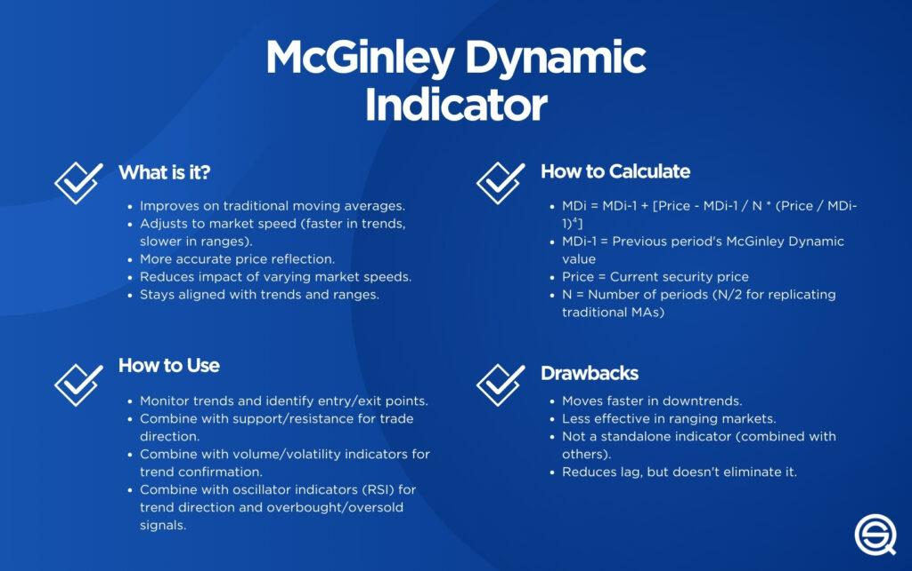

The McGinley Dynamic Indicator is a sophisticated tool offering considerable improvements over traditional moving averages in trading analysis. This indicator was developed by John R. McGinley, a market technician who sought to solve the inherent issues of lag associated with moving averages, particularly when market speeds vary. Unlike conventional moving averages that apply a fixed period, the McGinley Dynamic Indicator is adaptive, meaning it responds more promptly to price changes while maintaining stability and reducing excessive fluctuations.

Traditional moving averages often struggle to keep pace with rapid market movements, leading to delayed signals that might result in missed opportunities or incorrect assessments of trend strength. This is where the McGinley Dynamic Indicator stands out, as it incorporates a dynamic adjustment factor allowing it to modify its calculation based on market speed. Such adaptability ensures more timely and accurate reflections of market conditions, making it a valuable tool in the arsenal of algorithmic traders.



This article will explore how the McGinley Dynamic Indicator can be applied in algorithmic trading. It will also cover its calculation and measure its effectiveness against traditional moving averages, emphasizing its potential advantages and limitations. With its inherent ability to adapt swiftly to market volatility, the McGinley Dynamic Indicator represents an innovative approach to trading, one that can significantly enhance decision-making processes for traders.

## Table of Contents

## Understanding the McGinley Dynamic Indicator

Introduced in the 1990s, the McGinley Dynamic Indicator is an adaptive moving average designed to improve upon the limitations of traditional moving averages, particularly the issue of lag. Developed by John R. McGinley, the indicator aims to adjust more effectively to varying market conditions by using a unique dynamic adjustment factor. This factor allows the indicator to swiftly respond to changes in market speed, ensuring that it remains more aligned with price movements than traditional moving averages.

The formula for the McGinley Dynamic Indicator involves a combination of the previous period’s value of the indicator and the current price, modulated by a factor that considers the desired smoothing period. This dynamic adjustment factor is key to its operation:

$$
\text{MD}_t = \text{MD}_{t-1} + \frac{\left(\text{Price}_t - \text{MD}_{t-1}\right)}{\left(N \cdot \frac{\text{Price}_t}{\text{MD}_{t-1}}\right)^4}
$$

In this formula:
- $\text{MD}_t$ is the McGinley Dynamic value at time $t$.
- $\text{Price}_t$ is the price at time $t$.
- $N$ is the smoothing constant (typically a number like 10 or 20).

This formulation allows the McGinley Dynamic Indicator to adjust more rapidly in fast-moving markets, attempting to minimize the lag and avoid excessive fluctuations, unlike traditional moving averages that strictly adhere to their specified period. By incorporating this dynamic element, the indicator is capable of providing a more accurate reflection of the current market trend, offering traders a potentially more reliable tool for their analyses.

## Advantages of Using the McGinley Dynamic Indicator in Algo Trading

The McGinley Dynamic Indicator offers several distinct advantages for [algorithmic trading](/wiki/algorithmic-trading), particularly its capacity to adjust dynamically to market changes. This adaptive quality makes it an attractive tool for various market conditions, enhancing its reliability as compared to traditional moving averages.

One of the primary benefits of the McGinley Dynamic Indicator is its ability to reduce lag, a common issue with conventional moving averages. Traditional moving averages tend to react slowly to price changes, which can result in delayed signals for trend identification and reversals. The McGinley Dynamic tackles this limitation by incorporating a smoothing mechanism that adjusts more swiftly to price movements without the dependency on a fixed period length seen in standard moving averages.

The formula for the McGinley Dynamic Indicator is designed to minimize this lag. Although the complete derivation of the formula involves several components, its effectiveness is attributed to a [factor](/wiki/factor-investing) that dynamically adjusts the smoothing constant based on the speed of the market. This allows the indicator to "catch up" with the market during rapid changes, providing traders with more timely insights.

Furthermore, the adaptive nature of the McGinley Dynamic Indicator allows it to filter out 'whipsaws'—situations where prices fluctuate back and forth—more efficiently. In volatile markets, this feature is particularly valuable. By mitigating the impact of false signals generated by sudden swings, traders are better positioned to make informed decisions. Consequently, the McGinley Dynamic is suitable for volatile trading environments where quick reactions are necessary.

In summary, the McGinley Dynamic Indicator enhances trading strategies by offering a balance between responsiveness and stability. Its reduced lag and ability to filter out noise make it a valuable asset for identifying trends and reversals promptly, thereby supporting more effective trading in both trending and ranging markets.

## Applying the McGinley Dynamic Indicator in Trading Strategies

The McGinley Dynamic Indicator is particularly versatile and finds utility in various trading strategies, primarily mean-reversion and trend-following approaches. 

In mean-reversion strategies, traders can capitalize on the natural ebb and flow of price movements. The McGinley Dynamic Indicator provides a reference point where traders can identify potential buy and sell signals. Specifically, a buy signal may be considered when the market price falls below the indicator, suggesting the price is likely to revert to the mean value represented by the indicator. Conversely, a sell signal might be recognized when the price rises above the indicator, indicating a potential decrease or return to the mean. This dynamic adjustment mitigates lag compared to traditional moving averages, thereby providing more timely entry and [exit](/wiki/exit-strategy) points.

In trend-following strategies, the McGinley Dynamic Indicator performs a different function. Here, its ability to stay aligned with the current market trend helps in confirming entry and exit points. For instance, traders might use this indicator alongside [momentum](/wiki/momentum) indicators like the Moving Average Convergence Divergence (MACD) or the Relative Strength Index (RSI) to affirm the direction of the trend. The McGinley Dynamic supports these strategies by smoothing out price movements, making it easier to decide when to stay within a trend or exit as trends reverse.

Python code can illustrate how to integrate the McGinley Dynamic Indicator with trading strategies. Below is a sample script using Python's pandas library to apply this indicator:

```python
import pandas as pd
import numpy as np

def calculate_mcginley(data, period=14):
    mcginley = [data[0]]
    k = 2 / (1 + period)
    for i in range(1, len(data)):
        mcginley_value = mcginley[-1] + (data[i] - mcginley[-1]) / max(1, (data[i] / mcginley[-1])**4) * k
        mcginley.append(mcginley_value)
    return mcginley

# Example use case
# Assuming `data` is a pandas Series of prices
data = pd.Series([100, 102, 101, 103, 102, 104, 106])
mcginley_values = calculate_mcginley(data)
trading_signals = pd.DataFrame({'Price': data, 'McGinley': mcginley_values})

# Plotting is optional to visualize signals
import matplotlib.pyplot as plt

plt.plot(trading_signals['Price'], label='Price')
plt.plot(trading_signals['McGinley'], label='McGinley Dynamic Indicator')
plt.legend()
plt.show()
```

This code calculates the McGinley Dynamic Indicator values for a given price series. It also provides a framework for visualizing how prices interact with the indicator, showcasing potential buy/sell signals as prices cross above or below the indicator's line. By integrating the McGinley Dynamic Indicator into trading systems, traders gain a robust mechanism for refining entry and exit points in their strategies, leveraging its adaptability to market condition changes.

## Backtesting the McGinley Dynamic Indicator

Backtesting the McGinley Dynamic Indicator involved a comprehensive analysis using the historical data of the S&P 500 index. The results of these backtests demonstrate that the McGinley Dynamic Indicator can be effectively utilized for both short-term and long-term trading strategies. The adaptive nature of the indicator, which dynamically adjusts to changes in market speed, allows it to perform distinctively across different trading periods.

Our findings confirmed that the McGinley Dynamic Indicator could be leveraged profitably in short-term trading by employing a shorter period in its configuration. This setup is particularly beneficial for mean-reversion strategies, where the aim is to capitalize on temporary market inefficiencies. By reacting more quickly to price fluctuations, this indicator helps identify points where the price is likely to reverse back to its mean, thus offering opportunities for timely entry and exit.

For traders seeking to engage in longer-term trades, configuring the McGinley Dynamic Indicator with a longer period has proven to be advantageous, particularly in trend-following strategies. In such scenarios, the indicator aligns with prolonged market trends, facilitating more accurate identification of sustained market movements. By reducing lag more effectively than traditional moving averages, it assists traders in recognizing the onset of a trend or its potential reversal, enhancing decision-making quality.

The empirical results from our backtests highlight that the McGinley Dynamic Indicator's ability to adjust its responsiveness based on market conditions is a key factor in its efficacy. While its use across different periods can be tailored to meet specific trading strategy goals, the underlying adaptability remains a common advantage across both short-term and long-term horizons. This adaptiveness helps maintain a balance between sensitivity to sudden price changes and stability against excessive noise, making it a robust component of algorithmic trading systems.

Below is an example of how you might implement the McGinley Dynamic Indicator in Python for [backtesting](/wiki/backtesting) purposes:

```python
def mcginley_dynamic(prices, period=14):
    mcg_values = [prices[0]]  # Initialize with the first price
    k = 60 / period  # Dynamic constant

    for price in prices[1:]:
        previous_mcg = mcg_values[-1]
        mcg = previous_mcg + (price - previous_mcg) / max(k * (price / previous_mcg), 1.0)
        mcg_values.append(mcg)

    return mcg_values

# Example usage with historical S&P 500 data (pseudo code for fetching data)
# sp500_prices = fetch_sp500_historical_prices()
# mcg_values = mcginley_dynamic(sp500_prices, period=14)
```

This Python function computes the McGinley Dynamic Indicator values, demonstrating how its adaptability is incorporated into its calculation. As with any trading indicator, while promising results have been observed, rigorous backtesting and statistical validation are crucial for confirming its effectiveness in a particular trading strategy or market condition.

## Challenges and Considerations

The McGinley Dynamic Indicator, while advantageous for its adaptive nature, does present some limitations and considerations for traders. One of the primary challenges arises when it is applied to range-bound markets. In such scenarios, the indicator may fail to provide clear signals, as its primary strength lies in adapting to varying market speeds rather than static conditions. This limitation makes it less effective in markets where prices oscillate within a narrow range without significant trends.

Furthermore, relying on the McGinley Dynamic Indicator as a sole analytical tool can result in misleading signals. To improve the robustness of trading signals, traders should complement the McGinley Dynamic Indicator with other technical indicators, such as the Relative Strength Index (RSI) or Moving Average Convergence Divergence (MACD). This approach can help to confirm signals and reduce the likelihood of false positives, which are especially prevalent in low-[volatility](/wiki/volatility-trading-strategies) environments.

Another consideration is the potential for false signals. In markets with low volatility, the indicator might produce frequent signals that do not correspond to genuine market reversals or trends. Traders should apply additional layers of confirmation, such as [volume](/wiki/volume-trading-strategy) analysis or price-action patterns, to distinguish between genuine signals and noise.

In summary, while the McGinley Dynamic Indicator is a versatile tool, its effectiveness is enhanced when used in combination with other indicators and methods, particularly in range-bound or low-volatility markets. This combined approach aids in mitigating the impact of false signals and provides a more comprehensive analysis for trading decisions.

## Conclusion

The McGinley Dynamic Indicator offers a compelling method for addressing market volatility and variations in speed that often challenge traders using traditional moving averages. Its ability to automatically adjust to changing market conditions provides a distinct advantage, as it mitigates the lag associated with fixed-period moving averages. This adaptability is achieved through its unique formula, which continuously recalibrates its response to price changes, ensuring that traders can make more timely decisions.

In practice, the McGinley Dynamic Indicator can outperform traditional moving averages by providing more accurate signals for entry and exit points, particularly in markets characterized by rapid fluctuations. However, its true effectiveness comes when it is part of a broader trading strategy that employs multiple indicators. By integrating the McGinley Dynamic Indicator with other tools, traders can enhance their market analyses and reduce the likelihood of false signals.

As with any technical indicator, the McGinley Dynamic Indicator requires thorough testing to understand its behavior across different market environments. Backtesting and live testing are essential to gauge its performance and refine its application. Continuous optimization, coupled with a comprehensive approach utilizing various analytical tools, ensures that the McGinley Dynamic Indicator can be a valuable asset in algorithmic trading.

## References & Further Reading

[1]: ["The McGinley Dynamic"](https://www.investopedia.com/terms/m/mcginley-dynamic.asp) by John R. McGinley, Technical Analysis of Stocks & Commodities Magazine.

[2]: Aronson, D. R. (2006). ["Evidence-Based Technical Analysis: Applying the Scientific Method and Statistical Inference to Trading Signals"](https://www.amazon.com/Evidence-Based-Technical-Analysis-Scientific-Statistical/dp/0470008741) (Vol. 217). John Wiley & Sons.

[3]: Murphy, J. J. (1999). ["Technical Analysis of the Financial Markets: A Comprehensive Guide to Trading Methods and Applications."](https://archive.org/details/technicalanalysi0000murp) New York Institute of Finance.

[4]: Jansen, S. (2020). ["Machine Learning for Algorithmic Trading."](https://github.com/stefan-jansen/machine-learning-for-trading) Packt Publishing Ltd.

[5]: Chan, E. P. (2009). ["Quantitative Trading: How to Build Your Own Algorithmic Trading Business"](https://github.com/ftvision/quant_trading_echan_book) John Wiley & Sons.

[6]: de Prado, M. L. (2018). ["Advances in Financial Machine Learning"](https://www.amazon.com/Advances-Financial-Machine-Learning-Marcos/dp/1119482089). Wiley.