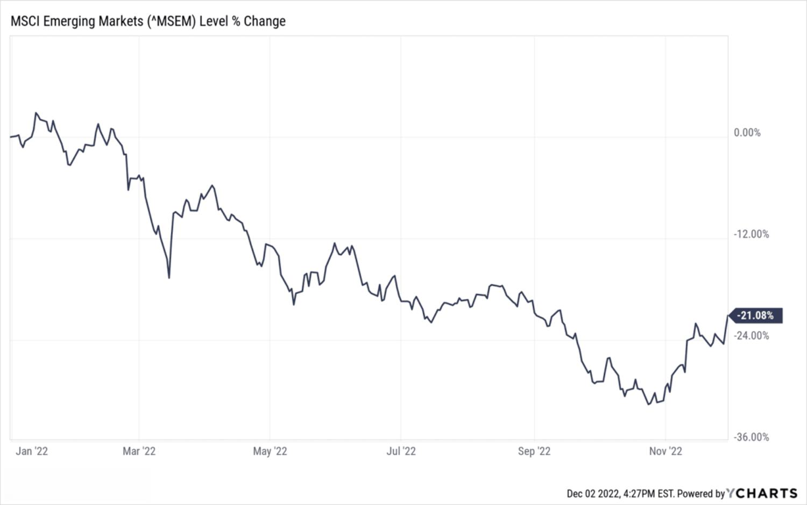

## Table of Contents

## What is MCSI Barra?

MCSI Barra is a company that helps investors make better decisions about their money. They do this by providing data, analytics, and tools that help people understand how different investments might perform. MCSI Barra is well-known in the financial world because they have been doing this for a long time and many big investors use their services.

Their main products include indexes, which are lists of stocks or other investments that represent a specific market or part of a market. They also offer risk management tools, which help investors understand and manage the risks associated with their investments. By using MCSI Barra's products, investors can make more informed choices and hopefully see better returns on their investments.

## Who founded MCSI Barra and when was it established?

MCSI Barra was founded by a man named Andrew Rudd. He started the company in 1975. At that time, it was called BARRA, which stands for Berkeley Associates in Research and Risk Analysis. Andrew Rudd wanted to help investors by giving them tools to understand and manage the risks of their investments.

Over the years, BARRA grew and became very important in the world of finance. In 2004, another company called MSCI bought BARRA. After the purchase, they combined their names and it became MSCI Barra. Today, MSCI Barra is known for its indexes and risk management tools that help many investors around the world.

## What are the main products and services offered by MCSI Barra?

MSCI Barra offers a variety of products and services that help investors make smart choices about their money. One of their main products is indexes. Indexes are lists of stocks or other investments that represent a specific market or part of a market. For example, they have indexes for different countries, industries, and types of companies. Investors use these indexes to understand how different parts of the market are doing and to make decisions about where to invest their money.

Another important service MSCI Barra provides is risk management tools. These tools help investors understand and manage the risks that come with their investments. For example, they can show how much a certain investment might go up or down in value. By using these tools, investors can make better decisions and try to avoid big losses. MSCI Barra's risk management tools are used by many big investors around the world because they are very helpful in making investment decisions.

Overall, MSCI Barra's products and services are designed to give investors the information and tools they need to make better investment choices. Whether it's through their indexes or risk management tools, MSCI Barra helps investors understand the markets and manage their risks, which can lead to better returns on their investments.

## How does MCSI Barra help in investment decision-making?

MSCI Barra helps in investment decision-making by providing investors with important information and tools. One of the main ways they do this is through their indexes. Indexes are like lists of stocks or other investments that show how a specific part of the market is doing. For example, they have indexes for different countries or industries. By looking at these indexes, investors can see which parts of the market are doing well and which are not. This helps them decide where to put their money to get the best returns.

Another way MSCI Barra helps is through their risk management tools. These tools help investors understand the risks that come with their investments. For example, they can show how much an investment might go up or down in value. By using these tools, investors can see how risky their investments are and make better choices to avoid big losses. Many big investors around the world use MSCI Barra's risk management tools because they are very helpful in making smart investment decisions.

## What is the significance of the Barra Risk Factor Analysis?

The Barra Risk Factor Analysis is a very important tool that helps investors understand the risks of their investments. It looks at different things that can affect how an investment might do, like how the economy is doing, what's happening in the industry, or even how much the stock market goes up and down. By understanding these factors, investors can see what might make their investments go up or down. This helps them make better choices about where to put their money.

This analysis is really helpful because it gives investors a clear picture of the risks they are taking. Instead of just guessing, they can use the Barra Risk Factor Analysis to see exactly what might affect their investments. This way, they can try to avoid big losses and make their investments safer. Many big investors use this tool because it helps them make smarter decisions and hopefully get better returns on their investments.

## How does MCSI Barra's equity models work?

MSCI Barra's equity models are tools that help investors understand how stocks might perform. They do this by looking at many different things that can affect a stock's price, like how the economy is doing, what's happening in the industry, or how much the stock market goes up and down. These models use a lot of data and math to figure out how important each of these factors is for a specific stock. By understanding these factors, investors can see what might make a stock go up or down in value.

These equity models are very helpful because they give investors a clear picture of what might happen to their investments. Instead of just guessing, investors can use the models to see how different things might affect their stocks. This helps them make better choices about which stocks to buy or sell. Many big investors use MSCI Barra's equity models because they help them make smarter decisions and hopefully get better returns on their investments.

## Can you explain the concept of the Barra Integrated Model?

The Barra Integrated Model is a tool that helps investors understand how their investments might do. It looks at many different things that can affect how a stock or other investment might go up or down. These things include how the economy is doing, what's happening in the industry, and even how much the stock market moves around. By putting all these factors together, the Barra Integrated Model gives investors a clear picture of what might happen to their investments.

This model is really helpful because it helps investors see the big picture. Instead of just looking at one thing at a time, the Barra Integrated Model looks at everything all at once. This way, investors can see how all these different things might work together to affect their investments. By using this model, investors can make smarter choices about where to put their money and hopefully get better returns on their investments.

## What are some of the key risk models provided by MCSI Barra?

MSCI Barra provides several key risk models that help investors understand the risks of their investments. One important model is the Barra Integrated Model. This model looks at many different things that can affect how a stock or other investment might go up or down. It includes factors like how the economy is doing, what's happening in the industry, and how much the stock market moves around. By putting all these factors together, the Barra Integrated Model gives investors a clear picture of what might happen to their investments.

Another key model is the Barra Risk Factor Analysis. This tool helps investors see what specific things might make their investments go up or down. It looks at things like the economy, industry trends, and how much the stock market goes up and down. By understanding these factors, investors can see exactly what might affect their investments. This helps them make better choices about where to put their money and try to avoid big losses.

Overall, MSCI Barra's risk models are very helpful for investors. They give a clear picture of the risks involved in different investments. By using these models, investors can make smarter decisions and hopefully get better returns on their investments.

## How does MCSI Barra integrate ESG factors into their models?

MSCI Barra integrates [ESG](/wiki/esg-investing) (Environmental, Social, and Governance) factors into their models to help investors understand how these factors might affect their investments. They do this by adding ESG data to their risk models. This data includes things like how much a company pollutes the environment, how well they treat their workers, and how they are run by their leaders. By including this information, MSCI Barra helps investors see if a company is doing good things or bad things that could affect its stock price.

For example, if a company is not taking care of the environment, it might face fines or lose customers. This could make its stock price go down. By looking at ESG factors, investors can see these risks and decide if they want to invest in that company. MSCI Barra's models help investors make better choices by showing them the full picture of what might happen to their investments, including the impact of ESG factors.

## What are the differences between MCSI Barra's global and regional models?

MSCI Barra's global models look at the whole world. They include data from many countries and help investors understand how their investments might do everywhere. These models consider things like how the world economy is doing, what's happening in different industries around the world, and how global events might affect investments. By using a global model, investors can see the big picture and make choices about where to put their money in different parts of the world.

On the other hand, MSCI Barra's regional models focus on specific areas, like Europe or Asia. These models use data from just that region and help investors understand how their investments might do in that specific part of the world. They look at things like how the economy is doing in that region, what's happening in local industries, and how events in that area might affect investments. By using a regional model, investors can make more detailed choices about where to invest their money within a specific region.

## How can financial institutions customize MCSI Barra models for their specific needs?

Financial institutions can customize MSCI Barra models to fit their specific needs by adjusting the factors that the models look at. For example, if a bank wants to focus more on certain industries or regions, they can change the model to give more importance to those areas. They can also add their own data to the model, like information about their clients or special market insights. This way, the model can give them a more accurate picture of the risks and opportunities that matter most to them.

By customizing the models, financial institutions can make better decisions that are more in line with their goals and strategies. For instance, if a firm is very worried about environmental risks, they can adjust the model to pay more attention to ESG factors. This helps them see how these risks might affect their investments and make choices that fit their risk tolerance and investment approach. Customizing MSCI Barra models helps financial institutions use the tools in a way that works best for them, leading to smarter investment decisions.

## What are the latest advancements or updates in MCSI Barra's methodologies and technologies?

MSCI Barra keeps improving its models and technologies to help investors make better decisions. One of the latest advancements is in their use of big data and [artificial intelligence](/wiki/ai-artificial-intelligence) (AI). They now use more data from different sources, like social media and news, to understand market trends better. This helps them predict how investments might do more accurately. They also use AI to find patterns in the data that humans might miss. This makes their models smarter and more helpful for investors.

Another update is in how they include ESG factors in their models. MSCI Barra has made their ESG data more detailed and up-to-date. They now look at more things like a company's carbon emissions, how they treat their workers, and how well they are run. By including this information, investors can see if a company is doing good or bad things that might affect its stock price. This helps them make choices that match their values and goals.

## What is the Role of Factor Models in Algo Trading?

Factor models are fundamental tools in identifying and quantifying the risk and return characteristics of investment portfolios. In the domain of [algorithmic trading](/wiki/algorithmic-trading), these models facilitate performance forecasting by pinpointing key market factors that drive returns and risks. MSCI Barra's [factor](/wiki/factor-investing) models are particularly vital for crafting diversified portfolios, as they meticulously manage exposure to various systematic risk factors.

The essence of factor models lies in their ability to decompose asset returns into components attributable to different risk factors. The general form of a factor model is expressed as:

$$
R_i = \alpha_i + \sum_{j=1}^{n} \beta_{ij} F_j + \epsilon_i
$$

where:
- $R_i$ is the return of asset $i$.
- $\alpha_i$ is the asset's alpha, or its return unexplained by the factors.
- $\beta_{ij}$ represents the sensitivity of asset $i$ to factor $F_j$.
- $F_j$ is the $j$-th factor affecting the market.
- $\epsilon_i$ is the error term, reflecting idiosyncratic risk.

MSCI Barra utilizes factor models in multiple asset classes, enabling traders to identify and manage risk exposures effectively. By understanding these exposures, traders can optimize algorithmic trading strategies to enhance returns while controlling risk.

For instance, a typical algorithmic trading strategy may integrate MSCI Barra’s factor models to adjust the portfolio’s beta exposure dynamically, aligning it with expected market conditions. The systematic decomposition of risk allows traders to quantitatively assess which factors are likely to impact returns significantly, improving the precision of predictive models.

Python can be employed to implement factor models dynamically within trading algorithms. A simple example in Python for performing a factor regression might look like this:

```python
import numpy as np
from sklearn.linear_model import LinearRegression

# Example returns data
asset_returns = np.array([0.02, 0.03, 0.015, 0.025])
factor_returns = np.array([
    [0.01, 0.02],
    [0.015, 0.025],
    [0.013, 0.02],
    [0.02, 0.03]
])

# Fit the factor model
model = LinearRegression()
model.fit(factor_returns, asset_returns)

alpha = model.intercept_
betas = model.coef_

print("Alpha:", alpha)
print("Betas:", betas)
```

By employing these computational techniques, traders can significantly enhance their algorithms, achieving more sophisticated analyses of market conditions. This strategic application of MSCI Barra's factor models aids in developing resilient and adaptive trading strategies, thus ensuring a competitive advantage in increasingly complex financial markets.

## What are some case studies and applications?

Several hedge funds and asset managers have integrated MSCI Barra models into their trading strategies, offering illustrative examples of its utility in minimizing portfolio risk and maximizing alpha generation. By optimizing factor exposures, MSCI Barra’s models enable traders to refine their strategies with a more calculated approach to risk management.

A key application of this integration is in the formulation of diversified portfolios that capitalize on precise factor analysis. Through MSCI Barra’s multifactor models, asset managers can dissect and understand the variance in stock returns, allowing for a strategic alignment of investments with anticipated market movements. This refined understanding is pivotal in volatile markets, where maintaining competitive positioning requires agility and insight. 

For instance, a [hedge fund](/wiki/hedge-fund-trading-strategies) using MSCI Barra’s models might identify key factors that historically drive returns in specific sectors or economies. By dynamically adjusting portfolio compositions based on these factor insights, the fund can minimize exposures to systemic risk while aiming to capture excess returns, or alpha. An example formula to compute expected returns using factor models is:

$$

E(R_i) = \alpha + \beta_1F_1 + \beta_2F_2 + \cdots + \beta_nF_n + \epsilon 
$$

where $E(R_i)$ is the expected return of the portfolio, $\alpha$ is the portfolio's alpha, $\beta_n$ are the factor loadings, $F_n$ are the factor returns, and $\epsilon$ is the error term.

Numerous case studies also demonstrate the efficacy of MSCI Barra in guiding trading decisions, thus enabling firms to withstand and even thrive amidst market upheavals. During periods of market distress, such as financial crises or geopolitical tensions, Barra models provide critical insights that can inform tactical shifts in strategy, ensuring that portfolios are calibrated to respond to market conditions.

In essence, the application of MSCI Barra models extends beyond mere risk mitigation; they serve as a foundation for strategic decision-making, enhancing an asset manager's ability to generate alpha and secure a competitive edge in fluctuating financial environments.

## References & Further Reading

[1]: Turkington, D., Whitaker, L., & Vass, L. (2020). ["A Practical Guide to Risk Management."](https://onlinelibrary.wiley.com/doi/book/10.1002/9781118881880) Wiley Finance.

[2]: Grinold, R. C., & Kahn, R. N. (2000). ["Active Portfolio Management: A Quantitative Approach for Producing Superior Returns and Controlling Risk."](https://www.amazon.com/Active-Portfolio-Management-Quantitative-Controlling/dp/0070248826) McGraw-Hill.

[3]: López de Prado, M. (2018). ["Advances in Financial Machine Learning."](https://www.amazon.com/Advances-Financial-Machine-Learning-Marcos/dp/1119482089) Wiley.

[4]: Chan, E. P. (2009). ["Quantitative Trading: How to Build Your Own Algorithmic Trading Business."](https://github.com/ftvision/quant_trading_echan_book) Wiley Trading.

[5]: Jansen, S. (2020). ["Machine Learning for Algorithmic Trading."](https://github.com/stefan-jansen/machine-learning-for-trading) Packt Publishing.