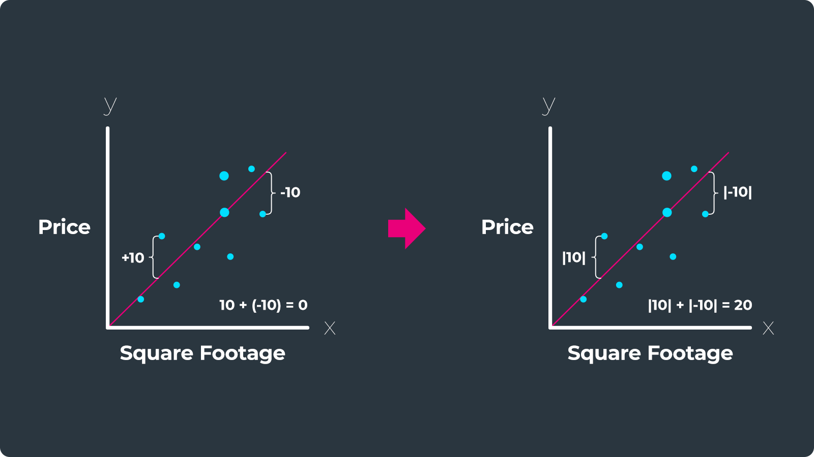

## Table of Contents

## What is Mean Absolute Error (MAE) in the context of machine learning?

Mean Absolute Error (MAE) is a common way to measure how well a machine learning model is doing. It tells you how far off, on average, the model's predictions are from the actual values. To find the MAE, you take the absolute difference between each prediction and the actual value, add up all these differences, and then divide by the number of predictions. The formula for MAE is $$ \text{MAE} = \frac{1}{n} \sum_{i=1}^{n} |y_i - \hat{y}_i| $$, where $n$ is the number of predictions, $y_i$ is the actual value, and $\hat{y}_i$ is the predicted value.

MAE is easy to understand because it's in the same units as the data you're working with. If you're predicting house prices in dollars, the MAE will also be in dollars. This makes it easy to explain to others how well your model is doing. One thing to keep in mind is that MAE treats all errors the same, no matter if they're big or small. This can be good or bad, depending on what you're trying to do with your model.

## How is MAE calculated?

Mean Absolute Error (MAE) is a way to see how good a machine learning model is at making predictions. To calculate it, you first find the difference between each prediction and the actual value. Then, you take the absolute value of each difference, which means you ignore whether the difference is positive or negative and just use the size of the difference. After that, you add up all these absolute differences and divide by the total number of predictions. The formula for MAE is $$ \text{MAE} = \frac{1}{n} \sum_{i=1}^{n} |y_i - \hat{y}_i| $$, where $n$ is the number of predictions, $y_i$ is the actual value, and $\hat{y}_i$ is the predicted value.

For example, if you have three predictions and their actual values are 10, 20, and 30, and your model predicts 12, 18, and 32, you would calculate the MAE like this: The absolute differences are |10-12| = 2, |20-18| = 2, and |30-32| = 2. Adding these up gives 2 + 2 + 2 = 6. Since there are three predictions, you divide 6 by 3 to get an MAE of 2. This means, on average, your predictions are off by 2 units.

## Why is MAE considered a useful metric in regression problems?

Mean Absolute Error (MAE) is a useful metric in regression problems because it gives a clear idea of how far off, on average, a model's predictions are from the actual values. It's easy to understand because MAE is in the same units as the data you're working with. For example, if you're predicting house prices in dollars, the MAE will also be in dollars. This makes it easy to explain to others how well your model is doing. The formula for MAE is $$ \text{MAE} = \frac{1}{n} \sum_{i=1}^{n} |y_i - \hat{y}_i| $$, where $n$ is the number of predictions, $y_i$ is the actual value, and $\hat{y}_i$ is the predicted value.

Another reason MAE is useful is that it treats all errors the same, no matter if they're big or small. This can be good because it doesn't punish large errors more than small ones, which can be important in some situations. For example, if you're predicting the number of items sold in a store, a small error might not matter much, but a large error could be a big deal. MAE gives a balanced view of the model's performance, making it a reliable choice for many regression problems.

## Can you explain the difference between MAE and other error metrics like RMSE and MSE?

Mean Absolute Error (MAE), Root Mean Square Error (RMSE), and Mean Square Error (MSE) are all ways to measure how good a [machine learning](/wiki/machine-learning) model is at making predictions, but they do it a bit differently. MAE is the average of the absolute differences between the predicted and actual values. It's easy to understand because it's in the same units as your data. The formula for MAE is $$ \text{MAE} = \frac{1}{n} \sum_{i=1}^{n} |y_i - \hat{y}_i| $$. On the other hand, MSE takes the average of the squared differences between the predicted and actual values. This means it gives more weight to bigger errors. The formula for MSE is $$ \text{MSE} = \frac{1}{n} \sum_{i=1}^{n} (y_i - \hat{y}_i)^2 $$. RMSE is just the square root of MSE, which brings the error back to the same units as your data, but it still gives more weight to larger errors. The formula for RMSE is $$ \text{RMSE} = \sqrt{\frac{1}{n} \sum_{i=1}^{n} (y_i - \hat{y}_i)^2} $$.

The choice between these metrics depends on what you care about in your model. MAE is good when you want to treat all errors the same, no matter how big or small they are. It's easy to explain and understand. MSE and RMSE, on the other hand, are more sensitive to larger errors because they square the differences. This can be useful if you want to really penalize your model for making big mistakes. RMSE is often preferred over MSE because it's in the same units as your data, making it easier to interpret. For example, if you're predicting house prices in dollars, RMSE will also be in dollars, while MSE will be in dollars squared, which can be harder to understand.

## In what scenarios would MAE be preferred over other error metrics?

MAE is often preferred when you want a simple and easy-to-understand measure of how well your model is doing. It's calculated as the average of the absolute differences between the predicted and actual values, so it's in the same units as your data. This makes it easy to explain to others, like if you're predicting house prices in dollars, the MAE will also be in dollars. If you want all errors to be treated the same, no matter if they're big or small, MAE is a good choice. It doesn't punish large errors more than small ones, which can be important in situations where every error matters equally.

In some cases, MAE might be preferred over RMSE or MSE because it's less sensitive to outliers. RMSE and MSE square the errors, which means big errors get a lot more weight. If you're in a situation where big errors aren't that important, or if you have a lot of outliers in your data, MAE can give you a better idea of how your model is doing overall. For example, if you're predicting the number of items sold in a store, a small error might not matter much, but a large error could be a big deal. MAE gives a balanced view of the model's performance, making it a reliable choice for many regression problems.

## How does MAE handle outliers compared to other metrics?

MAE is good at dealing with outliers because it uses the absolute value of the errors. This means that even if there's a really big error, it doesn't get a lot more weight than a small error. The formula for MAE is $$ \text{MAE} = \frac{1}{n} \sum_{i=1}^{n} |y_i - \hat{y}_i| $$. So, if you have a few outliers in your data, they won't mess up your MAE as much as they might with other metrics.

On the other hand, RMSE and MSE are more sensitive to outliers because they square the errors. This means that big errors get a lot more weight. The formula for MSE is $$ \text{MSE} = \frac{1}{n} \sum_{i=1}^{n} (y_i - \hat{y}_i)^2 $$, and RMSE is just the square root of MSE. So, if you have outliers in your data, they can make your RMSE or MSE look a lot worse than your MAE.

## What are the advantages and disadvantages of using MAE as a loss function?

Using MAE as a loss function has some good points. It's easy to understand because it's in the same units as your data. If you're predicting house prices in dollars, the MAE will also be in dollars. This makes it easy to explain to others how well your model is doing. Another good thing about MAE is that it treats all errors the same, no matter if they're big or small. This can be important in some situations where every error matters equally. The formula for MAE is $$ \text{MAE} = \frac{1}{n} \sum_{i=1}^{n} |y_i - \hat{y}_i| $$. Also, MAE is less sensitive to outliers than other metrics like RMSE or MSE, so if you have some unusual data points, they won't mess up your MAE as much.

But, there are also some downsides to using MAE as a loss function. One problem is that it doesn't give more weight to bigger errors. If you're in a situation where big errors are a big deal, MAE might not be the best choice. For example, if you're predicting how many people will show up to an event, a big error could mean you don't have enough space or food, so you might want a metric that punishes big errors more. Another issue is that MAE can be harder to work with when you're trying to make your model better because it's not as smooth as other metrics like MSE. This can make it trickier to use some optimization methods that work better with smooth functions.

## How can MAE be implemented in Python using popular libraries like scikit-learn?

You can use the scikit-learn library in Python to calculate the Mean Absolute Error (MAE). This library has a function called `mean_absolute_error` that makes it easy to find the MAE. You just need to give it the actual values and the predicted values from your model. The formula for MAE is $$ \text{MAE} = \frac{1}{n} \sum_{i=1}^{n} |y_i - \hat{y}_i| $$, where $n$ is the number of predictions, $y_i$ is the actual value, and $\hat{y}_i$ is the predicted value. This function will do all the math for you and give you the average absolute difference between your predictions and the actual values.

Here's how you can use it in Python:

```python
from sklearn.metrics import mean_absolute_error
import numpy as np

# Example data
y_true = np.array([3, -0.5, 2, 7])
y_pred = np.array([2.5, 0.0, 2, 8])

# Calculate MAE
mae = mean_absolute_error(y_true, y_pred)

print(f"Mean Absolute Error: {mae}")
```

In this example, `y_true` is the actual values and `y_pred` is the predicted values. The `mean_absolute_error` function calculates the MAE and gives you a number that shows how far off, on average, your predictions are from the actual values. This is a simple way to see how well your model is doing.

## What are some practical examples where MAE is used to evaluate model performance?

Mean Absolute Error (MAE) is often used to evaluate how well a model predicts house prices. If you're trying to guess how much houses will sell for, you want to know how close your guesses are to the real prices. MAE helps you do that by showing the average difference between your guesses and the actual prices. For example, if your model predicts a house will sell for $200,000 but it actually sells for $210,000, MAE will take that $10,000 difference into account. The formula for MAE is $$ \text{MAE} = \frac{1}{n} \sum_{i=1}^{n} |y_i - \hat{y}_i| $$. This makes it easy to explain to people how good your model is at predicting house prices because MAE is in dollars, just like the prices.

Another practical example where MAE is used is in predicting the demand for products in a store. Store owners need to know how many items to order so they don't run out or have too much stock. If a model predicts that 100 units of a product will be sold but the actual number is 110, MAE will show the average error across all predictions. This helps store owners understand if their model's guesses are close enough to be useful. MAE treats all errors the same, so it's good for this kind of situation where every error matters equally. 

Here's how you can calculate MAE in Python using the scikit-learn library:

```python
from sklearn.metrics import mean_absolute_error
import numpy as np

# Example data for house prices
y_true = np.array([200000, 300000, 250000, 400000])
y_pred = np.array([210000, 290000, 260000, 390000])

# Calculate MAE
mae = mean_absolute_error(y_true, y_pred)

print(f"Mean Absolute Error: {mae}")
```

In this example, `y_true` is the actual house prices and `y_pred` is the predicted prices. The `mean_absolute_error` function calculates the MAE, giving you a number that shows how far off, on average, your predictions are from the actual values.

## How does the choice of MAE impact model training and optimization?

Using Mean Absolute Error (MAE) as a loss function during model training can shape how the model learns and gets better. MAE measures the average of the absolute differences between the predicted and actual values, calculated as $$ \text{MAE} = \frac{1}{n} \sum_{i=1}^{n} |y_i - \hat{y}_i| $$. Because MAE treats all errors the same, whether they're big or small, it helps the model focus on reducing all errors equally. This can be good if you want your model to pay attention to every mistake without giving more weight to larger ones. However, MAE can sometimes make it harder to use certain optimization methods because it's not as smooth as other metrics like Mean Squared Error (MSE). This means that the process of making the model better might take a bit longer or need different approaches.

When you choose MAE for training, it can also affect how your model deals with outliers. Since MAE doesn't punish big errors more than small ones, it's less sensitive to outliers in your data. This can be helpful if your dataset has a lot of unusual points that you don't want to affect your model too much. But, if big errors are a big deal for your situation, like if you're predicting something where a large mistake could cause big problems, MAE might not push your model hard enough to fix those big errors. So, [picking](/wiki/asset-class-picking) MAE can make your model more balanced in how it handles errors, but you need to think about what's most important for your specific problem.

## What are the considerations for using MAE in time series forecasting?

When using Mean Absolute Error (MAE) in time series forecasting, it's important to think about how well it fits your specific needs. MAE measures the average of the absolute differences between the predicted and actual values, calculated as $$ \text{MAE} = \frac{1}{n} \sum_{i=1}^{n} |y_i - \hat{y}_i| $$. This means MAE treats all errors the same, no matter if they're big or small. In time series forecasting, this can be helpful if you want your model to focus on getting all predictions as close as possible to the actual values, without worrying too much about the occasional big mistake. Also, because MAE is in the same units as your data, it's easy to explain and understand, which is great for time series where you might be predicting things like sales numbers or temperatures.

However, there are some things to keep in mind when using MAE for time series forecasting. One issue is that MAE can be less sensitive to outliers, which might be good or bad depending on your situation. If your time series data has a lot of unusual spikes or drops, MAE won't punish your model as much for those big errors as other metrics like Mean Squared Error (MSE) would. This can be useful if those outliers aren't very important, but if they are, you might want a metric that makes your model work harder to predict them right. Another thing to consider is that MAE can make optimization a bit trickier because it's not as smooth as other metrics. This might mean you need to use different methods or spend more time tweaking your model to get the best results.

## How can one interpret and communicate the results of MAE to stakeholders who are not familiar with machine learning metrics?

When explaining Mean Absolute Error (MAE) to people who aren't experts in machine learning, it's helpful to keep things simple. You can say that MAE shows how far off, on average, your predictions are from the real numbers. It's like guessing how many cookies are in a jar. If you guess 10 but there are really 12, your error is 2 cookies. If you do this for every guess and then find the average of all those errors, that's what MAE tells you. It's a way to see if your model is good at predicting things, and it's easy to understand because it uses the same units as your data. So, if you're predicting house prices in dollars, the MAE will also be in dollars.

To make it even clearer, you could give a real-life example. Imagine you're predicting how many people will come to a party. If your model says 50 people will show up but 55 actually come, the error is 5 people. If you do this for every party and find the average error, that's your MAE. You can tell stakeholders that a lower MAE means your model is better at guessing. If the MAE is small, like 2 people, it means your predictions are usually pretty close to the real number. If it's big, like 10 people, your predictions might be off by a lot more. This way, even people who don't know much about machine learning can understand how well your model is doing.

## References & Further Reading

[1]: Willmott, C. J., & Matsuura, K. (2005). ["Advantages of the Mean Absolute Error (MAE) over the Root Mean Square Error (RMSE) in assessing average model performance."](https://www.int-res.com/articles/cr2005/30/c030p079.pdf) Climate Research, 30(1), 79-82.

[2]: Hyndman, R. J., & Koehler, A. B. (2006). ["Another look at measures of forecast accuracy."](https://www.sciencedirect.com/science/article/pii/S0169207006000239) International Journal of Forecasting, 22(4), 679-688.

[3]: ["An Introduction to Statistical Learning: with Applications in R"](https://link.springer.com/book/10.1007/978-1-0716-1418-1) by Gareth James, Daniela Witten, Trevor Hastie, and Robert Tibshirani.

[4]: ["Hands-On Machine Learning with Scikit-Learn, Keras, and TensorFlow"](https://www.amazon.com/Hands-Machine-Learning-Scikit-Learn-TensorFlow/dp/1492032646) by Aurélien Géron.

[5]: Chai, T., & Draxler, R. R. (2014). ["Root mean square error (RMSE) or mean absolute error (MAE)?"](https://gmd.copernicus.org/articles/7/1247/2014/) Geoscientific Model Development, 7(3), 1247-1249.