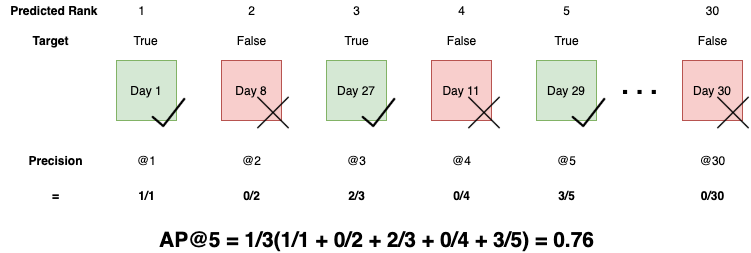

## Table of Contents

## What is Mean Average Precision at K (MAP@K) in the context of machine learning?

Mean Average Precision at K (MAP@K) is a metric used in machine learning to evaluate the performance of a model, especially in tasks like information retrieval, recommendation systems, and search engines. It measures how well a model ranks relevant items in the top K results. The idea is to see if the model can put the most important or relevant items at the top of its list. For example, if you search for "best movies," MAP@K would check if the model lists the most popular or highly-rated movies near the top of its suggestions.

To calculate MAP@K, you first need to find the average precision at K for each query or user. The precision at K is the number of relevant items in the top K results divided by K. The average precision at K is then the average of these precision values across all relevant items. Finally, MAP@K is the mean of the average precision at K across all queries or users. If you have a set of queries, you calculate the average precision at K for each query and then take the average of those values. This gives you a single number that tells you how well your model is doing overall. 

Here's a simple example of how to calculate MAP@K for a single query with K=3: Suppose the relevant items are A, B, and C, and the model's top 3 results are A, D, B. The precision at 1 is 1 (A is relevant), at 2 is 0.5 (A is relevant, D is not), and at 3 is 0.67 (A and B are relevant, D is not). The average precision at 3 is (1 + 0.5 + 0.67) / 3 = 0.72. If you have more queries, you'd repeat this process and average the results to get the final MAP@3.

## Why is MAP@K important for evaluating machine learning models?

MAP@K is important for evaluating machine learning models because it tells us how good the model is at putting the most important or relevant items at the top of its list. In many real-world applications like search engines or recommendation systems, it's crucial that the most relevant results appear first. For example, if you're searching for a product online, you want the best matches to show up at the top of the page. MAP@K helps us measure this by looking at the top K results and seeing how many of them are relevant. This gives us a clear picture of the model's performance in a way that's easy to understand and compare.

Another reason MAP@K is important is that it takes into account the order of the results, not just whether they are correct or not. This is different from other metrics that might only care if the right answer is somewhere in the list. With MAP@K, if the model puts a relevant item at the very top, it gets a higher score than if it puts that item lower down. This makes MAP@K a more realistic measure of how useful the model's results will be to users. By using MAP@K, we can fine-tune our models to make sure they are not just finding the right answers, but also presenting them in the best possible order.

## How is MAP@K calculated step-by-step?

To calculate MAP@K, you first need to look at each query or user one by one. For each query, you check the top K results given by the model. You count how many of these results are relevant. For example, if K is 5 and the model gives 5 results, you count how many of these 5 are actually relevant to the query. Then, you calculate the precision at each point where a relevant item appears in the top K results. Precision at a point is the number of relevant items up to that point divided by the position of that point. For instance, if the first relevant item is at position 2, the precision at 2 is 1/2 or 0.5. You do this for all relevant items in the top K results and then take the average of these precision values. This average is called the average precision at K for that query.

Once you have the average precision at K for each query, you calculate the mean of these values across all queries. This gives you the Mean Average Precision at K, or MAP@K. If you have 10 queries, you add up the average precision at K for all 10 queries and divide by 10. The final number you get is the MAP@K, which tells you how well the model is doing overall at putting relevant items at the top of its list. For example, if the average precision at K for query 1 is 0.7, for query 2 is 0.8, and for query 3 is 0.6, the MAP@K for these three queries would be (0.7 + 0.8 + 0.6) / 3 = 0.7. This single number helps you understand and compare the performance of different models or different versions of the same model.

## What is the difference between Precision at K and MAP@K?

Precision at K measures how many of the top K results given by a model are relevant. For example, if K is 5 and 3 out of the top 5 results are relevant, the Precision at K would be 3/5 or 0.6. This metric is simple and tells you the percentage of relevant items in the top K results for a single query. It's useful for understanding the model's performance for one specific query or user at a time.

MAP@K, or Mean Average Precision at K, takes things a step further by looking at multiple queries or users. For each query, you calculate the average precision at K, which is the average of the precision values at each point where a relevant item appears in the top K results. Then, you find the mean of these average precision values across all queries. This gives you a single number that shows how well the model is doing overall at putting relevant items at the top of its list. MAP@K is more comprehensive because it considers both the order of the results and the performance across multiple queries.

## Can you explain the concept of 'relevance' in the context of MAP@K?

In the context of MAP@K, 'relevance' means how well the items in the top K results match what the user is looking for. Imagine you're searching for "best laptops." The results that show popular, highly-rated laptops are relevant, while results showing unrelated items like shoes are not. Relevance is important because it helps us see if the model is good at finding what users want and putting those items at the top of the list.

To calculate MAP@K, we need to know which results are relevant for each query. We look at the top K results and count how many of them are relevant. Then, we use this information to find the average precision at K for each query, and finally, we take the mean of these values across all queries. This way, MAP@K gives us a single number that tells us how well the model is doing overall at putting relevant items at the top of its list.

## How does the choice of K affect the MAP@K metric?

The choice of K in MAP@K can change how we see the model's performance. A smaller K, like K=5, focuses on the very top results. This is useful if you want to see how well the model does at putting the most important items right at the top. A larger K, like K=20, looks at more results. This can show if the model is good at finding relevant items even if they are a bit further down the list. The value of K you choose depends on what you want to measure and what's important for your users.

For example, if you're building a search engine, users might only look at the first few results. So, a smaller K would be more important. But if you're making a recommendation system where users might scroll through more items, a larger K could be better. The choice of K affects the MAP@K score because it changes which results are included in the calculation. A smaller K might give a higher MAP@K if the model is really good at the top results, but a larger K could show a lower score if the model's performance drops off further down the list.

## What are some common use cases for MAP@K in machine learning?

MAP@K is often used in search engines to see how well they find what users are looking for. When you search for something online, you want the best matches to show up at the top of the page. MAP@K helps measure this by looking at the top K results and counting how many are relevant. For example, if you search for "best restaurants," MAP@K can tell if the search engine lists popular, highly-rated restaurants near the top. This makes it easier to understand if the search engine is doing a good job for its users.

Another common use case for MAP@K is in recommendation systems, like those on streaming services or online shopping sites. These systems suggest items to users, and it's important that the most interesting or useful items appear first. MAP@K checks how well the system does this by looking at the top K recommendations and seeing how many are relevant to what the user might like. If the system is good at putting relevant items at the top, it can make users happier and keep them coming back to the site or app.

## How does MAP@K handle multi-label classification problems?

In multi-label classification problems, where each item can belong to more than one category, MAP@K can still be used to evaluate how well a model ranks relevant items. For each query or user, you need to know which labels are relevant. Then, you look at the top K results and count how many of them have at least one of the relevant labels. The calculation of MAP@K remains the same as in single-label problems, but now you're considering multiple labels for each item.

For example, if you're recommending movies and a user likes both action and romance, a movie that fits either category could be considered relevant. You would calculate the precision at each point where a relevant movie appears in the top K results, then find the average precision at K for that user. Finally, you take the mean of these average precision values across all users to get the MAP@K. This way, MAP@K helps you see if the model is good at putting movies that match the user's interests at the top of the list, even when those interests span multiple genres.

## What are the limitations of using MAP@K as a performance metric?

One limitation of using MAP@K as a performance metric is that it can be sensitive to the choice of K. If you choose a small K, like 5, the metric will focus only on the very top results. This might make the model seem better than it really is if it does well on just the first few items but not so well further down the list. On the other hand, if you choose a larger K, like 20, the metric will consider more results, which could make the model seem worse if its performance drops off after the first few items. So, the choice of K can change how good the model looks, and it might not give a full picture of how well the model works for all users.

Another limitation is that MAP@K might not work well for all types of problems. For example, in some cases, the order of the results might not be as important as just finding all the relevant items. MAP@K focuses a lot on the order, which can make it less useful for tasks where the order doesn't matter as much. Also, if there are very few relevant items for a query, MAP@K can be hard to interpret because the average precision at K might not be very meaningful with so little data. So, while MAP@K is great for tasks like search engines and recommendation systems, it might not be the best choice for every [machine learning](/wiki/machine-learning) problem.

## How can MAP@K be used to compare different machine learning models?

MAP@K can be a useful tool for comparing different machine learning models because it gives a single number that shows how well each model puts relevant items at the top of its list. To compare models, you would calculate the MAP@K for each model using the same set of queries or users. The model with the higher MAP@K score is doing a better job at ranking relevant items higher in the top K results. This makes it easy to see which model is performing better overall. For example, if Model A has a MAP@K of 0.7 and Model B has a MAP@K of 0.6, you can say that Model A is better at putting relevant items at the top.

However, it's important to keep in mind that the choice of K can affect the results. If you use a small K, like 5, you might find that one model looks better than another because it does well on just the first few results. But if you use a larger K, like 20, the results might change because now you're looking at more items. So, when comparing models, it's a good idea to try different values of K to get a full picture of how they perform. This way, you can make a more informed decision about which model is really the best for your needs.

## What are some advanced techniques to optimize MAP@K in model training?

To optimize MAP@K in model training, one effective technique is to use learning to rank algorithms. These algorithms focus on improving the order of the results, which is exactly what MAP@K measures. For example, you can use a method called LambdaMART, which is good at optimizing ranking metrics like MAP@K. LambdaMART works by adjusting the model's predictions to make sure that relevant items are ranked higher. During training, the model learns to give higher scores to items that should appear at the top of the list, which can lead to a better MAP@K score.

Another advanced technique is to use a loss function that directly targets MAP@K. Normally, models are trained with loss functions like mean squared error or cross-entropy, but these don't focus on ranking. Instead, you can use a custom loss function that tries to maximize the MAP@K score. For instance, you might use a loss function that penalizes the model more when it ranks relevant items lower in the list. This can help the model learn to put the most important items at the top, improving its MAP@K performance. By focusing on the right loss function, you can train the model to do better at what MAP@K measures.

## How does MAP@K relate to other ranking metrics like NDCG and MRR?

MAP@K, NDCG (Normalized Discounted Cumulative Gain), and MRR (Mean Reciprocal Rank) are all used to measure how well a model ranks items, but they do it in slightly different ways. MAP@K looks at the top K results and checks how many of them are relevant, then averages the precision at each point where a relevant item appears. It's good for seeing if the model puts the most important items at the top. NDCG also looks at the order of the results but gives more points to relevant items that are ranked higher. It uses a formula to "discount" the value of items that are lower in the list, which means it cares a lot about the order. MRR, on the other hand, focuses on the rank of the first relevant item. It takes the reciprocal of the position of the first relevant item and averages this across all queries. So, MRR is really about how quickly the model finds the first relevant item.

While MAP@K, NDCG, and MRR all measure ranking performance, they highlight different aspects of it. MAP@K gives a good overall picture of how well the model ranks relevant items in the top K results. It's useful when you want to see if the model is doing a good job at putting many relevant items near the top. NDCG is more detailed because it considers the exact position of each relevant item and gives more credit to items that are ranked higher. This makes NDCG useful when the order of the results is very important. MRR is simpler and focuses only on the first relevant item, which can be helpful if finding the first relevant result quickly is the main goal. Each metric has its strengths, so choosing the right one depends on what you want to measure and what's most important for your users.

## References & Further Reading

[1]: Manning, C. D., Raghavan, P., & Schütze, H. (2008). ["Introduction to Information Retrieval."](https://www.cambridge.org/highereducation/books/introduction-to-information-retrieval/669D108D20F556C5C30957D63B5AB65C) Cambridge University Press.

[2]: Baeza-Yates, R., & Ribeiro-Neto, B. (1999). ["Modern Information Retrieval."](https://www.researchgate.net/publication/2352627_Modern_Information_Retrieval) Addison-Wesley.

[3]: Järvelin, K., & Kekäläinen, J. (2002). ["Cumulated gain-based evaluation of IR techniques."](https://dl.acm.org/doi/10.1145/582415.582418) ACM Transactions on Information Systems (TOIS), 20(4), 422–446.

[4]: Chapelle, O., & Chang, Y. (2011). ["Yahoo! learning to rank challenge overview."](https://proceedings.mlr.press/v14/chapelle11a.html) In the Proceedings of the Second International Conference on Yahoo! Learning to Rank Challenge.

[5]: Rajaraman, A., & Ullman, J. D. (2011). ["Mining of Massive Datasets."](https://assets.cambridge.org/97811084/76348/frontmatter/9781108476348_frontmatter.pdf) Cambridge University Press.