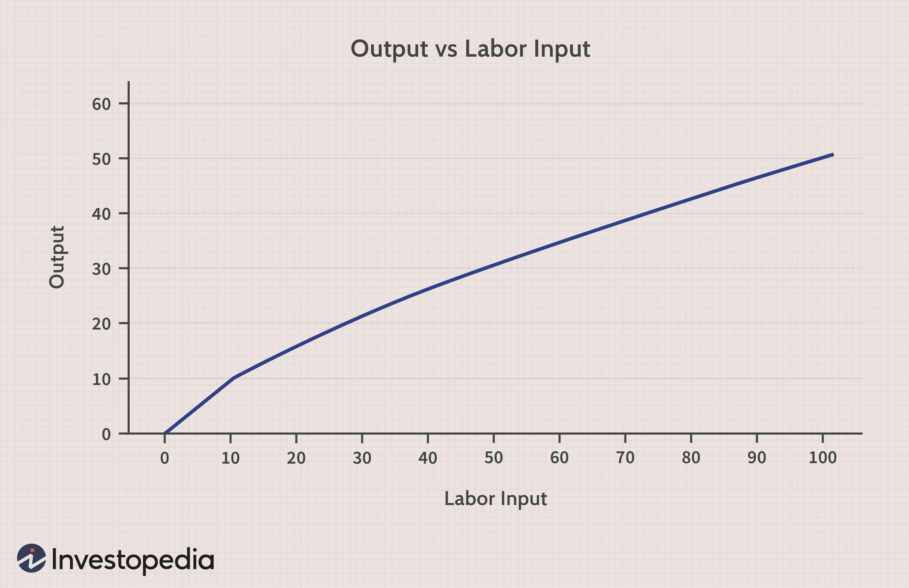

## Table of Contents

## What is Mean Decrease Accuracy (MDA) in the context of feature importance?

Mean Decrease Accuracy (MDA) is a way to find out how important each feature is in a machine learning model. It works by changing one feature at a time and seeing how much the model's accuracy drops. If the accuracy drops a lot when a feature is changed, that feature is very important. If the accuracy doesn't change much, the feature is not very important.

To do MDA, you first train your model with all the features. Then, you mix up the values of one feature and see how the model does. You do this for each feature, one at a time. By comparing the drop in accuracy for each feature, you can see which ones are most important for the model's predictions. This helps you understand which features are really helping the model and which ones might not be needed.

## How does MDA help in understanding the importance of features in a model?

Mean Decrease Accuracy (MDA) helps us understand which features are important in a machine learning model by seeing how much the model's accuracy changes when we mix up the values of one feature at a time. If the model's accuracy drops a lot when we mix up a feature, it means that feature is very important for the model to make good predictions. On the other hand, if the accuracy doesn't change much, it means the feature isn't very important.

By using MDA, we can compare the importance of different features. This helps us see which features are really helping the model and which ones might not be needed. For example, if we find that changing one feature makes the model's accuracy drop a lot, we know that feature is key to the model's performance. This information can help us make better models by focusing on the most important features and maybe even removing the ones that don't help much.

## What is the basic process of calculating MDA?

To calculate Mean Decrease Accuracy (MDA), you start by training your machine learning model using all the features you have. Once the model is trained, you then mix up the values of one feature at a time, keeping all other features the same. You then use the model with the mixed-up feature to make predictions and see how accurate those predictions are. You do this for each feature, one by one.

After you've mixed up each feature and checked the model's accuracy each time, you compare the results. The difference in accuracy before and after mixing up each feature tells you how important that feature is. If the accuracy drops a lot when you mix up a feature, it means that feature is very important for the model's predictions. If the accuracy doesn't change much, the feature is not very important. By doing this for all features, you can rank them by their importance to the model.

## Can you explain how MDA is different from other feature importance methods like Mean Decrease Impurity (MDI)?

Mean Decrease Accuracy (MDA) and Mean Decrease Impurity (MDI) are two different ways to figure out which features are important in a machine learning model, but they work differently. MDA looks at how the model's accuracy changes when you mix up the values of one feature at a time. If the accuracy drops a lot, that feature is very important. This method directly measures how much each feature helps the model make good predictions by seeing what happens when the feature's information is messed up.

On the other hand, Mean Decrease Impurity (MDI) works by looking at how much each feature helps to make the model's decisions clearer at each split in a decision tree. MDI is based on how much a feature reduces the randomness or 'impurity' in the data as the tree grows. This method is good for understanding which features help the most in building the tree, but it doesn't directly tell you how important the feature is for the model's final predictions like MDA does.

In simple terms, MDA is about seeing how messing up a feature affects the model's accuracy, while MDI is about how a feature helps to make the decision tree clearer. Both methods give you information about feature importance, but they do it in different ways and can sometimes lead to different conclusions about which features are most important.

## What types of models can MDA be applied to?

Mean Decrease Accuracy (MDA) can be used with many different types of machine learning models, as long as you can mix up the feature values and check the model's accuracy. This includes models like random forests, which are made up of many decision trees, and other kinds of tree-based models. It also works with models like support vector machines (SVMs) and neural networks, as long as you can use them to make predictions and see how accurate those predictions are.

The key thing for using MDA is that you need to be able to train the model, mix up the values of one feature at a time, and then see how well the model does with the mixed-up feature. This means MDA can be used with any model where you can do these steps, making it a flexible way to figure out which features are important for a wide range of machine learning models.

## How do you implement MDA in a practical setting using a popular programming language like Python?

To implement Mean Decrease Accuracy (MDA) in Python, you start by training your model using all the features. You can use popular libraries like scikit-learn to train models like random forests or other types of models. Once your model is trained, you need to mix up the values of one feature at a time. You can do this by shuffling the values of that feature while keeping all other features the same. Then, you use the model to make predictions with the mixed-up feature and check how accurate those predictions are. You repeat this process for each feature, one by one.

After you've mixed up each feature and checked the model's accuracy, you calculate the difference in accuracy before and after mixing up each feature. This difference tells you how important each feature is to the model's predictions. If the accuracy drops a lot when you mix up a feature, that feature is very important. You can use a simple loop in Python to go through all the features, mix them up, and calculate the accuracy drop. By comparing these drops, you can rank the features by their importance to the model. This helps you understand which features are key to the model's performance and which ones might not be needed.

## What are the common pitfalls or biases one might encounter when using MDA?

When using Mean Decrease Accuracy (MDA), one common pitfall is that it can be affected by the correlation between features. If two features are very similar and both help the model, mixing up one of them might not show a big drop in accuracy because the other feature can still help the model make good predictions. This can make it seem like the mixed-up feature is not very important, even if it really is.

Another issue is that MDA can be biased towards features with more categories or continuous features with a wider range of values. When you mix up these kinds of features, it's easier to see a big change in the model's predictions, which can make them seem more important than they really are. It's important to be careful and think about these things when you use MDA to figure out which features are important in your model.

## How can the reliability of MDA results be assessed or improved?

To assess the reliability of MDA results, you can use something called cross-validation. This means you split your data into different parts, run MDA on each part, and see if you get similar results each time. If the importance of features stays the same across different parts of your data, you can trust your MDA results more. Another way to check reliability is by comparing MDA results with other methods of finding important features, like Mean Decrease Impurity (MDI) or permutation importance. If different methods show that the same features are important, you can feel more confident in your MDA results.

To improve the reliability of MDA, you can handle the issue of correlated features by using techniques like Principal Component Analysis (PCA) to combine similar features into new ones. This can help make sure that MDA is not missing the importance of features that are very similar. Also, when you mix up the values of features, it's a good idea to do this many times and then average the results. This can help reduce the chance that random changes in the data make your results less reliable. By using these methods, you can make your MDA results more trustworthy and get a better understanding of which features are really important for your model.

## What are some advanced techniques or modifications to the standard MDA method?

One advanced technique to improve the standard MDA method is called grouped MDA. This is useful when you have features that are related to each other. Instead of mixing up each feature one by one, you mix up groups of related features together. This helps you see how important the whole group is to the model, not just each feature by itself. For example, if you have different features that all measure parts of a person's health, you can mix up all these health features together to see how important health is to the model's predictions.

Another modification is to use stratified shuffling when you mix up the feature values. This means you make sure that the mix-up keeps the same balance of different groups in your data. For example, if you have data about people from different countries, you want to make sure that after mixing up a feature, the number of people from each country stays the same. This can help make your MDA results more reliable because it stops the mix-up from changing the balance of your data in a way that could affect the model's accuracy.

A third advanced technique is to use bootstrap resampling with MDA. This means you take many smaller samples from your data, run MDA on each sample, and then average the results. This can help make your MDA results more stable and less affected by random changes in your data. By using these advanced techniques, you can get a better and more reliable understanding of which features are really important for your model's predictions.

## How does the choice of model parameters affect the MDA results?

The choice of model parameters can really change the results you get from Mean Decrease Accuracy (MDA). When you train a model, you set different parameters that tell the model how to learn from the data. For example, if you're using a random forest model, you might set parameters like the number of trees or the maximum depth of each tree. These parameters can change how the model makes predictions and how it uses different features. If you change these parameters, the model might start to see some features as more or less important, which will show up in your MDA results.

For example, if you increase the number of trees in a random forest, the model might be able to use more features to make better predictions. This could make the MDA results show that more features are important because the model is using them more. On the other hand, if you set the maximum depth of the trees to be very small, the model might not be able to use as many features, and the MDA results might show that fewer features are important. So, when you're using MDA, it's a good idea to try different model parameters and see how they change the results. This can help you understand which features are really important, no matter how you set up the model.

## Can MDA be used effectively in high-dimensional datasets, and if so, how?

Yes, MDA can be used in high-dimensional datasets, but it needs some extra care. High-dimensional datasets have a lot of features, which can make it hard for MDA to find out which ones are really important. When you mix up a feature in a high-dimensional dataset, other features might still help the model make good predictions, so the drop in accuracy might not be as clear. To make MDA work well in these cases, you can use something called dimensionality reduction techniques, like Principal Component Analysis (PCA), to combine similar features into new ones. This can help MDA focus on the most important parts of your data.

Another way to use MDA effectively in high-dimensional datasets is to use grouped MDA. This means you mix up groups of related features together instead of one by one. This helps you see how important the whole group is, not just each feature by itself. For example, if you have a lot of features about a person's health, you can mix up all these health features together to see how important health is to the model's predictions. By using these methods, you can make MDA work well even when you have a lot of features.

## What are the latest research developments or criticisms regarding the use of MDA in feature importance?

Recent research has pointed out some issues with using Mean Decrease Accuracy (MDA) for figuring out which features are important. One big problem is that MDA can be affected by how features are related to each other. If two features are very similar, mixing up one might not change the model's accuracy much because the other feature can still help the model make good predictions. This can make it seem like the mixed-up feature is not very important, even if it really is. Researchers have also found that MDA can be biased towards features with more categories or a wider range of values. When you mix up these kinds of features, it's easier to see a big change in the model's predictions, which can make them seem more important than they really are.

To deal with these issues, new methods have been developed to improve how MDA works. One of these is called grouped MDA, where you mix up groups of related features together instead of one by one. This helps you see how important the whole group is, not just each feature by itself. Another new idea is to use bootstrap resampling with MDA. This means you take many smaller samples from your data, run MDA on each sample, and then average the results. This can help make your MDA results more stable and less affected by random changes in your data. By using these new methods, you can get a better and more reliable understanding of which features are really important for your model's predictions.

## What is Mean Decrease Accuracy (MDA) and how is it understood?

Mean Decrease Accuracy (MDA) is a widely utilized method for assessing the importance of features in [machine learning](/wiki/machine-learning) models. It employs permutation techniques to evaluate the effect of each feature on model performance. This approach involves measuring the decline in model accuracy when the values of a particular feature are randomly shuffled. The fundamental concept is to disrupt the relationship between the feature and the outcome, observing how this affects the model’s predictive capability.

MDA begins by training a model using the complete dataset, establishing a baseline accuracy. For each feature, the procedure involves permuting its values while keeping others constant, then recalculating the model's accuracy. The difference in accuracy before and after permutation indicates the feature's importance. Specifically, the permutation is done as follows:

1. Train the model on the dataset and obtain the baseline accuracy.
2. For each feature $X_i$:
   - Permute the values of $X_i$ across all samples.
   - Evaluate the model's performance on this perturbed dataset.
   - Calculate the decrease in accuracy to quantify the feature importance.

Mathematically, if $\text{Acc}_{\text{orig}}$ is the original accuracy and $\text{Acc}_{\text{perm}}$ is the permuted accuracy, the importance $I$ of a feature can be expressed as:

$$
I(X_i) = \text{Acc}_{\text{orig}} - \text{Acc}_{\text{perm}}(X_i)
$$

One of the advantages of MDA is its model-agnostic nature; it can be applied to any predictive model, whether it's a decision tree, support vector machine, or a [neural network](/wiki/neural-network). Additionally, rather than focusing solely on individual features, MDA captures the interaction effects between features. This is particularly useful when dealing with complex datasets where interaction effects may play a significant role.

The technique effectively highlights features that contribute significantly to the model's performance, offering insights not easily discernible through simpler, univariate methods. However, the interpretability of MDA results depends on careful implementation, ensuring that model accuracies are correctly recalculated and that permutations do not inadvertently distill misleading signals. The ability to evaluate interactions and apply it across various models makes MDA a versatile choice for feature importance assessment in [algorithmic trading](/wiki/algorithmic-trading) and other predictive modeling contexts.

## How can MDA be implemented in algorithmic trading?

To implement Mean Decrease Accuracy (MDA) in algorithmic trading, a systematic approach is necessary to accurately assess the importance of individual features within a model. The process involves several key steps:

1. **Model Training and Baseline Accuracy**: Initially, a machine learning model is trained using the full dataset. This phase establishes a baseline accuracy which serves as a reference point for evaluating feature importance. The accuracy at this stage reflects how well the model predicts outcomes using all available features.

2. **Feature Permutation**: Each feature in the dataset is isolated and subjected to random permutation. This involves shuffling the values of the feature, effectively disrupting any relationship it holds with the target variable. The objective is to assess the impact of the feature by observing the model's predictive performance after it has been perturbed.

   The permutation can be expressed mathematically. Suppose $X$ is the matrix of input features, with the column $X_j$ representing the feature being evaluated. A random permutation of $X_j$ is performed to create a new feature matrix $X^{\text{perm}}$, where 
$$
   X^{\text{perm}} = \{ X_1, X_2, ..., \pi(X_j), ..., X_n \}

$$

   Here, $\pi(X_j)$ is the permuted version of $X_j$.

3. **Re-Evaluation of Model Performance**: After permuting each feature independently, the model's performance is re-evaluated against the baseline accuracy. This step is crucial to calculate the decrease in accuracy due to the permutation. The model should be tested using the same metrics applied during the baseline evaluation to ensure consistency.

4. **Assessing Feature Importance**: Features causing a significant drop in the model's accuracy are considered influential. The mean decrease in accuracy for a feature is computed by comparing the pre- and post-permutation accuracies. A larger decrease signifies higher importance, as the feature contributes materially to the predictive capability of the model.

   The importance score for a feature $j$ can be mathematically represented as:
$$
   \text{Importance}_j = \text{Accuracy}_{\text{baseline}} - \text{Accuracy}_{\text{perm\_}j}

$$

   where $\text{Accuracy}_{\text{perm\_}j}$ is the model accuracy with the j-th feature permuted.

Implementing MDA, especially in algorithmic trading, relies on understanding these steps to help determine the features that significantly influence trading models, thereby improving their predictive performance and robustness. Integrating MDA into trading strategy development can optimize feature selection and enhance the model's adaptability to financial market conditions.

## References & Further Reading

[1]: Bergstra, J., Bardenet, R., Bengio, Y., & Kégl, B. (2011). ["Algorithms for Hyper-Parameter Optimization."](https://papers.nips.cc/paper/4443-algorithms-for-hyper-parameter-optimization) Advances in Neural Information Processing Systems 24.

[2]: ["Advances in Financial Machine Learning"](https://www.amazon.com/Advances-Financial-Machine-Learning-Marcos/dp/1119482089) by Marcos Lopez de Prado

[3]: ["Evidence-Based Technical Analysis: Applying the Scientific Method and Statistical Inference to Trading Signals"](https://www.amazon.com/Evidence-Based-Technical-Analysis-Scientific-Statistical/dp/0470008741) by David Aronson

[4]: ["Machine Learning for Algorithmic Trading"](https://github.com/PacktPublishing/Machine-Learning-for-Algorithmic-Trading-Second-Edition) by Stefan Jansen

[5]: ["Quantitative Trading: How to Build Your Own Algorithmic Trading Business"](https://books.google.com/books/about/Quantitative_Trading.html?id=j70yEAAAQBAJ) by Ernest P. Chan