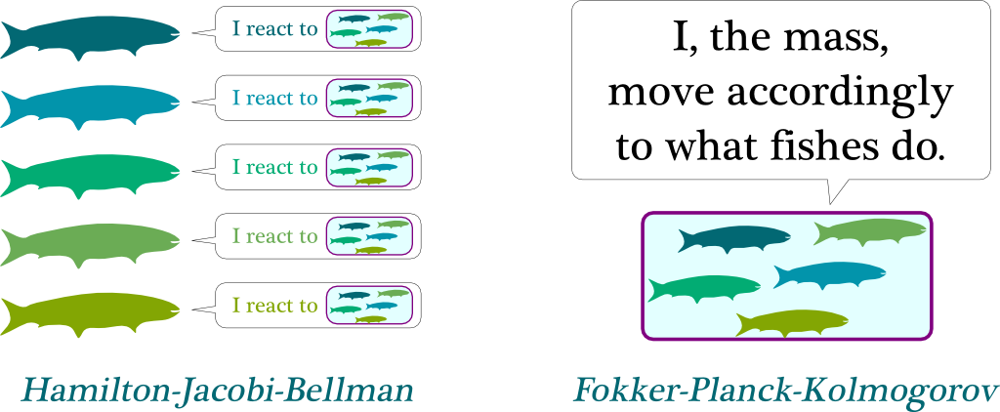

Algorithmic trading refers to the use of computer algorithms to automate trading decisions and execute orders in financial markets at high speed and frequency. This approach has revolutionized the trading landscape, allowing for more precise, timely, and efficient transactions compared to traditional methods. The significance of algorithmic trading in modern financial markets is extensive, offering benefits such as improved liquidity, reduced transaction costs, and the ability to leverage large volumes of data for informed decision-making. The impact of algorithmic trading is evident as it accounts for a substantial portion of global trading volumes, with its influence continuously expanding as technologies advance.

Mean Field Games (MFG) serve as a mathematical framework that has gained attention due to its applicability in modeling complex systems with many interacting agents. Originating from the study of differential games, MFG provides a simplified yet powerful means to analyze the collective behavior of a large number of interacting entities, such as traders in a financial market. This framework facilitates the understanding of how individual actions at the micro level lead to emergent phenomena at the macro level, a concept particularly pertinent to financial markets where individual trading strategies can aggregate to influence market dynamics.

The rationale for utilizing MFG in algorithmic trading is to model and optimize the interactions of numerous trading agents effectively. With financial markets characterized by high complexity and constant fluctuations, traditional models may fall short in capturing the intricate interplay of factors influencing market trends. MFG, with its ability to handle large-scale agent interactions, offers a viable solution for developing robust trading strategies. By incorporating MFG, traders can potentially enhance their strategies to optimize performance under various market conditions, leading to more resilient and adaptive trading systems.

This article is structured to provide a comprehensive understanding of MFG and its application in algorithmic trading. Section one introduces the concepts of MFG and algorithmic trading. The subsequent sections delve into the theoretical underpinnings of MFG, providing historical context and explaining key mathematical principles such as differential equations, followed by an overview of algorithmic trading itself. We will also examine how MFG can be specifically applied to algorithmic trading, addressing challenges and limitations in the process. Lastly, we will explore future directions for innovation within this intersection of fields.

The optimization of trading strategies is crucial given the dynamic nature of financial markets. Efficient market participation requires traders to continually adapt to diverse conditions ranging from rapid market shifts to subtle long-term trends. Leveraging frameworks such as MFG can enhance a trader's ability to navigate these challenges, ultimately contributing to more strategic decision-making and sustained competitive advantage in the financial sector.

## Table of Contents

## Understanding Mean Field Games

Mean Field Games (MFG) present a robust framework for analyzing the collective behavior of a large number of interacting decision-makers, often referred to as agents. Rooted in the intersection of differential equations and game theory, MFG enables the study of strategic interactions where the effect of any individual agent is negligible due to the vast number involved. This section delves into the core components and broader context of mean field games.

Historically, the development of MFG can be traced back to the early 2000s through the pioneering works of Jean-Michel Lasry and Pierre-Louis Lions. Their collaboration introduced the key concepts of MFG, focusing on the evolution and strategies of [agents](/wiki/agents) over time. Independently, Peter Caines and his collaborators also advanced similar concepts, bringing forth methodologies that addressed large-scale multi-agent systems.

At its mathematical core, MFGs employ differential equations to model the dynamics of agent populations. The typical MFG framework consists of two critical components: the Hamilton-Jacobi-Bellman (HJB) equation and the Fokker-Planck (FP) equation. The HJB equation describes the optimization problem faced by an individual agent, while the FP equation characterizes the evolution of the distribution of the entire agent population.

In formal terms, if we let $u(t, x)$ represent the value function for an agent at time $t$ and state $x$, the HJB equation can be expressed as:

$$

\frac{\partial u(t, x)}{\partial t} + H(t, x, \nabla u(t, x), m(t, x)) = 0 
$$

where $H$ is the Hamiltonian reflecting agent control impacts and $m(t, x)$ is the distribution of states in the population. The FP equation accompanies this to describe the dynamics of $m(t, x)$:

$$

\frac{\partial m(t, x)}{\partial t} - \nabla \cdot (m(t, x) \nabla H) = 0 
$$

Mean field games find applications beyond the financial sector. They are employed in diverse fields such as crowd dynamics, where human movement patterns are studied, and in epidemiology, where the spread of diseases through populations is modeled. Furthermore, MFGs have facilitated advancements in decentralized control systems, impacting sectors like telecommunications and energy management.

A distinguishing feature of MFG compared to traditional game theory is its focus on the limit behavior of large populations rather than finite, identifiable groups of players. While classical game theory deals with discrete interactions among strategically acting players, the MFG paradigm hinges on the aggregate effect of strategies across an entire population. This distinction affords MFG a unique capability to simplify complex strategic interactions and capture the evolving nature of many-agent systems efficiently.

The deployment of MFGs necessitates a rethinking of how games are approached mathematically and conceptually, offering potent tools for modeling and solving problems in various domains requiring analysis of large-scale interactions.

## Algorithmic Trading: A Brief Overview

Algorithmic trading refers to the use of complex algorithms and automated systems to facilitate the execution of trading decisions in financial markets. This method of trading leverages advanced mathematical models and computational techniques to execute orders at speeds and frequencies that would be impossible for human traders. Over the years, [algorithmic trading](/wiki/algorithmic-trading) has transformed the financial landscape, enabling traders to capitalize on fleeting market opportunities with enhanced precision and reduced transaction costs.

The evolution of algorithmic trading has been marked by significant technological advancements and an increasing emphasis on speed and efficiency. Initially, algorithms were simple decision-making tools, but they have since evolved into highly sophisticated systems capable of processing and analyzing vast datasets in real-time. Innovations such as high-frequency trading ([HFT](/wiki/high-frequency-trading-strategies)) have further accelerated the pace at which trading is conducted, reshaping market dynamics and [liquidity](/wiki/liquidity-risk-premium).

At the core of algorithmic trading is the automation of trading decisions. Algorithms are designed to automatically determine the timing, price, and quantity of trades based on predefined criteria and market conditions. The automation process minimizes the need for human intervention, thereby reducing the potential for human error and emotional bias. By relying on rule-based systems, algorithmic trading can efficiently execute trades that align with specific strategies and objectives.

Algorithmic trading strategies are diverse and cater to different market conditions and trader goals. Among the prevalent strategies are market-making and [arbitrage](/wiki/arbitrage). Market-making involves quoting continuous buy and sell prices to provide liquidity to the market, profiting from the bid-ask spread. This strategy requires algorithms to constantly adjust to market conditions to maintain profitable spreads while minimizing risk. Arbitrage, on the other hand, involves exploiting price discrepancies between different markets or financial instruments. Algorithms can identify and execute arbitrage opportunities faster than manual trading, ensuring profitability from small price differentials.

Despite its advantages, the algorithmic trading landscape is not without challenges. The rapid nature of algorithmic trading can lead to unintended market [volatility](/wiki/volatility-trading-strategies), exemplified by events such as the Flash Crash of 2010. Additionally, algorithmic systems must continually adapt to evolving market conditions and regulatory requirements. Traders face the ongoing challenge of maintaining the competitiveness and resilience of their algorithms in an increasingly crowded and technologically advanced market.

Algorithmic trading relies heavily on the behavior of trading agents—autonomous algorithms designed to execute specific strategies. These agents operate independently based on their programming and analysis of market data. Their behavior is driven by objectives such as maximizing returns, minimizing risk, or achieving specific market positions. The interaction among these agents, each pursuing different strategies, creates complex market dynamics that require continuous study and adaptation.

In conclusion, algorithmic trading has revolutionized financial markets by introducing heightened levels of speed, efficiency, and sophistication. It encompasses a wide range of strategies and relies on automated agents to make rapid, precision-based trading decisions. While it presents unique challenges, algorithmic trading remains a critical component of modern financial markets, continuously evolving to address emerging opportunities and risks.

## Application of Mean Field Games in Algorithmic Trading

Mean Field Games (MFG) offer a robust framework for modeling interactions among a large number of trading agents in algorithmic trading environments. By considering the aggregate effect of all agents' actions, MFG provides insights that can optimize trading strategies and improve market efficiency.

### Modeling Interactions Among Trading Agents

In algorithmic trading, numerous agents, each with their own strategy, act simultaneously in the market. MFG models these interactions by treating the population of agents as a continuum. An agent's strategy depends not only on individual preferences but also on the expected behavior of the average agent, leading to a more comprehensive approach to market dynamics.

### Overview of Latent Factors

Latent factors are unobservable variables that influence market behaviors and trading decisions. In MFG, these factors are critical as they impact agents' perceptions and actions. They can include market sentiment, unforeseen economic indicators, or other hidden influences that traditional models might overlook. Understanding these latent factors allows for a more accurate prediction of market movements and the development of sophisticated trading strategies.

### Filtering Techniques for Latent States

To deal with latent factors, filtering techniques are employed to estimate unobservable states in real-time. These techniques use observable market data to infer the hidden states, which are then incorporated into the MFG model. A common approach is the Kalman filter, a set of mathematical equations used to predict the state of the system and update these predictions based on new data. Such methods enable traders to continuously adjust their strategies in response to the evolving market environment.

### Stochastic Games and MFG Equilibrium

Mean Field Games are a class of stochastic games where each agent’s payoff depends on both their own state and the distribution of states across all agents. The goal is to find an equilibrium where each agent's strategy is optimal given the strategies of others. In algorithmic trading, this translates to finding a strategy that maximizes expected returns while considering the aggregate behavior of other market participants. The equilibrium in MFG provides a stable state where no single agent can unilaterally benefit by deviating from their current strategy, assuming other agents' strategies remain constant.

### Case Studies and Examples

Several case studies have demonstrated the utility of MFG in algorithmic trading. For instance, a study might explore how MFG can optimize trade execution by minimizing market impact and transaction costs. In another example, MFG could be applied to model high-frequency trading environments, where rapid decision-making is crucial, and traditional models fall short in capturing the complex interactions among traders.

Using MFG frameworks, researchers have also developed models for risk management and portfolio optimization, offering strategies that adjust dynamically to market changes. By integrating MFG, trading systems become more adaptive and robust, capable of withstanding volatile market conditions while achieving optimal performance.

In summary, the application of Mean Field Games in algorithmic trading provides a comprehensive approach to understanding and optimizing the interactions among numerous trading agents. Through the integration of latent factors, filtering techniques, and equilibrium concepts, MFG enhances the ability to make informed trading decisions, paving the way for more sophisticated and effective trading strategies.

## Challenges and Limitations

### Challenges and Limitations

The application of Mean Field Games (MFG) to real-world financial markets presents several technical challenges. One of the primary challenges lies in the complexity of accurately modeling the interactions among a vast number of trading agents. Financial markets are inherently dynamic, with numerous participants whose decisions can be both rational and irrational. Modeling these interactions requires advancements in understanding how MFG can reflect such real-world behavior, especially under rapidly changing market conditions. 

Current MFG models often face significant limitations in capturing the intricate and volatile dynamics of these markets. Many models are built on assumptions that may not hold true in practical scenarios, such as the homogeneity of agents or the complete knowledge of payoff functions. This can lead to models that do not adequately encompass the unpredictability and the diverse strategies employed by market participants.

Data fitting and model accuracy are critical issues that may impact the effectiveness of MFG. Financial markets generate vast amounts of data that are often noisy and incomplete, posing challenges for accurate data fitting. This issue is compounded by the high computational complexity associated with solving MFG models, which typically involve solving differential equations numerically. As computational demands increase, the efficiency and scalability of these solutions become paramount, especially considering real-time trading scenarios.

Optimization of trading strategies using MFG must also consider potential pitfalls and limitations. Strategies optimized under certain market conditions may not perform well when those conditions evolve. The robustness of a model against a changing market environment is crucial for the financial viability of trading strategies derived from MFG.

Ethical concerns and regulatory considerations also present significant limitations to the deployment of MFG in algorithmic trading. The automation of trading strategies has often been scrutinized for contributing to market volatility and creating unfair advantages. As MFG models are employed to optimize strategies, they must align with regulatory frameworks and ethical trading practices, ensuring they do not exacerbate systemic risks or contribute to market manipulation.

In summary, while MFG presents a promising mathematical framework for optimizing algorithmic trading strategies, its application is fraught with technical challenges. Overcoming these obstacles requires robust models that are sensitive to real-world conditions, capable of accurately fitting market data, and cognizant of ethical and regulatory constraints. The development of more sophisticated and adaptable MFG models will be essential to harnessing their full potential in financial markets.

## Future Directions and Innovations

Mean field games (MFG) are gaining traction in the algorithmic trading landscape as researchers and practitioners explore new avenues for implementation. One significant trend is the increasing complexity and dynamism of financial markets, which necessitate advanced modeling techniques. MFG offers a robust framework to address these needs by providing a scalable approach to model interactions among a large number of trading agents. This is particularly pertinent in high-frequency trading environments where rapid decision-making is crucial.

Technological advancements, particularly in computational power and data processing capabilities, are facilitating improved implementation of MFG in trading scenarios. For instance, the development of parallel computing and cloud-based infrastructures allows for the simulation and analysis of complex MFG models at unprecedented scales. These advancements make it feasible to compute MFG equilibria, helping traders to identify optimal strategies in real-time.

The integration of other mathematical and computational tools with MFG is another promising area. Techniques from [machine learning](/wiki/machine-learning) and [artificial intelligence](/wiki/ai-artificial-intelligence) are being employed alongside MFG to enhance predictive accuracy and adaptability. Machine learning algorithms can be used to estimate latent variables or market conditions, which are then incorporated into MFG models to refine strategy outcomes. Moreover, combining MFG with agent-based models or [reinforcement learning](/wiki/reinforcement-learning) offers a hybrid approach that leverages the strengths of each methodology.

MFG's potential to address evolving market conditions and trader needs is significant. Markets are becoming increasingly interconnected and volatile, and traditional models may struggle to accommodate these changes. MFG's adaptability makes it well-suited to capture and respond to the nuances of modern financial markets. By modeling the collective behavior of agents and understanding the macro dynamics that arise from individual actions, MFG can help traders to not only optimize their strategies but also to anticipate and respond to broader market shifts.

Finally, opportunities for collaborative research and development in financial technologies are abundant. Academic institutions, financial firms, and technology companies are increasingly collaborating to explore and expand the applications of MFG in finance. This multidisciplinary approach is essential for advancing MFG methodologies and ensuring their effectiveness in real-world applications. Collaborative platforms and open-source initiatives further support the development of MFG-based strategies, facilitating knowledge exchange and innovation in the field.

## Conclusion

Algorithmic trading, which relies on the use of algorithms to automate trading decisions, has become a cornerstone of modern financial markets. Within this context, mean field games (MFG) have emerged as a valuable mathematical framework that enhances our understanding and modeling of complex interactions among trading agents. This article has explored how MFG can significantly advance algorithmic trading methodologies by providing a structured approach to capturing the collective behavior of these agents, which is critical in optimizing trading strategies under variable market conditions.

The application of MFG in algorithmic trading offers new avenues for both theoretical and practical exploration. It allows for the modeling of interactions in a way that traditional game theoretic approaches may not, by incorporating differential equations to represent the dynamic behavior of numerous agents over time. The importance of this lies in its potential to guide traders in developing strategies that are more informed and adaptive to market changes, which is essential for maintaining a competitive edge.

As the trading landscape continues to evolve, there is a pressing need for further research at the intersection of MFG and finance. Investigating how MFG can be better tailored and applied to real-world markets will not only advance academic understanding but also offer practical insights that can be harnessed by financial practitioners. This includes exploring new mathematical and computational tools to overcome current limitations in MFG models and improve data fitting and model accuracy.

Looking ahead, the future of trading strategies and market analysis will likely be influenced by continued advancements in MFG. As markets become more complex and data-driven, the integration of MFG with other innovative technologies could lead to more sophisticated and responsive trading algorithms. There is also an opportunity for collaborative research and development in financial technologies that can further bridge the gap between theory and practice.

Finally, we invite feedback and engagement from the academic and financial community. Open discussion and collaboration are crucial as we strive to refine and innovate within this exciting intersection of mathematics and finance. Such dialogue will play a vital role in overcoming challenges and seizing opportunities that lie ahead in the advancement of algorithmic trading strategies.

## References & Further Reading

[1]: Lasry, J.-M., & Lions, P.-L. (2007). ["Mean Field Games."](https://link.springer.com/article/10.1007/s11537-007-0657-8) Bulletin of the American Mathematical Society, 45(02), 197-213.

[2]: Caines, P. E., Huang, M., & Malhamé, R. P. (2006). ["Large Population Stochastic Dynamic Games: Closed-Loop McKean-Vlasov Systems and the Nash Certainty Equivalence Principle."](https://www.semanticscholar.org/paper/Large-population-stochastic-dynamic-games%3A-systems-Caines-Huang/8c5d03db540c542b914552b180f94f563f96a476) IEEE Conference on Decision and Control.

[3]: Cardaliaguet, P. (2010). ["Notes on Mean Field Games."](https://www.ceremade.dauphine.fr/~cardaliaguet/MFG20130420.pdf) Lecture Notes, Collège de France.

[4]: Carmona, R., & Delarue, F. (2018). ["Probabilistic Theory of Mean Field Games with Applications."](https://link.springer.com/book/10.1007/978-3-319-58920-6) Springer International Publishing. 

[5]: Fabozzi, F. J., Focardi, S. M., & Kolm, P. N. (2010). ["Quantitative Equity Investing: Techniques and Strategies."](https://www.semanticscholar.org/paper/Quantitative-Equity-Investing%3A-Techniques-and-Fabozzi-Focardi/1c49a2a53919f7e65cb96f16691b8ff726fd3cd7) Wiley.

[6]: Bouchaud, J.-P., Farmer, J. D., & Lillo, F. (2009). ["How Markets Slowly Digest Changes in Supply and Demand."](https://arxiv.org/abs/0809.0822) Handbook of Financial Markets: Dynamics and Evolution.

[7]: Gatheral, J. (2006). ["The Volatility Surface: A Practitioner's Guide."](https://books.google.com/books/about/The_Volatility_Surface.html?id=P7ASlvLRsKMC) Wiley.

[8]: Cont, R., Stoikov, S., & Talreja, R. (2010). ["A Stochastic Model for Order Book Dynamics."](http://rama.cont.perso.math.cnrs.fr/pdf/CST2010.pdf) Operations Research, 58(3), 549-563.