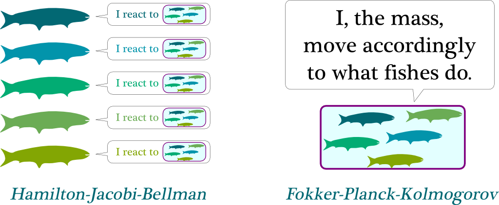

## Table of Contents

## What are mean field games?

Mean field games are a type of mathematical model used to study how large groups of people or agents make decisions and interact with each other. Imagine you're in a crowded place, like a busy market. Everyone is trying to move around and make their own decisions, but they're also affected by what others are doing. Mean field games help us understand these kinds of situations by looking at the average behavior of the crowd instead of focusing on each individual.

In these models, each person or agent tries to make the best decision for themselves, but they also consider what the rest of the group is doing. For example, if you're driving on a highway, you might decide to change lanes based on how fast other cars are going. Mean field games use math to predict how these individual decisions can lead to patterns or trends in the whole group. This can be useful for things like managing traffic, planning cities, or even understanding economic markets.

## How do mean field games differ from traditional game theory?

Mean field games and traditional game theory both study how people or agents make decisions, but they do it in different ways. Traditional game theory usually focuses on small groups of players, like in a chess game where each player's move directly affects the other. It looks at how each player tries to outsmart the others to win. In these games, the strategies of all players are important, and each player knows who they are playing against.

On the other hand, mean field games look at much larger groups, often so big that it's hard to keep track of each individual. Instead of focusing on specific players, mean field games consider the average behavior of the whole group. Imagine you're at a huge concert; you can't see or know what every person is doing, but you can see the overall flow of the crowd. In mean field games, each person still makes their own decisions, but they're influenced by the general behavior of everyone else, not by specific individuals. This makes mean field games useful for understanding big, complex systems like traffic or financial markets.

## What are the basic components of a mean field game?

Mean field games have a few key parts that make them work. The first part is the agents. These are the people or things making decisions in the game. Each agent wants to do what's best for themselves, but they also look at what everyone else is doing. The second part is the state of the system. This is like a snapshot that shows where all the agents are and what they're doing at any moment. The state changes over time as agents make their choices.

Another important part is the cost or payoff function. This tells each agent how good or bad their decision is. If an agent's choice leads to a good result, the payoff is high. If it's a bad result, the payoff is low. The last part is the mean field. This is the average behavior of all the agents together. It's like looking at the crowd from far away and seeing the general direction everyone is moving. Agents use this average to help make their own decisions.

## Can you explain the concept of a mean field in the context of these games?

In mean field games, the mean field is like a big picture of what everyone is doing all together. Imagine you're at a huge festival with thousands of people. You can't keep track of what each person is doing, but you can see the overall flow of the crowd. That's the mean field - it's the average behavior of all the people or agents in the game. Instead of focusing on one person, you look at the whole group and see where they're moving, what they're doing, and how they're behaving on average.

Each person or agent in the game uses this mean field to make their own decisions. If you're at that festival and you see most people moving towards a certain stage, you might decide to go that way too. The mean field helps you guess what might be a good choice based on what everyone else is doing. It's a way to simplify a very complicated situation by looking at the big picture instead of every tiny detail.

## What are some common applications of mean field games?

Mean field games are used in many real-life situations where lots of people make decisions at the same time. One common use is in managing traffic. Imagine you're driving on a busy highway. Mean field games can help predict how all the drivers might choose to change lanes or speed up based on what everyone else is doing. This can help city planners figure out how to reduce traffic jams and make roads safer.

Another use is in economics and finance. Think about a stock market where many traders are buying and selling stocks. Mean field games can model how these traders make decisions based on the overall market trends. This helps economists understand how prices might go up or down and how to make better financial plans. It's like looking at the big picture of the market to see where it might be heading.

## How are mean field games mathematically formulated?

Mean field games are set up using math that looks at big groups of people or agents. Each agent has a state, which is like where they are or what they're doing at any moment. This state changes over time as agents make decisions. These decisions are based on a cost or payoff function, which tells each agent if their choice is good or bad. The key part of mean field games is the mean field itself, which is the average behavior of all the agents together. Each agent uses this average to help make their own choices.

To put this into math, we use equations that describe how the state of each agent changes and how the mean field affects those changes. One equation shows how each agent's state moves over time, taking into account their own decisions and the mean field. Another equation describes how the mean field changes based on the decisions of all the agents. These equations work together to show how the whole system evolves. By solving these equations, we can predict how the big group of agents will behave over time.

## What is the role of the Hamilton-Jacobi-Bellman equation in mean field games?

The Hamilton-Jacobi-Bellman (HJB) equation is a key part of mean field games. It helps each agent figure out the best way to make decisions. In simple terms, the HJB equation tells an agent how to choose actions that will give them the best payoff over time. It takes into account not just the immediate effect of a decision, but also how that decision will affect the agent's future choices. By solving the HJB equation, each agent can find a strategy that makes their overall situation as good as possible.

In mean field games, the HJB equation works together with another important equation called the Fokker-Planck (FP) equation. While the HJB equation focuses on what's best for each individual agent, the FP equation looks at how the whole group of agents behaves on average. The two equations are linked because each agent's decisions, guided by the HJB equation, affect the mean field, which is described by the FP equation. Together, they help us understand how individual choices lead to patterns in the entire system.

## How does the Fokker-Planck equation relate to mean field games?

The Fokker-Planck (FP) equation is like a big picture tool in mean field games. It helps us understand how the whole group of people or agents behaves over time. Imagine you're looking at a crowd from far away. The FP equation shows how this crowd moves and changes direction as a whole. It's all about the average behavior, not what each person is doing. In mean field games, the FP equation tracks how the mean field, which is the average behavior of everyone, changes as all the agents make their decisions.

The FP equation works hand in hand with another equation called the Hamilton-Jacobi-Bellman (HJB) equation. While the HJB equation helps each person figure out their best move, the FP equation shows how all these individual choices affect the whole group. Think of it like this: if everyone in the crowd decides to move left because it's the best choice for them, the FP equation will show that the crowd as a whole is moving left. By solving both equations together, we can see how individual decisions create patterns in the entire system.

## What numerical methods are used to solve mean field games?

To solve mean field games, people often use a method called the finite difference method. This method breaks down the big problem into smaller, easier parts. Imagine you're trying to solve a huge puzzle. Instead of looking at the whole thing at once, you focus on small pieces. The finite difference method does something similar by dividing the space and time into small steps. Then, it uses these steps to figure out how each agent's state changes and how the mean field evolves. This method is good for solving the Hamilton-Jacobi-Bellman and Fokker-Planck equations that are important in mean field games.

Another common way to solve mean field games is by using the Monte Carlo method. This method is like guessing and checking a lot of times. Imagine you're trying to guess how many jelly beans are in a jar. You might take a handful, count them, and then guess the total based on that. The Monte Carlo method does something similar by simulating many different possible outcomes for how agents might behave. By running these simulations many times, it can give a good idea of the average behavior of the whole group. This helps solve the equations and understand how the mean field game works.

## What are some of the challenges in solving mean field games?

One big challenge in solving mean field games is that they involve a lot of math and calculations. The Hamilton-Jacobi-Bellman and Fokker-Planck equations are hard to solve because they are very complex. They need to be solved together, which makes it even trickier. Sometimes, the equations can't be solved exactly, so people have to use special methods like the finite difference method or Monte Carlo simulations. These methods help, but they can take a long time and need powerful computers to work well.

Another challenge is that mean field games often need to handle a huge number of agents. When you have thousands or millions of people making decisions, it's hard to keep track of everything. The mean field helps simplify things by looking at average behavior, but it still needs a lot of data and careful calculations. If the model doesn't accurately represent how agents behave, the results might not be right. So, making sure the model is good and the data is correct is a big part of the challenge.

## How do mean field games extend to multi-population settings?

Mean field games can be used to study situations where there are different groups of people or agents, each with their own way of making decisions. Imagine a city with different neighborhoods. Each neighborhood might have its own rules and habits, but they all affect each other. In multi-population mean field games, each group is looked at separately, but the average behavior of all groups together still matters. This helps us understand how different groups can influence each other and how their choices can lead to patterns in the whole city.

For example, think about two types of drivers on a road: those who are in a hurry and those who are not. Each type of driver makes decisions based on what the other type is doing, but also on what their own group is doing. The mean field game model would look at the average behavior of both groups to predict how traffic might flow. By studying these different groups together, we can see how their interactions can lead to traffic jams or smooth flows, and how to manage them better.

## What are the current research frontiers in mean field games?

Researchers are working on making mean field games more realistic and useful. They want to include more details about how people make decisions, like emotions or different goals. For example, some people might care more about the future than others, or they might make choices based on what they think others will do. By adding these details, mean field games can better predict real-life situations like how people move in a busy city or how they trade in a stock market. Another big focus is on making the math easier to solve. Mean field games have complex equations, and solving them can take a lot of time and computer power. Researchers are looking for new ways to simplify these equations or use faster computers to solve them more quickly.

Another exciting area is using mean field games to study how different groups of people interact. Imagine a city with different neighborhoods, each with its own habits and rules. Researchers want to understand how these groups affect each other and how their choices can lead to patterns in the whole city. This can help with planning cities or managing resources better. Also, there's a lot of interest in using mean field games for new kinds of problems, like how to control robots or drones that work together. By figuring out how these machines can make decisions based on what others are doing, we can make them work more efficiently and safely.

## What are the theoretical developments and solutions?

Recent developments in mean field games (MFG) theory, particularly the work of Casgrain and Jaimungal, have significantly expanded the scope and effectiveness of MFG in addressing complex trading scenarios. The core theoretical concept behind MFG involves the use of forward-backward stochastic differential equations (FBSDEs), which are crucial for simulating the interactions within markets. These equations are pivotal in capturing the dynamic interplay of transient and permanent impacts that trading activities impose on the market environment.

The FBSDE framework in mean field games is utilized to model the evolution of both individual agents' states and the aggregate effect of their collective behavior on the market. The forward component typically models the evolution of an agent's state under specific dynamics, while the backward component manages the value function evaluation or cost-to-go, capturing future rewards or penalties given the current state.

For example, consider a market with agents affecting each other primarily through their aggregate trades, influencing price dynamics. The FBSDE for one such agent could be expressed as:

$$
\begin{align*}
&\text{Forward SDE:} \quad dx_t = \mu(x_t, m_t) \, dt + \sigma(x_t, m_t) \, dW_t \\
&\text{Backward SDE:} \quad -dY_t = f(x_t, Y_t, Z_t, m_t) \, dt - Z_t \, dW_t 
\end{align*}
$$

Here, $x_t$ represents the state of an agent, $m_t$ the mean field representing other agents, $\mu$ and $\sigma$ represent the drift and diffusion terms respectively, and $Y_t$ and $Z_t$ correspond to the cost process and its control. The function $f$ typically represents the running cost or reward of the agent.

Constructing solutions to these equations requires advanced mathematical tools, particularly because agents may have diverse models and objectives. Researchers employ a variety of numerical methods, including Monte Carlo simulations and finite difference methods, to solve these complex systems of equations. By doing so, they aim to find equilibria states—situations where no single agent can improve its outcome by changing its strategy alone.

The solutions derived from these equations furnish traders with crucial insights into how MFG strategies can stabilize markets where numerous competitive agents operate. By setting and achieving equilibrium conditions, traders can better anticipate outcomes of trading strategies under varied scenarios, further enhancing market efficiency and stability. The work of Casgrain and Jaimungal, among others, underscores the importance of these theoretical advancements in forming actionable strategies in contemporary financial markets.

## What are Case Studies and Simulations?

Case studies and simulations serve as pivotal tools for understanding the practical applications of Mean Field Games (MFG) in algorithmic trading. By analyzing various simulation models, researchers and traders can observe how different levels of market disagreement influence trade dynamics, a [factor](/wiki/factor-investing) critical to adapting strategies in real-time trading environments.

One significant insight from simulation studies is the effect of heterogeneous beliefs among traders on market volatility and liquidity. When traders operate under different assumptions and information sets, their collective actions can lead to increased market fluctuations. Simulations allow for the quantification of this impact by varying parameters that represent trader perceptions and observing the consequent changes in market behavior. 

For instance, in a simulated market with a set number of traders, if the disagreement level among traders is high, the resulting trading activity might lead to sharper price movements and higher volatility compared to a scenario with a consensus-driven market. This can be modeled using an agent-based simulation where each trader's strategy updates based on personal utility functions and market observations. 

Python's versatility offers robust options for running these simulations. A simple agent-based model can be constructed where each trader seeks to maximize their utility function $U_i$, influenced by both their private signal $s_i$ and the observed market trend. The utility might be expressed as:

$$
U_i = a_i \cdot (P - E[P]) - c_i \cdot V
$$

where $P$ is the price, $E[P]$ is the expected price based on trader $i$'s belief, $V$ is market volatility, and $a_i$ and $c_i$ are coefficients reflecting individual risk tolerance and the cost of trading. By altering $a_i$ and $c_i$, simulations can mimic different levels of market disagreement.

Through these simulations, MFG strategies can be evaluated for their adaptability to market changes. For example, in scenarios where new information causes rapid shifts in trader expectations, MFG-based algorithms have shown a capability to recalibrate effectively, adjusting trading levels and timing dynamically to optimize outcomes.

Case studies further illustrate the vital role of MFG in crafting resilient trading algorithms. They provide quantitative and qualitative evaluations of trading performance under competitive and unpredictable market conditions. Insights gained from these examples enhance a trader's ability to anticipate and mitigate adverse effects of such environments, thus shaping robust strategies tailored for future applications in complex financial markets. 

By examining and interpreting these studies, traders gain a deeper understanding of the strategic implications of MFG models, thereby refining their approaches to align with the nuanced dynamics of contemporary financial ecosystems.

## References & Further Reading

[1]: Cardaliaguet, P., Delarue, F., Lasry, J.-M., & Lions, P.-L. (2010). ["The master equation and the convergence problem in mean field games."](https://www.degruyter.com/document/doi/10.1515/9780691193717/html) arXiv preprint arXiv:1509.04711.

[2]: Carmona, R., & Delarue, F. (2018). ["Probabilistic Theory of Mean Field Games with Applications I."](https://link.springer.com/book/10.1007/978-3-319-58920-6) Mean Field FBSDEs, Control, and Games. Springer.

[3]: Huang, M., Caines, P. E., & Malhamé, R. P. (2006). ["Large-population cost-coupled LQG problem: A continuum approximation."](https://projecteuclid.org/journals/communications-in-information-and-systems/volume-6/issue-3/Large-population-stochastic-dynamic-games--closed-loop-McKean-Vlasov/cis/1183728987.full) IEEE Transactions on Automatic Control, 52(4), 1560-1571.

[4]: Gueant, O., Lasry, J. M., & Lions, P. L. (2010). ["Mean field games and applications."](https://link.springer.com/chapter/10.1007/978-3-642-14660-2_3) Paris-Princeton Lectures on Mathematical Finance 2010, 205-266.

[5]: Jaimungal, S., & Casgrain, P. (2020). ["Mean field games and systemic risk."](https://onlinelibrary.wiley.com/doi/10.1111/mafi.12237) arXiv preprint arXiv:1802.08296.

[6]: Jaimungal, S., & Nourian, M. (2015). ["Mean field games with regime switching."](https://www.semanticscholar.org/paper/Mean-Field-Game-Strategies-for-Optimal-Execution-Huang-Jaimungal/4b90cafcecdd49c6a9f4e8f3e14ce65cef0ce226) Journal of Economic Dynamics and Control, 54, 144-158.