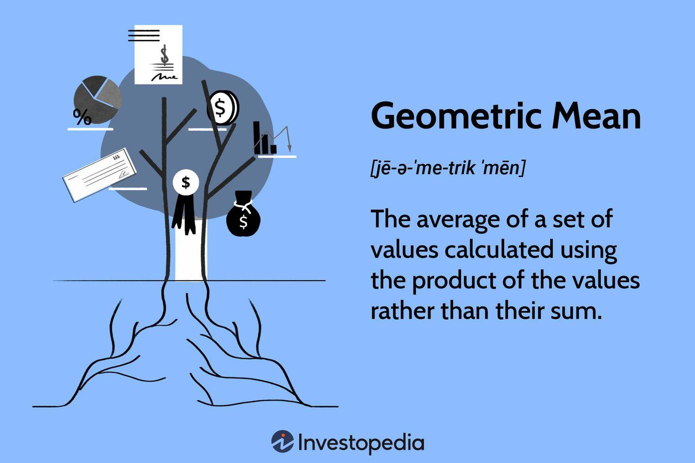

## Table of Contents

## What is the mean return in finance?

In finance, the mean return is a way to figure out the average amount of money an investment makes over time. It's like finding the average score of a bunch of tests. You add up all the returns from an investment and then divide by the number of times you checked the return. This helps investors see how well their investment is doing overall.

The mean return is really useful because it gives a simple number that shows the typical performance of an investment. But, it's important to remember that this number doesn't tell the whole story. Sometimes, investments can have big ups and downs, and the mean return might not show those changes. So, while it's a good starting point, investors should look at other things too, like how much the returns can vary, to get a full picture.

## How is the mean return calculated?

To find the mean return, you first need to know the returns of an investment over a certain time. Let's say you're looking at how a stock did over five years. You would find out the return for each of those years. The return could be positive if the stock went up or negative if it went down. Once you have these numbers, you add them all up.

After adding up all the returns, you divide the total by the number of years you looked at. So, if you added up the returns for five years, you would divide by five. This gives you the mean return, which is the average performance of the investment over that time. It's a simple way to see how well the investment did on average.

## Why is the mean return important for investors?

The mean return is important for investors because it gives them a quick and easy way to see how well their investment is doing on average. When you're thinking about putting your money into something, you want to know if it's going to grow over time. The mean return tells you the typical amount of money you might make each year, which helps you decide if the investment is worth it.

But, the mean return isn't perfect. It's just one piece of the puzzle. Sometimes, investments can have big swings up and down, and the mean return might not show those changes. So, while it's a good starting point, investors should also look at other things, like how much the returns can vary, to get a full picture of the investment's performance. This helps them make smarter choices with their money.

## Can you provide a simple example of calculating the mean return?

Let's say you bought a stock and you want to see how it did over three years. In the first year, the stock went up by 10%. In the second year, it went down by 5%. And in the third year, it went up by 8%. To find the mean return, you add up all these returns: 10% + (-5%) + 8%. That gives you a total of 13%.

Now, you divide this total by the number of years, which is three. So, 13% divided by 3 equals about 4.33%. That's your mean return. It means, on average, your stock went up by about 4.33% each year over those three years.

## What are the limitations of using the mean return as a performance measure?

The mean return is a helpful way to see how well an investment is doing on average, but it has some problems. One big issue is that it doesn't show you how much the returns can go up and down. Sometimes, an investment might have a high average return, but it could also have big drops that make it risky. If you only look at the mean return, you might think the investment is safer than it really is.

Another problem is that the mean return can be thrown off by really high or really low returns. If one year your investment does super well or super badly, it can make the average look different than what usually happens. This can trick you into thinking the investment is better or worse than it really is over time. So, it's good to look at other things, like how much the returns change, to get a better idea of how the investment is doing.

## How does the mean return differ from other return metrics like the median return?

The mean return and the median return are two different ways to look at how well an investment is doing. The mean return is what you get when you add up all the returns and then divide by how many returns you have. It's like finding the average score of a bunch of tests. The median return, on the other hand, is the middle number when you line up all the returns from smallest to biggest. If you have five years of returns, the median would be the third one in the list.

The main difference between these two is how they handle big ups and downs. The mean return can be pulled up or down a lot by one really good or really bad year. For example, if one year your investment jumps up a lot, it can make the mean return look higher than what usually happens. The median return doesn't get affected by these big changes as much because it just looks at the middle number. So, the median can give you a better idea of what's typical without being thrown off by extreme years.

## What role does the mean return play in portfolio management?

In portfolio management, the mean return helps investors figure out how well their whole bunch of investments is doing on average. When you have a lot of different investments, like stocks, bonds, or other things, you want to know if they're growing your money over time. By finding the mean return of your whole portfolio, you get a simple number that shows you the typical growth rate. This helps you see if your investments are doing what you hoped they would do and if you're on track to reach your money goals.

But, using the mean return isn't perfect. It's just one part of the story. Sometimes, different parts of your portfolio can go up and down a lot, and the mean return might not show those changes. That's why smart investors also look at other things, like how much the returns can vary or even the worst-case scenarios. By looking at all these pieces together, they can make better choices about which investments to keep, which to sell, and how to balance their portfolio to reach their goals while keeping risks in check.

## How can the mean return be used in conjunction with risk measures?

The mean return tells you the average amount of money your investment makes over time, but it's not the whole story. You also need to know about the risks. Risk measures, like the standard deviation, show how much the returns can go up and down. When you use the mean return along with these risk measures, you get a better picture of what's happening with your investment. For example, a high mean return might look good, but if the standard deviation is also high, it means your investment could have big swings, which might be too risky for you.

By looking at both the mean return and the risk measures, you can make smarter choices about your investments. If two investments have the same mean return, but one has a lower standard deviation, it might be a safer choice. This helps you balance the chance of making money with the chance of losing it. So, while the mean return shows you the average growth, the risk measures help you understand how bumpy the ride might be. Together, they give you a fuller view of your investment's performance and help you manage your portfolio better.

## What are the statistical assumptions behind using the mean return?

When you use the mean return to look at how well an investment is doing, there are some things you need to assume about the numbers. One big assumption is that the returns are normally distributed. This means that most of the time, the returns are close to the mean return, and big ups and downs are less common. It's like saying that the returns follow a bell curve, where the middle is the most likely place for returns to land.

Another assumption is that the returns are independent of each other. This means that what happened last year doesn't affect what will happen this year. If returns were not independent, like if a big drop one year made it more likely for a big drop the next year, then the mean return wouldn't be as useful. It's important to keep these assumptions in mind because if they're not true, the mean return might not give you a good picture of how your investment is doing.

## How does the frequency of data collection affect the calculation of the mean return?

The frequency of data collection can make a big difference when you're calculating the mean return. If you look at the returns every month instead of every year, you'll have more numbers to work with. This can make your mean return more detailed because it's based on more data points. For example, if you check the return every month for a year, you'll have 12 numbers to add up and divide by 12. But if you only check it once a year, you'll just have one number for that year.

However, using more frequent data can also make things a bit tricky. Sometimes, when you look at returns over shorter periods, like months instead of years, the numbers can be more up and down. This means the mean return might look different depending on how often you collect the data. So, it's important to think about what you're trying to learn from the mean return and choose the right time frame that matches your goals.

## Can the mean return be applied to different types of financial assets?

Yes, the mean return can be used for all sorts of financial stuff, like stocks, bonds, mutual funds, and even real estate. It's a way to figure out how much money, on average, you're making from these investments over time. For example, if you own a bunch of stocks, you can add up the returns from each stock over a few years and then divide by how many years you looked at. This gives you the mean return, which helps you see if your stocks are doing well on average.

The mean return is handy because it works the same way no matter what kind of investment you're looking at. Whether it's a bond that pays you interest every year or a piece of real estate that might go up in value, you can use the mean return to get a quick idea of how it's doing. But remember, it's just one part of the story. Different investments can have different risks and other things to think about, so it's good to use the mean return along with other measures to get the full picture.

## How do advanced statistical techniques enhance the analysis of mean return?

Advanced statistical techniques can make the mean return a lot more useful by giving you a deeper look at how well your investments are doing. For example, something called regression analysis can help you see how different things, like the overall market or interest rates, affect your investment's returns. This can show you if your mean return is because of your smart choices or just because of what's happening in the world. Another cool tool is time series analysis, which looks at how returns change over time. This can help you spot patterns or trends that the mean return alone might miss, like if your investment does better in certain months or years.

These techniques also help you understand the risks better. For instance, using something called Monte Carlo simulations, you can see how your investment might do in the future based on different possible scenarios. This can give you a range of possible mean returns, not just one number, so you get a better idea of what could happen. Plus, techniques like Value at Risk (VaR) can tell you the worst-case scenario for your investment, which is something the mean return doesn't show. By using these advanced methods along with the mean return, you get a fuller picture of your investment's performance and can make smarter decisions.

## What is the importance of understanding financial metrics in investment analysis?

Financial metrics play a pivotal role in assessing the performance and potential of investment opportunities. They provide quantifiable data that help investors make informed decisions by analyzing risk, return, and asset allocation needs. Among these metrics, the Sharpe Ratio, Maximum Drawdown, and Profit Factor are foundational in unveiling insights about risk-adjusted returns and potential drawdowns of investments.

The Sharpe Ratio is a widely recognized metric that measures the return of an investment compared to its risk. It is defined as:

$$
\text{Sharpe Ratio} = \frac{R_p - R_f}{\sigma_p}
$$

where $R_p$ is the portfolio return, $R_f$ is the risk-free rate, and $\sigma_p$ is the standard deviation of the portfolio’s excess return. This ratio provides insights into how much excess return an investor can expect for a given level of risk, assisting in the evaluation of investment strategies.

Maximum Drawdown is another critical metric, representing the largest peak-to-trough decline in the value of an investment portfolio before it recovers to a new peak. It is used to assess the risk of a given investment, reflecting the potential for significant losses during downturns. The smaller the drawdown, the better the risk profile of the investment.

The Profit Factor is an essential measure of profitability in trading and investment analysis. It is calculated by dividing the sum of all winning trades by the sum of all losing trades. A Profit Factor above 1 indicates that the strategy is profitable, while a value below 1 suggests a losing strategy.

These metrics serve purposes beyond mere valuation. They are instrumental in the strategic allocation of assets within a portfolio. By evaluating potential returns and identifying associated risks, investors can align their strategies with their risk tolerance levels. This alignment is crucial for enhancing the probability of meeting investment objectives.

Incorporating these financial metrics into investment analysis leads to a more comprehensive understanding of the potential gains and risks involved. This systematic approach not only empowers investors to make smarter decisions but also helps optimize asset allocation based on individual risk profiles. Aligning financial metrics with an investor’s risk tolerance enhances the likelihood of achieving desired financial outcomes, supporting strategic, well-informed decisions in investment practices. 

By systematically applying these metrics, investors can adopt a data-driven approach to evaluate and manage their portfolios, guiding them toward achieving their financial goals.

## What is the Concept of Mean Return and How is it Calculated?

Mean return, also known as expected return, is a key concept in investment analysis that represents the average profit or loss anticipated from an investment portfolio. It serves as a foundational metric to gauge the potential performance of financial investments over a period of time. Several methods are used to calculate mean returns, each offering different insights into the portfolio's potential outcomes.

One common method is the arithmetic mean, which is the simple average of a set of returns over a specified period. The arithmetic mean is calculated using the formula:

$$
\text{Arithmetic Mean} = \frac{\sum_{i=1}^n R_i}{n}
$$

where $R_i$ is the return in each period and $n$ is the total number of periods.

However, a more nuanced method often employed in finance is the geometric mean, which accounts for the compounding effect of returns over multiple periods. The geometric mean is particularly useful in understanding investment returns over time, as it provides a more accurate picture by considering the [volatility](/wiki/volatility-trading-strategies) in returns. The geometric mean is calculated as follows:

$$
\text{Geometric Mean} = \left( \prod_{i=1}^n (1 + R_i) \right)^{\frac{1}{n}} - 1
$$

The use of probability distributions is another approach to estimate mean returns, particularly when dealing with uncertain or variable future market conditions. By assigning probabilities to different potential outcomes, investors can compute an expected average return. This probabilistic model can aid in understanding the range and likelihood of possible return scenarios.

While mean return serves as an important estimate of portfolio performance, it is crucial to remember that it is one part of a broader investment analysis framework. It does not account for the risk or variability of returns, underscoring the necessity for incorporating additional financial metrics such as standard deviation or variance when evaluating investments. These metrics help quantify the risk associated with an investment, offering a more comprehensive risk-versus-reward analysis.

Moreover, investors should interpret mean returns with caution. Since they are predictive in nature, mean returns are not guaranteed outcomes. Therefore, it is essential for investors to consider them within the context of broader market conditions and personal investment objectives. By recognizing the inherent assumptions and limitations of mean return calculations, investors can better navigate the complexity of the financial markets and enhance their decision-making processes.

## What are the strategies and performance metrics in algorithmic trading?

Algorithmic trading has become a pivotal aspect of modern financial markets, leveraging sophisticated algorithms to execute trades efficiently based on predefined criteria. This method of trading not only streamlines the trading process but also enhances precision and speed, which are critical in today's fast-paced markets.

**Strategies in Algorithmic Trading**

Several strategies are employed within [algorithmic trading](/wiki/algorithmic-trading), each with its unique approach and objectives:

1. **Trend Following**: This strategy capitalizes on market momentum by analyzing historical data to identify and follow prevailing price trends. The algorithm generates buy or sell signals when it detects the start of a new trend, thereby attempting to profit from sustained market movements.

2. **Statistical Arbitrage**: Also known as stat arb, this strategy relies on statistical models to identify price discrepancies between multiple securities. By exploiting these inefficiencies, the algorithm aims to execute simultaneous buy and sell orders to capture profit from the correction of the price divergence.

3. **High-Frequency Trading (HFT)**: HFT strategies involve executing a large number of trades at extremely high speeds. These algorithms aim to profit from small price differentials, often holding positions for mere seconds. The success of HFT relies on advanced technology and low-latency access to market data.

**Performance Metrics for Evaluation**

To assess the effectiveness of algorithmic trading strategies, specific performance metrics are crucial:

- **Sharpe Ratio**: This metric evaluates the risk-adjusted return of an investment, calculated as the ratio of excess return (return above the risk-free rate) to the standard deviation of returns. It provides insight into the reward per unit of risk.
$$
  \text{Sharpe Ratio} = \frac{E[R_p - R_f]}{\sigma_p}

$$

  Where $E[R_p]$ is the expected portfolio return, $R_f$ is the risk-free rate, and $\sigma_p$ is the standard deviation of the portfolio return.

- **Win Rate**: This metric indicates the percentage of successful trades out of the total number of trades executed. A higher win rate suggests a more consistently profitable strategy.
$$
  \text{Win Rate} = \frac{\text{Number of Winning Trades}}{\text{Total Number of Trades}} \times 100\%

$$

- **Average Trade Size**: This metric measures the average monetary value of trades executed by the algorithm. It helps in understanding the scale and impact of trades on the market.

Understanding these performance metrics allows investors and traders to adapt their strategies to better align with prevailing market conditions and investment objectives.

**Opportunities and Challenges**

As algorithmic trading continues to progress, it offers significant opportunities for enhanced market efficiency and profitability. However, it also presents challenges, such as market impact, regulatory scrutiny, and technological dependency. Consequently, traders and algorithm developers must continuously refine their strategies to mitigate risks and capitalize on ever-evolving market dynamics.

To maintain competitiveness, continuous evaluation and recalibration of algorithmic strategies are essential. By integrating robust performance metrics and adaptable strategies, algorithmic trading can lead to more effective decision-making and optimized financial outcomes.

## How can financial metrics be integrated with algorithmic trading?

The integration of financial metrics into algorithmic trading provides a robust framework for assessing the effectiveness and viability of trading strategies. By leveraging quantitative measures, traders can gain insights into the performance of their algorithms, enabling them to make data-driven decisions and optimize their trading approaches.

One of the key financial metrics used in evaluating algorithmic trading strategies is the Sharpe Ratio. This ratio is a measure of the risk-adjusted return of an investment portfolio. It is calculated as the difference between the portfolio’s return and the risk-free rate, divided by the portfolio’s standard deviation:

$$
\text{Sharpe Ratio} = \frac{R_p - R_f}{\sigma_p}
$$

Where $R_p$ is the portfolio return, $R_f$ is the risk-free rate, and $\sigma_p$ is the standard deviation of the portfolio returns. A higher Sharpe Ratio indicates a more favorable risk-adjusted performance.

Financial metrics such as the Sharpe Ratio not only help in evaluating the historical performance of trading algorithms but also assist traders in determining how well these algorithms can adapt to different market conditions. This adaptability is critical in an ever-changing financial landscape where the dynamics of markets require continuous evaluation and readjustment of trading strategies.

By incorporating these metrics, traders can make informed decisions to optimize their algorithms. For example, they can adjust risk parameters to improve the Sharpe Ratio, increase profitability, or rebalance their portfolios to minimize potential drawdowns. These strategic adjustments are pivotal in enhancing the overall effectiveness of algorithmic trading systems.

Moreover, the integration of financial metrics extends beyond just optimizing existing strategies. It involves the proactive development of new algorithms that are inherently more robust and aligned with the trader’s risk tolerance and investment objectives. As markets become more complex, the ability to dynamically adjust trading strategies based on real-time data and performance feedback becomes crucial.

Financial metrics also play a pivotal role in managing risks more effectively. By continuously monitoring metrics such as the maximum drawdown and profit [factor](/wiki/factor-investing), traders can identify potential risks early and make the necessary adjustments to mitigate them. This proactive risk management approach helps in safeguarding investments against unforeseen market events.

Through the holistic combination of financial metrics and algorithmic trading, traders are better equipped to enhance profitability while managing risks effectively. Consequently, they can maintain a competitive edge in the fast-paced financial markets, ensuring that their trading strategies remain viable and successful over the long term.

## References & Further Reading

[1]: Bergstra, J., Bardenet, R., Bengio, Y., & Kégl, B. (2011). ["Algorithms for Hyper-Parameter Optimization."](https://dl.acm.org/doi/10.5555/2986459.2986743) Advances in Neural Information Processing Systems 24.

[2]: ["Advances in Financial Machine Learning"](https://www.amazon.com/Advances-Financial-Machine-Learning-Marcos/dp/1119482089) by Marcos Lopez de Prado

[3]: ["Evidence-Based Technical Analysis: Applying the Scientific Method and Statistical Inference to Trading Signals"](https://www.amazon.com/Evidence-Based-Technical-Analysis-Scientific-Statistical/dp/0470008741) by David Aronson

[4]: ["Machine Learning for Algorithmic Trading"](https://github.com/stefan-jansen/machine-learning-for-trading) by Stefan Jansen

[5]: ["Quantitative Trading: How to Build Your Own Algorithmic Trading Business"](https://github.com/LucindaYa/quant-resources/blob/master/Quantitative%20Trading%20How%20to%20Build%20Your%20Own%20Algorithmic%20Trading%20Business.pdf) by Ernest P. Chan