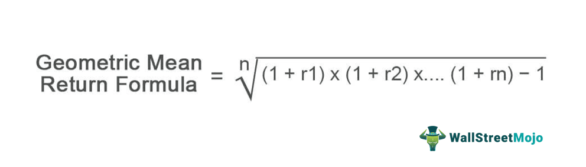

In the rapidly evolving landscape of financial investments, understanding the synergy between financial metrics, investment analysis, mean return, and algorithmic trading is vital. The integration of these components has transformed how modern investors and traders approach the market, enabling more sophisticated and informed decision-making processes.

Financial metrics serve as indispensable tools in assessing the performance and risk of various investment vehicles. By applying metrics such as the Sharpe Ratio, Maximum Drawdown, and Profit Factor, investors can gain detailed insights into risk-adjusted returns and potential volatility. These metrics go beyond basic valuation techniques, allowing for strategic asset allocation within portfolios that align with individual risk tolerances.

Mean return, often referred to as the expected return, offers a crystal ball into the average profit or loss to be anticipated from an investment portfolio. Calculations using geometric mean or probability distributions provide investors with estimates of potential portfolio performance. However, it's important to understand that mean returns are predictive rather than guaranteed. This necessitates careful interpretation to gauge risk versus reward effectively.

Algorithmic trading is another critical facet in modern investment strategy, utilizing sophisticated algorithms to execute trades based on predefined criteria. This form of trading encompasses various strategies such as trend following, statistical arbitrage, and high-frequency trading. Evaluating the performance of these strategies often requires specific metrics like the Sharpe Ratio and Win Rate, ensuring alignment with market conditions and investment goals.

The interplay of financial metrics with algorithmic trading creates a robust framework for assessing strategy viability. By employing performance metrics to evaluate trading algorithms, traders can optimize their strategies, ensuring they remain effective and adaptable to the dynamic nature of global markets. This confluence of data-driven insights and automated trading strategies exemplifies the evolution of trading in the digital age.

Overall, the interconnectedness of financial metrics, mean return, and algorithmic trading forms the foundation for a comprehensive approach to developing successful trading and investment strategies. Understanding these elements is crucial for navigating the complexities of modern financial markets and achieving desired investment outcomes.

## Table of Contents

## Understanding Financial Metrics in Investment Analysis

Financial metrics play a pivotal role in assessing the performance and potential of investment opportunities. They provide quantifiable data that help investors make informed decisions by analyzing risk, return, and asset allocation needs. Among these metrics, the Sharpe Ratio, Maximum Drawdown, and Profit Factor are foundational in unveiling insights about risk-adjusted returns and potential drawdowns of investments.

The Sharpe Ratio is a widely recognized metric that measures the return of an investment compared to its risk. It is defined as:

$$
\text{Sharpe Ratio} = \frac{R_p - R_f}{\sigma_p}
$$

where $R_p$ is the portfolio return, $R_f$ is the risk-free rate, and $\sigma_p$ is the standard deviation of the portfolio’s excess return. This ratio provides insights into how much excess return an investor can expect for a given level of risk, assisting in the evaluation of investment strategies.

Maximum Drawdown is another critical metric, representing the largest peak-to-trough decline in the value of an investment portfolio before it recovers to a new peak. It is used to assess the risk of a given investment, reflecting the potential for significant losses during downturns. The smaller the drawdown, the better the risk profile of the investment.

The Profit Factor is an essential measure of profitability in trading and investment analysis. It is calculated by dividing the sum of all winning trades by the sum of all losing trades. A Profit Factor above 1 indicates that the strategy is profitable, while a value below 1 suggests a losing strategy.

These metrics serve purposes beyond mere valuation. They are instrumental in the strategic allocation of assets within a portfolio. By evaluating potential returns and identifying associated risks, investors can align their strategies with their risk tolerance levels. This alignment is crucial for enhancing the probability of meeting investment objectives.

Incorporating these financial metrics into investment analysis leads to a more comprehensive understanding of the potential gains and risks involved. This systematic approach not only empowers investors to make smarter decisions but also helps optimize asset allocation based on individual risk profiles. Aligning financial metrics with an investor’s risk tolerance enhances the likelihood of achieving desired financial outcomes, supporting strategic, well-informed decisions in investment practices. 

By systematically applying these metrics, investors can adopt a data-driven approach to evaluate and manage their portfolios, guiding them toward achieving their financial goals.

## The Concept of Mean Return and Its Calculations

Mean return, also known as expected return, is a key concept in investment analysis that represents the average profit or loss anticipated from an investment portfolio. It serves as a foundational metric to gauge the potential performance of financial investments over a period of time. Several methods are used to calculate mean returns, each offering different insights into the portfolio's potential outcomes.

One common method is the arithmetic mean, which is the simple average of a set of returns over a specified period. The arithmetic mean is calculated using the formula:

$$
\text{Arithmetic Mean} = \frac{\sum_{i=1}^n R_i}{n}
$$

where $R_i$ is the return in each period and $n$ is the total number of periods.

However, a more nuanced method often employed in finance is the geometric mean, which accounts for the compounding effect of returns over multiple periods. The geometric mean is particularly useful in understanding investment returns over time, as it provides a more accurate picture by considering the [volatility](/wiki/volatility-trading-strategies) in returns. The geometric mean is calculated as follows:

$$
\text{Geometric Mean} = \left( \prod_{i=1}^n (1 + R_i) \right)^{\frac{1}{n}} - 1
$$

The use of probability distributions is another approach to estimate mean returns, particularly when dealing with uncertain or variable future market conditions. By assigning probabilities to different potential outcomes, investors can compute an expected average return. This probabilistic model can aid in understanding the range and likelihood of possible return scenarios.

While mean return serves as an important estimate of portfolio performance, it is crucial to remember that it is one part of a broader investment analysis framework. It does not account for the risk or variability of returns, underscoring the necessity for incorporating additional financial metrics such as standard deviation or variance when evaluating investments. These metrics help quantify the risk associated with an investment, offering a more comprehensive risk-versus-reward analysis.

Moreover, investors should interpret mean returns with caution. Since they are predictive in nature, mean returns are not guaranteed outcomes. Therefore, it is essential for investors to consider them within the context of broader market conditions and personal investment objectives. By recognizing the inherent assumptions and limitations of mean return calculations, investors can better navigate the complexity of the financial markets and enhance their decision-making processes.

## Algorithmic Trading: Strategies and Performance Metrics

Algorithmic trading has become a pivotal aspect of modern financial markets, leveraging sophisticated algorithms to execute trades efficiently based on predefined criteria. This method of trading not only streamlines the trading process but also enhances precision and speed, which are critical in today's fast-paced markets.

**Strategies in Algorithmic Trading**

Several strategies are employed within [algorithmic trading](/wiki/algorithmic-trading), each with its unique approach and objectives:

1. **Trend Following**: This strategy capitalizes on market momentum by analyzing historical data to identify and follow prevailing price trends. The algorithm generates buy or sell signals when it detects the start of a new trend, thereby attempting to profit from sustained market movements.

2. **Statistical Arbitrage**: Also known as stat arb, this strategy relies on statistical models to identify price discrepancies between multiple securities. By exploiting these inefficiencies, the algorithm aims to execute simultaneous buy and sell orders to capture profit from the correction of the price divergence.

3. **High-Frequency Trading (HFT)**: HFT strategies involve executing a large number of trades at extremely high speeds. These algorithms aim to profit from small price differentials, often holding positions for mere seconds. The success of HFT relies on advanced technology and low-latency access to market data.

**Performance Metrics for Evaluation**

To assess the effectiveness of algorithmic trading strategies, specific performance metrics are crucial:

- **Sharpe Ratio**: This metric evaluates the risk-adjusted return of an investment, calculated as the ratio of excess return (return above the risk-free rate) to the standard deviation of returns. It provides insight into the reward per unit of risk.
$$
  \text{Sharpe Ratio} = \frac{E[R_p - R_f]}{\sigma_p}

$$

  Where $E[R_p]$ is the expected portfolio return, $R_f$ is the risk-free rate, and $\sigma_p$ is the standard deviation of the portfolio return.

- **Win Rate**: This metric indicates the percentage of successful trades out of the total number of trades executed. A higher win rate suggests a more consistently profitable strategy.
$$
  \text{Win Rate} = \frac{\text{Number of Winning Trades}}{\text{Total Number of Trades}} \times 100\%

$$

- **Average Trade Size**: This metric measures the average monetary value of trades executed by the algorithm. It helps in understanding the scale and impact of trades on the market.

Understanding these performance metrics allows investors and traders to adapt their strategies to better align with prevailing market conditions and investment objectives.

**Opportunities and Challenges**

As algorithmic trading continues to progress, it offers significant opportunities for enhanced market efficiency and profitability. However, it also presents challenges, such as market impact, regulatory scrutiny, and technological dependency. Consequently, traders and algorithm developers must continuously refine their strategies to mitigate risks and capitalize on ever-evolving market dynamics.

To maintain competitiveness, continuous evaluation and recalibration of algorithmic strategies are essential. By integrating robust performance metrics and adaptable strategies, algorithmic trading can lead to more effective decision-making and optimized financial outcomes.

## Integrating Financial Metrics and Algorithmic Trading

The integration of financial metrics into algorithmic trading provides a robust framework for assessing the effectiveness and viability of trading strategies. By leveraging quantitative measures, traders can gain insights into the performance of their algorithms, enabling them to make data-driven decisions and optimize their trading approaches.

One of the key financial metrics used in evaluating algorithmic trading strategies is the Sharpe Ratio. This ratio is a measure of the risk-adjusted return of an investment portfolio. It is calculated as the difference between the portfolio’s return and the risk-free rate, divided by the portfolio’s standard deviation:

$$
\text{Sharpe Ratio} = \frac{R_p - R_f}{\sigma_p}
$$

Where $R_p$ is the portfolio return, $R_f$ is the risk-free rate, and $\sigma_p$ is the standard deviation of the portfolio returns. A higher Sharpe Ratio indicates a more favorable risk-adjusted performance.

Financial metrics such as the Sharpe Ratio not only help in evaluating the historical performance of trading algorithms but also assist traders in determining how well these algorithms can adapt to different market conditions. This adaptability is critical in an ever-changing financial landscape where the dynamics of markets require continuous evaluation and readjustment of trading strategies.

By incorporating these metrics, traders can make informed decisions to optimize their algorithms. For example, they can adjust risk parameters to improve the Sharpe Ratio, increase profitability, or rebalance their portfolios to minimize potential drawdowns. These strategic adjustments are pivotal in enhancing the overall effectiveness of algorithmic trading systems.

Moreover, the integration of financial metrics extends beyond just optimizing existing strategies. It involves the proactive development of new algorithms that are inherently more robust and aligned with the trader’s risk tolerance and investment objectives. As markets become more complex, the ability to dynamically adjust trading strategies based on real-time data and performance feedback becomes crucial.

Financial metrics also play a pivotal role in managing risks more effectively. By continuously monitoring metrics such as the maximum drawdown and profit [factor](/wiki/factor-investing), traders can identify potential risks early and make the necessary adjustments to mitigate them. This proactive risk management approach helps in safeguarding investments against unforeseen market events.

Through the holistic combination of financial metrics and algorithmic trading, traders are better equipped to enhance profitability while managing risks effectively. Consequently, they can maintain a competitive edge in the fast-paced financial markets, ensuring that their trading strategies remain viable and successful over the long term.

## Conclusion: Navigating Financial Success

Comprehending financial metrics, mean return, and algorithmic trading is indispensable for modern investors striving for success. These components form the backbone of an informed investment strategy, each playing a complementary role in navigating the complexities of financial markets.

The mean return serves as a basic indicator of potential portfolio earnings, providing investors with an estimate of the expected performance. However, this metric is inherently predictive and does not account for the variability and risk inherent in market investments. Therefore, relying solely on mean return calculations can lead to overly optimistic expectations, emphasizing the need for a more comprehensive analysis.

Financial metrics such as the Sharpe Ratio, Maximum Drawdown, and Profit Factor furnish a deeper and more nuanced understanding of the balance between risk and reward. These metrics allow investors to evaluate the risk-adjusted returns of a portfolio, identifying strategies that are not only profitable but also aligned with their risk tolerance. By incorporating these metrics, investors can make more informed decisions that optimize the strategic allocation of assets and enhance the probability of achieving their financial goals.

Algorithmic trading, enhanced by data-driven insights, offers a powerful tool for executing trades with increased efficiency and precision. Through the use of sophisticated algorithms, investors can implement strategies that respond dynamically to market conditions, from [trend following](/wiki/trend-following) to statistical [arbitrage](/wiki/arbitrage) and high-frequency trading. The performance of these algorithms must be continually assessed using key metrics to ensure alignment with market conditions and investment goals. Such strategies require ongoing refinement to adapt to the ever-shifting financial landscape.

In a rapidly evolving financial environment, staying informed and adaptable is crucial to maintaining a competitive edge. The integration of financial metrics, mean return analysis, and algorithmic trading equips investors with a robust framework for navigating this complex landscape. By leveraging these tools effectively, investors can enhance their decision-making processes and drive the pursuit of their financial objectives toward success.

## References & Further Reading

[1]: Bergstra, J., Bardenet, R., Bengio, Y., & Kégl, B. (2011). ["Algorithms for Hyper-Parameter Optimization."](https://dl.acm.org/doi/10.5555/2986459.2986743) Advances in Neural Information Processing Systems 24.

[2]: ["Advances in Financial Machine Learning"](https://www.amazon.com/Advances-Financial-Machine-Learning-Marcos/dp/1119482089) by Marcos Lopez de Prado

[3]: ["Evidence-Based Technical Analysis: Applying the Scientific Method and Statistical Inference to Trading Signals"](https://www.amazon.com/Evidence-Based-Technical-Analysis-Scientific-Statistical/dp/0470008741) by David Aronson

[4]: ["Machine Learning for Algorithmic Trading"](https://github.com/stefan-jansen/machine-learning-for-trading) by Stefan Jansen

[5]: ["Quantitative Trading: How to Build Your Own Algorithmic Trading Business"](https://github.com/LucindaYa/quant-resources/blob/master/Quantitative%20Trading%20How%20to%20Build%20Your%20Own%20Algorithmic%20Trading%20Business.pdf) by Ernest P. Chan