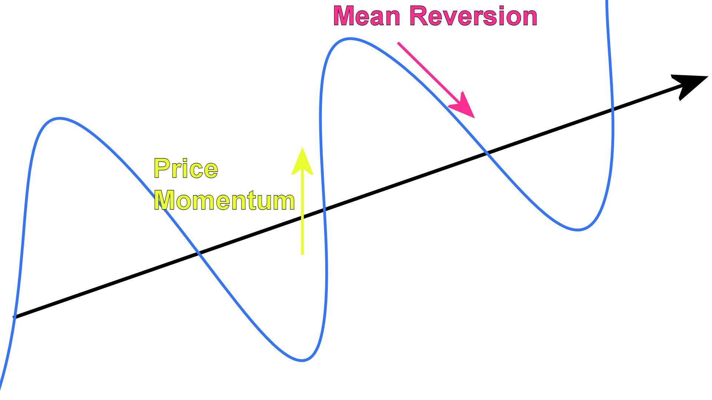

Mean reversion is a widely recognized concept in algorithmic trading, based on the idea that asset prices have a tendency to revert to their historical average over time. This tendency is leveraged by traders to devise strategies that capitalize on the predictable nature of price fluctuations. By identifying deviations from the mean, traders can potentially exploit the mispricing of assets, engaging in trades that assume prices will correct themselves.

This article will cover the fundamentals of mean reversion strategies and their applicability across various financial markets. The mechanics of mean reversion revolve around understanding the statistical properties of asset prices, which often exhibit cycles where they oscillate above and below a mean value. Mean reversion capitalizes on these cycles by identifying when prices have strayed too far from their average and are likely to return. A core principle behind this approach is the belief that extreme price movements are temporary and that prices will ultimately stabilize, benefiting traders who position themselves correctly.



The use of technical indicators is central to mean reversion trading. Indicators like the Relative Strength Index (RSI), Bollinger Bands, and Moving Averages serve as tools to assess when prices have moved away from their mean and may indicate potential reversion points. These tools help traders strategize entry and exit points, thus maximizing the opportunity for profit while minimizing risk.

In crafting a robust mean reversion strategy, traders must consider key elements such as asset selection, timeframes, entry and exit criteria, and risk management. The effectiveness of mean reversion strategies depends on a trader's ability to consistently apply these principles in dynamic market conditions, adapting to changes and using historical data to inform their decisions.

Understanding mean reversion provides traders with a statistical advantage, allowing them to capitalize on systematic price patterns. This knowledge can be applied not only to stock markets but also to commodities, forex, and other financial markets, each presenting unique opportunities for implementing mean reversion strategies. The article will offer both new and experienced traders actionable insights to enhance their trading performance through the strategic application of mean reversion techniques.

## Table of Contents

## Understanding Mean Reversion

Mean reversion is a prominent financial theory suggesting that asset prices tend to return to their long-term mean or average level over time. This concept arises from the natural statistical properties observed in asset prices across various financial instruments, reflecting a tendency for prices to fluctuate around a stable equilibrium level. The principle implies that when an asset's price significantly deviates from its historical average, it eventually moves back towards that average, creating potential trading opportunities.

Traders leverage mean reversion to identify potential price corrections, offering them the chance to buy low when prices are below the mean or sell high when they exceed it. This approach is grounded in the understanding that prices oscillate within a range, and such deviations from the mean are typically temporary. Identifying these deviations is crucial for executing a mean reversion strategy. For instance, a price far from the mean might indicate an overbought or oversold condition, which could precede a reversal.

The effectiveness of mean reversion strategies is often influenced by understanding the factors causing prices to deviate from the mean. Market overreactions, driven by excess buying or selling, can push prices away from the average. Moreover, external factors such as economic news, geopolitical events, and changes in market sentiment might also lead to significant price shifts. Recognizing these situations enables traders to anticipate potential reversions more effectively.

Statistical measures are often employed to quantify and identify mean reversion opportunities. Mathematically, the presence of mean reversion in a time series $X_t$ can be evaluated using the autocorrelation function or partial autocorrelation function. In Python, one might use the library `statsmodels` to analyze such patterns:

```python
import pandas as pd
from statsmodels.tsa.stattools import adfuller

# Example time series data
data = pd.Series([...])  # Replace with asset prices

# Performing Augmented Dickey-Fuller test
result = adfuller(data)

# Interpreting ADF test
print('ADF Statistic:', result[0])
print('p-value:', result[1])
```

A lower p-value in the Augmented Dickey-Fuller test indicates that mean reversion may be present, as it suggests the time series is stationary. Ultimately, mean reversion provides traders with a statistical edge, allowing them to capitalize systematically on predictable price patterns in various financial markets.

## Key Indicators for Mean Reversion

Indicators play an essential role in identifying mean reversion opportunities in financial markets. They provide traders with the tools needed to detect potential price deviations and reversals. Among the most popular indicators used in mean reversion strategies are the Relative Strength Index (RSI), Bollinger Bands, and Moving Averages.

### Relative Strength Index (RSI)

The Relative Strength Index (RSI) is a [momentum](/wiki/momentum) oscillator that measures the speed and change of price movements. Typically calculated over a 14-day period, the RSI oscillates between 0 and 100. It helps in identifying overbought or oversold conditions in the market. 

The formula for RSI is:

$$
\text{RSI} = 100 - \left(\frac{100}{1 + RS}\right)
$$

where $RS$ (Relative Strength) is the average of x days' up closes divided by the average of x days' down closes. A traditional interpretation of the RSI indicates that values above 70 may signify that an asset is overbought, while values below 30 suggest it may be oversold. These extremes can signal potential price reversions, making RSI a valuable tool for traders seeking to exploit mean reversion.

### Bollinger Bands

Bollinger Bands consist of a middle band (a simple moving average) and two outer bands, which represent standard deviations away from the moving average. The typical settings use a 20-day moving average with bands drawn at two standard deviations above and below this average. The formula for Bollinger Bands is:

- Middle Band: $MA = \frac{P_1 + P_2 + \ldots + P_n}{n}$
- Upper Band: $UB = MA + (K \times \sigma)$
- Lower Band: $LB = MA - (K \times \sigma)$

where $MA$ is the moving average, $\sigma$ is the standard deviation, and $K$ is a factor typically set at 2. When asset prices touch or move beyond the bands, it may indicate a reversion opportunity, as prices often revert to the mean represented by the middle band.

### Moving Averages

Moving averages are among the simplest yet most effective mean reversion indicators. They provide a dynamic reference point for the mean value of an asset's price over a specific period. Common types of moving averages include the Simple Moving Average (SMA) and the Exponential Moving Average (EMA).

The formula for a simple moving average (SMA) is:

$$
\text{SMA}_n = \frac{P_1 + P_2 + \ldots + P_n}{n}
$$

For an exponential moving average (EMA), the calculation involves more weight on recent prices:

$$
\text{EMA}_t = P_t \times \frac{2}{n+1} + \text{EMA}_{t-1} \times \left(1-\frac{2}{n+1}\right)
$$

where $P_t$ is the current price, and $n$ is the number of periods. A significant deviation from the moving average signals potential trading opportunities where prices are likely to revert towards the mean. Traders often look for crossovers, where short-term averages converge with long-term averages, as key trading signals.

In conclusion, indicators like RSI, Bollinger Bands, and Moving Averages enhance the efficacy of mean reversion strategies by providing quantifiable signals to identify potential reversions. Understanding and applying these indicators allows traders to exploit statistical patterns in price movements effectively.

## Crafting a Mean Reversion Strategy

A successful mean reversion strategy requires careful selection of assets and timeframes, along with clear trading criteria and robust risk management practices. To identify profitable mean reversion opportunities, traders should prioritize assets that exhibit consistent trading ranges with ample historical price data. This ensures that the statistical assumptions underlying mean reversion are more likely to hold.

One of the key steps in crafting a mean reversion strategy is to use statistical tools and indicators that help identify points where prices deviate significantly from their mean. Commonly used indicators include the Z-score, which measures the number of standard deviations a current price is from the mean. The formula for Z-score is:

$$
Z = \frac{(X - \mu)}{\sigma}
$$

where $X$ is the current price, $\mu$ is the mean of the historical prices, and $\sigma$ is the standard deviation of those prices. A high absolute Z-score can indicate that a price is unusually high or low compared to its historical average, signaling a potential mean reversion opportunity.

Another critical component of a mean reversion strategy is the establishment of clear [exit](/wiki/exit-strategy) criteria. As prices trend back toward their mean, traders should execute exit strategies to realize profits before market conditions shift. The mean can be a dynamic or static level, often set by moving averages. Using a Trailing Stop approach can also be effective, where the stop-loss level is continuously adjusted as the price changes favorably toward the mean.

Risk management forms the backbone of any successful trading strategy, especially mean reversion. Implementing stop-loss orders is crucial to limit potential losses if the asset fails to revert to the mean. Effective position sizing is another essential element, where the size of each trade is determined based on the level of risk the trader is willing to accept. The Kelly Criterion is a well-known formula used to calculate optimal position sizes:

$$
f^* = \frac{bp - q}{b}
$$

In this equation, $f^*$ represents the fraction of the trading capital to place in each trade, $b$ stands for the odds received from a trade (the amount won per unit bet), $p$ is the probability of winning the trade, and $q$ is the probability of losing the trade.

By combining these elements—carefully chosen assets, precise entry and exit strategies, and meticulous risk management—traders can effectively construct mean reversion strategies that capitalize on predictable price dynamics, enhancing their potential for success in various market conditions.

## Applying Mean Reversion in Various Markets

Mean reversion strategies are versatile and applicable across different financial markets, demonstrating their flexibility and potential for profit. Each market presents unique characteristics that traders can exploit using mean reversion principles.

In stock markets, mean reversion can be effectively applied to both individual stocks and stock indices. Traders often leverage periods of price consolidation—times when prices oscillate in a narrow range without a clear trend. During these periods, mean reversion strategies aim to capitalize on the oscillations around a central value. For instance, if a stock deviates significantly from its historical average price, traders might anticipate a reversal back towards this mean, executing trades that assume this reversion will occur. Using historical price data and identifying stocks with well-defined trading ranges are critical for the successful implementation of these strategies.

In the commodity markets, mean reversion strategies can be used to navigate the cyclical price patterns that are often influenced by underlying supply and demand dynamics. Commodities such as oil, gold, and agricultural products exhibit cyclical patterns due to factors like seasonality, geopolitical events, and production changes. By identifying these cycles and the average prices commodities tend to revert to, traders can make informed decisions—buying when prices are below the mean and selling when they exceed it. The key is to recognize when these cycles are likely to lead to a reversion to the mean, providing trading opportunities.

Forex markets present another opportunity for the application of mean reversion strategies, particularly during periods of low [volatility](/wiki/volatility-trading-strategies). In such environments, currency pairs may exhibit mean-reverting behavior, oscillating around a stable exchange rate. Traders can capture small, consistent gains by identifying the mean levels to which currency pairs are likely to revert. Employing indicators like the Relative Strength Index (RSI) or Bollinger Bands can help identify overbought or oversold conditions, suggesting imminent mean reversion. The choice of currency pairs and the timing of trades are crucial factors determining the strategy's success in [forex](/wiki/forex-system) markets.

Overall, the success of mean reversion strategies hinges on market selection and adaptability to changing conditions. Traders must continuously assess market environments, ensuring their strategies are responsive to new trends or shifts. By doing so, they can exploit predictable price behaviors while mitigating risks associated with unexpected market movements.

## References & Further Reading

[1]: Poterba, J. M., & Summers, L. H. (1988). ["Mean Reversion in Stock Prices: Evidence and Implications."](https://www.sciencedirect.com/science/article/abs/pii/0304405X88900219) Journal of Financial Economics, 22(1), 27-59.

[2]: Lo, A. W., & MacKinlay, A. C. (1988). ["Stock Market Prices Do Not Follow Random Walks: Evidence from a Simple Specification Test."](https://www.nber.org/papers/w2168) The Review of Financial Studies, 1(1), 41-66.

[3]: Montier, J. (2007). ["Behavioural Investing: A Practitioner's Guide to Applying Behavioural Finance."](https://onlinelibrary.wiley.com/doi/book/10.1002/9781118673430) John Wiley & Sons.

[4]: Keltner, C. (1960). ["How to Make Money in Commodities."](https://www.amazon.com/Make-Money-Commodities-Chester-Keltner/dp/B000KU0XK2) Prentice-Hall.

[5]: Fama, E. F., & French, K. R. (1988). ["Permanent and Temporary Components of Stock Prices."](https://www.jstor.org/stable/1833108) Journal of Political Economy, 96(2), 246-273.

[6]: Chan, E. (2009). ["Quantitative Trading: How to Build Your Own Algorithmic Trading Business."](https://github.com/ftvision/quant_trading_echan_book) Wiley.