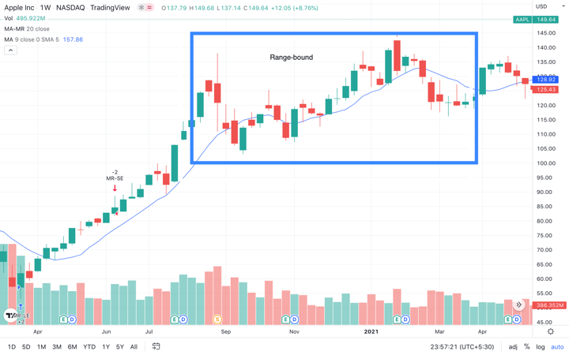
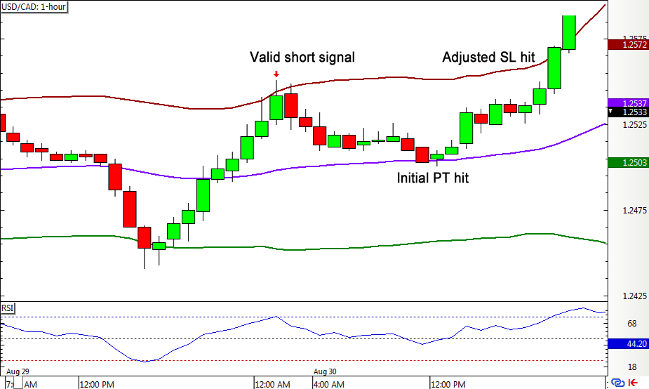
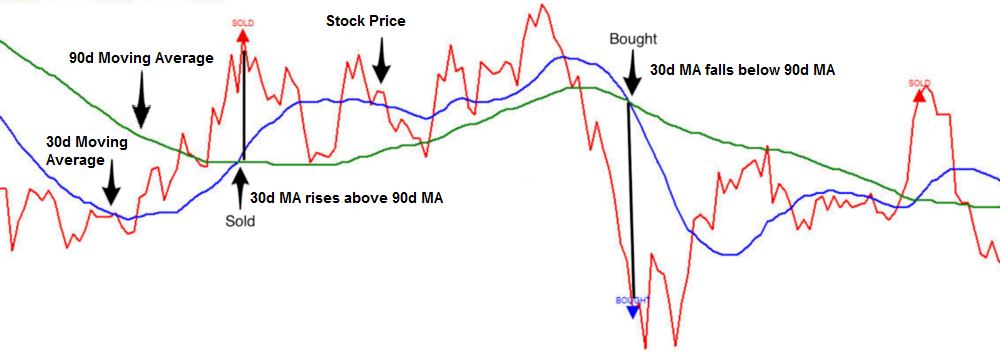

## Table of Contents


## What is Mean Reversion Trading Strategy?

Mean reversion is a financial theory centered on the concept that asset prices and historical returns eventually return to their long-term mean or average level. This principle posits that excessive rises or dips in price or performance are temporary and will reverse over time, bringing the price back towards its average. Mean reversion assumes that asset prices oscillate around a historical average or mean and that these fluctuations are predictable due to fundamental and psychological forces.

**Asset Prices and Historical Averages**

Asset prices are influenced by a variety of factors, including market news, investor sentiment, and economic indicators. According to the mean reversion hypothesis, prices may temporarily diverge from their historical average (due to these short-term influences) but will eventually revert. The fluctuations around this mean can be visualized through time series data, where the prices show a tendency to oscillate around the mean value over the long term.

Mathematically, this can be expressed using a simple formula:

$$
P_{t} = \mu + \epsilon_{t}
$$

where $P_{t}$ is the asset price at time $t$, $\mu$ is the long-term mean of the price, and $\epsilon_{t}$ represents the short-term deviations from the mean, assumed to be normally distributed.

**Equilibrium in Financial Markets**

The concept of market equilibrium is closely linked to mean reversion. Financial markets are constantly seeking equilibrium, a state where supply and demand are balanced. In theory, when asset prices deviate from their equilibrium level (or mean), market forces work to correct this imbalance. Overvalued assets will see a price decrease, while undervalued assets are likely to experience a price rise as market participants make trades in expectation of these adjustments.

This equilibrium-seeking behavior fortifies the mean reversion assumption, suggesting that this natural correction process is integral to market dynamics.

**Asset Classes Exhibiting Mean Reversion**

Different asset classes demonstrate varying degrees of mean reversion tendencies. Commonly, fixed-income securities, such as bonds, are more likely to revert to mean because they are closely tied to interest rates, which also tend to normalize over time. Commodities often display mean reversion due to supply-demand dynamics and production cycles influencing their prices.

Equities, on the other hand, may exhibit less pronounced mean reversion characteristics due to the influence of diverse factors like corporate earnings, innovation, and market sentiment, which can introduce lasting changes in their valuation.

For instance, equity indices might reflect mean reversion over very long periods due to economic cycles, but individual stocks are more prone to be affected by company-specific news, which can deviate prices from their historical averages for prolonged durations.

Understanding these tendencies involves analyzing historical price data and employing statistical tools to measure deviation from the mean. This examination helps in assessing the potential for future mean reversion, forming the basis for strategies that harness these tendencies within various asset classes.

## How does Mean Reversion differ from other trading strategies?

Mean Reversion Trading stands out from other strategies because it’s built on the idea that prices, volatility, or other market metrics tend to snap back to their historical average over time, rather than chasing trends or betting on big directional moves. It’s less about riding momentum and more about catching the rubber band when it’s stretched too far.

Take momentum trading, for instance. Momentum traders jump on a stock that’s surging, hoping it keeps climbing—think Tesla during a hype wave. Mean Reversion traders do the opposite: if Tesla’s price spikes way above its typical range, they’d short it, expecting it to drop back to “normal.” It’s contrarian by nature.

Then there’s trend-following, where you buy as prices break out and ride the wave, like with moving average crossovers. Mean Reversion flips that—it assumes breakouts fizzle and prices revert, so you’d fade the [breakout](/wiki/breakout-trading) instead of chasing it.

Compared to [arbitrage](/wiki/arbitrage) strategies—like Dispersion Trading, which exploits volatility spreads—Mean Reversion is simpler in focus. It doesn’t need complex multi-asset setups; it just bets on a single asset’s price or metric (like a stock or pair) returning to its mean. Dispersion’s about relationships; Mean Reversion’s about reversion to a baseline.

Even value investing shares some DNA—buying undervalued assets—but Mean Reversion is shorter-term and less about fundamentals. It’s not waiting years for a company’s worth to shine; it’s banking on a quick snapback, often in days or weeks.

## What are the core principles behind Mean Reversion Trading?

Mean reversion trading is a strategy rooted in the idea that prices, or other financial metrics, tend to move back toward their historical average or "mean" over time. It’s based on the assumption that extreme movements—whether up or down—are temporary and that markets have a natural tendency to stabilize. Traders using this approach look for opportunities where an asset’s price has deviated significantly from its norm, betting it’ll eventually snap back.

The core principles boil down to a few key ideas. First, there’s the concept of statistical equilibrium: prices oscillate around a central value—like a moving average or a baseline derived from past data—and extreme deviations are seen as outliers that won’t last. Second, it leans on the belief that markets are driven by human behavior, which often overreacts to news or events, pushing prices too far before cooler heads prevail. Third, it’s about timing—identifying when an asset is overbought or oversold, often using tools like Bollinger Bands, RSI (Relative Strength Index), or standard deviation metrics to gauge those extremes.

For example, if a stock’s been on a tear and is trading two standard deviations above its 50-day moving average, a mean reversion trader might short it, expecting a pullback. Conversely, if it’s tanked well below that mean, they might go long, anticipating a bounce. The strategy thrives on volatility but assumes the asset doesn’t fundamentally break from its historical pattern—say, due to a bankruptcy or a game-changing innovation.

It’s not foolproof, though. Markets can stay irrational longer than you can stay solvent, as the saying goes, and trends can persist, defying the mean for extended periods. Risk management—like tight stop-losses—is critical because the "reversion" isn’t guaranteed to happen when you want it to. Still, the principle’s allure is its simplicity: what goes up too far, or down too much, tends to come back to earth—eventually.

## What types of assets are best suited for Mean Reversion Trading?

Mean reversion trading works best with assets that have a tendency to fluctuate around a stable average rather than trending relentlessly in one direction. The strategy thrives on predictability and cyclicality, so certain asset classes and characteristics make them more suitable than others.

Stocks are a prime candidate, especially large-cap ones with established histories. These tend to have well-defined trading ranges and revert to their mean after overreactions to earnings, news, or market sentiment. Think blue-chip companies—less prone to wild structural shifts compared to, say, speculative small-caps or penny stocks, where fundamentals can collapse or skyrocket unpredictably. ETFs tracking broad indices, like the S&P 500, can also fit, though their lower volatility might shrink profit potential.

Currencies in [forex](/wiki/forex-system) markets are another good match. Exchange rates often oscillate within ranges, especially for major pairs like EUR/USD or USD/JPY, where central bank policies and economic data create temporary distortions that eventually correct. High [liquidity](/wiki/liquidity-risk-premium) and tight spreads in forex also help, making it easier to execute trades without slippage eating into returns.

Commodities can work, but it’s trickier. Stuff like oil, gold, or agricultural goods can revert to a mean tied to supply-demand balances or production costs, but they’re also vulnerable to prolonged trends from geopolitical shocks or weather events. Mean reversion shines more with commodities that have stable fundamentals—like industrial metals—over speculative ones prone to bubbles or busts.

Bonds or [interest rate](/wiki/interest-rate-trading-strategies) products (like Treasury futures) can suit the strategy too, especially when yields deviate from long-term averages due to market panic or euphoria. Their mean-reverting nature often ties to macroeconomic cycles, though you’d need to watch for shifts in monetary policy that could break the pattern.

The best assets share a few traits: high liquidity (to get in and out easily), enough volatility (to create exploitable deviations), and a history of stability (so the mean isn’t a moving target). Assets to avoid? Hyper-[growth stocks](/wiki/growth-stocks), cryptocurrencies like Bitcoin, or anything with low [volume](/wiki/volume-trading-strategy)—those can trend indefinitely or lack the data to establish a reliable mean. Context matters too; a stock might revert in a calm market but not during a sector-wide disruption. Pick assets where the pendulum swings, not where it’s stuck or broken.

## How do traders identify mean-reverting opportunities?

Traders spot mean-reverting opportunities by looking for price deviations from a central tendency—usually a historical average—that signal an asset’s gone too far, too fast. It’s about catching the rubber band before it snaps back. Here’s how they do it, step by step.

First, they define the “mean.” Most use a moving average—simple (SMA) or exponential (EMA)—over a set period, like 20, 50, or 200 days, depending on their trading horizon. A 50-day SMA might show a stock’s baseline price; if it’s $100 and the stock’s at $110, that’s a potential clue. The choice of lookback period matters—shorter for quick trades, longer for bigger swings.

Next, they measure how far prices stray. Common yardsticks are standard deviations (via Bollinger Bands) or percentage moves. If a stock’s two standard deviations above its mean—say, $115 when the upper band’s at $112—it’s stretched. Tools like RSI (Relative Strength Index) pitch in here too: above 70 means overbought, below 30 oversold. The idea’s to quantify “extreme” based on past behavior.

Volume’s a telltale. A price spike on low volume might scream reversion—weak conviction behind the move. But if it’s high volume, like a breakout or panic sell-off, the mean might be shifting, not reverting. Traders cross-check with Average True Range (ATR) to see if the move’s outsized for the asset’s normal volatility.

Patterns matter. Candlestick setups—like a doji or hammer after a big run—hint at exhaustion, suggesting a turn. Momentum indicators, like MACD or Stochastic Oscillator, can confirm: slowing momentum at an extreme price often flags a reversal. For example, if RSI hits 80 and starts curling down, that’s a green light.

Context is king. Traders scan market conditions—sideways chop favors reversion, trends kill it. They’ll check correlations too; if a stock’s up 10% while its sector’s flat, it’s more likely to revert than if the whole industry’s rallying. News or events (earnings, Fed moves) get weighed—temporary overreactions are gold, structural shifts are poison.

Some go statistical. They calculate z-scores—(price - mean) / standard deviation—to rank deviations objectively. A z-score above 2 or below -2 might trigger a trade. Pairs traders take this further, tracking spreads between correlated assets (e.g., two oil stocks) and pouncing when the gap yawns wide.

Screeners automate the hunt. Tools like TradingView or Finviz let traders filter for stocks gapping 5% from their 50-day SMA or hitting RSI extremes, narrowing the field. Algo traders code custom scans—say, “price > 1.5x ATR above 20-day EMA”—to flag setups in real time.

Timing’s the last piece. They wait for confirmation—a price drop after hitting the upper Bollinger Band, or a volume fade on an oversold bounce. Jumping the gun risks catching a trend instead of a reversion.

It’s part art, part science: pick a baseline, measure the stretch, read the market’s mood, and pounce when the odds tilt. The best traders backtest their signals to know what sticks—because not every outlier comes home.

## What role does statistical analysis play in Mean Reversion Trading?

Statistical analysis is the backbone of mean reversion trading—it’s what turns a hunch about prices “coming back” into a concrete, repeatable strategy. It gives traders the tools to define the mean, measure deviations, assess likelihoods, and manage risk, all grounded in numbers rather than guesswork.

At its core, it starts with establishing the “mean” itself. Traders use stats to calculate a central tendency—typically a moving average (like a 50-day SMA) or a weighted version (EMA)—based on historical price data. This isn’t just an arbitrary line; it’s the statistical anchor that prices are expected to revert to, derived from the asset’s past behavior over a chosen lookback period.

Then comes measuring how far prices stray. Standard deviation is the workhorse here. It quantifies volatility—how much prices typically fluctuate around the mean. If a stock’s average price is $100 with a $5 standard deviation, a move to $110 (two standard deviations) flags an outlier. Bollinger Bands lean on this, plotting bands at, say, two standard deviations above and below the mean, giving a visual cue for when prices are stretched.

Probability ties it together. Statistical concepts like the normal distribution help traders estimate how likely a reversion is. A price three standard deviations off the mean—rarer than 99% of moves—suggests a higher chance of snapping back, assuming the asset’s behavior hasn’t fundamentally changed. Z-scores refine this: (price - mean) / standard deviation gives a standardized metric to compare deviations across assets or time frames.

Stationarity’s a big deal too. Stats tests—like the Augmented Dickey-Fuller (ADF) test—check if an asset’s price series is mean-reverting by nature. If it’s stationary (oscillates around a constant mean), the strategy’s on solid ground. Non-stationary data, like a trending stock, warns traders to steer clear or adjust their mean dynamically. Pairs traders use cointegration stats to ensure two assets’ prices move together long-term, making their spread a reliable reversion target.

Risk and sizing get a statistical boost. Variance and covariance help calculate portfolio risk—how much a trade might swing before reverting. The Kelly Criterion, rooted in probability, optimizes bet sizes based on expected edge and win rate, keeping traders from overleveraging on shaky setups. Backtesting leans on stats too—Sharpe ratios or max drawdowns quantify how a strategy holds up historically.

Time series analysis digs deeper. Autocorrelation checks if past prices predict future ones; negative autocorrelation (a rise followed by a fall) supports reversion. Advanced traders might use ARIMA models to forecast when the mean kicks in, though that’s overkill for most.

The catch? Stats assume the past predicts the future. A black swan—like a company imploding—can trash the mean, and no z-score saves you. That’s why traders pair analysis with real-time gut checks. Still, stats strip out emotion, set the odds, and frame the trade. It’s the difference between betting on a vibe and betting on a calculated edge.

## How can a beginner start experimenting with Mean Reversion Trading?

To formulate a basic mean reversion trading strategy, several methodical steps need to be undertaken. The nature of mean reversion strategies centers on the assumption that asset prices and returns tend to revert to their historical averages over time. Below are the key steps and considerations for building an effective mean reversion strategy.

**Selecting timeframes**

The choice of timeframe is crucial in a mean reversion strategy. Different timeframes capture varying market dynamics and volatility levels. Commonly used timeframes range from intraday to daily or weekly. For shorter timeframes, the mean reversion signals may be more frequent, but the noise can lead to false signals. Conversely, longer timeframes might filter out noise better but provide fewer trading opportunities. The appropriate timeframe depends on the trader's risk tolerance, capital availability, and market conditions.

**Choosing assets**

Identifying suitable assets for mean reversion is pivotal. Not all assets exhibit mean-reverting behavior; thus, it is important to select securities with a historical tendency to revert to a mean. Stocks, exchange-traded funds (ETFs), and commodities are popular choices. Market sectors known for higher volatility or cyclical behavior often provide fertile grounds for mean reversion opportunities. Historical volatility and past performance analytics should guide asset selection.

**Setting entry and exit points**

Defining clear entry and exit points underpins the effective execution of a mean reversion strategy. Entry points are typically set when an asset's price significantly deviates from its historical average, indicating a potential opportunity for reversion. Exit points should be determined by when the price approaches or crosses its mean, allowing traders to capture expected profits. Technical indicators such as moving averages, Relative Strength Index (RSI), and Bollinger Bands assist in identifying these key points.

Here's a basic Python example using moving averages to identify entry and exit points.

```python
import pandas as pd

# Sample DataFrame with price data
data = pd.DataFrame({
    'price': [100, 102, 101, 105, 107, 110, 108, 107, 103]
})

# Calculate moving averages
data['short_ma'] = data['price'].rolling(window=3).mean()
data['long_ma'] = data['price'].rolling(window=5).mean()

# Example logic for entry (buy when short MA is below long MA) and exit (sell when short MA is above long MA)
data['signal'] = 0  # 1 for buy, -1 for sell
data.loc[data['short_ma'] < data['long_ma'], 'signal'] = 1
data.loc[data['short_ma'] > data['long_ma'], 'signal'] = -1

print(data)
```

## What are the main risks associated with Mean Reversion Trading?

Mean reversion trading can be a solid strategy, but it’s not without pitfalls. The risks stem from its core assumption—prices will return to the mean—and the reality that markets don’t always play along. Here’s what can go wrong.

**Trend Persistence**: The biggest trap is a strong trend. If a stock’s in a bull run—like a tech name riding a hype wave—or a brutal sell-off—like a retailer facing bankruptcy—the mean keeps shifting. You might short at $110, expecting a drop to $100, only to watch it climb to $130. Markets can stay irrational longer than you can stay liquid, and fighting momentum burns cash fast.

**Timing Errors**: Reversion isn’t instant. A price might deviate for days, weeks, or longer before snapping back—or not at all. If you jump in too early, say buying an oversold stock at $90 expecting a bounce to $100, it could sink to $80 first. Your capital’s tied up, or worse, you’re stopped out before the turn comes. Patience is key, but mistiming kills returns.

**False Signals**: Not every extreme reverts. A stock hitting the upper Bollinger Band might look overbought, but if it’s breaking out on big news—like a takeover bid—it’s not coming back soon. Indicators like RSI or standard deviations can mislead without context. Noise in choppy markets can also trigger bad trades—too many small swings that don’t pan out.

**Volatility Spikes**: High volatility can stretch prices beyond your thresholds. In a panic—like a 2020-style crash—a stock might blow past three standard deviations and keep going. Your “safe” entry gets wrecked, and the reversion might happen at a new, lower mean you didn’t foresee. Low volatility’s a risk too—tiny moves shrink profits, and fees eat you alive.

**Regime Changes**: The mean’s only as good as the past it’s built on. A structural shift—new regulations, a competitor’s collapse, or a macro shock like a rate hike—can redefine an asset’s baseline. A commodity reverting to $50 might reset to $30 if supply floods in. Stats won’t catch that until it’s too late.

**Liquidity Traps**: Thinly traded assets (small caps, obscure pairs) can fake you out. A big order might spike the price, suggesting a deviation, but it’s just noise—not a revertible move. Low volume also means wider spreads and slippage, turning a small winner into a loser when you exit.

**Overleveraging**: The strategy’s allure—small, frequent wins—tempts traders to juice positions with margin. If a trade goes south and doesn’t revert, losses compound fast. A 2% dip you bet $1,000 on becomes a $500 hole at 5x leverage. One bad call can wipe you out.

**Psychological Strain**: Waiting for reversion tests discipline. You’re betting against the crowd, watching red ink grow as prices defy you. Panic can force early exits, or greed can keep you in too long. It’s a mental grind, especially when the data says “hold” but the chart looks grim.

**Mitigation Matters**: Stop-losses, tight position sizing (e.g., 1-2% of capital per trade), and trend filters (like a 200-day SMA check) can curb these risks. Backtesting helps too—know your asset’s quirks before you bet. But the truth is, mean reversion’s a probability game. You’ll win some, lose some, and the losses sting when the market says “not this time.” Play small, stay sharp, and respect the outliers.

## How do professionals measure success in Mean Reversion Trading?

Professionals measure success in Mean Reversion Trading by focusing on a Few key metrics that reflect the strategy's effectiveness, profitability, and risk management. Mean reversion relies on the idea that prices tend to revert to a historical average or equilibrium after deviating, so the metrics are tailored to assess how well the strategy capitalizes on this behavior. Here's how they typically approach it:

First, they look at **profitability**, often through the total return or profit [factor](/wiki/factor-investing). Total return is straightforward—how much money the strategy makes over a given period, expressed as a percentage of the starting capital. The profit factor digs a bit deeper, dividing gross profits by gross losses. A profit factor above 1 means the strategy is profitable overall, with higher values (say, 1.5 or 2) indicating a stronger edge.

Then there’s the **win rate**, which is the percentage of trades that are profitable. Mean reversion strategies don’t always need a super high win rate—50% to 60% can be solid if the average winning trade outweighs the average loser. This ties into the **risk-reward ratio**, where pros compare the average profit per winning trade to the average loss per losing trade. A ratio of 2:1, for example, means winners are twice as big as losers, which can make up for a lower win rate.

Risk management is huge, so they also track **drawdowns**—the peak-to-trough decline in account equity during a losing streak. Maximum drawdown shows the worst-case loss, and pros aim to keep this manageable, often below 10-20% of capital, depending on their risk tolerance. The **Sharpe Ratio** is another go-to—it measures return per unit of risk (standard deviation of returns). A Sharpe above 1 is decent, above 2 is excellent, showing the strategy isn’t just luck but consistent outperformance relative to volatility.

Finally, they assess **trade frequency and holding period**. Mean reversion often involves quick trades—sometimes hours or days—so they check if the number of trades and their duration align with the strategy’s logic. Too few trades might mean missed opportunities; too many could signal overtrading and higher costs from spreads or fees.

In practice, pros combine these metrics. A strategy might have a 55% win rate, a 1.8 profit factor, a 1.5:1 risk-reward, a 15% max drawdown, and a Sharpe of 1.3. They’d weigh these together to see if it’s worth running, tweaking, or scrapping. It’s less about one magic number and more about balancing profit, risk, and consistency.

## What advanced techniques can improve Mean Reversion strategies?

Improving Mean Reversion strategies involves sharpening their edge through advanced techniques that enhance entry/exit precision, adapt to market conditions, and manage risk more effectively. Professionals often go beyond basic mean reversion setups—waiting for prices to snap back to a moving average—and incorporate sophisticated tools and ideas. Here are some of the standout approaches:

One powerful technique is **incorporating volatility filters**. Mean reversion works best when prices oscillate predictably, so pros use indicators like the Average True Range (ATR) or Bollinger Band Width to gauge volatility. They might only trade when volatility is moderate—avoiding dead-calm markets (where reversion lacks momentum) or chaotic spikes (where trends might dominate). For example, they could set a rule: only enter when ATR is between 1x and 2x its 20-day average, ensuring enough movement without wild breakouts.

Another trick is **dynamic mean estimation**. Instead of a static moving average (like a 50-day SMA), they use adaptive models—think Exponential Moving Averages (EMAs) with variable lookbacks, Kalman filters, or even [machine learning](/wiki/machine-learning) to predict the "true" mean based on recent data. This adjusts to regime changes, like when a stock shifts from a tight range to a new baseline after earnings. A Kalman filter, for instance, smooths noisy price data and updates the mean in real-time, catching shifts basic averages miss.

**Pair trading or co-integration** takes it up a notch. Rather than betting on one asset reverting to its own mean, pros find two correlated assets (say, two stocks in the same sector) and trade the spread between them when it deviates from its historical norm. They use statistical tests like the Augmented Dickey-Fuller (ADF) to confirm co-integration—ensuring the spread is stationary and likely to revert. This hedges market-wide moves and isolates the reversion bet.

Timing entries with **overbought/oversold oscillators** is another go-to. The Relative Strength Index (RSI) or Stochastic Oscillator can signal when an asset’s stretched too far from its mean. Pros might wait for RSI to hit 20 (oversold) before buying, but they’ll often tweak thresholds—say, 15 or 25—based on [backtesting](/wiki/backtesting), or combine RSI with volume spikes to confirm exhaustion.

**Machine learning for pattern recognition** is gaining traction. Instead of hardcoding rules (e.g., "buy at 2 standard deviations below the mean"), they train models like Random Forests or LSTMs on historical price, volume, and sentiment data to predict reversion likelihood. This can uncover subtle setups—like specific candlestick patterns or news-driven overreactions—that humans might overlook.

Risk management gets a boost with **position sizing algorithms**. Pros use the Kelly Criterion or volatility-adjusted sizing to bet bigger when confidence is high (e.g., a strong statistical edge) and scale back during uncertainty. For instance, if a trade’s expected edge is 3% with a 5% stop-loss, Kelly might suggest risking 60% of capital—but they’ll cap it at 10% to avoid blowups.

Finally, **multi-timeframe analysis** adds depth. They might use a longer timeframe (daily) to set the mean and a shorter one (hourly) to time entries, catching reversions within bigger trends. A stock might be 10% below its 200-day SMA but oversold on a 1-hour RSI—perfect for a quick scalp.

These techniques aren’t standalone—they’re often layered. A pro might use a co-integrated pair, filter for volatility, time entries with RSI, and size positions dynamically. The key is rigorous backtesting to ensure the tweaks add value without overfitting, balancing complexity with real-world robustness.

## How do market conditions affect Mean Reversion Trading outcomes?

Market conditions play a huge role in how well mean reversion trading performs because the strategy hinges on prices snapping back to a norm—and that doesn’t always happen predictably. Different environments can either amplify or derail the approach.

In **range-bound markets**, mean reversion shines. When prices oscillate within a tight band—think a stock bouncing between support and resistance with no clear trend—the strategy’s assumption of returning to the mean holds strong. Low volatility and stable fundamentals, like during a quiet economic period, let traders exploit small, repeatable swings. For example, a currency pair like EUR/USD might ping-pong around a moving average as traders overreact to minor news, giving clean entry and exit points.

**Trending markets** are the kryptonite, though. If a stock or asset’s in a strong uptrend—say, a tech darling riding AI hype—or a brutal downtrend—like an energy firm hit by falling oil prices—the mean keeps shifting. Prices don’t revert; they run away. Trying to short an overbought stock in a bull market can bleed you dry as momentum trumps reversion. The longer a trend persists, the more the historical mean becomes irrelevant, and stop-losses get triggered fast.

**Volatility** cuts both ways. Moderate volatility is ideal—enough price swings to create deviations but not so wild that patterns break. High volatility, like during a market crash or a geopolitical shock, can overshoot the mean by miles, making it hard to tell if a reversion’s coming or if the asset’s entering a new regime. Low volatility, on the flip side, squeezes profit margins; deviations are tiny, and transaction costs can eat up gains.

**Liquidity** matters too. In thin markets—small-cap stocks or obscure forex pairs—price swings might not revert cleanly because a few big trades can distort the mean. High-liquidity assets, like S&P 500 stocks or major currencies, tend to behave more predictably, as broader participation smooths out anomalies.

**Macro conditions** add another layer. In a stable economy with steady interest rates and no major disruptions, mean reversion thrives on consistent behavior. But throw in a recession, a rate hike, or a black swan—like a pandemic—and assets can abandon their historical norms. A bond yield might not revert if the Fed’s rewriting the playbook, or a commodity might trend hard if supply chains collapse.

Timing’s also affected. Choppy, sideways markets let traders act fast on short-term signals—hours or days. In turbulent conditions, reversion might take weeks or not happen at all, testing patience and capital. Risk management has to adapt: wider stops in volatile times, tighter ones when it’s calm.

Ultimately, mean reversion works best when the market’s playing by the rules of the past—stable, cyclical, and not too crazy. Step outside that, and you’re betting on a rubber band that might not snap back—or might snap in your face. Context is everything; read the room before you trade the mean.

## What tools or software are commonly used for Mean Reversion Trading analysis?

Mean reversion trading relies heavily on tools and software that can identify price deviations, track historical averages, and signal entry or exit points. Traders blend technical analysis platforms with statistical firepower to make it work. Here’s what’s commonly in the toolbox.

**Trading Platforms**: Most traders start with something like MetaTrader 4 or 5 (MT4/MT5). These are popular for forex and stocks, offering built-in indicators like Bollinger Bands, Moving Averages (simple or exponential), and RSI—all staples for spotting when prices stray too far from the mean. Thinkorswim by TD Ameritrade is another go-to, especially for U.S. equities and options, with robust charting and customizable scans to flag overbought or oversold conditions.

**Technical Indicators**: Beyond the basics, tools like the Stochastic Oscillator or MACD (Moving Average Convergence Divergence) help gauge momentum and reversion potential. Bollinger Bands are a favorite—prices hitting the upper or lower band (typically two standard deviations from a moving average) often signal a likely snapback. The ATR (Average True Range) can size up volatility, giving context to how extreme a move really is.

**Statistical Software**: For the number-crunchers, Excel’s still a workhorse. Traders dump price data into spreadsheets, calculate means and standard deviations, and build simple models to test reversion setups. More advanced folks use R or Python—both free and powerful. Python libraries like Pandas for data handling, NumPy for stats, and TA-Lib for technical indicators let you customize everything. You can pull historical data from APIs (like Yahoo Finance or Alpha Vantage) and script your own mean reversion logic.

**Algorithmic Trading Tools**: For automation, TradeStation or NinjaTrader step up. They let you code strategies—say, “buy when price dips 2% below the 20-day SMA and sell when it hits the mean”—and backtest them on historical data. QuantConnect, an open-source platform, is another option for coders, supporting Python and live trading integration.

**Data Feeds**: Reliable, real-time data is key. Bloomberg Terminal’s the gold standard if you’ve got deep pockets, with its rich datasets and analytics. For the rest, Interactive Brokers or TradingView offer affordable access to live prices and historical charts across stocks, forex, and more.

**Screeners**: Tools like Finviz or StockCharts help scan markets for assets hitting mean reversion thresholds—think stocks gapping 5% below their 50-day average. TradingView’s screener is especially handy for custom filters across multiple asset classes.

The choice depends on your style. Casual traders might stick to MT4 and RSI, while quants lean into Python and backtesting rigs. Speed, precision, and adaptability matter most—prices don’t wait, and the mean shifts fast in choppy markets. Whatever the setup, it’s about finding edges in the noise without drowning in complexity.

## What are key mean reversion indicators?

Mean reversion trading strategies rely heavily on identifying deviations from the historical average price. This is achieved through a variety of indicators that highlight when an asset's price has diverged from typical patterns and suggest the potential for a return to the mean. Some of the most popular indicators include the Relative Strength Index (RSI), Bollinger Bands, and Moving Averages, each providing a unique perspective on market conditions.

### Relative Strength Index (RSI)

The Relative Strength Index (RSI) is a [momentum](/wiki/momentum) oscillator that measures the speed and change of price movements. It is typically used to identify overbought or oversold conditions in an asset's price. RSI values range from 0 to 100, with levels above 70 often indicating an overbought condition, and levels below 30 suggesting oversold conditions. Traders use RSI to anticipate potential price corrections:

$$
\text{RSI} = 100 - \left( \frac{100}{1 + \frac{\text{Average Gain}}{\text{Average Loss}}} \right)
$$

In mean reversion strategies, RSI is employed to identify when prices might revert to their mean after reaching extreme levels. For example, if a stock's RSI breaches the 70 mark, a trader might sell or short the stock, anticipating a downward correction. Conversely, a RSI below 30 might prompt a buy signal, expecting a price rise.

### Bollinger Bands



Bollinger Bands consist of a middle band (a simple moving average) and two outer bands set at standard deviations away from the middle band. The bands contract and expand based on market [volatility](/wiki/volatility-trading-strategies):

- **Middle Band**: Simple Moving Average (SMA)
- **Upper Band**: SMA + (Standard Deviation × n)
- **Lower Band**: SMA - (Standard Deviation × n)

In a mean reversion context, when a price touches or breaks through the upper band, it may signal an overbought condition, while a move below the lower band might indicate overselling. Here, mean reversion is expected as prices tend to move back towards the SMA after hitting the extremes.

### Moving Averages



Moving averages provide a smoothed representation of an asset's price over a given period, helping traders discern mean price levels over time. Key types include the Simple Moving Average (SMA) and the Exponential Moving Average (EMA). In mean reversion strategies, these are used as indicators of the average price level to which an asset may revert.

- **SMA Calculation**:

  $$
  \text{SMA}(t) = \frac{\sum_{i=0}^{n-1} P_{t-i}}{n}
  $$

  where $P$ is the price at time $t$, and $n$ is the number of periods.

- **EMA Calculation**:

  $$
  \text{EMA}(t) = \left( \frac{P_t - \text{EMA}_{t-1}}{n+1} \right) + \text{EMA}_{t-1}
  $$

Mean reversion traders look for crossover points, such as when a short-term moving average crosses a long-term moving average, as potential entry or [exit](/wiki/exit-strategy) points.

### Role of Standard Deviation

Standard deviation is crucial in evaluating price deviations and assessing volatility. It measures how much individual price points differ from the mean price. In Bollinger Bands, standard deviation helps set the upper and lower bands, signaling when prices deviate significantly from the mean.

High standard deviation indicates greater price variability, suggesting a stronger potential for mean reversion once the prices return to normal levels. Conversely, a low standard deviation reflects stable pricing, potentially diminishing immediate mean reversion opportunities.

In summary, indicators like RSI, Bollinger Bands, and Moving Averages, along with statistical tools like standard deviation, are fundamental in pinpointing mean reversion opportunities. They provide traders with the analytical capability to predict when an asset's price is likely to revert to its mean, enabling informed and strategic trading decisions.


## What are examples of mean reversion strategies?

Mean reversion strategies are popular in [algorithmic trading](/wiki/algorithmic-trading) due to their foundational principle that asset prices tend to revert to their historical averages over time. Two prevalent mean reversion strategies are pairs trading and moving averages crossovers.

### Pairs Trading

Pairs trading is a market-neutral strategy that involves finding two historically correlated assets that diverge in price and trading them against each other. The assumption is that the price relationship will revert to the mean. This strategy typically involves the following steps:

1. **Selection of Pairs**: Choosing two assets with a historical correlation. For instance, let's consider two similar companies such as Coca-Cola and Pepsi.

2. **Establishing Entry and Exit Points**: When the spread between the two assets deviates significantly from the historical average, a trader would sell the outperforming asset and buy the underperforming one. A return to the mean would imply exiting the trade by closing both positions when the spread normalizes.

**Backtest Example**

A simple backtest can be conducted using Python libraries such as `pandas` and `statsmodels`. The basic setup involves computing the rolling mean and standard deviation of the spread.

```python
import pandas as pd
from statsmodels.tsa.stattools import coint

# Assume 'asset1' and 'asset2' are pandas Series of price data
spread = asset1 - asset2
mean_spread = spread.rolling(window=30).mean()
std_spread = spread.rolling(window=30).std()

# Entry and exit signals
z_score = (spread - mean_spread) / std_spread

entry_signal = z_score.abs() > 2
exit_signal = z_score.abs() < 0.5

# Simulate trades
positions = pd.DataFrame(index=spread.index)
positions['asset1'] = -entry_signal * np.sign(z_score)
positions['asset2'] = entry_signal * np.sign(z_score)
```

**Pros**:
- Market-neutral, not affected by broad market movements.
- Potential arbitrage opportunities.

**Cons**:
- Requires careful selection of pairs with stable historical correlation.
- Can incur high transaction costs due to frequent trading.

### Moving Averages Crossovers

This strategy involves using moving averages of different periods to generate trade signals. The intersection of a short-term and a long-term moving average is used to predict mean reversion.

1. **Moving Averages Calculation**: Calculate short-term (e.g., 20-day) and long-term (e.g., 50-day) moving averages.

2. **Signal Generation**: A buy signal is generated when the short-term average crosses above the long-term average, indicating potential price reversion to a rising trend. Conversely, a sell signal occurs when the short-term average crosses below the long-term average.


## References & Further Reading

[1]: Ang, A., & Bekaert, G. (2002). ["International Asset Allocation with Time-Varying Correlations."](https://www.nber.org/papers/w7056) The Review of Financial Studies, 15(4), 1137-1187.

[2]: Brock, W., Lakonishok, J., & LeBaron, B. (1992). ["Simple Technical Trading Rules and the Stochastic Properties of Stock Returns."](https://www.jstor.org/stable/2328994) The Journal of Finance, 47(5), 1731-1764.

[3]: Lo, A. W., & MacKinlay, A. C. (1988). ["Stock Market Prices Do Not Follow Random Walks: Evidence from a Simple Specification Test."](https://academic.oup.com/rfs/article-abstract/1/1/41/1601244) The Review of Financial Studies, 1(1), 41-66.

[4]: Granger, C. W. J., & Engle, R. F. (1987). ["Cointegration and Error Correction: Representation, Estimation, and Testing."](https://www.jstor.org/stable/1913236?read-now=1) Econometrica, 55(2), 251-276.

[5]: Chan, E. P. (2009). ["Quantitative Trading: How to Build Your Own Algorithmic Trading Business."](https://github.com/ftvision/quant_trading_echan_book) Wiley.

[6]: Prado, M. L. (2018). ["Advances in Financial Machine Learning."](https://www.amazon.com/Advances-Financial-Machine-Learning-Marcos/dp/1119482089) Wiley.

[7]: Aronson, D. R. (2007). ["Evidence-Based Technical Analysis: Applying the Scientific Method and Statistical Inference to Trading Signals."](https://onlinelibrary.wiley.com/doi/book/10.1002/9781118268315) Wiley.