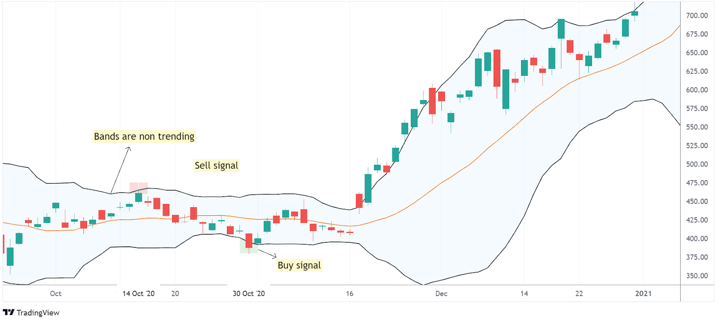

In algorithmic trading, mean-reverting and momentum strategies are two popular approaches traders use to capitalize on market movements. Mean-reverting strategies are based on the concept that asset prices, over time, will return to their historical averages. This strategy assumes that price deviations are temporary and that any significant departure from the mean presents an opportunity for profit. Traders utilizing mean reversion seek to identify and act upon securities with prices that straddle extremes, expecting them to revert to their average levels. 

Conversely, momentum strategies revolve around the persistence of price trends. Traders engaging in momentum trading focus on identifying securities exhibiting sustainable upward or downward trends, with the objective of capitalizing on continued price momentum. Rather than predicting reversals, momentum trading exploits existing trends, assuming that an asset's recent price direction will persist.



Understanding how these strategies work, their differences, and potential applications is crucial for traders looking to maximize their returns. Each strategy offers distinct benefits and challenges, depending on market conditions and individual risk preferences. While mean reversion capitalizes on volatility within a range, momentum strategies thrive in trending markets.

This article provides detailed insights into both strategies, discussing their strengths, limitations, and implementation techniques essential for effective trading. The strategic choice between mean reversion and momentum should align with the trader's market perspective, volatility expectations, and risk management preferences.

## Table of Contents

## Understanding Mean Reversion Strategy

Mean reversion is a financial theory postulating that asset prices and returns eventually revert back to their long-term mean or average level. This idea is built on the assumption that high and low prices are temporary and that an asset's price will return to its historical average over time. The concept is akin to the statistical phenomena of regression to the mean, where extreme data points are followed by more typical data.

Traders employing mean reversion strategies aim to capitalize on securities that have strayed significantly away from their average price, anticipating a retracement. The deviations from the mean can be viewed as opportunities — buying when prices are markedly below the historical average and selling when they are significantly above it.

Several key indicators are used to detect these deviations, each offering unique insights into the degree and timing of the mean reversion:

1. **Relative Strength Index (RSI):** A momentum oscillator that measures the speed and change of price movements. It functions on a scale of 0 to 100. Typically, an RSI above 70 suggests that a security is overbought and may be due for a pullback, whereas an RSI below 30 indicates that it is oversold and may be headed for an upward correction.

2. **Standard Deviation:** This statistical measure quantifies the amount of variation or dispersion in a set of values. In trading, a high standard deviation signifies a large variance from the mean, often pointing to overbought or oversold conditions.

3. **Money Flow Index (MFI):** Similar to RSI, the MFI is a momentum indicator that also incorporates volume to identify overbought or oversold conditions. It ranges from 0 to 100, with values above 80 suggesting overbought conditions and values below 20 indicating oversold conditions.

4. **Bollinger Bands:** These are volatility bands placed above and below a moving average. The width of the bands is determined by the standard deviation of the asset's price, adjusting to market volatility. Prices that touch the upper band are generally considered overbought, while those touching the lower band are viewed as oversold.

In practical terms, mean reversion strategies are often employed in range-bound markets where prices oscillate between established levels. This strategy may not be as effective in strong trending markets, as trends can persist longer than expected, leading to substantial losses if positions are held beyond its reversal point. Understanding and correctly applying these indicators can enable traders to effectively anticipate and exploit market price reversions.

## How to Trade with Mean Reversion Strategy

To successfully trade using a mean reversion strategy, traders must first identify assets that have considerably deviated from their historical mean. This deviation is often measured using statistical metrics such as the Z-score, which signifies how far a data point is from the mean in terms of standard deviations. For example, a Z-score greater than 2 or less than -2 may indicate that a security's price has significantly deviated and could eventually revert to the mean.

Traders frequently employ various technical indicators to identify potential mean reversion opportunities. Among these, the Relative Strength Index (RSI) is particularly useful. The RSI, which quantifies the velocity and magnitude of price movements, ranges from 0 to 100. Values above 70 generally indicate overbought conditions, whereas values below 30 suggest oversold conditions, signaling potential mean reversion.

Another commonly used tool is Bollinger Bands, which consists of a moving average and two standard deviation lines above and below it. Prices that touch or breach the upper or lower bands can suggest over-extension, thereby hinting at a likely reversion to the mean.

Pairs trading, a popular mean-reversion strategy, involves trading two correlated assets. The aim is to identify divergences in their price movements. When one asset significantly deviates from its mean relative to the other, it can present an opportunity. For instance, if Asset A usually correlates with Asset B but suddenly moves higher while Asset B remains stable, a trader might short Asset A and go long on Asset B, anticipating that the spread between the two will eventually close.

In practice, Python is often used by traders to automate and backtest mean reversion strategies. A simple implementation may look like this:

```python
import numpy as np
import pandas as pd
import matplotlib.pyplot as plt
from ta.momentum import RSIIndicator

# Load historical price data
data = pd.read_csv('asset_prices.csv')
prices = data['price']

# Calculate RSI
rsi = RSIIndicator(close=prices, window=14)
data['RSI'] = rsi.rsi()

# Identify potential mean reversion signals
oversold_signals = data[data['RSI'] < 30]
overbought_signals = data[data['RSI'] > 70]

# Visualization
plt.figure(figsize=(12, 6))
plt.plot(data['price'], label='Price')
plt.scatter(oversold_signals.index, oversold_signals['price'], marker='^', color='g', label='Oversold')
plt.scatter(overbought_signals.index, overbought_signals['price'], marker='v', color='r', label='Overbought')
plt.title('Price and RSI Indicators')
plt.xlabel('Date')
plt.ylabel('Price')
plt.legend()
plt.show()
```

This code calculates the RSI of an asset and identifies overbought and oversold conditions, providing a basis for entering trades. The future efficacy of the strategy depends heavily on rigorous [backtesting](/wiki/backtesting) and risk management to ensure profitability across varying market conditions.

## Exploring Momentum Trading Strategy

Momentum trading is a strategy centered on capitalizing on existing trends in asset prices. The underlying premise is that securities experiencing upward trends will likely continue their trajectory in the same direction for a period, thereby presenting potential profit opportunities for traders. Unlike [fundamental analysis](/wiki/fundamental-analysis), which examines an asset's intrinsic value, [momentum](/wiki/momentum) trading relies strictly on technical analysis tools and techniques.

**Technical Analysis in Momentum Trading**

Momentum traders use various technical analysis tools to identify and validate trends. These tools help in recognizing patterns and signals that suggest continuation or reversal of trends, independent of an asset's fundamental health or market conditions. Traders typically enter trades based on the strength and persistence of these upward trends, aiming to benefit from price continuity as momentum sustains the trend directionality.

**Trend Following and Entry Points**

A core principle of momentum trading is the "trend is your friend," which implies that markets that have moved in a particular direction for some time are more likely to continue moving in that direction than to reverse. Traders look for established trends with sufficient strength to warrant entry. Once a trend is identified, traders seek optimal entry points to maximize profits while mitigating risk. 

Momentum strategies often incorporate indicators such as Moving Averages, Relative Strength Index (RSI), and MACD (Moving Average Convergence Divergence) to gauge the trend's strength and longevity. These indicators assist traders in confirming trend presence and timing their entry and [exit](/wiki/exit-strategy) points effectively. For instance, a common approach is to identify assets whose prices are consistently closing above a chosen moving average over a set time period.

**Consideration of Risk and Reward**

Momentum trading requires robust risk management techniques because trends can be volatile, and reversals can occur rapidly. Traders employ stop-loss orders to protect against significant downside risk if the trend unexpectedly reverses along with setting target price levels to secure profits once the asset achieves anticipated levels.

**Exploiting Market Psychology**

Momentum strategies are also inherently linked to market psychology, which can perpetuate trends as traders react to price movements. As more investors jump on the bandwagon, buying strong-performing assets, it can further fuel the trend, creating a self-fulfilling cycle that momentum traders aim to exploit until the trend naturally dissipates.

In summary, momentum trading is a technique focused purely on identifying and riding existing market trends. It employs technical analysis to maximize the chances of capturing extended price moves, without considering an asset's underlying fundamental factors. Despite its potential for high returns, the approach requires sophisticated risk management and can benefit from market sentiment and psychology, which greatly influence trend dynamics.

## How to Use Momentum Indicators

Momentum indicators are vital tools in technical analysis, providing traders with insights into the strength and direction of existing market trends. These indicators help traders make informed decisions by identifying whether to enter or exit a position based on trend analysis.

**Trend Lines**

Trend lines are fundamental in evaluating the directional movement of a stock or asset. They are drawn on charts to connect certain points, typically peaks and troughs, which indicate the general direction of the asset's price movement. By observing the inclination angle of a trend line, traders can determine whether an asset is in an uptrend (bullish) or downtrend (bearish). A steeper trend line suggests a stronger trend, while a flatter line indicates a weaker trend. This visual representation assists traders in anticipating potential reversal points and validating trend strength.

**Moving Averages**

Moving averages are used to smooth price data over a specific period, thus minimizing short-term fluctuations and highlighting longer-term trends. There are several types of moving averages, with the simple moving average (SMA) and exponential moving average (EMA) being the most commonly used. The moving average calculation for an SMA over $n$ periods is given by:

$$
\text{SMA} = \frac{P_1 + P_2 + \ldots + P_n}{n}
$$

where $P_i$ represents the price at each period $i$.

The choice between using a short-term or long-term moving average depends on the trader’s strategy. A crossover of short-term and long-term moving averages often signals a potential change in trend direction. For example, a short-term moving average crossing above a long-term moving average might indicate a bullish trend, known as a "golden cross," while a crossing below might suggest a bearish trend, termed a "death cross."

**Average Directional Index (ADX)**

The Average Directional Index (ADX) is a crucial indicator for determining trend strength, independent of its direction. Values of ADX are typically derived from the directional movement index (DMI), which comprises two lines: the positive directional indicator (+DI) and the negative directional indicator (−DI). The ADX is calculated as the moving average of the absolute value of the difference between these two indicators:

$$
\text{ADX} = \text{EMA} \left( \frac{|+DI - -DI|}{+DI + -DI} \right)
$$

A high ADX value (above 25) suggests a strong trend, whereas a low ADX value (below 20) indicates a weak trend or a non-trending market. Traders use the ADX to avoid range-bound conditions when momentum strategies might fail to yield significant results.

In summary, momentum indicators such as trend lines, moving averages, and the ADX, provide essential inputs for understanding market trends and making better trading decisions. By analyzing these indicators collectively, traders can better assess market conditions and strategically position their trades.

## Mean Reversion vs. Momentum: Which is Better?

In contrast to momentum trading, which thrives on capturing significant, sustained price movements, mean reversion strategies are particularly suited to markets that frequently revert to historical price averages. Traders operating in range-bound environments often find mean reversion effective, as it allows for the capture of profits from regular and frequent price oscillations. The key assumption in mean reversion is that security prices will eventually return to their mean or average level, making it essential for traders to identify overextended market conditions. However, while this approach results in more frequent trades, the profit expectations per trade can be lower due to the reliance on a consistent oscillation around the mean.

On the other hand, momentum strategies capitalize on securities maintaining a directional trend over time. These strategies often yield less frequent trading opportunities, as they wait for substantial trends to form. The profit potential with momentum trading is generally higher, due to the ability to capture a more extended price movement in a single trade. Traders using momentum strategies depend heavily on technical indicators to identify the strength and direction of trends, such as moving averages or the Average Directional Index (ADX).

The effectiveness of either mean reversion or momentum trading largely hinges on specific market conditions and the trader's willingness to assume risk. In volatile, sideways-moving markets, mean reversion can consistently seize small profits, albeit with lower risk. Conversely, in trending markets, momentum strategies can be much more profitable, although they often involve higher risk due to the nature of trend-following and the possibility of abrupt trend reversals.

Ultimately, the choice between mean reversion and momentum strategies should be informed by a trader’s insight into market conditions, risk tolerance, and adaptability to changing dynamics. Both strategies offer unique advantages and can be integral parts of a diversified trading strategy.

## Conclusion

In the context of [algorithmic trading](/wiki/algorithmic-trading), mean-reverting and momentum strategies stand out due to their distinct characteristics and applicability in various market environments. Both strategies leverage different market behaviors, offering unique advantages that can be strategically employed to achieve trading objectives.

Mean-reverting strategies are particularly effective in range-bound markets where asset prices oscillate around a mean or average value. By utilizing statistical measures such as the Relative Strength Index (RSI), standard deviation, and Bollinger Bands, traders can identify overbought or oversold conditions and anticipate price corrections. The key to success with mean reversion lies in accurately identifying these extremes and timing trades to capitalize on the anticipated return to the mean. This approach tends to involve frequent trades, generally yielding narrower profit margins, but providing consistent opportunities in stable market conditions.

On the other hand, momentum strategies excel in trending markets where price movements exhibit sustained directional momentum. By relying on technical indicators like moving averages and the Average Directional Index (ADX), traders seek to confirm and enter existing trends, maximizing potential gains as prices continue to move favorably. Momentum trading generally results in fewer trades compared to mean reversion; however, it offers the opportunity to capitalize on significant market moves, leading to potentially higher rewards when successfully executed.

When deciding between these strategies, traders must consider current market conditions and their personal risk tolerance. A mean-reverting strategy might be more suitable in markets characterized by low [volatility](/wiki/volatility-trading-strategies) and frequent price fluctuations. In contrast, momentum strategies may be better suited for volatile markets with clear trends.

Ultimately, many traders find success by integrating both strategies into their trading arsenal, allowing them to adapt to changing market dynamics. Employing [machine learning](/wiki/machine-learning) algorithms and continuous data analysis can further enhance the effectiveness of these strategies. Traders who invest in learning and developing their understanding of market behaviors will be better positioned to navigate the complexities of algorithmic trading, maximizing their returns while effectively managing risks.

## References & Further Reading

[1]: ["Statistical Arbitrage: Algorithmic Trading Insights and Techniques"](https://www.wiley.com/en-us/Statistical+Arbitrage%3A+Algorithmic+Trading+Insights+and+Techniques-p-9780470138441) by Andrew Pole

[2]: ["Algorithmic Trading: Winning Strategies and Their Rationale"](https://books.google.com/books/about/Algorithmic_Trading.html?id=CIwCTVqEj4oC) by Ernie Chan

[3]: Moskowitz, T. J., Ooi, Y. H., & Pedersen, L. H. (2012). ["Time Series Momentum."](https://www.sciencedirect.com/science/article/pii/S0304405X11002613) Review of Financial Studies, 26(4), 1063-1111

[4]: Fama, E. F., & French, K. R. (1988). ["Permanent and Temporary Components of Stock Prices."](https://www.jstor.org/stable/1833108) Journal of Political Economy, 96(2), 246-273

[5]: Jegadeesh, N., & Titman, S. (1993). ["Returns to Buying Winners and Selling Losers: Implications for Stock Market Efficiency."](https://www.bauer.uh.edu/rsusmel/phd/jegadeesh-titman93.pdf) The Journal of Finance, 48(1), 65-91