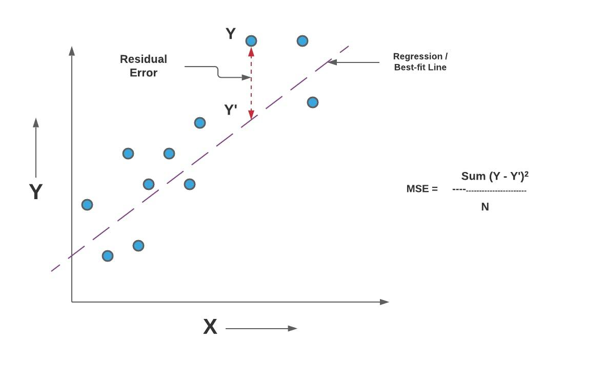

## Table of Contents

## What is Mean Squared Error (MSE) in the context of machine learning?

Mean Squared Error (MSE) is a way to measure how well a machine learning model is doing. It does this by looking at the difference between the numbers the model predicts and the actual numbers. To find the MSE, you first take the difference between each prediction and the real value, square that difference, and then find the average of all those squared differences. The formula for MSE is $$ \text{MSE} = \frac{1}{n} \sum_{i=1}^{n} (y_i - \hat{y}_i)^2 $$ where $y_i$ is the actual value, $\hat{y}_i$ is the predicted value, and $n$ is the number of observations.

Using MSE is helpful because squaring the errors makes sure that bigger mistakes are punished more than smaller ones, and it also makes all errors positive so they don't cancel each other out. A lower MSE means the model's predictions are closer to the actual values, which is what you want. MSE is often used in regression problems, where you're trying to predict a number, like the price of a house or the temperature tomorrow. It's a common way to see how good a model is at making those predictions.

## How is MSE calculated?

To calculate Mean Squared Error (MSE), you start by finding the difference between each prediction your model makes and the actual value. For each of these differences, you square the number. Squaring the differences makes sure that all errors are positive and that larger errors are penalized more than smaller ones. After you have squared all the differences, you add them all up.

Once you have the sum of all the squared differences, you divide this total by the number of predictions you made. This gives you the average of the squared errors, which is the Mean Squared Error. The formula for MSE is $$ \text{MSE} = \frac{1}{n} \sum_{i=1}^{n} (y_i - \hat{y}_i)^2 $$ where $y_i$ is the actual value, $\hat{y}_i$ is the predicted value, and $n$ is the number of observations. A lower MSE means your model's predictions are closer to the actual values, which is a good thing.

## Why is MSE commonly used as a loss function in regression models?

MSE is commonly used as a loss function in regression models because it provides a clear measure of how far off a model's predictions are from the actual values. By squaring the errors, MSE ensures that all errors are positive and that larger errors are penalized more heavily than smaller ones. This property is useful because it makes the model focus more on correcting bigger mistakes, which can lead to better overall performance. The formula for MSE is $$ \text{MSE} = \frac{1}{n} \sum_{i=1}^{n} (y_i - \hat{y}_i)^2 $$ where $y_i$ is the actual value, $\hat{y}_i$ is the predicted value, and $n$ is the number of observations.

Another reason MSE is popular is that it is differentiable, which means that it can be used with optimization algorithms like gradient descent. These algorithms need to calculate the gradient of the loss function to adjust the model's parameters to minimize the error. Because MSE is differentiable, it allows these algorithms to work smoothly, making it easier to train regression models effectively. Overall, MSE's ability to penalize errors in a way that reflects their magnitude and its compatibility with common optimization techniques make it a go-to choice for many regression tasks.

## What are the advantages of using MSE over other error metrics?

One of the main advantages of using Mean Squared Error (MSE) over other error metrics is that it gives more weight to larger errors. This is because MSE squares the difference between the predicted and actual values. By doing this, bigger mistakes have a much bigger impact on the overall error score than smaller ones. This can be good because it pushes the model to focus on fixing the bigger errors first. The formula for MSE is $$ \text{MSE} = \frac{1}{n} \sum_{i=1}^{n} (y_i - \hat{y}_i)^2 $$ where $y_i$ is the actual value, $\hat{y}_i$ is the predicted value, and $n$ is the number of observations. This focus on larger errors can lead to better performance in many cases.

Another advantage of MSE is that it's easy to work with when you're trying to make your model better. MSE is a smooth function, which means you can use common methods like gradient descent to find the best settings for your model. These methods need to calculate how the error changes when you change the model's settings, and MSE makes this calculation easy. This makes it simpler to train and improve regression models. While other metrics like Mean Absolute Error (MAE) might be less sensitive to outliers, MSE's ability to work well with optimization algorithms and its focus on larger errors often make it a popular choice for many [machine learning](/wiki/machine-learning) tasks.

## Can you explain the disadvantages or limitations of using MSE?

One limitation of using Mean Squared Error (MSE) is that it can be heavily affected by outliers. Because MSE squares the errors, any big mistake can make the total error much larger. This means that even if a model is doing well for most of the data, a few big errors can make it look like the model is not doing well overall. The formula for MSE is $$ \text{MSE} = \frac{1}{n} \sum_{i=1}^{n} (y_i - \hat{y}_i)^2 $$, where $y_i$ is the actual value, $\hat{y}_i$ is the predicted value, and $n$ is the number of observations. If you have data with lots of outliers, using MSE might not be the best choice because it could make your model focus too much on those outliers instead of the rest of the data.

Another disadvantage of MSE is that it doesn't give you information about the direction of the errors. Since MSE squares the differences, it turns all errors positive, which means you can't tell if your model is consistently predicting too high or too low. This can make it harder to understand and fix the problems in your model. If knowing the direction of errors is important for your task, you might want to use a different error metric, like Mean Absolute Error (MAE), which doesn't square the errors and keeps their signs.

## How does MSE relate to the concept of variance in statistics?

Mean Squared Error (MSE) and variance are related because both deal with how spread out numbers are. In [statistics](/wiki/bayesian-statistics), variance tells us how much the numbers in a set differ from their average. It's calculated by taking the average of the squared differences between each number and the mean of the set. The formula for variance is $$ \text{Var}(X) = \frac{1}{n} \sum_{i=1}^{n} (x_i - \mu)^2 $$, where $x_i$ is each number in the set, $\mu$ is the mean, and $n$ is the number of numbers. MSE, on the other hand, measures how far off a model's predictions are from the actual values. The formula for MSE is $$ \text{MSE} = \frac{1}{n} \sum_{i=1}^{n} (y_i - \hat{y}_i)^2 $$, where $y_i$ is the actual value, $\hat{y}_i$ is the predicted value, and $n$ is the number of observations. Both formulas involve squaring the differences and then finding an average, which is why they are related.

In the context of a model's predictions, MSE can be thought of as a combination of the model's bias and variance. Bias is the error from the model's wrong assumptions, while variance is the error from sensitivity to small changes in the training data. If you imagine a model's predictions as a set of numbers, the variance of these predictions would show how much they differ from their average prediction. MSE includes this variance because it measures how spread out the predictions are from the actual values. So, a high MSE could mean the model has high variance, making its predictions more spread out and less reliable. Understanding this relationship helps in improving models by balancing bias and variance to get the lowest possible MSE.

## What impact does outliers have on MSE, and how can this be mitigated?

Outliers can have a big impact on Mean Squared Error (MSE). Because MSE squares the differences between the predicted and actual values, any big mistake (outlier) can make the total error much larger. This means that even if a model is doing well for most of the data, a few big errors can make it look like the model is not doing well overall. The formula for MSE is $$ \text{MSE} = \frac{1}{n} \sum_{i=1}^{n} (y_i - \hat{y}_i)^2 $$, where $y_i$ is the actual value, $\hat{y}_i$ is the predicted value, and $n$ is the number of observations. If your data has a lot of outliers, using MSE might not be the best choice because it could make your model focus too much on those outliers instead of the rest of the data.

To mitigate the impact of outliers on MSE, you can use different strategies. One way is to use a different error metric that is less sensitive to outliers, like Mean Absolute Error (MAE). MAE doesn't square the errors, so big mistakes don't have as big an impact on the total error. Another way is to clean your data by removing or adjusting the outliers before you calculate MSE. This can help make sure that the outliers don't mess up your model's performance. You could also use robust regression methods that are designed to handle outliers better, like using the Huber loss function instead of MSE. These methods can help your model focus on the overall trend of the data instead of being pulled off track by a few big errors.

## How can MSE be used to compare the performance of different models?

Mean Squared Error (MSE) is a helpful way to see which model is better at predicting things. When you want to compare different models, you can use MSE to see how close each model's predictions are to the real numbers. The model with the smaller MSE is usually the better one because it means its predictions are closer to the actual values. The formula for MSE is $$ \text{MSE} = \frac{1}{n} \sum_{i=1}^{n} (y_i - \hat{y}_i)^2 $$, where $y_i$ is the actual value, $\hat{y}_i$ is the predicted value, and $n$ is the number of observations. By calculating the MSE for each model and comparing them, you can pick the one that does the best job.

Sometimes, though, just looking at MSE might not be enough. If your data has some really big or small numbers that are different from the rest (outliers), these can make the MSE much bigger. This means a model might look worse than it really is just because of a few big errors. To deal with this, you can try using other ways to measure how good a model is, like Mean Absolute Error (MAE), or you can clean your data to take out or change the outliers before you calculate MSE. By doing this, you can get a fairer comparison of how well different models are doing.

## What is the relationship between MSE and Root Mean Squared Error (RMSE)?

Mean Squared Error (MSE) and Root Mean Squared Error (RMSE) are closely related because RMSE is just the square root of MSE. The formula for MSE is $$ \text{MSE} = \frac{1}{n} \sum_{i=1}^{n} (y_i - \hat{y}_i)^2 $$, where $y_i$ is the actual value, $\hat{y}_i$ is the predicted value, and $n$ is the number of observations. To get RMSE, you take the square root of this MSE value, so the formula for RMSE is $$ \text{RMSE} = \sqrt{\text{MSE}} = \sqrt{\frac{1}{n} \sum_{i=1}^{n} (y_i - \hat{y}_i)^2} $$. This means that if you know the MSE, you can easily find the RMSE by taking its square root.

The main reason to use RMSE instead of MSE is that RMSE is in the same units as the original data, which can make it easier to understand. For example, if you're predicting temperatures in degrees Celsius, the RMSE will also be in degrees Celsius, while the MSE would be in squared degrees Celsius. This makes RMSE a more intuitive measure of how far off your predictions are from the actual values. Both MSE and RMSE are used to see how well a model is doing, but RMSE can be easier to explain to people who aren't used to working with squared values.

## How does the choice of MSE as a loss function affect model training?

Choosing Mean Squared Error (MSE) as a loss function during model training means the model will try to make its predictions as close as possible to the actual values. MSE does this by squaring the difference between each prediction and the real value, then finding the average of all those squared differences. The formula for MSE is $$ \text{MSE} = \frac{1}{n} \sum_{i=1}^{n} (y_i - \hat{y}_i)^2 $$, where $y_i$ is the actual value, $\hat{y}_i$ is the predicted value, and $n$ is the number of observations. Because MSE squares the errors, it makes bigger mistakes count more than smaller ones. This helps the model focus on fixing the bigger errors first, which can lead to better overall performance.

Using MSE can also affect how the model learns because it's a smooth function. This means it's easy for common methods like gradient descent to work with MSE. These methods need to calculate how the error changes when you change the model's settings, and MSE makes this calculation easy. This makes it simpler to train and improve regression models. However, MSE can be heavily affected by outliers because squaring the errors makes any big mistake much larger. So, if your data has a lot of outliers, using MSE might make your model focus too much on those outliers instead of the rest of the data.

## In what scenarios might MSE not be the best choice for a loss function?

Mean Squared Error (MSE) might not be the best choice for a loss function in scenarios where the data has a lot of outliers. Because MSE squares the differences between the predicted and actual values, any big mistake can make the total error much larger. This means that even if a model is doing well for most of the data, a few big errors can make it look like the model is not doing well overall. The formula for MSE is $$ \text{MSE} = \frac{1}{n} \sum_{i=1}^{n} (y_i - \hat{y}_i)^2 $$, where $y_i$ is the actual value, $\hat{y}_i$ is the predicted value, and $n$ is the number of observations. If your data has a lot of outliers, using MSE could make your model focus too much on those outliers instead of the rest of the data.

Another scenario where MSE might not be the best choice is when understanding the direction of errors is important. MSE squares the errors, which means it turns all errors positive, so you can't tell if your model is consistently predicting too high or too low. This can make it harder to understand and fix the problems in your model. If knowing whether your model tends to overestimate or underestimate is crucial for your task, you might want to use a different error metric, like Mean Absolute Error (MAE), which doesn't square the errors and keeps their signs.

## How can one implement MSE in a programming language like Python?

To implement Mean Squared Error (MSE) in Python, you can write a simple function that calculates the average of the squared differences between the actual values and the predicted values. The formula for MSE is $$ \text{MSE} = \frac{1}{n} \sum_{i=1}^{n} (y_i - \hat{y}_i)^2 $$, where $y_i$ is the actual value, $\hat{y}_i$ is the predicted value, and $n$ is the number of observations. You can use a list or an array to hold these values and then loop through them to compute the MSE.

Here is an example of how you might write this in Python:

```python
def mean_squared_error(y_true, y_pred):
    n = len(y_true)
    mse = sum((y_true[i] - y_pred[i]) ** 2 for i in range(n)) / n
    return mse

# Example usage
actual_values = [3, -0.5, 2, 7]
predicted_values = [2.5, 0.0, 2, 8]
error = mean_squared_error(actual_values, predicted_values)
print("Mean Squared Error:", error)
```

This code defines a function `mean_squared_error` that takes two lists, `y_true` and `y_pred`, representing the actual and predicted values respectively. It calculates the MSE by summing the squared differences and dividing by the number of observations. The example usage shows how to use this function with sample data, and it will print the calculated MSE.