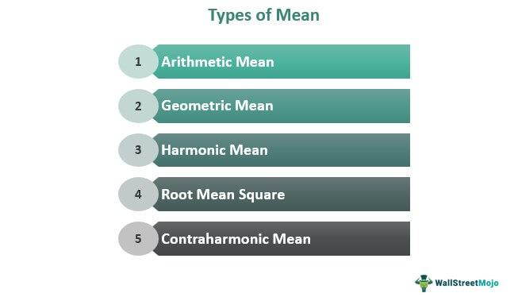

In financial markets, various mathematical concepts play a critical role in trading strategies. Among these, the concept of 'mean' stands out as essential for understanding and developing different trading mechanisms, particularly in the domain of algorithmic trading. Means provide a foundational basis for analyzing market data, guiding traders in making informed decisions by revealing trends, patterns, and potential anomalies in stock prices and other financial instruments.

In finance, the mean serves as a measure of central tendency, helping to summarize data sets with a single representative value. This plays a crucial role in evaluating historical performance, forecasting future trends, and identifying opportunities for buy or sell actions in the market. By applying mathematical averages, traders can devise strategies that exploit price distributions, volatility, and mean reversion patterns. The mean also underpins various sophisticated statistical tools and models employed in quantitative analysis, which are integral to algorithmic trading strategies that rely on speed and precision.



This article will explore the various types of mean—arithmetic, geometric, and harmonic—and discuss their individual formulas. Additionally, it will illustrate how these mathematical concepts are specifically applied within the context of algorithmic trading to enhance performance and strategy development. Through this exploration, readers will gain insight into the pivotal role that means play in both the theoretical and practical aspects of financial markets.

## Table of Contents

## Understanding Means in Finance

A 'mean' is essentially the mathematical average of a set of numbers and serves as a central tendency indicator in statistics. In finance, understanding different types of means is crucial for analyzing data related to market trends, investment returns, and risk assessments. Specifically, in trading, various means help in assessing historical performance and making informed predictions about future price movements. 

The arithmetic mean is the most straightforward type of mean, calculated by summing all numbers in a dataset and then dividing by the total count of these numbers. It provides a simple average and is widely used for its ease of calculation:

$$
\text{Arithmetic Mean} = \frac{\sum_{i=1}^{n} x_i}{n}
$$

where $x_i$ represents each value in the dataset and $n$ is the total number of values.

The geometric mean, meanwhile, is more applicable when dealing with data that involves rates of change, such as investment returns over time. It is calculated by multiplying all numbers in a dataset and then taking the nth root, where $n$ is the number of values. This mean is particularly important for understanding compounded returns:

$$
\text{Geometric Mean} = \left( \prod_{i=1}^{n} x_i \right)^{\frac{1}{n}}
$$

The harmonic mean is most useful in finance when dealing with average rates or ratios, such as price-to-earnings ratios in valuations. It is calculated by dividing the number of observations by the sum of the reciprocals of each number in the dataset:

$$
\text{Harmonic Mean} = \frac{n}{\sum_{i=1}^{n} \frac{1}{x_i}}
$$

Each type of mean provides unique insights into financial datasets, catering to different types of data and analytical purposes. Understanding these various means enables traders and analysts to select the appropriate tool for the specific type of financial data they are analyzing, leading to more accurate and meaningful analyses.

## Types of Means and Their Formulas

In the context of financial analysis and trading, understanding different types of means is crucial as they offer distinct ways of interpreting data sets. Three primary means utilized in financial computations are the arithmetic mean, geometric mean, and harmonic mean.

### Arithmetic Mean

The arithmetic mean, commonly known as the simple average, is the most straightforward form of mean. It is calculated by summing all the individual numbers in a dataset and dividing this total by the count of the numbers in the dataset. The arithmetic mean is expressed mathematically as:

$$
\text{Arithmetic Mean} = \frac{1}{n} \sum_{i=1}^{n} x_i
$$

where $n$ is the number of observations, and $x_i$ represents each individual data point. This measure is particularly useful for datasets where values are uniformly distributed or when analyzing central tendencies in normally distributed datasets.

### Geometric Mean

The geometric mean is a more sophisticated measure compared to the arithmetic mean. It is particularly suitable for datasets that exhibit exponential growth or are characterized by compounding, making it relevant in finance for assessing average rates of return over time. The geometric mean is calculated by multiplying all the numbers in a dataset and then taking the nth root of the resulting product, where n is the total number of observations. The formula for the geometric mean is:

$$
\text{Geometric Mean} = \left( \prod_{i=1}^{n} x_i \right)^{\frac{1}{n}}
$$

This measure provides a more accurate picture in cases involving percentage growth or ratios, as it accounts for the effects of compounding.

### Harmonic Mean

The harmonic mean is different as it is particularly useful when dealing with rates or ratios, like average speeds or prices. It is calculated by dividing the number of data points by the sum of the reciprocals of each data point in the dataset. The harmonic mean is given by the formula:

$$
\text{Harmonic Mean} = \frac{n}{\sum_{i=1}^{n} \frac{1}{x_i}}
$$

The harmonic mean is especially sensitive to extremely small values in a dataset, making it beneficial in scenarios where the smallest values significantly impact the mean.

### Python Implementation

Here's a basic implementation in Python for calculating these means:

```python
import numpy as np

def arithmetic_mean(data):
    return sum(data) / len(data)

def geometric_mean(data):
    return np.prod(data) ** (1 / len(data))

def harmonic_mean(data):
    return len(data) / sum(1 / x for x in data)

# Example usage
data = [10, 20, 30, 40, 50]

print("Arithmetic Mean:", arithmetic_mean(data))
print("Geometric Mean:", geometric_mean(data))
print("Harmonic Mean:", harmonic_mean(data))
```

Each mean provides a unique perspective on a data set, suitable for different financial analyses and applications. Understanding these distinctions aids in selecting the appropriate measure for specific financial or trading needs.

## Application in Trading

Understanding means is essential for investors to gauge and predict stock performance. In [algorithmic trading](/wiki/algorithmic-trading), the concept of mean reversion plays a crucial role. Mean reversion is based on the idea that asset prices tend to return to their historical average over time. When a price deviates significantly from its historical average, this could indicate a potential trading opportunity. Traders can capitalize on this by anticipating that the price will eventually move back towards its mean, thus allowing them to buy low and sell high, or vice versa.

Moving averages are another important tool where different types of means are applied in trading strategies. A moving average is a calculation to analyze data points by creating a series of averages of different subsets of the full data set. This allows traders to identify trends by smoothing out fluctuations in the price data, making it easier to see the underlying trend.

One popular strategy involving means is the moving average crossover. This strategy compares two moving averages of a stock's price over different time periods — typically a short-term and a long-term moving average. A common approach involves using simple moving averages (SMAs), calculated as follows:

$$
\text{SMA} = \frac{\sum_{i=1}^{n} P_i}{n}
$$

where $P_i$ is the price of the asset and $n$ is the number of periods in the moving average. A potential buy signal is generated when the short-term moving average crosses above the long-term moving average, known as a "golden cross." Conversely, a "death cross" occurs when the short-term average crosses below the long-term average, suggesting a potential sell signal.

Implementing these strategies in algorithmic trading frequently involves coding algorithms to automatically execute trades based on predefined criteria. Python is a preferred programming language for this due to its extensive libraries and ease of use. For instance, in Python, a simple moving average can be calculated using the Pandas library as follows:

```python
import pandas as pd

# Assuming 'data' is a DataFrame containing your stock price data
short_window = 40
long_window = 100

data['Short_MA'] = data['Close'].rolling(window=short_window, min_periods=1).mean()
data['Long_MA'] = data['Close'].rolling(window=long_window, min_periods=1).mean()

# Generate signals
data['Signal'] = 0.0
data['Signal'][short_window:] = np.where(data['Short_MA'][short_window:] > data['Long_MA'][short_window:], 1.0, 0.0)
data['Position'] = data['Signal'].diff()
```

Here, `Signal` indicates when a crossover occurs, and `Position` helps identify buy (1) or sell (-1) signals. Leveraging these techniques allows traders to create systematic and repeatable trading strategies based on the statistical principles of mean and trend analysis.

## Mean Reversion and Its Significance

Mean reversion is a pivotal financial theory that posits asset prices and other financial metrics, such as interest rates, will eventually revert to their long-term mean or average level. This concept is a cornerstone in the development of many trading strategies, especially in markets characterized by high [volatility](/wiki/volatility-trading-strategies). The underlying assumption is that deviations from the mean are temporary and that prices will normalize over time. 

The effectiveness of mean reversion strategies largely hinges on the identification of assets that have significantly deviated from their historical prices. Traders implementing mean reversion techniques often look for stocks, commodities, or other financial instruments exhibiting price anomalies. These anomalies indicate a potential for profits as the prices are expected to revert to their average value.

Mathematically, mean reversion can be shown using the concept of a stationary time series, where the values fluctuate around a constant mean over time. For example, the Ornstein-Uhlenbeck process is frequently used to model mean-reverting behavior. In Python, such a process can be simulated with:

```python
import numpy as np

def simulate_ou_process(n_steps, mu, sigma, theta, dt):
    prices = np.zeros(n_steps)
    prices[0] = mu  # starting value at the mean

    for t in range(1, n_steps):
        dW = np.random.normal(scale=np.sqrt(dt))
        prices[t] = prices[t-1] + theta * (mu - prices[t-1]) * dt + sigma * dW

    return prices

# Example parameters
mu = 100  # long-term mean
sigma = 2  # volatility parameter
theta = 0.3  # speed of reversion
dt = 0.01  # time increment
n_steps = 1000

prices = simulate_ou_process(n_steps, mu, sigma, theta, dt)
```

The function `simulate_ou_process` models the dynamics of prices under a mean-reverting process, demonstrating how deviations from the mean tend to be corrected over time.

In practice, mean reversion is exploited by setting bands around the mean (often with the help of moving averages) and executing trades when the price moves outside these bands. A common technique involves trading "long" when the price falls below the lower band and "short" when it rises above the upper band. This method hinges on the belief that the prices will inevitably return to the mean, thus providing a scope for profit in both rising and falling markets.

Despite its potential, mean reversion is not without limitations. The assumption that prices will revert to the mean may not hold in trending markets, where new information or events cause a permanent shift in the price level, defying historical patterns. Therefore, while mean reversion is a useful concept, relying solely on this strategy without considering broader market dynamics can be risky. Traders often complement mean reversion strategies with other analytical tools to build comprehensive trading frameworks.

## Algorithmic Trading Techniques

Algorithmic trading harnesses the power of mathematical formulas and computational techniques to automate and optimize trading strategies. One of the fundamental techniques employed in algorithmic trading is mean reversion. This strategy is based on the assumption that asset prices and returns eventually revert to their long-term mean or average level. Traders use statistical models to identify when asset prices deviate significantly from their historical average, creating potential buying or selling opportunities. A common tool here is the z-score calculation, which standardizes the deviation of the price from its mean, allowing traders to identify extreme movements. 

Moving averages are another cornerstone technique in algorithmic trading. They smooth out price data over a specified period, helping to identify trends by filtering out short-term fluctuations. Two popular types are the simple moving average (SMA), which is the arithmetic mean of a given set of prices over a specific number of periods, and the exponential moving average (EMA), which gives more weight to recent prices. Moving averages are often used in crossover strategies, where a shorter-term moving average crossing above a longer-term average may signal a buy, and crossing below may signal a sell.

Statistical analysis, including the use of [machine learning](/wiki/machine-learning) algorithms, plays a crucial role in developing and refining trading strategies. Techniques such as regression analysis, time series forecasting, and clustering are employed to uncover patterns and relationships within market data. Machine learning models, including decision trees, random forests, and support vector machines, can predict future price movements based on historical data patterns.

The implementation of these strategies relies heavily on programming languages like Python or R due to their extensive libraries and frameworks designed for quantitative analysis. Python, in particular, is favored for its user-friendly syntax and powerful libraries such as NumPy, Pandas, and Scikit-learn, which facilitate data manipulation, model building, and statistical analysis. Here's a simple example of a moving average crossover strategy in Python:

```python
import pandas as pd

# Load data into DataFrame
data = pd.read_csv('stock_data.csv')
data['SMA50'] = data['Close'].rolling(window=50).mean()
data['SMA200'] = data['Close'].rolling(window=200).mean()

# Generate buy/sell signals
data['Signal'] = 0
data['Signal'][50:] = np.where(data['SMA50'][50:] > data['SMA200'][50:], 1, 0)
data['Position'] = data['Signal'].diff()

# Display signals
print(data[['Date', 'Close', 'SMA50', 'SMA200', 'Position']].dropna())
```

In summary, algorithmic trading techniques leverage mathematical principles and computational prowess to create strategies that can efficiently navigate complex market environments. These strategies, rooted in statistical analysis and supported by programming capabilities, provide traders with robust tools for making data-driven decisions.

## Benefits and Limitations

The use of means in trading provides significant advantages in data analysis and decision-making processes. By utilizing different types of means, traders can analyze historical price data to identify patterns, trends, and potential entry and [exit](/wiki/exit-strategy) points. This quantitative approach helps in crafting strategies with an objective framework, reducing emotional biases that often affect trading decisions. The arithmetic mean, for example, can highlight the central tendency of price movements over a specific period, enabling traders to anticipate likely price behavior. Additionally, more complex means, such as the geometric and harmonic means, offer insights into compounded returns and performance metrics that can further refine trading strategies.

However, reliance on mean-based strategies alone can present limitations. While means effectively capture the average behavior of a dataset, they may not fully account for market anomalies or unforeseen economic events that could lead to significant deviations from historical patterns. This is particularly relevant in volatile markets where price movements can be abrupt and unpredictable, outlying events can disproportionately affect average values, misleading traders. Furthermore, statistical means do not inherently consider the temporal sequence of prices, potentially overlooking patterns like trends or cycles.

To overcome these limitations, integrating other analytical tools and techniques is crucial. Incorporating volatility measures, such as standard deviation, can provide additional context about the [dispersion](/wiki/dispersion-trading) of prices around the mean. This can help in assessing the risk associated with trading signals derived from mean calculations. Additionally, employing machine learning models and algorithmic techniques can enhance predictive capabilities by analyzing non-linear patterns and incorporating a more extensive range of market indicators. By combining these approaches, traders can develop more robust strategies that account for both historical averages and dynamic market conditions.

## Conclusion

The concept of mean is a foundational element in finance and trading, serving as a key tool for analysis and strategy development. By employing various types of means, such as arithmetic, geometric, and harmonic, traders are able to construct robust, data-driven strategies that can enhance decision-making processes and improve the accuracy of performance analysis. Each type of mean offers unique insights, allowing for the tailored application to specific financial scenarios, thereby maximizing potential for returns.

Despite these advantages, traders should be acutely aware of the limitations inherent in mean-based strategies. These methodologies may not fully account for market anomalies or unforeseen economic events that can influence asset prices unpredictably. Therefore, while the use of means enriches analytical rigor, it should be complemented by other analytical tools and strategies. Diversification of analytical approaches ensures a more comprehensive understanding of market dynamics, providing a stronger foundation for navigating the complexities of trading in diverse market conditions.

## References & Further Reading

[1]: Perez, P. & Ni, Y. (2018). ["Mean Reversion in Financial Markets"](https://www.tandfonline.com/doi/full/10.1080/1331677X.2018.1456358) in Quantpedia.

[2]: Hull, J. C. (2018). ["Options, Futures, and Other Derivatives"](https://www.semanticscholar.org/paper/Options%2C-Futures%2C-and-Other-Derivatives-Hull/89bdee500c8623864fc9eb7a471546aa713acc44). 10th Edition. Pearson.

[3]: Lo, A. W., & MacKinlay, A. C. (1999). ["A Non-Random Walk Down Wall Street"](https://www.jstor.org/stable/j.ctt7tccx). Princeton University Press.

[4]: Tsay, R. S. (2005). ["Analysis of Financial Time Series"](https://cpb-us-w2.wpmucdn.com/blog.nus.edu.sg/dist/0/6796/files/2017/03/analysis-of-financial-time-series-copy-2ffgm3v.pdf). Wiley-Interscience.

[5]: De Prado, M. L. (2018). ["Advances in Financial Machine Learning"](https://www.amazon.com/Advances-Financial-Machine-Learning-Marcos/dp/1119482089). Wiley.