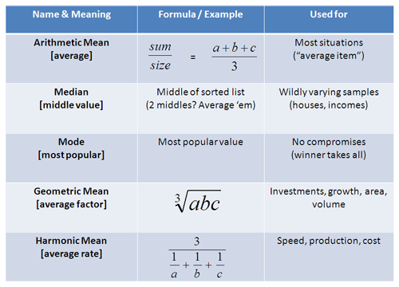

## Table of Contents

## What is the mean in statistics?

In statistics, the mean is a way to find the average of a set of numbers. To calculate the mean, you add up all the numbers in the set and then divide by how many numbers there are. For example, if you have the numbers 2, 4, and 6, you add them up to get 12, and then divide by 3 (since there are three numbers) to get a mean of 4.

The mean is useful because it gives you a single number that represents the center of your data. It's often used to summarize data and make it easier to understand. However, the mean can be affected by very high or very low numbers in the set, which might not always give you the best picture of the data. In such cases, other measures like the median or mode might be more helpful.

## How do you calculate the arithmetic mean?

To calculate the arithmetic mean, you add up all the numbers in your group and then divide by how many numbers you have. For example, if you have the numbers 3, 5, and 7, you add them up to get 15. Then, you divide 15 by 3 (the number of numbers) to get a mean of 5.

The arithmetic mean is a good way to find the middle value of your numbers. It's like finding the balance point if you imagine your numbers as weights on a scale. However, if you have one number that is much bigger or smaller than the others, it can pull the mean towards it, which might not show the true middle of your data.

## What is the difference between mean, median, and mode?

The mean, median, and mode are three ways to find the center or most common value in a set of numbers. The mean is what you usually call the average. You find it by adding up all the numbers and then dividing by how many numbers there are. For example, if you have the numbers 2, 4, and 6, the mean is (2 + 4 + 6) / 3 = 4. The mean is good for understanding the overall average, but it can be affected a lot by very high or very low numbers.

The median is the middle number when you line up all the numbers from smallest to largest. If you have an odd number of numbers, the median is the one right in the middle. If you have an even number of numbers, the median is the average of the two middle numbers. For example, with the numbers 2, 4, and 6, the median is 4 because it's in the middle. The median is useful because it's not affected by extreme values, so it gives a better sense of the middle when you have numbers that are very different from each other.

The mode is the number that shows up the most often in your set of numbers. If no number shows up more than once, then there is no mode. For example, if you have the numbers 2, 4, 4, and 6, the mode is 4 because it appears more times than the others. The mode is helpful when you want to know which value is the most common in your data. Sometimes, you can have more than one mode if multiple numbers appear the same number of times and more often than any other number.

## Can you explain the concept of weighted mean?

The weighted mean is a way to find the average of a set of numbers when some numbers are more important than others. Instead of treating all numbers the same, you give each number a weight, which is like a score that shows how important it is. To find the weighted mean, you multiply each number by its weight, add up all those products, and then divide by the total of all the weights. For example, if you have test scores of 80, 90, and 70, and the weights are 1, 2, and 1 (because the second test is twice as important), you would calculate the weighted mean like this: (80*1 + 90*2 + 70*1) / (1 + 2 + 1) = (80 + 180 + 70) / 4 = 330 / 4 = 82.5.

The weighted mean is useful in situations where not all data points should be treated equally. For instance, in school, if some assignments are worth more points than others, you would use a weighted mean to find your overall grade. It helps to give a more accurate picture of the average when some values are more significant. In everyday life, you might use a weighted mean when calculating things like a shopping budget, where some items cost more and should have a bigger impact on your total spending.

## How is the geometric mean calculated and when is it used?

The geometric mean is a way to find the average of a set of numbers by multiplying them together and then taking the root of the product. For example, if you have the numbers 2, 4, and 8, you multiply them to get 2 * 4 * 8 = 64. Then, you take the cube root of 64 (because you have three numbers) to get the geometric mean, which is 4. The formula for the geometric mean of numbers \(a_1, a_2, ..., a_n\) is the \(n\)-th root of the product \(a_1 \times a_2 \times ... \times a_n\). It's different from the arithmetic mean, which adds the numbers and divides by how many there are.

The geometric mean is used when you want to find the average rate of change or growth over time. It's helpful for things like investment returns, population growth, or even bacteria growth. For instance, if an investment grows by 10% one year and 20% the next, the geometric mean will give you the average growth rate over those two years. It's also used in fields like biology and finance because it's better at dealing with numbers that grow or change over time in a multiplicative way, rather than just adding up.

## What is the harmonic mean and in what scenarios is it applied?

The harmonic mean is a type of average that you use when you want to find the average of rates. To calculate it, you take the numbers you have, find their reciprocals (which means you divide 1 by each number), add those reciprocals together, and then divide the total number of numbers by that sum. For example, if you have the numbers 2, 3, and 6, their reciprocals are 1/2, 1/3, and 1/6. You add those up to get 1/2 + 1/3 + 1/6 = 1. If you have three numbers, you divide 3 by 1 to get the harmonic mean, which is 3.

The harmonic mean is useful in situations where you are dealing with rates or ratios. For example, if you want to find the average speed of a trip where you travel different distances at different speeds, the harmonic mean gives you a better answer than the arithmetic mean. Imagine you drive 60 miles at 30 mph and then 60 miles at 60 mph. The harmonic mean of the speeds (30 mph and 60 mph) will give you the true average speed for the whole trip, which is different from just averaging the speeds. It's also used in finance, like when calculating the average price of shares bought at different prices over time.

## How does the concept of mean apply to grouped data?

When you have grouped data, like ages grouped into ranges, you can still find the mean. You do this by first finding the midpoint of each group. The midpoint is the middle number of the range. For example, if one group is ages 10-19, the midpoint is 14.5. Then, you multiply each midpoint by the number of people in that group. After that, you add up all those products and divide by the total number of people in all the groups. This gives you the mean of the grouped data.

The mean for grouped data is useful because it helps you understand the average even when you don't have exact numbers for everyone. It's a way to estimate the average when you only have data in groups. But remember, since you're using midpoints, the mean might not be as exact as if you had all the individual numbers. Still, it's a good way to get a general idea of the average when working with grouped data.

## What are the limitations and potential biases when using the mean?

When you use the mean to find the average of a set of numbers, it can be affected by numbers that are very high or very low. These extreme numbers can pull the mean away from what most people might think of as the middle. For example, if you have the numbers 1, 2, 3, 4, and 100, the mean is 22, which doesn't really show what most of the numbers are like. This is called being sensitive to outliers. Because of this, the mean might not always give you the best picture of your data, especially if you have a few numbers that are very different from the rest.

Another problem with the mean is that it can hide important details about your data. If you only look at the mean, you might miss other things that are important, like how spread out the numbers are or if there are different groups within your data. For example, if you're looking at the average income in a town, the mean might be high because of a few very rich people, but most people might actually be [earning](/wiki/earning-announcement) much less. This can lead to a bias where the mean makes it seem like everyone is doing better than they really are. So, it's good to use the mean along with other ways to look at your data, like the median or the mode, to get a fuller picture.

## How do outliers affect the mean and what can be done to mitigate their impact?

Outliers are numbers that are much bigger or smaller than the other numbers in your set. When you calculate the mean, these outliers can pull the average away from what most of the numbers look like. For example, if you have the numbers 2, 3, 4, 5, and 100, the mean is 22.8, which is much higher than most of the numbers because of the 100. This can make the mean not very useful for understanding the middle of your data, especially if you're trying to see what's normal or typical.

To lessen the impact of outliers, you can use other ways to find the middle of your data, like the median or the mode. The median is the middle number when you line up all your numbers from smallest to largest, so it's not affected by outliers as much. In the example above, the median would be 4, which is a better picture of the middle of the data. Another way is to use something called trimmed mean, where you take out the highest and lowest numbers before calculating the mean. This can help make the mean more accurate when you have outliers.

## Can you describe the use of the mean in advanced statistical analysis, such as in regression models?

In advanced statistical analysis like regression models, the mean plays a big role. In regression, you're trying to see how different things affect an outcome. For example, you might want to know how studying time and sleep affect test scores. The mean helps you understand the average of these things. In a simple linear regression, you're looking at how one thing (like studying time) affects the mean of the outcome (test scores). The mean of the outcome variable helps you draw a line that shows the average effect of the predictor variable.

In more complex regression models, like multiple regression, the mean is still important. You might be looking at how several things together affect an outcome. For example, you could be studying how studying time, sleep, and diet affect test scores. The mean of the outcome variable (test scores) helps you understand the average effect of all these predictors together. By using the mean, you can make predictions about what the average test score might be for someone with certain levels of studying time, sleep, and diet. This way, the mean helps you see the overall pattern in your data and make useful predictions.

## How is the mean used in time series analysis and forecasting?

In time series analysis and forecasting, the mean is used to understand the average level of the data over time. When you look at data that changes over time, like monthly sales or daily temperatures, the mean helps you see what's normal or typical for that data. For example, if you're looking at the average monthly sales for a store, the mean of these sales over a year can show you what a typical month looks like in terms of sales. This helps you understand the overall trend and can be useful for making plans or setting goals.

The mean is also important in forecasting because it's often used to make predictions about future values. In simple forecasting methods, like moving averages, you might use the mean of recent data points to predict what's coming next. For example, if you want to forecast next month's sales, you could take the mean of the last few months' sales to get an idea of what to expect. In more advanced methods, like ARIMA models, the mean can be part of the calculations that help predict future values by understanding the average behavior of the data over time.

## What are some alternative measures of central tendency that might be used instead of the mean in specific contexts?

In some situations, the median might be a better choice than the mean. The median is the middle number when you line up all your numbers from smallest to largest. It's not affected by very high or very low numbers, which can pull the mean away from what's typical. For example, if you're looking at house prices in a neighborhood and there's one mansion that's much more expensive than the others, the median will give you a better idea of what most houses cost. The median is useful when you want to see what's normal without being thrown off by outliers.

Another measure of central tendency is the mode, which is the number that shows up the most often in your set of numbers. The mode is good when you want to know what's most common. For example, if you're looking at the sizes of shoes people buy, the mode will tell you which size is bought the most. Unlike the mean, the mode isn't affected by extreme values, so it's helpful when you want to focus on what's typical or popular. Sometimes, you might even have more than one mode if several numbers appear the same number of times and more often than any other number.

## What does understanding means in finance entail?

A 'mean' is essentially the mathematical average of a set of numbers and serves as a central tendency indicator in [statistics](/wiki/bayesian-statistics). In finance, understanding different types of means is crucial for analyzing data related to market trends, investment returns, and risk assessments. Specifically, in trading, various means help in assessing historical performance and making informed predictions about future price movements. 

The arithmetic mean is the most straightforward type of mean, calculated by summing all numbers in a dataset and then dividing by the total count of these numbers. It provides a simple average and is widely used for its ease of calculation:

$$
\text{Arithmetic Mean} = \frac{\sum_{i=1}^{n} x_i}{n}
$$

where $x_i$ represents each value in the dataset and $n$ is the total number of values.

The geometric mean, meanwhile, is more applicable when dealing with data that involves rates of change, such as investment returns over time. It is calculated by multiplying all numbers in a dataset and then taking the nth root, where $n$ is the number of values. This mean is particularly important for understanding compounded returns:

$$
\text{Geometric Mean} = \left( \prod_{i=1}^{n} x_i \right)^{\frac{1}{n}}
$$

The harmonic mean is most useful in finance when dealing with average rates or ratios, such as price-to-earnings ratios in valuations. It is calculated by dividing the number of observations by the sum of the reciprocals of each number in the dataset:

$$
\text{Harmonic Mean} = \frac{n}{\sum_{i=1}^{n} \frac{1}{x_i}}
$$

Each type of mean provides unique insights into financial datasets, catering to different types of data and analytical purposes. Understanding these various means enables traders and analysts to select the appropriate tool for the specific type of financial data they are analyzing, leading to more accurate and meaningful analyses.

## What are the types of means and their formulas?

In the context of financial analysis and trading, understanding different types of means is crucial as they offer distinct ways of interpreting data sets. Three primary means utilized in financial computations are the arithmetic mean, geometric mean, and harmonic mean.

### Arithmetic Mean

The arithmetic mean, commonly known as the simple average, is the most straightforward form of mean. It is calculated by summing all the individual numbers in a dataset and dividing this total by the count of the numbers in the dataset. The arithmetic mean is expressed mathematically as:

$$
\text{Arithmetic Mean} = \frac{1}{n} \sum_{i=1}^{n} x_i
$$

where $n$ is the number of observations, and $x_i$ represents each individual data point. This measure is particularly useful for datasets where values are uniformly distributed or when analyzing central tendencies in normally distributed datasets.

### Geometric Mean

The geometric mean is a more sophisticated measure compared to the arithmetic mean. It is particularly suitable for datasets that exhibit exponential growth or are characterized by compounding, making it relevant in finance for assessing average rates of return over time. The geometric mean is calculated by multiplying all the numbers in a dataset and then taking the nth root of the resulting product, where n is the total number of observations. The formula for the geometric mean is:

$$
\text{Geometric Mean} = \left( \prod_{i=1}^{n} x_i \right)^{\frac{1}{n}}
$$

This measure provides a more accurate picture in cases involving percentage growth or ratios, as it accounts for the effects of compounding.

### Harmonic Mean

The harmonic mean is different as it is particularly useful when dealing with rates or ratios, like average speeds or prices. It is calculated by dividing the number of data points by the sum of the reciprocals of each data point in the dataset. The harmonic mean is given by the formula:

$$
\text{Harmonic Mean} = \frac{n}{\sum_{i=1}^{n} \frac{1}{x_i}}
$$

The harmonic mean is especially sensitive to extremely small values in a dataset, making it beneficial in scenarios where the smallest values significantly impact the mean.

### Python Implementation

Here's a basic implementation in Python for calculating these means:

```python
import numpy as np

def arithmetic_mean(data):
    return sum(data) / len(data)

def geometric_mean(data):
    return np.prod(data) ** (1 / len(data))

def harmonic_mean(data):
    return len(data) / sum(1 / x for x in data)

# Example usage
data = [10, 20, 30, 40, 50]

print("Arithmetic Mean:", arithmetic_mean(data))
print("Geometric Mean:", geometric_mean(data))
print("Harmonic Mean:", harmonic_mean(data))
```

Each mean provides a unique perspective on a data set, suitable for different financial analyses and applications. Understanding these distinctions aids in selecting the appropriate measure for specific financial or trading needs.

## How can applications be used in trading?

Understanding means is essential for investors to gauge and predict stock performance. In [algorithmic trading](/wiki/algorithmic-trading), the concept of mean reversion plays a crucial role. Mean reversion is based on the idea that asset prices tend to return to their historical average over time. When a price deviates significantly from its historical average, this could indicate a potential trading opportunity. Traders can capitalize on this by anticipating that the price will eventually move back towards its mean, thus allowing them to buy low and sell high, or vice versa.

Moving averages are another important tool where different types of means are applied in trading strategies. A moving average is a calculation to analyze data points by creating a series of averages of different subsets of the full data set. This allows traders to identify trends by smoothing out fluctuations in the price data, making it easier to see the underlying trend.

One popular strategy involving means is the moving average crossover. This strategy compares two moving averages of a stock's price over different time periods — typically a short-term and a long-term moving average. A common approach involves using simple moving averages (SMAs), calculated as follows:

$$
\text{SMA} = \frac{\sum_{i=1}^{n} P_i}{n}
$$

where $P_i$ is the price of the asset and $n$ is the number of periods in the moving average. A potential buy signal is generated when the short-term moving average crosses above the long-term moving average, known as a "golden cross." Conversely, a "death cross" occurs when the short-term average crosses below the long-term average, suggesting a potential sell signal.

Implementing these strategies in algorithmic trading frequently involves coding algorithms to automatically execute trades based on predefined criteria. Python is a preferred programming language for this due to its extensive libraries and ease of use. For instance, in Python, a simple moving average can be calculated using the Pandas library as follows:

```python
import pandas as pd

# Assuming 'data' is a DataFrame containing your stock price data
short_window = 40
long_window = 100

data['Short_MA'] = data['Close'].rolling(window=short_window, min_periods=1).mean()
data['Long_MA'] = data['Close'].rolling(window=long_window, min_periods=1).mean()

# Generate signals
data['Signal'] = 0.0
data['Signal'][short_window:] = np.where(data['Short_MA'][short_window:] > data['Long_MA'][short_window:], 1.0, 0.0)
data['Position'] = data['Signal'].diff()
```

Here, `Signal` indicates when a crossover occurs, and `Position` helps identify buy (1) or sell (-1) signals. Leveraging these techniques allows traders to create systematic and repeatable trading strategies based on the statistical principles of mean and trend analysis.

## References & Further Reading

[1]: Perez, P. & Ni, Y. (2018). ["Mean Reversion in Financial Markets"](https://www.tandfonline.com/doi/full/10.1080/1331677X.2018.1456358) in Quantpedia.

[2]: Hull, J. C. (2018). ["Options, Futures, and Other Derivatives"](https://www.semanticscholar.org/paper/Options%2C-Futures%2C-and-Other-Derivatives-Hull/89bdee500c8623864fc9eb7a471546aa713acc44). 10th Edition. Pearson.

[3]: Lo, A. W., & MacKinlay, A. C. (1999). ["A Non-Random Walk Down Wall Street"](https://www.jstor.org/stable/j.ctt7tccx). Princeton University Press.

[4]: Tsay, R. S. (2005). ["Analysis of Financial Time Series"](https://cpb-us-w2.wpmucdn.com/blog.nus.edu.sg/dist/0/6796/files/2017/03/analysis-of-financial-time-series-copy-2ffgm3v.pdf). Wiley-Interscience.

[5]: De Prado, M. L. (2018). ["Advances in Financial Machine Learning"](https://www.amazon.com/Advances-Financial-Machine-Learning-Marcos/dp/1119482089). Wiley.