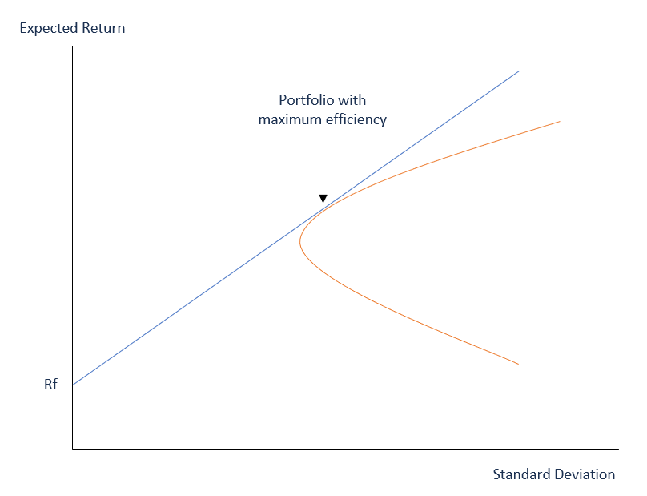

In the ever-evolving world of finance, investors continually seek strategies that balance the dual objectives of maximizing returns and minimizing risk. One pivotal approach firmly rooted in this pursuit is mean-variance analysis, which serves as a cornerstone of modern portfolio theory. 

Mean-variance analysis offers a strategic framework to assess the delicate trade-off between expected returns and the risk associated with various investment choices. By examining the variance and expected return of asset returns, investors gain the analytical tools necessary to construct and manage diversified portfolios effectively. This methodology empowers investors to evaluate individual assets not only on their potential returns but also on their contribution to overall portfolio risk, thereby enhancing their capacity to make informed investment decisions.



This article focuses on integrating mean-variance analysis within the broader context of portfolio theory and algorithmic trading. Such an integration provides investors with a sophisticated approach to optimizing portfolios. It involves constructing an efficient frontier, which represents the set of portfolios offering the highest expected return for a given level of risk. The synergy between mean-variance analysis and algorithmic trading facilitates real-time adjustments and decision-making, adapting portfolios dynamically to changing market conditions.

By exploring these concepts, this article aims to unlock pathways to strategic investment decisions, equipping investors with methodologies to construct resilient portfolios capable of navigating market volatility and achieving long-term financial goals.

## Table of Contents

## Understanding Mean-Variance Analysis

Mean-variance analysis is a fundamental component of modern portfolio theory, offering investors a structured method to evaluate the trade-off between risk and return when constructing investment portfolios. The primary objective of this analysis is to identify an optimal balance wherein portfolio risk is minimized for a given level of expected return, or equivalently, to maximize expected return for a given level of risk.

**Key Components of Mean-Variance Analysis**

1. **Expected Return**: This is the average return an asset is expected to generate over a specific period. It is generally calculated as the weighted average of possible outcomes, with the weights being the probabilities of each outcome. Mathematically, the expected return $E(R)$ of a portfolio is expressed as:
$$
   E(R) = \sum_{i=1}^{n} w_i \cdot E(R_i)

$$

   where $w_i$ represents the weight of each asset in the portfolio, and $E(R_i)$ is the expected return of asset $i$.

2. **Variance and Standard Deviation**: Variance measures the dispersion of asset returns around their expected value. It quantifies risk by indicating the degree to which actual returns might deviate from the expected return. The standard deviation, being the square root of variance, is often preferred as it expresses risk in the same unit as returns, making it more intuitively comprehensible. The variance $\sigma^2$ of a portfolio is given by:
$$
   \sigma^2 = \sum_{i=1}^{n} \sum_{j=1}^{n} w_i w_j \sigma_{ij}

$$

   where $\sigma_{ij}$ is the covariance between the returns of asset $i$ and asset $j$.

**Impact on Investment Decisions**

Understanding these components assists investors in making more informed decisions. By quantifying the expected return and variance, investors gain insight into the risk-return profile of different assets or portfolios. This understanding allows them to construct portfolios that align with their individual risk tolerance and investment objectives.

Portfolio managers utilize mean-variance analysis to assess the viability of investment opportunities, adapting portfolios in the context of changing market conditions. By examining the variance of asset returns, they can better manage potential risks, leading to the development of more resilient and optimized portfolios.

In practical applications, the calculation and analysis of these components can be automated through programming. Here is an example of calculating expected return and portfolio variance using Python:

```python
import numpy as np

# Expected returns for each asset
expected_returns = np.array([0.05, 0.10, 0.15])

# Portfolio weights
weights = np.array([0.4, 0.4, 0.2])

# Covariance matrix of asset returns
cov_matrix = np.array([[0.005, -0.010, 0.004],
                       [-0.010,  0.040, -0.002],
                       [0.004, -0.002,  0.023]])

# Calculate expected portfolio return
port_return = np.dot(weights, expected_returns)

# Calculate portfolio variance
port_variance = np.dot(weights.T, np.dot(cov_matrix, weights))

print(f"Expected Portfolio Return: {port_return:.2%}")
print(f"Portfolio Variance: {port_variance:.4f}")
```

In this example, investors can observe how adjusting portfolio weights influences expected return and variance, facilitating the construction of portfolios with favorable risk-return characteristics. By strategically applying mean-variance analysis, they can enhance their risk management and investment planning, ultimately striving for optimal portfolio performance.

## Portfolio Theory and Mean-Variance Optimization

Portfolio theory, which Harry Markowitz introduced in the early 1950s, has revolutionized the way investors approach risk management and asset allocation. The fundamental premise of portfolio theory is diversification. By combining assets with varying return distributions, investors can form a portfolio that minimizes risk for a specific level of expected return. This concept challenges the idea of evaluating securities in isolation and instead focuses on their combined impact within a portfolio.

Mean-variance optimization, central to portfolio theory, focuses on constructing an optimal portfolio that offers the greatest expected return for a given amount of risk. This process entails defining a set of efficient portfolios that represent the best possible risk-reward combinations. To achieve this, one must calculate:

1. **Expected Return** ($E(R_p)$): The weighted average of the expected returns of the individual assets in the portfolio. It can be expressed as:
$$
   E(R_p) = \sum_{i=1}^{n} w_i \cdot E(R_i)

$$
   where $w_i$ is the weight of asset $i$ in the portfolio, and $E(R_i)$ is the expected return of asset $i$.

2. **Portfolio Variance** ($\sigma_p^2$): This measures the variability of portfolio returns and is calculated as:
$$
   \sigma_p^2 = \sum_{i=1}^{n} \sum_{j=1}^{n} w_i \cdot w_j \cdot Cov(R_i, R_j)

$$
   where $Cov(R_i, R_j)$ represents the covariance between the returns of assets $i$ and $j$.

3. **Efficient Frontier**: The graphical representation of the set of optimal portfolios that offer the highest expected return for a defined level of risk, depicted as part of the risk-return spectrum. Portfolios on this frontier are considered optimal.

The optimization process involves solving for the asset weights ($w_i$) that minimize portfolio variance while meeting a specific expected return. This can be formulated as a quadratic programming problem, often implemented through mathematical programming solvers or libraries.

For hands-on optimization, Python offers several libraries such as NumPy for mathematical operations, Pandas for data manipulation, and SciPy for optimization. Here's a basic implementation using Python:

```python
import numpy as np
from scipy.optimize import minimize

# Simulated data: Expected returns, covariance matrix
expected_returns = np.array([0.1, 0.2, 0.15])
cov_matrix = np.array([
    [0.005, -0.010, 0.004],
    [-0.010, 0.040, -0.002],
    [0.004, -0.002, 0.023]
])

# Objective function: Minimize portfolio variance
def portfolio_variance(weights):
    return np.dot(weights.T, np.dot(cov_matrix, weights))

# Constraints
constraints = ({'type': 'eq', 'fun': lambda x: np.sum(x) - 1},
               {'type': 'eq', 'fun': lambda x: np.dot(x, expected_returns) - 0.15})

# Bounds: Weights must be between 0 and 1
bounds = tuple((0, 1) for _ in range(len(expected_returns)))

# Initial guess
initial_weights = np.array([1/3, 1/3, 1/3])

# Optimization
result = minimize(portfolio_variance, initial_weights, method='SLSQP', bounds=bounds, constraints=constraints)

# Optimal weights
optimal_weights = result.x
```

Through mean-variance optimization, investors can strategically allocate resources across various asset classes, constructing portfolios that are not only efficient in terms of risk-adjusted returns but are also robust against market uncertainties. This quantitative method empowers investors to align their portfolios with their risk tolerance while striving for maximal returns.

## Algorithmic Trading and Portfolio Management

Algorithmic trading utilizes sophisticated algorithms to efficiently manage portfolios by automating the process of identifying and executing trading opportunities. This approach is characterized by rapid decision-making and execution, harnessing computational power to analyze large datasets and market signals. Integrating mean-variance analysis into [algorithmic trading](/wiki/algorithmic-trading) can further refine trading strategies by optimizing risk-return profiles.

Mean-variance analysis, a key component of modern portfolio theory, focuses on balancing risk and return. By incorporating this analysis into algorithmic strategies, traders can enhance decision-making processes in real-time. Algorithms can be programmed to evaluate an asset's expected return against its variance, thus enabling more refined and dynamic portfolio adjustments. These adjustments ensure that the portfolio remains aligned with the investor’s risk tolerance and investment goals as market conditions evolve. The mathematical foundation provided by mean-variance optimization is crucial in constructing portfolios that are efficient, i.e., achieving the maximum expected return for a given risk level or minimizing risk for a given return.

A typical algorithmic trading system integrating mean-variance analysis could operate through the following Python pseudocode:

```python
import numpy as np
from scipy.optimize import minimize

# Simulated returns and covariance matrix
expected_returns = np.array([0.1, 0.2, 0.15])
covariance_matrix = np.array([[0.005, -0.001, 0.004],
                              [-0.001, 0.010, -0.002],
                              [0.004, -0.002, 0.020]])

# Objective: Minimize variance for a given return
def objective(weights):
    return np.dot(weights.T, np.dot(covariance_matrix, weights))

# Constraint: Expected portfolio return
def constraint(weights):
    return np.sum(weights * expected_returns) - target_return

# Portfolio constraints
constraints = ({'type': 'eq', 'fun': constraint})
bounds = tuple((0, 1) for _ in range(len(expected_returns)))
target_return = 0.12

# Initial guess
initial_weights = np.ones(len(expected_returns)) / len(expected_returns)

# Minimize variance
optimized_result = minimize(objective, initial_weights, bounds=bounds, constraints=constraints)

# Optimal portfolio weights
optimal_weights = optimized_result.x
```

This example illustrates how a mean-variance optimization process can identify an optimal set of asset weights to achieve the desired portfolio performance. The flexibility of algorithmic trading allows such strategies to continuously monitor market conditions and rebalance portfolios based on real-time data.

The synergy between algorithmic trading and mean-variance optimization ensures that portfolios are continually adjusted to align with evolving market conditions. This dynamic approach is adept at adapting to fluctuations, maintaining the robustness of the portfolio, and managing [volatility](/wiki/volatility-trading-strategies) effectively. By automatizing these complex calculations and leverages, algorithmic trading with mean-variance analysis offers a systematic method to improve performance, reduce risk, and enhance overall portfolio management.

## Applications and Benefits of Mean-Variance Analysis

Mean-variance analysis serves as a fundamental component in managing financial portfolios, offering significant advantages in risk management, portfolio optimization, and asset allocation. By examining the trade-off between expected return and risk, defined by the variance or standard deviation of returns, investors can make informed decisions tailored to their unique financial goals and risk appetites.

### Customizing Portfolios to Individual Preferences

Investors can utilize mean-variance analysis to construct portfolios aligned with their specific risk tolerance and investment objectives. The primary aim is to find an optimal portfolio that maximizes expected return for a given level of risk or minimizes risk for a certain return threshold. This is achieved by analyzing the expected returns and the covariance among assets, leading to the selection of asset combinations that maintain a desired risk profile.

### Systematic Portfolio Rebalancing

One of the noteworthy benefits of mean-variance analysis is its capacity to facilitate systematic portfolio rebalancing. As market conditions change, the risk-return characteristics of portfolio assets can shift, necessitating adjustments to maintain the intended asset allocation. For instance, if an investor’s portfolio has veered from its optimal risk-return profile due to market volatility, mean-variance analysis can guide adjustments to steer the portfolio back on [course](/wiki/best-algorithmic-trading-courses). 

### Identifying Securities with Favorable Risk-Return Profiles

Mean-variance analysis aids in the identification of securities that offer attractive risk-return profiles, essentially highlighting those investments that provide higher expected returns for lower relative risk. By considering the correlation between different assets, investors can pinpoint combinations that enhance diversification, thereby reducing overall portfolio risk without sacrificing potential returns.

### Minimizing Catastrophic Losses

Another critical advantage of this analysis is its role in minimizing the likelihood of catastrophic losses. Through diversification, mean-variance optimization reduces specific risks associated with individual assets by spreading exposures across various securities, sectors, or geographical regions. This diversification is predicated on the principle that not all asset classes will respond similarly to economic or market stimuli, thus lowering the impact of adverse movements on the portfolio’s total value.

By integrating these applications into investment strategies, mean-variance analysis empowers investors to achieve a well-rounded, resilient portfolio capable of withstanding market fluctuations. This quantitative approach remains a cornerstone in modern finance for crafting efficient portfolios that balance risk and return adeptly.

## Conclusion

In the contemporary landscape of financial markets, where complexity and uncertainty prevail, strategies like mean-variance analysis stand out as essential tools for investors aiming to make informed decisions. This quantitative approach allows for a structured analysis of the risk-return trade-off, offering insights into optimal asset allocation.

The integration of portfolio theory with algorithmic trading marks a significant advancement in the pursuit of maximizing returns while effectively mitigating risks. Portfolio theory, with its foundation in diversification and efficient frontier concepts, provides a robust framework for constructing portfolios that aim for the highest expected return given a specific level of risk. When combined with the precision and speed of algorithmic trading, investors can optimize their portfolios in real-time, adapting swiftly to market changes and volatility. This synergy results in a dynamic investment strategy capable of consistently adjusting to market conditions, thus optimizing the risk-reward balance.

The diligent application of these financial principles empowers investors to build portfolios that are not only robust but also resilient. These portfolios are better equipped to withstand the vicissitudes of market turbulence, thanks to ongoing recalibration and strategic realignment based on quantitative analysis. As financial landscapes continue to evolve, embracing strategies like mean-variance analysis bolstered by algorithmic trading methodologies will remain instrumental in achieving sustainable and profitable investment outcomes.

## FAQ

### What is mean-variance analysis, and how does it enhance investment strategies?

Mean-variance analysis is a fundamental process within modern portfolio theory that quantifies the relationship between risk and return. It evaluates portfolios based on the expected return (mean) and the risk (variance or standard deviation) associated with achieving those returns. By using these metrics, investors can construct portfolios that aim to minimize risk for a given level of expected return, or conversely, maximize expected return for a predetermined level of risk. This enhances investment strategies by providing a quantitative framework to make informed decisions, balancing the trade-off between risk and return effectively.

### How does mean-variance optimization differ from other portfolio management strategies?

Mean-variance optimization is distinct from other portfolio management strategies due to its rigorous mathematical approach that focuses on risk-return trade-offs. While other strategies might prioritize qualitative factors like management quality or market trends, mean-variance optimization systematically analyzes historical data to determine the optimal asset allocation. It employs the covariance between asset returns to achieve diversification, thereby reducing unsystematic risk. Unlike some strategies that rely heavily on forecasting future conditions, mean-variance optimization relies on statistical measures drawn from historical data to guide decision-making, which can be both a strength and a limitation, depending on market conditions.

### Can algorithmic trading effectively incorporate mean-variance analysis for better performance?

Yes, algorithmic trading can effectively incorporate mean-variance analysis to enhance performance. Algorithms can be designed to automatically adjust portfolio allocations based on the real-time analysis of risk-return profiles. This automated process allows for the continual reassessment of portfolios, ensuring they remain aligned with optimal risk-return parameters as market conditions evolve. By integrating mean-variance analysis, algorithms can swiftly react to changes, thus maintaining the portfolio's efficient frontier. Python, for instance, can be utilized to implement such strategies:

```python
import numpy as np

def portfolio_return(weights, returns):
    return np.dot(weights, returns)

def portfolio_variance(weights, cov_matrix):
    return np.dot(weights.T, np.dot(cov_matrix, weights))

weights = np.array([0.2, 0.3, 0.5])  # Example weights
returns = np.array([0.05, 0.1, 0.12])
cov_matrix = np.array([[0.1, 0.02, 0.04], [0.02, 0.2, 0.02], [0.04, 0.02, 0.3]])

print('Expected Return:', portfolio_return(weights, returns))
print('Expected Variance:', portfolio_variance(weights, cov_matrix))
```

This code demonstrates calculating expected return and variance, fundamental components of mean-variance optimization, which can be embedded into high-frequency trading algorithms.

### What are the primary benefits of using mean-variance optimization in portfolio management?

The primary benefits of using mean-variance optimization in portfolio management include:

1. **Risk Management**: It enables investors to quantitatively assess and control the risks associated with their portfolio, ensuring the risk taken is commensurate with expected returns.

2. **Diversification**: By analyzing the covariance between different asset returns, mean-variance optimization helps in constructing diversified portfolios that minimize unsystematic risk.

3. **Objective Decision-Making**: Investing decisions are guided by statistical analysis rather than emotion or heuristics, leading to more consistent and replicable results.

4. **Efficient Resource Allocation**: This method identifies the most efficient allocation of resources across various assets, maximizing returns for a given risk level or minimizing risk for a desired return level.

Overall, mean-variance optimization provides a structured approach to portfolio management, helping achieve better aligned risk-reward profiles essential for long-term financial success.

## References & Further Reading

[1]: Markowitz, H. (1952). ["Portfolio Selection."](https://onlinelibrary.wiley.com/doi/abs/10.1111/j.1540-6261.1952.tb01525.x) The Journal of Finance, 7(1), 77–91.

[2]: Bodie, Z., Kane, A., & Marcus, A. J. (2014). "Investments." McGraw-Hill Education.

[3]: Elton, E. J., Gruber, M. J., Brown, S. J., & Goetzmann, W. N. (2014). "Modern Portfolio Theory and Investment Analysis." John Wiley & Sons.

[4]: Merton, R. C. (1972). ["An Analytic Derivation of the Efficient Portfolio Frontier."](http://www.stat.ucla.edu/~nchristo/statistics_c183_c283/analytic_derivation_frontier.pdf) Journal of Financial and Quantitative Analysis, 7(4), 1851-1872.

[5]: Ang, A. (2014). ["Asset Management: A Systematic Approach to Factor Investing."](https://archive.org/details/assetmanagements0000anga) Oxford University Press.