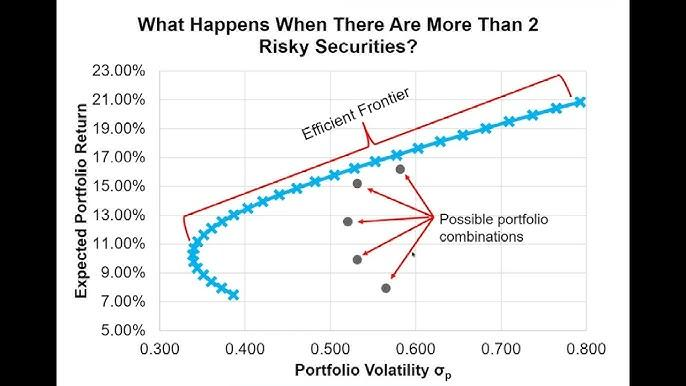

Mean-Variance Optimization (MVO) stands as a fundamental element of modern portfolio theory, extensively utilized in finance for the purpose of optimizing portfolios. This technique is particularly significant in the sphere of algorithmic trading, offering practical applications that are crucial for contemporary financial strategies. The concept of MVO was pioneered by Harry Markowitz in the 1950s and underlines the essential balance between risk and return – a core consideration in investment analysis.

MVO plays a pivotal role in formulating portfolios that strive to maximize expected return for a specified level of risk or, conversely, minimize risk for a desired expected return. The method aims to construct efficient portfolios by determining the optimal weights of different assets based on their expected returns, standard deviations (volatility), and correlations with one another.

A central principle in MVO is the exploitation of the correlation between asset returns to diminish the overall risk of a portfolio. By diversifying investments across assets with varying performance in different market conditions, the technique reduces the portfolio’s exposure to individual asset risks. Mathematically, this relationship is captured through the covariance matrix of asset returns:

$$
\sigma_p^2 = \sum_{i=1}^{n}\sum_{j=1}^{n}w_iw_j\sigma_{ij}
$$

where $\sigma_p^2$ denotes the portfolio variance, $w_i$ and $w_j$ represent the weights of assets $i$ and $j$ in the portfolio, and $\sigma_{ij}$ symbolizes the covariance between the returns of assets $i$ and $j$.

By leveraging these statistical properties of asset returns, MVO provides a systematic way to achieve an optimal balance between risk and reward, thereby forming the backbone of many automated trading systems and investment strategies that seek efficiency and precision in financial markets.

## Table of Contents

## Theoretical Foundation

Mean-variance optimization (MVO) relies on several foundational assumptions integral to its framework: expected returns, [volatility](/wiki/volatility-trading-strategies), correlation, and the risk-free rate. These components influence the construction of portfolios that either maximize expected return for a defined level of risk or minimize risk for a specified level of expected return.

The expected return of a portfolio is calculated as the weighted sum of the individual asset returns. Mathematically, this can be expressed as:

$$
E(R_p) = \sum_{i=1}^{n} w_i \cdot E(R_i)
$$

where $E(R_p)$ is the expected return of the portfolio, $w_i$ represents the weight of asset $i$ in the portfolio, and $E(R_i)$ is the expected return of asset $i$.

Portfolio risk considers both the variances of the individual asset returns and their covariances. The portfolio's variance, a measure of risk, is determined by:

$$
\sigma^2_p = \sum_{i=1}^{n}\sum_{j=1}^{n} w_i w_j \sigma_{ij}
$$

Here, $\sigma^2_p$ is the variance of the portfolio, $\sigma_{ij}$ is the covariance between asset $i$ and asset $j$, and the summation iterates over all asset pairs in the portfolio.

A central concept in mean-variance optimization is the efficient frontier, which represents the set of optimal portfolios offering the maximum expected return for a given level of risk. Portfolios on the efficient frontier are considered optimal, as they provide the highest expected return for a defined risk or a minimal risk for a given level of return. The efficient frontier assumes that increasing the expected return typically requires accepting additional risk, but through careful asset selection, one can achieve an optimal risk-return trade-off.

The Capital Market Line (CML) is an extension of MVO, which incorporates a risk-free asset into the analysis. This line represents the risk-return trade-off available to investors in the market and is defined as:

$$
E(R_c) = R_f + \frac{E(R_m) - R_f}{\sigma_m} \cdot \sigma_c
$$

In this equation, $E(R_c)$ is the expected return on the capital market line, $R_f$ is the risk-free rate, $E(R_m)$ is the expected market return, $\sigma_m$ is the market portfolio's standard deviation, and $\sigma_c$ is the standard deviation of the portfolio on the CML. This equation signifies the optimal combination of risk-free assets and the market portfolio, indicating how an investor can allocate resources to achieve a desired balance of risk and return.

Understanding and leveraging the theoretical foundations of MVO, including these key concepts and assumptions, enables investors and financial institutions to design portfolios that align with specific investment objectives and risk tolerances.

## Practical Application

Applying mean-variance optimization (MVO) in real-world scenarios involves addressing numerous challenges and deploying specific techniques to achieve optimal portfolio management. The process begins with accurate input estimation, which is crucial for effective portfolio optimization. This involves predicting expected returns, volatilities, and covariances of assets. These parameters are essential inputs for the optimization algorithm and play a significant role in determining the effectiveness of the MVO approach.

Expected return is typically estimated using historical data, macroeconomic indicators, or analyst forecasts. Volatility, or the standard deviation of asset returns, provides a measure of risk, while covariance accounts for the degree to which assets move in relation to one another. These inputs feed into the optimization model, enabling the construction of a portfolio that aims to maximize expected returns for a specified level of risk, or equivalently, minimize risk for a given return.

Various optimization techniques are employed to determine the optimal portfolio weights. Quadratic programming is one of the most widely used methods, given the quadratic nature of the risk function in MVO. The typical quadratic optimization problem can be represented as:

$$

\begin{align*}
\min & \quad w^T \Sigma w \\
\text{subject to} & \quad w^T \mu = R_p \\
& \quad w^T \mathbf{1} = 1 \\
& \quad w \geq 0 
\end{align*} 
$$

where $w$ is the vector of portfolio weights, $\Sigma$ is the covariance matrix of asset returns, $\mu$ is the vector of expected returns, $R_p$ is the target portfolio return, and $\mathbf{1}$ is a vector of ones.

In addition to quadratic programming, numerical methods and heuristic algorithms, such as the genetic algorithm, may be utilized to solve the optimization problem, especially when dealing with complex constraints or large datasets.

Portfolio rebalancing is another critical aspect of practical MVO application. As market conditions fluctuate, asset prices and other market variables change, potentially altering the risk-return profile of the portfolio. Regular rebalancing ensures that the portfolio remains aligned with the investor’s objectives and risk tolerance. The frequency and method of rebalancing depend on factors such as transaction costs, tax implications, and market volatility.

Real-world application of MVO also requires consideration of factors like transaction costs, taxes, and [liquidity](/wiki/liquidity-risk-premium) constraints. Transaction costs can erode returns, necessitating their inclusion in the optimization process. Similarly, taxes can impact the net returns of certain investment strategies, and must be considered when rebalancing portfolios. Liquidity constraints, which relate to the ease with which assets can be bought or sold without affecting their price, also play a role in portfolio construction and management.

In practice, incorporating these real-world considerations often requires sophisticated modeling techniques and computational tools to balance trade-offs effectively. Financial organizations, therefore, utilize advanced software and algorithms to navigate these complexities, allowing for more robust and realistic portfolio management strategies.

## Extensions and Variations

The field of mean-variance optimization has advanced with several extensions and variations designed to mitigate certain limitations of the traditional approach. Among these, the Black-Litterman model is noteworthy as it combines the insights of traditional mean-variance optimization with market equilibrium. This model incorporates investor views on expected returns alongside market data, effectively addressing issues such as the sensitivity of portfolio weights to changes in expected returns.

Robust optimization is another significant extension aimed at enhancing decision-making under uncertainty. By incorporating uncertainty sets, robust optimization ensures that portfolio decisions remain effective across a range of possible scenarios. This method mitigates the impact of estimation errors, especially in the contexts of volatility and covariance, by providing more conservative and consistent results compared to traditional mean-variance approaches.

Conditional Value-at-Risk (CVaR) is utilized to focus on tail risk management, addressing scenarios with extreme losses. CVaR is an alternative risk assessment metric that captures the expected loss given that the loss is beyond a certain percentile. By integrating CVaR into the optimization process, investors can design portfolios that are more resilient to unexpected market downturns.

Dynamic Mean-Variance Optimization (MVO) further evolves the traditional model by allowing portfolio adjustments over time as market conditions change. This adaptability ensures that portfolios remain optimal as the financial environment evolves, balancing the trade-off between risk and return in a dynamic fashion. 

These extensions aim to enhance the flexibility and robustness of mean-variance optimization, providing more comprehensive tools for portfolio management under uncertainty. By integrating such advanced methodologies, investors can better navigate volatile and unpredictable financial markets, maintaining a strategic edge in optimizing asset allocations.

## Case Studies and Implementation

Leading financial institutions like BlackRock and Goldman Sachs have been at the forefront of implementing advanced Mean-Variance Optimization (MVO) strategies to manage assets, optimize asset allocation, and effectively control risk. These institutions utilize a blend of quantitative techniques, technological innovation, and financial expertise to create portfolios that strive to achieve the optimal balance between risk and expected return.

BlackRock, known for its quantitative investment models, employs MVO through its Aladdin platform, which provides a comprehensive view of portfolio risks and returns by integrating MVO with sophisticated risk management tools. This platform allows portfolio managers to simulate various market scenarios, perform stress tests, and adjust asset allocations dynamically, ensuring that the portfolios align with investor goals while adhering to risk constraints. BlackRock’s approach exemplifies how MVO can be scaled to manage extensive and diversified portfolios, catering to a global clientele with varied investment objectives.

Similarly, Goldman Sachs leverages MVO by incorporating it into their quantitative strategies team. The firm utilizes advanced algorithms and statistical models to enhance traditional MVO, adjusting for factors such as transaction costs, market impact, and liquidity constraints. Goldman Sachs extends MVO's traditional framework by incorporating [alternative data](/wiki/best-alternative-data) sources and [machine learning](/wiki/machine-learning) techniques to refine input estimates for expected returns, volatilities, and correlations. This improvement allows for more precise optimization, resulting in portfolios that better reflect current and anticipated market conditions.

By examining these implementations, key insights into the practical benefits and challenges of MVO can be obtained. The use of MVO allows institutions to construct portfolios that are not only efficient in their risk-return trade-off but also adaptable to changing market dynamics. However, challenges such as accurate input estimation, model risk, and the integration of complex real-world constraints remain significant. These challenges necessitate continuous advancements in computational methods and data analytics to ensure the efficacy and relevance of MVO frameworks in modern financial markets.

In conclusion, the sophisticated application of MVO by leading financial firms like BlackRock and Goldman Sachs underscores its critical role in contemporary asset management. By leveraging advanced quantitative methods and technological infrastructures, these institutions exemplify how MVO can be effectively employed to navigate the complexities of financial markets and meet the strategic objectives of investors.

## Conclusion

Mean-Variance Optimization (MVO) persists as an indispensable instrument within the financial sector, primarily applied to systematic portfolio construction and risk management. At its core, MVO guides investors by optimizing the allocation of assets to achieve the desired balance between risk and return. This methodology simplifies complex decisions, offering a clear framework based on quantifiable metrics such as expected return and risk, typically measured as variance.

Despite its widespread applicability, MVO is not without limitations. One notable challenge is the sensitivity of the optimization process to the input parameters, including expected returns, variances, and covariances. Small deviations in these inputs can lead to substantial changes in the resulting asset allocation, potentially undermining portfolio robustness. Furthermore, MVO assumes that asset returns follow a normal distribution, an assumption that may not hold in all market conditions. It also necessitates a stationary covariance matrix, which may not be realistic in fluctuating financial markets.

Nonetheless, ongoing advancements continue to enhance the relevance of MVO in complex financial environments. Techniques such as robust optimization and the inclusion of alternative risk measures are being developed to address traditional shortcomings and improve the flexibility of the model. These innovations allow for more reliable and adaptive portfolio management strategies that better accommodate market anomalies and extreme events.

Informed asset allocation decisions, grounded in mean-variance optimization, persistently guide investors toward their financial objectives. By systematically balancing return expectations against associated risks, MVO equips investors with the analytical tools necessary to navigate the intricate landscape of financial markets, thus ensuring its continued utility in strategic investment planning.

## References & Further Reading

[1]: Markowitz, H. (1952). ["Portfolio Selection"](https://onlinelibrary.wiley.com/doi/abs/10.1111/j.1540-6261.1952.tb01525.x). The Journal of Finance, 7(1), 77-91.

[2]: Fabozzi, F. J., Gupta, F., & Markowitz, H. M. (2002). ["The Legacy of Modern Portfolio Theory."](http://www.simonemariotti.com/downloads/Papers%20finanziari/Fabozzi-Gupta-Mar.pdf) The Journal of Investing, 11(3), 7-22.

[3]: Black, F., & Litterman, R. (1992). ["Global Portfolio Optimization."](https://people.duke.edu/~charvey/Teaching/BA453_2006/Black_Litterman_Global_Portfolio_Optimization_1992.pdf) Financial Analysts Journal, 48(5), 28-43.

[4]: ["Mean-Variance Portfolio Theory"](https://en.wikipedia.org/wiki/Modern_portfolio_theory) by Harry Markowitz

[5]: Elton, E. J., Gruber, M. J., Brown, S. J., & Goetzmann, W. N. (2007). ["Modern Portfolio Theory and Investment Analysis."](https://books.google.com/books/about/Modern_Portfolio_Theory_and_Investment_A.html?id=181CEAAAQBAJ) Wiley.

[6]: Michaud, R. O., & Michaud, R. M. (2008). ["Efficient Asset Management: A Practical Guide to Stock Portfolio Optimization and Asset Allocation."](https://academic.oup.com/book/52209) Oxford University Press.

[7]: Luenberger, D. G. (1997). ["Investment Science."](https://www.amazon.com/Investment-Science-David-G-Luenberger/dp/0199740089) Oxford University Press.

[8]: Jorion, P. (1991). ["Bayes-Stein Estimation for Portfolio Analysis."](https://www.cambridge.org/core/journals/journal-of-financial-and-quantitative-analysis/article/abs/bayesstein-estimation-for-portfolio-analysis/B7D5C6C54432BDE3F8E3B107E68B0E1E) Journal of Financial and Quantitative Analysis, 26(3), 279-292.