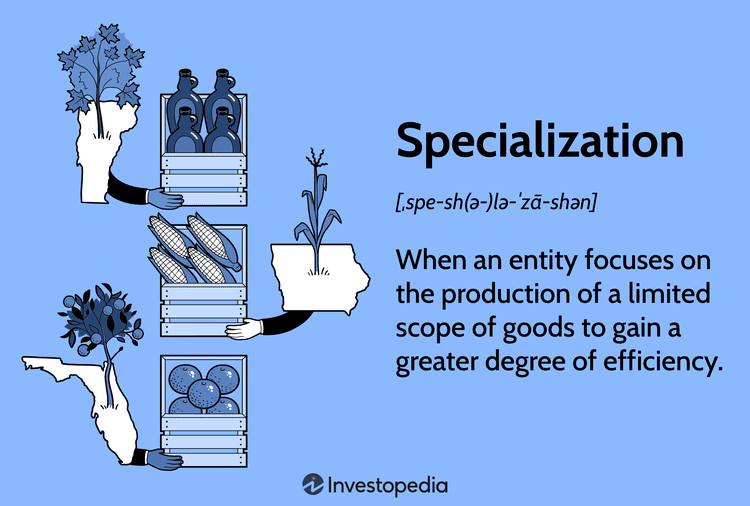

Understanding property boundaries and land surveying is crucial for maintaining clear ownership records, especially in areas adjacent to water bodies. Accurate delineation of land is essential for legal clarity, resource management, and environmental protection. Within this framework, the concept of meander lines is pivotal. Meander lines are survey lines used to represent the edge of irregular water bodies like rivers and lakes, providing a means to approximate the boundary between water and land. These lines help define the theoretical edge of water bodies, offering a basis for determining adjoining land tracts for governmental surveys and property assessments. While not fixed boundaries, they play a key role in assessing how land and water interfaces change over time due to natural processes such as sedimentation or erosion.

Concurrently, the financial markets have experienced a significant transformation with the advent of algorithmic trading, commonly referred to as algo trading. This technological advancement, characterized by the use of complex algorithms to execute trades automatically at speeds and frequencies beyond human capability, has revolutionized market dynamics. The adoption of algo trading has led to increased liquidity and market efficiency, enabling traders to capitalize on slight fluctuations in market prices for optimized gains.



The article explores the intersection between meander lines in land surveying and the dynamic world of algo trading. On the surface, these fields may appear disparate; however, they both handle intricate data sets and rely heavily on technology and precision. The analysis of spatial data in surveying and the use of trading algorithms in finance showcase the role of mathematical modeling and data-driven decision-making in tackling unique challenges across different sectors. Through this exploration, the article aims to provide insights into how advancements in technology and data analysis can drive innovation and integration, potentially blending methodologies from both fields to solve complex problems in areas such as real estate valuation.

## Table of Contents

## What is Meander Line in Land Surveying?

Meander lines in land surveying are crucial for accurately mapping the perimeters of water bodies such as rivers and lakes. Unlike fixed boundary lines, meander lines serve to define the theoretical edge of these water bodies, acknowledging the natural and often dynamic boundaries influenced by factors such as erosion and sediment deposition.

The primary function of meander lines is to help delineate the adjacent land tracts. During the survey of public lands in the United States, a meander line is established to create a framework for adjoining land tracts, playing a vital role in governmental cadastral functions. These lines are utilized to determine the extent of land ownership by identifying the boundary where land meets water. Surveyors use meander lines as a basis for calculating the acreage of riparian (water-adjacent) tracts, essential for managing and recording land for taxation, sale, or conservation purposes. 

It's important to note that while meander lines provide a useful guide for shaping land borders near water, they are not static indicators. Natural processes can alter the landscape, meaning that these theoretical boundaries may shift over time. Adjustments may be necessary to account for changing water levels and shorelines. This adaptability underscores why meander lines are not recognized as legal boundaries but instead are instrumental in helping surveyors translate natural features into measurable data for land administration. 

Overall, meander lines play a vital role in bridging natural geography with systematic land management, ensuring that land parcels are accurately represented and managed in relation to their watery borders.

## Legal Implications of Meander Lines

Meander lines, although not official property demarcations, play a significant role in legal contexts involving land ownership and rights. These lines are essential in cases where the boundaries between land and water bodies are blurred, often due to natural changes in water levels, erosion, or flooding. The use of meander lines aids in delineating the theoretical edge of a body of water for survey purposes, which can become particularly contentious when the physical landscape shifts.

The legal implications of meander lines are evident in property rights disputes, particularly when bodies of water change their [course](/wiki/best-algorithmic-trading-courses) or size over time. For instance, if a river gradually erodes its banks or a lake's water level recedes, the meander lines originally established during surveying may no longer align with the current physical boundaries. This misalignment can lead to legal challenges as property owners may find their land encroached upon or newly exposed, prompting questions of property rights and land ownership redistribution.

Understanding the legal framework that involves meander lines is crucial in navigating such disputes. Typically, the principle of accretion and reliction may influence decisions in these cases. Accretion refers to the gradual increase in land by depositing soil or sediment, while reliction pertains to the increase of land area when water levels permanently recede. These principles aid in determining how property rights adjust to shifting meander lines, often requiring expert interpretation and legal guidance.

Furthermore, in legal disputes, historical case law often informs proceedings involving meander lines. Courts examine past rulings and the application of survey principles to offer precedents that might influence current judgments. For example, the way courts interpret changes in the shoreline and their impact on land ownership could be pivotal in current cases involving similar circumstances.

Ultimately, individuals and entities involved in disputes over land adjoining water bodies must possess a nuanced understanding of the interaction between physical changes in geography and legal rights as defined by meander lines. This understanding helps to prevent and resolve conflicts, maintaining the integrity of property rights in light of ever-changing natural landscapes.

## Property Boundaries and Meander Lines: A Case Study

In the quest to understand the complexities of property boundaries adjacent to water bodies, the case of Bliss v. Kinsey serves as a poignant illustration of the intricate relationship between meander lines and current land use. Historically, meander lines were drawn during initial surveys to form approximations of water body boundaries, which were not intended to act as precise legal property lines. This distinction is vital, as it often leads to contention when aligning historic survey data with today's property delimitation.

In Bliss v. Kinsey, the heart of the legal dispute centered on whether the meander line recorded during early land surveys accurately reflected the natural and observable boundaries of the property. This case exemplifies how water level changes, due to phenomena such as erosion and sediment deposit changes over time, affect property lines. Consequently, when such natural alterations occur, the question becomes whether the land gained due to recession belongs to the upland property owner, or if new surveys should redefine property boundaries.

Surveyors and legal professionals often face challenges when historical meander lines no longer align with the current geographical and topographical realities. To navigate these discrepancies, they employ advanced technologies such as Geographic Information Systems (GIS) to provide a more accurate mapping of existing conditions. GIS technology allows for overlaying historical survey maps with current satellite imagery, aids in the visualization of boundary changes, and provides clarity in legal disputes over land rights.

Furthermore, legal principles like accretion and avulsion play a critical role. Accretion refers to the gradual deposit of land by water action, potentially altering property lines slowly over time, which typically benefits the landowner. In contrast, avulsion is the sudden and perceptible change in a water body's course, typically leaving original boundary lines intact despite the change in land formation. Courts often rely on these principles to adjudicate disputes where current land use diverges from historical maps defined by meander lines.

In summary, cases like Bliss v. Kinsey underscore the significance of integrating historical survey methods with modern technological tools to resolve legal discrepancies concerning property boundaries, offering greater clarity and coherence in property law adjacent to dynamic water bodies.

## Algorithmic Trading: Revolutionizing Financial Markets

Algorithmic trading, commonly referred to as 'algo trading', leverages computer algorithms to automate trading processes, executing trades at speeds and frequencies unattainable by human traders. These algorithms are designed to follow specific criteria based on predefined strategies, such as timing, price, or [volume](/wiki/volume-trading-strategy), to make decisions on buying or selling financial securities.

The rapid growth of [algorithmic trading](/wiki/algorithmic-trading) has significantly transformed financial markets. By reducing the time needed to execute trades, it provides enhanced market [liquidity](/wiki/liquidity-risk-premium) and tighter bid-ask spreads. As a result, traders can capitalize on market inefficiencies more swiftly, often resulting in increased market [volatility](/wiki/volatility-trading-strategies). The precise nature of algo trading reduces human error and allows for greater consistency, leading to more robust and reliable trading outcomes.

Advancements in computing power and data analytics have further fueled the expansion of algo trading. These technological improvements enable more complex algorithms that can analyze vast amounts of data in real time, detect patterns, and react to market conditions efficiently. Consequently, many institutional investors and hedge funds have adopted algorithmic trading to manage large transactions and improve their operational efficiency.

The influence of algorithmic trading extends beyond individual markets, impacting market dynamics globally. It contributes to the globalization of markets by enabling seamless cross-border trading activities. However, this increased interconnectedness also introduces systemic risks, such as flash crashes, where automated trading leads to rapid market declines within minutes.

In summary, algorithmic trading represents a paradigm shift in financial market operations. Its ability to process information and execute strategies at extraordinary speeds offers substantial benefits while posing challenges in terms of market stability and regulatory oversight. As technology continues to evolve, the role of algo trading in shaping market dynamics is likely to expand further, necessitating continual adaptation by market participants and regulators alike.

## The Intersection of Land Surveying and Algo Trading

Land surveying and algorithmic trading, although seemingly disparate disciplines, share common ground in their reliance on advanced technology and data analysis. The mutual dependence on accurate data collection, sophisticated analysis, and technological advancements underscores a synergy between these fields that is often overlooked. 

Advancements in data collection technology, such as Geographic Information Systems (GIS) and remote sensing in land surveying, have been revolutionary. These technologies offer highly precise spatial data which is invaluable for determining property boundaries, especially in areas where natural features like water bodies have fluctuating boundaries. Accurate geospatial data is crucial for creating detailed maps and models that aid in effective land management and planning.

In algorithmic trading, technology facilitates the swift execution of trades based on complex algorithms that analyze vast datasets within milliseconds. High-frequency trading ([HFT](/wiki/high-frequency-trading-strategies)) relies on algorithmic systems to identify trading opportunities across global markets by quickly processing financial data and executing trades faster than human traders can manage. The ability to exploit minute price discrepancies across exchanges, optimize trading strategies, and manage risk profiles is largely due to advancements in data analytics and processing power.

The potential for integrating geospatial data from land surveying into trading algorithms presents exciting opportunities. For example, real estate investment strategies can be enhanced by incorporating detailed spatial data into financial models. By interpreting geospatial information, investors can better assess property values, anticipate market trends, and identify lucrative investment opportunities. This integration can prove particularly beneficial in regions where land characteristics significantly influence market dynamics.

Furthermore, [machine learning](/wiki/machine-learning) algorithms could integrate historical geospatial data, economic indicators, and real-time market data to predict property market shifts. A basic Python code snippet to demonstrate how geospatial data might be incorporated into an algo-trading strategy could involve using libraries such as `pandas`, `geopandas`, and `scikit-learn`:

```python
import pandas as pd
import geopandas as gpd
from sklearn.ensemble import RandomForestRegressor

# Load geospatial data
geo_data = gpd.read_file('property_data.shp')

# Load market data
market_data = pd.read_csv('market_data.csv')

# Merge datasets based on a common key
combined_data = geo_data.merge(market_data, on='property_id')

# Prepare features and target
features = combined_data[['location_index', 'property_size', 'market_volatility']]
target = combined_data['property_value']

# Train a machine learning model
model = RandomForestRegressor(n_estimators=100, random_state=42)
model.fit(features, target)

# Predict property values
predictions = model.predict(features)
```

Such models aid in making informed decisions by combining the spatial accuracy of land surveying with the analytical prowess of algorithmic trading. As both fields continue to evolve, the interconnection between land surveying and algo trading points towards innovative methodologies where data-driven insights can redefine standards and practices across both industries.

## Conclusion

Both meander line land surveying and algorithmic trading emerge as specialized fields that present unique sets of challenges and opportunities. In the realm of land surveying, understanding the intricacies of property boundaries, especially in dynamic environments adjacent to water bodies, is essential. Meander lines, while not definitive boundaries, are crucial for approximating and managing land ownership as they shift with natural changes in the landscape. This precise documentation is vital not only for legal clarity but also for environmental management and urban planning.

Algorithmic trading, on the other hand, represents a transformative force in financial markets, leveraging the precision and speed of computer algorithms to execute trades under predefined criteria. This method significantly impacts liquidity, market behavior, and efficiency, allowing investors to engage with the market in fundamentally new ways. The dynamic interaction of algorithms and data fosters an environment where trading decisions are refined continuously, reducing the influence of human emotion and error.

The intersection of these two fields draws from a shared reliance on technology and data analysis. With advancements in data collection techniques, both industries can benefit from more precise information and analysis. One exciting possibility arises in the potential integration of geospatial data into trading algorithms, a development that could revolutionize asset valuation, especially in the real estate sector. By incorporating this data, traders could obtain a more comprehensive understanding of property values influenced by geographic and environmental factors.

The future holds significant promise for further integration of methodologies from land surveying into algorithmic trading. As technology continues to evolve, so too will the opportunities to innovate at the confluence of these disciplines. Such innovations could redefine traditional boundaries, blending insights across sectors to optimize efficiency, accuracy, and strategic decision-making in both land management and financial trading arenas.

## References & Further Reading

[1]: Moore, J. W. (2002). ["Principles and Practices of Land Surveying"](https://www.scirp.org/%28S%28czeh4tfqyw2orz553k1w0r45%29%29/reference/referencespapers?referenceid=1239872). Land Surveyors Publishing.

[2]: McEwen, N. M., Diacogiannis, G. (1990). ["Mathematics and Computer Software for Surveying"](https://www.researchgate.net/publication/13801246_McEwen_BS_Protective_and_damaging_effects_of_stress_mediators_N_Engl_J_Med_338_171-9). Whittles Publishing.

[3]: Myers, B. R., & Remund, Q. (2019). ["Riparian Rights and Water Boundaries"](https://lawreview.vermontlaw.edu/wp-content/uploads/2019/06/vlaw_43n3_Hammond-Wagner.pdf). John Wiley & Sons.

[4]: King, R. J., & Chapman, D. (2008). ["Land Law and the Environment: Complementary or in Conflict?"](https://www.semanticscholar.org/paper/Differentiated-Assessment-Strategies:-One-Tool-Fit-Chapman-King/8f2d35ca2ef9d71d9279a584f05fd109cc188e4c). Oxford University Press.

[5]: Lo, A. W. (2020). ["Adaptive Markets: Financial Evolution at the Speed of Thought"](https://www.amazon.com/Adaptive-Markets-Financial-Evolution-Thought/dp/0691191360). Princeton University Press.