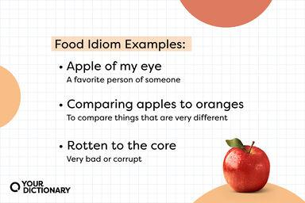

## Table of Contents

## What does the phrase 'eating someone's lunch' mean?

The phrase 'eating someone's lunch' means taking away someone's business or advantage. It's like when someone does better than another person in a competition or at work, and as a result, the other person loses out.

For example, if a new store opens and starts getting all the customers that used to go to an older store, people might say the new store is eating the older store's lunch. This phrase shows how one person or business can overpower another and take their place.

## Can you provide a simple example of 'eating someone's lunch' in a business context?

Imagine there are two pizza shops in a small town. One shop, called Joe's Pizza, has been there for years and always had lots of customers. But then a new pizza shop, called Tony's Pizza, opens up right across the street. Tony's Pizza starts offering better deals and tastier pizza. Soon, more and more people start going to Tony's instead of Joe's. Tony's Pizza is eating Joe's Pizza's lunch.

As a result, Joe's Pizza starts losing money because they don't have as many customers. They might have to close down if things don't change. This shows how Tony's Pizza took away Joe's Pizza's business and advantage by doing a better job.

## How is 'eating someone's lunch' different from other competitive phrases?

'Eating someone's lunch' is different from other competitive phrases because it shows a complete takeover of someone's business or advantage. When you hear this phrase, it means one person or company is not just doing better than another; they are taking everything away from them. It's like one kid at school taking another kid's lunch and eating it all, leaving nothing for the other kid.

Other phrases, like 'stealing market share' or 'outperforming a competitor,' might suggest a smaller impact. These phrases can mean that one company is doing better, but the other company might still have some business left. 'Eating someone's lunch' is stronger and shows that the winning side is taking over completely, leaving the losing side with almost nothing.

## What are the origins of the phrase 'eating someone's lunch'?

The phrase 'eating someone's lunch' comes from schoolyards and playgrounds. Imagine two kids at school. One kid brings a tasty lunch, but a bigger, stronger kid comes over and takes it. The bigger kid eats the whole lunch, leaving nothing for the other kid. This is where the phrase comes from. It shows how someone can take everything away from someone else, just like taking their lunch.

Over time, people started using this phrase in business and competition. If a new company comes in and takes all the customers away from an older company, people might say the new company is eating the older company's lunch. It's a way to show how one side can completely overpower the other and take their place.

## In what industries is the phrase 'eating someone's lunch' most commonly used?

The phrase 'eating someone's lunch' is often used in the business world, especially in industries where competition is tough. It's common to hear this phrase in technology, where new companies with fresh ideas can quickly take over from older ones. For example, if a new app becomes popular and takes all the users away from an older app, people might say the new app is eating the older app's lunch.

This phrase is also used in retail, where new stores can steal customers from older ones. If a new shop opens and offers better prices or products, it might take all the business away from a shop that's been around for a long time. People in the retail industry might say the new shop is eating the older shop's lunch.

## How can a company tell if another company is 'eating their lunch'?

A company can tell if another company is eating their lunch by looking at their sales numbers. If their sales start going down a lot and they see that a new company is getting more customers, it might mean the new company is taking over. They can also look at how many people are coming to their store or using their services. If fewer people are coming and more are going to the other company, it's a sign that their lunch is being eaten.

Another way to tell is by listening to what customers are saying. If customers start talking about how much better the other company's products or services are, it's a big clue. Companies can also look at their market share, which is how much of the market they control. If their market share is getting smaller and the other company's is getting bigger, it means the other company is eating their lunch.

## What strategies can businesses employ to prevent others from 'eating their lunch'?

Businesses can stop others from eating their lunch by always trying to be better. They can do this by making their products or services better than what the other company offers. For example, if a new company has cheaper prices, the old company can lower their prices or offer special deals to keep their customers. They can also listen to what their customers want and make changes to keep them happy. By staying ahead of the competition and always trying to improve, a business can keep its lunch safe.

Another way is to be different from the competition. If a new company is doing well because they have something special, the old company can find their own special thing. This could be a new product, a better way of doing things, or even better customer service. By being unique and offering something that the other company doesn't have, a business can keep its customers and stop others from taking over. It's all about finding ways to stand out and stay important to the people who buy from them.

## Can 'eating someone's lunch' have positive connotations in certain contexts?

'Eating someone's lunch' usually means taking away someone's business or advantage, which sounds bad. But sometimes, it can be seen in a good way. If a new company comes along and does things better, it can make the whole industry better. The new company might push others to work harder and improve their products or services. This can be good for customers because they get better choices and better deals.

For example, if a new tech company comes out with a great new app, it might 'eat the lunch' of older apps. But this can lead to the older companies making their apps better too. In the end, everyone wins because the whole industry gets better. So, while 'eating someone's lunch' might sound bad, it can sometimes lead to positive changes and growth.

## How has the use of 'eating someone's lunch' evolved over time?

The phrase 'eating someone's lunch' started on school playgrounds. It means one kid takes another kid's lunch and eats it all. This shows how someone can take everything away from someone else. Over time, people started using this phrase in business. If a new company takes all the customers away from an older company, people say the new company is eating the older company's lunch. It's a way to show how one side can completely overpower the other.

As businesses and industries changed, the phrase became more common. It's often used in tech and retail, where competition is tough. When a new company comes in with better products or services, it can take over the market and leave older companies behind. The phrase helps people understand how fast things can change in business. It's a strong way to talk about competition and shows how important it is for companies to keep improving.

## What are some real-world case studies where one company was clearly 'eating another's lunch'?

One clear example of a company eating another's lunch is when Netflix started to take over the video rental market from Blockbuster. In the early 2000s, Blockbuster was the big name in video rentals. People would go to their stores to rent movies. But then Netflix came along with a new idea: renting movies by mail and later, streaming them online. Netflix's service was easier and more convenient, and soon, more and more people started using Netflix instead of going to Blockbuster. By the time Blockbuster realized what was happening, it was too late. Netflix had eaten Blockbuster's lunch, and Blockbuster went out of business.

Another example is how Uber changed the taxi industry. Before Uber, if you wanted a ride, you had to call a taxi company or find a taxi on the street. It could be hard and take a long time. But Uber made it easy to get a ride with just a few taps on your phone. They also had better prices and more cars available. Soon, more people started using Uber instead of taxis. Taxi companies lost a lot of business because Uber was eating their lunch. This shows how a new company can come in and change everything for an older industry.

## How does 'eating someone's lunch' impact market dynamics and consumer behavior?

When one company starts eating another company's lunch, it changes the way the market works. The company that is losing its lunch might have to lower their prices or make their products better to keep their customers. This can make the whole market more competitive because everyone is trying harder to be the best. The company that is eating the lunch might get more customers and grow bigger, but it also puts pressure on other companies to do better. This can lead to new ideas and better products for everyone in the market.

For customers, when one company is eating another's lunch, it can mean more choices and better deals. If a new company comes in and takes over, it might offer lower prices or better services to get more customers. This can make customers happy because they get more for their money. But it can also be confusing because there are so many choices. Customers might switch to the new company if it's better, but they might also feel sad if their old favorite company goes out of business. In the end, eating someone's lunch can shake up the market and change what customers do.

## What are the ethical considerations surrounding the practice of 'eating someone's lunch' in business?

When a company eats another company's lunch, it can be good for customers because they get better products and lower prices. But it can also be bad for the workers at the old company. They might lose their jobs if their company goes out of business. It's important for the new company to think about how their actions affect people. They should try to be fair and not just focus on making more money.

Sometimes, the way a company eats another's lunch can be seen as not fair. For example, if they use tricks or lies to take customers away, that's not right. Companies should compete in a way that is honest and good for everyone. They should try to make the market better, not just hurt other companies. In the end, it's about finding a balance between being competitive and being fair to everyone involved.

## What is Understanding Market Share?

Market share is a metric indicating the proportion of an industry's total sales or revenue that a specific company achieves. It reflects a company's position and competitiveness within its market compared to its rivals. A higher market share often signifies a company's ability to attract more customers and generate more sales than its competitors, marking it as a leader in its industry.

### Importance of Market Share

Gaining market share is a strategic objective for businesses seeking to grow and enhance their competitive edge. An increase in market share typically results from successful business strategies that differentiate the company from its competitors. Such strategies may involve competitive pricing, innovation in product development, and effective marketing initiatives. By expanding market share, companies can secure a more solid market position, which can lead to economies of scale and increased profitability.

### Strategies to Increase Market Share

1. **Pricing Strategies**: Competitive pricing can attract price-sensitive customers, potentially increasing a company's market share. Businesses may choose to lower prices temporarily to capture a larger customer base or offer bundles and discounts.

2. **Innovation**: Offering innovative products or services can differentiate a company in a crowded market. Investing in research and development (R&D) can lead to groundbreaking products that attract new customers and retain existing ones.

3. **Marketing Efforts**: Effective marketing campaigns can increase brand visibility and customer loyalty. Targeted advertising, social media engagement, and customer relationship management are crucial components.

4. **Customer Experience**: Improving customer service and the overall customer experience can lead to higher customer satisfaction and retention, thereby boosting market share.

### Monitoring Market Share

Regularly monitoring market share provides insights into a company's performance relative to its competitors. This analysis can help identify growth opportunities and potential threats. Businesses can track changes in market share by calculating:

$$
\text{Market Share (\%)} = \left( \frac{\text{Company's Sales}}{\text{Total Market Sales}} \right) \times 100
$$

Continuous analysis allows businesses to adapt their strategies proactively. For instance, if a company's market share is declining, this might indicate increased competition or market saturation, prompting a strategic reevaluation.

In sum, understanding and increasing market share is vital for businesses aiming for long-term success and competitiveness. Companies that effectively monitor and strategize to enhance their market share typically achieve greater stability and profitability in the marketplace.

## References & Further Reading

[1]: Bergstra, J., Bardenet, R., Bengio, Y., & Kégl, B. (2011). ["Algorithms for Hyper-Parameter Optimization."](https://dl.acm.org/doi/10.5555/2986459.2986743) Advances in Neural Information Processing Systems 24.

[2]: ["Advances in Financial Machine Learning"](https://www.amazon.com/Advances-Financial-Machine-Learning-Marcos/dp/1119482089) by Marcos Lopez de Prado

[3]: ["Evidence-Based Technical Analysis: Applying the Scientific Method and Statistical Inference to Trading Signals"](https://www.amazon.com/Evidence-Based-Technical-Analysis-Scientific-Statistical/dp/0470008741) by David Aronson

[4]: ["Machine Learning for Algorithmic Trading"](https://github.com/stefan-jansen/machine-learning-for-trading) by Stefan Jansen

[5]: ["Quantitative Trading: How to Build Your Own Algorithmic Trading Business"](https://github.com/LucindaYa/quant-resources/blob/master/Quantitative%20Trading%20How%20to%20Build%20Your%20Own%20Algorithmic%20Trading%20Business.pdf) by Ernest P. Chan