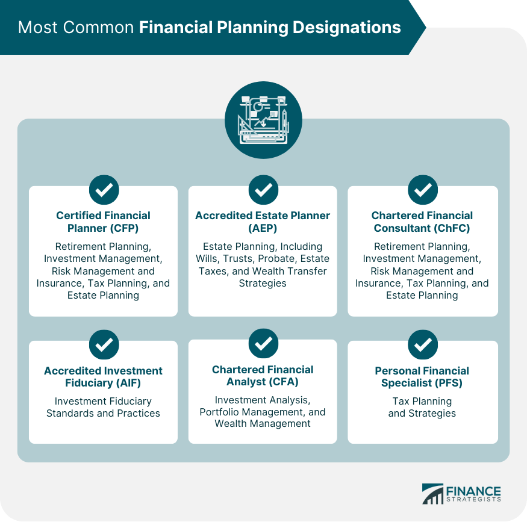

## Table of Contents

## What is a financial advisor designation?

A financial advisor designation is a professional certification that shows a person has special training and knowledge in financial planning and advice. It's like a badge that tells clients the advisor knows a lot about money matters and follows certain rules and standards.

Getting a designation usually involves studying, passing exams, and sometimes having work experience. Popular designations include Certified Financial Planner (CFP) and Chartered Financial Analyst (CFA). These help advisors give better advice and make clients feel more confident in their services.

## Why are financial advisor designations important?

Financial advisor designations are important because they show that an advisor has gone through special training and passed tough exams. This means they know a lot about money and how to help people with their finances. When an advisor has a designation like CFP or CFA, it tells clients that the advisor is serious about their job and follows high standards. This can make clients feel more comfortable and trust the advisor more.

Having a designation also helps advisors give better advice. It's like having a special tool that lets them understand more about different financial situations and options. This can lead to better plans for saving, investing, and reaching financial goals. So, designations not only help advisors do their job better but also help clients make smarter choices with their money.

## What is the difference between a certification and a designation?

A certification and a designation are similar because they both show that someone has special knowledge and skills in a certain area. But there are some small differences. A certification usually means that a person has passed a test or series of tests to show they know a lot about a subject. It's like getting a certificate that says you're good at something. Many jobs, like being a financial advisor, need certifications to show that the person knows what they're doing.

A designation, on the other hand, often includes not just passing tests, but also having work experience and following certain rules. It's a bit more than just a certificate because it shows that the person not only knows about the subject but has also used that knowledge in real life. For example, a financial advisor might have a designation like CFP, which means they've studied, passed exams, and worked in the field for a certain amount of time. So, while both certifications and designations show that someone is good at their job, designations usually mean a bit more experience and commitment.

## How can someone become a financial advisor?

To become a financial advisor, you first need to get a good education. Most people start by getting a bachelor's degree in finance, business, economics, or a related field. This helps you learn the basics about money and how businesses work. After college, it's a good idea to get some experience by working in a financial job. This could be at a bank, an investment firm, or another place where you can learn about helping people with their money.

Once you have some experience, you can start working toward becoming a financial advisor. You'll need to pass some exams to show you know enough about finance to help others. These exams can include the Series 65 or Series 66, which are required in many states. You might also want to get a certification or designation, like the Certified Financial Planner (CFP), which shows you're really good at financial planning. This involves more studying and passing more tests, but it can help you stand out and earn more trust from clients.

## What is the most common financial advisor designation?

The most common financial advisor designation is the Certified Financial Planner (CFP). It is well-known and respected in the financial world. To become a CFP, a person needs to finish college, have some experience working in finance, pass a tough exam, and follow a set of rules about how they treat clients. This shows that they know a lot about money and are good at helping people plan their finances.

Getting a CFP can help a financial advisor stand out. It tells clients that the advisor has gone through a lot of training and is serious about helping people with their money. Many people feel more comfortable working with someone who has a CFP because it means the advisor is trustworthy and skilled.

## What does the Certified Financial Planner (CFP) designation entail?

The Certified Financial Planner (CFP) designation is a special title that shows someone knows a lot about helping people with their money. To get this title, a person needs to finish college, work in finance for a while, and pass a big test. The test covers all sorts of money topics, like how to save, invest, and plan for the future. After passing the test, the person also has to follow certain rules about how they treat clients, making sure they always act in the client's best interest.

Having a CFP designation is a big deal because it tells clients that the advisor is serious about their job and has gone through a lot of training. People feel more comfortable working with a CFP because they know the advisor has the skills and knowledge to help them reach their financial goals. It's like a badge of trust and expertise that can make a big difference in how well an advisor can help their clients.

## How does the Chartered Financial Analyst (CFA) designation differ from others?

The Chartered Financial Analyst (CFA) designation is different from other financial advisor titles because it focuses a lot on investing and analyzing how well companies are doing. To get a CFA, someone needs to study hard and pass three big tests that cover things like how to pick good investments, understand financial reports, and make smart choices with money. It's not just about planning someone's money; it's more about understanding the big world of investments and how to make money grow.

Unlike the Certified Financial Planner (CFP) which looks at all parts of someone's financial life, the CFA is more about the investment side of things. People with a CFA often work at places like big investment firms or banks, helping to make decisions about where to put money to get the best returns. While a CFP might help someone plan for retirement or save for their kids' college, a CFA is more likely to be looking at stock markets and other big investment choices. Both are important, but they focus on different parts of the money world.

## What are the requirements for obtaining a Chartered Financial Consultant (ChFC) designation?

To get a Chartered Financial Consultant (ChFC) designation, a person needs to finish some college education and have a few years of work experience in finance. They also have to pass a bunch of tests that cover different parts of financial planning, like how to help people save money, plan for retirement, and manage their taxes. It's not just about passing tests though; they also need to follow certain rules about how they treat clients and keep learning new things to stay up to date.

The ChFC is a bit like the Certified Financial Planner (CFP), but it's a bit different in what it focuses on. While the CFP looks at all parts of someone's financial life, the ChFC might spend more time on things like insurance and estate planning. It's still a big deal to have a ChFC because it shows that the advisor knows a lot about money and is good at helping people plan their futures. People with a ChFC can help clients feel more confident because they have this special title that says they're experts in financial planning.

## Can you explain the significance of the Personal Financial Specialist (PFS) designation?

The Personal Financial Specialist (PFS) designation is important because it shows that a person knows a lot about helping people with their money, especially when it comes to taxes. To get a PFS, someone needs to be a certified public accountant (CPA) first, which means they already know a lot about taxes and accounting. Then, they have to pass more tests and keep learning new things to stay up to date. This makes them really good at giving advice that can help people save money on taxes and plan their finances better.

Having a PFS can make a big difference for clients because it means the advisor can look at their whole financial picture, including taxes, and come up with smart plans. People feel more comfortable working with someone who has a PFS because they know the advisor has special skills and knowledge that can help them keep more of their money. It's like having a trusted expert who can guide them through the tricky world of taxes and financial planning.

## How do designations like the Registered Investment Advisor (RIA) affect a financial advisor's practice?

The Registered Investment Advisor (RIA) designation is important for a financial advisor because it shows they are allowed to give advice about investing money. To become an RIA, a person has to register with the government and follow certain rules about how they work with clients. This means they have to be honest and always act in the best interest of the people they help. Having an RIA designation can make clients trust the advisor more because it shows the advisor is serious about doing a good job and following the law.

Having an RIA designation can also affect how a financial advisor runs their business. It lets them offer more services, like managing investments directly for their clients. This can help them stand out from other advisors who might not have this title. Clients might feel more comfortable working with an RIA because they know the advisor has the legal permission to give investment advice and follows strict rules to protect their money. So, the RIA designation can help a financial advisor grow their practice and build stronger relationships with their clients.

## What continuing education requirements are associated with maintaining various financial advisor designations?

To keep their financial advisor designations, people have to keep learning new things. This is called continuing education. For example, to stay a Certified Financial Planner (CFP), someone needs to do at least 30 hours of learning every two years. Some of this time has to be about rules and ethics, which means how to treat clients the right way. The rest can be about new things in the world of money, like new laws or ways to invest. This helps them stay good at their job and give the best advice to their clients.

The Chartered Financial Analyst (CFA) also needs continuing education. Every year, they have to do at least 20 hours of learning. This can be about anything related to finance, like how to pick good investments or understand financial reports better. The goal is to keep their knowledge up to date so they can keep helping people make smart choices with their money. Both the CFP and CFA have to show they are still learning to keep their titles, which helps clients trust that their advisors know what they're doing.

## How do international financial advisor designations compare to those in the U.S.?

Financial advisor designations in the U.S. are well-known and respected around the world, but other countries have their own special titles for advisors. In the U.S., popular designations like the Certified Financial Planner (CFP) and Chartered Financial Analyst (CFA) are seen as top choices. These titles show that an advisor has gone through tough training and follows strict rules. In other countries, there are similar titles, but the rules and what they cover can be different. For example, in Canada, the CFP is also used, but there's another title called the Chartered Investment Manager (CIM) which is more focused on managing investments. In the UK, advisors might have the Chartered Financial Planner title, but they also have the Certified Financial Planner, which is a bit different from the U.S. version.

The main difference between U.S. and international designations is what they focus on and the rules they follow. In some countries, the education and tests might be easier or harder than in the U.S. Also, the rules about how advisors treat clients can be different. For example, in Australia, advisors need a designation called the Certified Financial Planner, but they also have to follow rules set by the Financial Adviser Standards and Ethics Authority (FASEA). This means they have to do more learning every year than U.S. advisors with the same title. Even though the titles might sound the same, like the CFP, what it takes to get them and keep them can be very different from one country to another.

## References & Further Reading

[1]: ["Advances in Financial Machine Learning"](https://www.amazon.com/Advances-Financial-Machine-Learning-Marcos/dp/1119482089) by Marcos Lopez de Prado

[2]: ["Evidence-Based Technical Analysis: Applying the Scientific Method and Statistical Inference to Trading Signals"](https://www.amazon.com/Evidence-Based-Technical-Analysis-Scientific-Statistical/dp/B01FIZ8X7I) by David Aronson

[3]: ["Machine Learning for Algorithmic Trading"](https://github.com/stefan-jansen/machine-learning-for-trading) by Stefan Jansen

[4]: ["Quantitative Trading: How to Build Your Own Algorithmic Trading Business"](https://www.amazon.com/Quantitative-Trading-Build-Algorithmic-Business/dp/1119800064) by Ernest P. Chan

[5]: CFA Institute. (n.d.). ["CFA Program"](https://www.cfainstitute.org/programs/cfa-program)

[6]: Certified Financial Planner Board of Standards, Inc. (n.d.). ["CFP Certification"](https://www.cfp.net/)