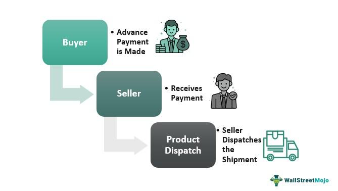

In recent years, a renewed focus has emerged on American manufacturing and the origin of products, driven by factors such as evolving economic policies, shifting consumer sentiment, and advances in technology. Notably, President Joe Biden issued an executive order to promote American-made products, directing federal spending towards companies based in the United States. This strategic emphasis underscores the importance of understanding the true meaning of 'Made in America' to distinguish between misleading claims and genuinely American-made goods. 

The concept of 'Made in America' has significant implications, not only for consumers who seek to support domestic industries but also for manufacturers navigating a complex regulatory environment. Products labeled as 'Made in America' have the potential to bolster the domestic economy by creating jobs, fostering innovation, and enhancing national self-reliance. Moreover, such labels can influence consumer purchasing decisions, aligning them with a broader patriotic and economic agenda.



In addition to economic strategies, technological advancements, particularly in algorithmic trading, play a vital role in boosting the American economy. Algorithmic trading, with its ability to process vast amounts of data and execute trades at high speeds, can facilitate the efficient allocation of resources. By doing so, it supports the financial viability of American manufacturers, allowing them to respond dynamically to policy changes and market conditions.

Understanding the significance of 'Made in America' labeling, combined with policies and technological innovations, is crucial for strengthening American manufacturing. This article will explore its impact on the economy and potential future developments in technology, such as algo trading, that may further support domestic industry growth.

## Table of Contents

## Understanding 'Made in America'

The Federal Trade Commission (FTC) plays a crucial role in defining and regulating "Made in America" claims to ensure consumers receive accurate information about the origin of products. This regulation is vital in preventing deceptive marketing practices that could mislead consumers into believing a product is predominantly manufactured domestically when it is not. 

At the core of the FTC's guidelines are the distinctions between unqualified and qualified claims concerning the origination of products. An unqualified "Made in America" claim asserts that all or virtually all parts, processing, and labor involved in the product's creation are of U.S. origin. For a product to meet this standard, the FTC requires that any materials or parts sourced from abroad must be negligible or count for a minimal portion of the product. This high threshold is critical in ensuring that consumers who purchase such products can have full confidence in their domestic origin.

On the other hand, qualified claims allow for some flexibility. These claims admit that while the product is assembled or significantly manufactured in the United States, it might contain imported components or materials. Qualified claims must specify the extent of the foreign content and the nature of the manufacturing processes in the U.S., offering transparency to consumers.

In addition to FTC regulations, several legislative acts reinforce these standards. The Buy American Act, for example, mandates that goods purchased with taxpayer funds must predominantly be produced in the United States. Particularly relevant to federal procurement, this act boosts domestic industry by prioritizing American-made goods in government contracts. Similarly, the American Automobile Labeling Act requires automakers to disclose the percentage of U.S. and Canadian parts in their vehicles, allowing consumers to make informed decisions.

Together, these regulations and legislative acts aim to preserve the integrity of the "Made in America" label. They emphasize transparency in the supply chain, enabling consumers to differentiate between those goods that are genuinely American-made and those that are not, thus fostering a well-informed marketplace.

## Impact of 'Buy American' Policies

The "Buy American" policies aim to prioritize federal procurement from U.S. sources, significantly influencing domestic manufacturing and employment levels. When government bodies increase their purchase of American-made goods, it directly supports domestic industries by stimulating demand. This increased demand fosters job creation as manufacturers require more labor to meet new orders. The ripple effect continues as local suppliers of raw materials, production machinery, and logistical services also experience a boost in activity, thereby supporting a broader range of economic sectors.

These policies also serve to empower small and medium-sized enterprises (SMEs) by enabling them to compete more effectively for government contracts. Often, larger corporations dominate procurement processes due to their established infrastructures and economies of scale. However, specific clauses in the Buy American initiatives can level the playing field, mandating that a certain percentage of contracts be awarded to smaller businesses. This promotes innovation and resilience within domestic markets, as smaller companies are encouraged to offer competitive pitches, including cost-effective and cutting-edge solutions.

Furthermore, these policies enhance governmental transparency by necessitating a clear delineation of spending on American versus foreign products. Clear guidelines on federal procurement allocations make it easier to track adherence to Buy American standards, informing the public and enforcing accountability. This transparency is crucial in maintaining public trust and ensuring that taxpayer dollars are reinvested into the national economy.

Stricter adherence to the "Made in America" standards arises from these policies, as agencies are held to heightened scrutiny in contract fulfillment. This heightened scrutiny involves rigorous documentation and verification processes to confirm that products genuinely meet the critera defined by legislation such as the Buy American Act. In addition, compliance ensures that deceptive practices are minimized, thus preserving the integrity of national manufacturing labels.

Together, Buy American policies serve as a catalyst for reinforcing domestic economic infrastructure, fostering a more self-reliant and robust industrial sector that can withstand global economic fluctuations.

## Challenges in Identifying True American-Made Products

Identifying genuine 'Made in America' products poses a challenge for consumers, primarily due to misleading marketing practices. Despite clear guidelines laid out by the Federal Trade Commission (FTC) and various legislative acts, deceptive packaging and claims continue to mislead consumers. This confusion often arises from the use of flag stickers and patriotic symbols that suggest a product is entirely made within the United States, even when it is not.

To discern true American-made products, consumers should prioritize detailed product labels and thoroughly examine company disclosures over superficial patriotic branding. The distinction between unqualified and qualified 'Made in America' claims provides a framework for consumers. Unqualified claims imply that almost all parts and processing are U.S.-based, while qualified claims may admit the presence of imported components.

The FTC plays a proactive role by monitoring and investigating misleading claims. Consumers can contribute to this regulatory process by submitting complaints and reports, prompting the FTC to assess and, if necessary, sanction companies making fraudulent claims. These investigations are crucial for maintaining the integrity of 'Made in America' labels and upholding consumer trust.

The onus is on consumers to remain vigilant and informed about product origins. By focusing on reliable indicators and leveraging regulatory oversight, they can more accurately identify genuinely American-made goods, thereby supporting domestic manufacturing and ensuring compliance with established standards.

## The Role of Algorithmic Trading in Supporting American Manufacturing

Algorithmic trading, commonly known as algo trading, involves the use of complex algorithms to automate trading decisions in financial markets. By processing vast amounts of data quickly and executing trades at optimal prices, algo trading facilitates an efficient allocation of resources to various sectors, including American manufacturing.

One of the primary benefits of algo trading is its ability to respond swiftly to changes in economic policies. For instance, when the government implements policies favoring 'Buy American' mandates, algorithms can quickly analyze the impact of these policy changes on the financial markets and adjust investment strategies accordingly. This rapid response can lead to a redirection of investment funds into manufacturing sectors that align with national economic priorities.

As technology continues to advance, algo trading also holds the potential to support American manufacturing through optimization of supply chain logistics and reduction of operational costs. By analyzing vast datasets, algorithms can identify patterns and inefficiencies within manufacturing processes. This can lead to actionable insights that improve production efficiency and reduce waste, ultimately enhancing competitiveness.

From a technical perspective, algo trading systems operate using a combination of quantitative financial models, market data analysis, and execution strategies. The following Python code snippet illustrates a simple example of an algorithm that could be used to automate trading decisions based on policy changes:

```python
import numpy as np

# Simulated policy change impact on manufacturing sectors
policy_impact_factors = np.random.rand(10)

def evaluate_policy_impact(factors):
    # Assume each factor influences an investment decision
    investment_threshold = 0.5
    investments = []
    for i, factor in enumerate(factors):
        if factor > investment_threshold:
            investments.append(f"Invest in Manufacturing Sector {i}")
    return investments

decisions = evaluate_policy_impact(policy_impact_factors)
print("Investment Decisions:", decisions)
```

This code demonstrates how an algorithm might evaluate various manufacturing sectors based on policy impact factors and make investment decisions accordingly.

Moreover, [algorithmic trading](/wiki/algorithmic-trading) contributes to cost reduction and increased efficiency across supply chains. By employing predictive analytics and [machine learning](/wiki/machine-learning) models, these systems can forecast demand, optimize inventory levels, and schedule logistics with precision. For instance, just-in-time (JIT) inventory strategies can be enhanced using algorithmic predictions, reducing overproduction and minimizing storage costs.

In summary, algorithmic trading plays a crucial role in supporting American manufacturing by enabling rapid investment adaptations to policy changes and optimizing manufacturing and supply chain processes. As technology advances, these systems will likely continue to benefit the manufacturing industry, contributing to economic growth and sustainability.

## Conclusion

Understanding the intricacies of 'Made in America' labeling and the impact of associated policies holds importance for both consumers and enterprises. These labels not only signify the origin of a product but also reflect broader economic policies aiming to bolster domestic industries. As consumers increasingly prioritize supporting local economies, accurate labeling helps them make informed purchasing decisions, thereby aligning consumer choice with national economic goals.

Government efforts to promote American manufacturing are further bolstered by technological advancements. One such advancement is algorithmic trading, a powerful tool that facilitates efficient capital allocation within the financial markets. By automating the trading process, algorithmic trading can swiftly redirect investments to sectors that benefit from 'Buy American' policies, ensuring that resources are channeled effectively to support domestic manufacturers. This can result in more robust support for industries aligned with national economic priorities, potentially leading to increased job creation and industry growth.

Looking to the future, measures should be taken to enhance transparency in product labeling and enforcement of 'Made in America' standards. Strengthening these areas will help protect consumers from misleading claims and ensure fair competition among businesses. Furthermore, leveraging technological innovations, such as algorithmic trading, can support sustainable economic growth by optimizing resource allocation, improving supply chain management, and reducing operational costs in the manufacturing sector.

Ultimately, a combined strategy that prioritizes transparency, rigorous enforcement of standards, and the incorporation of technological advancements is crucial. This approach will not only support American manufacturing but also contribute to a resilient and dynamic economy.

## References & Further Reading

[1]: ["FTC - Complying with the Made in USA Standard"](https://www.ftc.gov/business-guidance/resources/complying-made-usa-standard) - Federal Trade Commission

[2]: ["The Buy American Act and Other Domestic Content Legislation: Background and Issues for Congress"](https://crsreports.congress.gov/product/pdf/R/R46748/1) - Congressional Research Service

[3]: ["Algorithmic Trading: A Practitioner's Guide"](https://www.amazon.com/Algorithmic-Trading-Practitioners-Jeffrey-Bacidore/dp/0578715236) by Jeffrey Bacidore

[4]: ["Guide to United States Government Procurement"](https://en.wikipedia.org/wiki/Government_procurement_in_the_United_States) - Office of Government Contracts Guidance

[5]: ["Supply Chain Optimization"](https://www.ibm.com/topics/supply-chain-optimization) - INFORMS

[6]: ["The American Economy: How It Works and How It Doesn't"](https://www.amazon.com/American-Economy-How-Works-Doesnt/dp/0765627582) by Arnold Kling