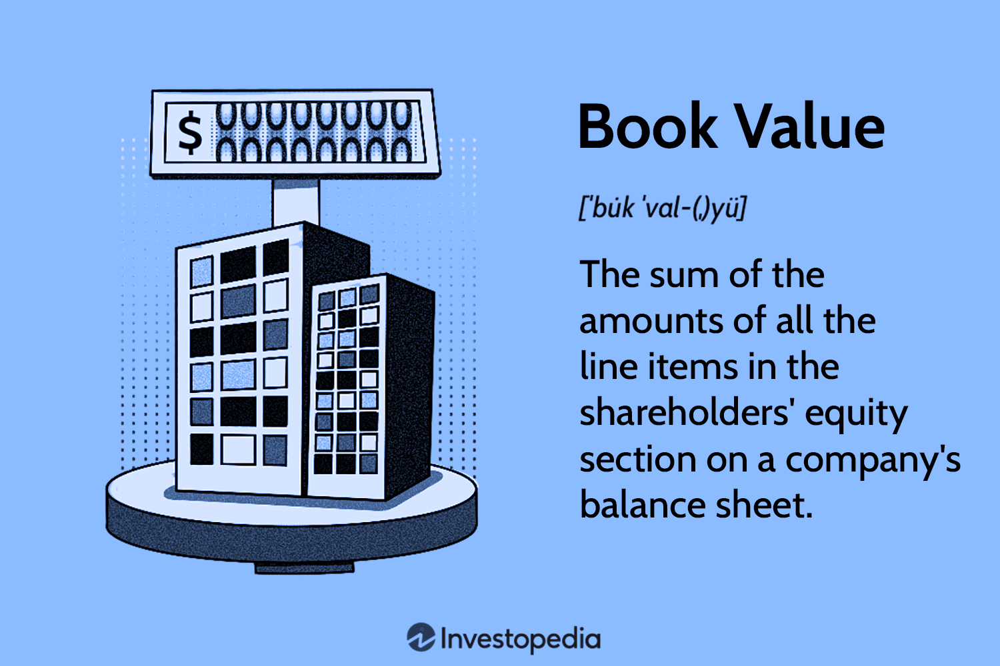

## Table of Contents

## What is the basic definition of a 'book' in finance?

In finance, a 'book' refers to the records or accounts that a business keeps to track its financial transactions. This can include everything from sales and purchases to assets and liabilities. The book is essentially a detailed log that helps businesses understand their financial health and performance over time.

These records are crucial for preparing financial statements, such as the balance sheet and income statement, which provide a snapshot of the company's financial position. Keeping accurate books is not only important for internal management but also for complying with legal and tax requirements. Without proper bookkeeping, a business might struggle to make informed decisions or face penalties for non-compliance.

## How does the term 'book' differ from everyday usage in the context of finance?

In everyday life, when people talk about a 'book,' they usually mean a collection of pages bound together, like a novel or a textbook. But in finance, a 'book' has a completely different meaning. It refers to the financial records a business keeps, which track all the money coming in and going out.

These financial 'books' are essential for a business to know how much money it has, how much it owes, and how well it's doing financially. They are used to create important reports like the balance sheet and income statement. So, while a regular book tells a story or teaches something, a financial book tells the story of a company's money.

## What are the different types of books used in financial accounting?

In financial accounting, there are several types of books that businesses use to keep track of their money. The main ones are the general ledger, the cash book, and the journal. The general ledger is like the master book where all the important financial information is recorded. It shows everything from money the business makes to money it spends, and it helps create the big financial reports. The cash book is used to keep track of all the cash that comes in and goes out. It's really helpful for businesses that deal a lot with cash. The journal is where businesses first write down their financial transactions before they move them to the general ledger. It's like a diary of all the money moves.

Another type of book is the subsidiary ledger, which is used to keep more detailed records of specific accounts, like accounts receivable or accounts payable. This helps businesses keep better track of who owes them money and who they owe money to. There's also the sales book and the purchases book. The sales book records all the sales a business makes on credit, while the purchases book records all the things a business buys on credit. These books help businesses keep a clear record of their credit transactions, which is important for managing cash flow and planning for the future.

## Can you explain what a 'book value' is and how it is calculated?

Book value is a way to figure out how much a company is worth based on its books, or financial records. It's like looking at what the company owns and what it owes, and then seeing what's left over. To find the book value, you start with the total value of everything the company owns, which is called its assets. Then, you take away the total amount of money the company owes, which are its liabilities. What you have left is the book value, sometimes called the net asset value.

Book value is important because it gives investors an idea of what the company would be worth if it had to sell everything and pay off all its debts. For example, if a company has assets worth $100,000 and liabilities of $60,000, its book value would be $40,000. This number can be compared to the company's market value, which is what people are willing to pay for the company's stock. If the market value is higher than the book value, it might mean people think the company will do well in the future. If it's lower, it might mean the opposite.

## How is 'book value' used in investment analysis?

Book value is a key tool for investors when they want to understand if a company is a good buy. It's like looking at the price tag of a company based on what it owns minus what it owes. Investors compare the book value to the market value, which is what the stock market thinks the company is worth. If the market value is higher than the book value, it might mean that people are excited about the company's future and expect it to grow. On the other hand, if the market value is lower than the book value, it could mean the company is undervalued, and it might be a good time to buy its stock.

In investment analysis, book value helps investors make decisions about buying or selling stocks. For example, if a company's book value is high and its stock price is low, an investor might see this as a chance to buy a bargain. They think that if the company were to sell all its assets and pay off its debts, they would still come out ahead. But, it's important to remember that book value is just one piece of the puzzle. Investors also need to look at other things like how the company is doing, what its future plans are, and how the industry is doing overall.

## What role does a 'book' play in double-entry bookkeeping?

In double-entry bookkeeping, a 'book' is where all the money moves of a business are recorded. This system makes sure that every time money comes in or goes out, it's written down in two places. One place shows where the money came from or went to, and the other place shows how it affected the business's money overall. The main book used in this system is called the general ledger. It's like a big notebook that keeps track of all the different accounts, like money the business makes, money it spends, things it owns, and money it owes.

The general ledger is really important because it helps make sure all the money moves are balanced. If you spend money to buy something, you write it down as an expense in one part of the book, and you also write it down as a decrease in your cash in another part. This way, the total amount of money in the business stays the same. By keeping everything in the books, businesses can see if they're making money or losing it, and they can make smart choices about what to do next.

## How do financial institutions use 'books' to manage their operations?

Financial institutions use 'books' to keep track of all their money moves. These books help them know how much money they have, how much they owe, and how much they are making or losing. Just like a business, a bank or an investment firm uses books to record every transaction, whether it's a customer depositing money, taking out a loan, or buying stocks. By keeping detailed records in their books, financial institutions can manage their cash flow, make sure they have enough money to cover their costs, and plan for the future.

These books are also important for making sure everything is done right and following the rules. Financial institutions have to follow a lot of laws and regulations, and their books help them show that they are doing things correctly. For example, if a bank needs to report its financial health to the government or to its shareholders, it uses the information from its books to create these reports. By keeping accurate and up-to-date books, financial institutions can run smoothly, stay out of trouble, and keep their customers and investors happy.

## What is the significance of 'off the books' transactions in finance?

'Off the books' transactions are financial activities that a business doesn't record in its official books. These transactions are not shown in the company's financial statements, which means they are hidden from the public, investors, and sometimes even the tax authorities. People might do this to hide money, avoid taxes, or make their business look more profitable than it really is. However, 'off the books' transactions are usually illegal and can lead to big problems if they are discovered.

The significance of 'off the books' transactions is that they can seriously damage a company's reputation and lead to legal trouble. If these hidden transactions come to light, the company could face fines, lawsuits, and even criminal charges. Investors might lose trust in the company, causing its stock price to drop. It's important for businesses to be open and honest about their finances to keep everyone's trust and avoid these kinds of problems.

## How does the concept of 'book' apply to financial reporting standards?

In financial reporting standards, a 'book' refers to the official records that a company keeps to show all its money moves. These records are really important because they help the company make financial reports that follow the rules set by organizations like the Financial Accounting Standards Board (FASB) or the International Accounting Standards Board (IASB). These rules make sure that everyone understands the company's financial health in the same way, which is important for investors, the government, and anyone else who looks at the company's money.

Keeping accurate books is a must for following these financial reporting standards. If a company doesn't keep good records, it might not be able to make the right reports, and that could get it into trouble. The books help the company show where its money comes from and where it goes, making sure everything is clear and honest. This way, people can trust the company's financial statements and make good decisions based on them.

## What are the implications of 'book' adjustments in corporate finance?

In corporate finance, 'book' adjustments are changes made to a company's financial records. These adjustments can happen for many reasons, like fixing mistakes, following new rules, or showing the real value of things the company owns. When a company makes these adjustments, it changes the numbers in its books, which can affect how much money it seems to have or how well it's doing. This is important because the numbers in the books are used to make financial reports that investors and others look at to understand the company's health.

Making book adjustments can have big effects on a company. If the adjustments make the company look better financially, it might make investors happier and raise the stock price. But if the adjustments show that the company is not doing as well as people thought, it could make investors worried and lower the stock price. It's really important for companies to be honest and clear about why they are making these adjustments, so everyone can trust the numbers in their financial reports.

## How do 'books' influence tax calculations and strategies?

A company's 'books' are very important for figuring out taxes. The books keep track of all the money that comes in and goes out, which the company uses to calculate how much tax it owes. The government looks at these books to make sure the company is paying the right amount of taxes. If the books show that the company made a lot of money, it might have to pay more in taxes. But if the books show that the company didn't make much money, it might pay less in taxes.

Companies can also use their books to plan their tax strategies. By looking at the books, a company can find ways to save money on taxes. For example, if the books show that the company spent a lot on things like equipment or buildings, it might be able to take a tax deduction for those expenses. This can lower the amount of taxes the company has to pay. But it's important for companies to follow the tax laws and keep their books honest, or they could get into trouble with the government.

## What advanced techniques are used to analyze 'books' for forensic accounting purposes?

Forensic accountants use advanced techniques to look at a company's books and find out if there's any funny business going on. They use something called data analytics to go through a lot of financial information quickly. This helps them spot patterns or unusual things that might mean someone is hiding money or doing something wrong. They also use something called Benford's Law, which is a way to check if the numbers in the books look normal or if they've been messed with. By using these techniques, forensic accountants can find clues that help them figure out if the books are telling the truth.

Another technique they use is called ratio analysis. This means they look at different numbers in the books to see if they make sense together. For example, they might compare how much money a company says it made to how much it spent, to see if those numbers fit together right. If they don't, it could mean someone is cooking the books. Forensic accountants also do something called trend analysis, where they look at the books over time to see if there are any strange changes that don't make sense. By using these advanced techniques, they can dig deep into the books and find out if everything is on the up and up.

## What is Key Finance Terminology?

Understanding finance terminology is crucial for comprehending market dynamics and making informed investment decisions. Several core terms underpin financial strategies and operations, including 'trading book,' 'alpha,' '[arbitrage](/wiki/arbitrage),' and 'market [liquidity](/wiki/liquidity-risk-premium).'

A 'trading book' refers to the portfolio of financial instruments held by a financial institution for the purpose of trading. These instruments include securities, commodities, and other assets that are actively managed to capitalize on market conditions. The trading book is marked to market daily, meaning it is revalued based on current market prices, enabling traders to assess their real-time gains or losses.

'Alpha' represents the excess return on an investment relative to a market benchmark or index. It is a measure of an investment's performance on a risk-adjusted basis. Positive alpha indicates that the investment has outperformed its benchmark, while negative alpha suggests underperformance. Mathematically, alpha can be expressed as:

$$
\alpha = R_i - R_f - \beta (R_m - R_f)
$$

where $R_i$ is the return of the investment, $R_m$ is the market return, $R_f$ is the risk-free rate, and $\beta$ is the investment’s beta, representing its sensitivity to market movements.

'Arbitrage' involves exploiting price differentials of the same asset in different markets or forms to earn risk-free profit. It ensures prices do not significantly deviate from fair value for long periods, contributing to market efficiency. Classic examples include currency arbitrage in the forex market and triangular arbitrage involving cross-exchange rates.

'Market liquidity' describes the ease with which assets can be bought or sold in a market without affecting the asset's price. Liquidity is crucial for market stability, as high liquidity indicates that assets can be readily converted into cash. Markets characterized by high liquidity often see smaller bid-ask spreads and lower transaction costs.

These terms form the backbone of financial strategies and investment decisions, each playing a significant role in how financial markets function. Mastery of these concepts is essential for those aiming to navigate and succeed in the financial sector.

## What are some influential financial books?

Books provide a wealth of knowledge for those looking to deepen their understanding of financial markets. Notable among these are "The Elements of Statistical Learning" and "Inside the Black Box," which serve as essential reads for individuals interested in quantitative finance and [algorithmic trading](/wiki/algorithmic-trading).

"The Elements of Statistical Learning," authored by Trevor Hastie, Robert Tibshirani, and Jerome Friedman, is a foundational text that explores statistical and machine learning methods pivotal to quantitative finance. It covers techniques such as linear regression, classification, resampling methods, and support vector machines, which can be applied to modeling financial data. The book is known for its thorough mathematical explanation of algorithms and its practical approach towards data-driven finance solutions.

"Inside the Black Box" by Rishi K. Narang offers a compelling look into the mechanism of quantitative trading strategies used by hedge funds. It examines how quantitative models are structured and the statistical techniques employed to generate trading signals. Narang elucidates risk management practices and emphasizes the importance of rigorous model testing and performance analytics, providing readers with a lens into the decision-making processes behind automated trading systems.

These [books](/wiki/algo-trading-books) not only explain the mathematical concepts necessary for understanding quantitative models but also elaborate on their strategic applications in real-world trading. For instance, algorithms derived from these resources can be instrumental in risk assessment, portfolio optimization, and deriving alpha through market inefficiencies, which are core objectives in financial analysis and trading.

#### Example of Application: Linear Regression

Consider using linear regression to predict stock prices based on historical data. The formula used is:

$$
Y = \alpha + \beta X + \epsilon
$$

Where:
- $Y$ is the dependent variable (e.g., future stock price),
- $\alpha$ is the intercept,
- $\beta$ represents the slopes of the predictor,
- $X$ is the independent variable (e.g., historical prices),
- $\epsilon$ is the error term.

In Python, such a model can be implemented using libraries such as `scikit-learn`:

```python
from sklearn.linear_model import LinearRegression
import numpy as np

# Simulated data
X = np.array([[1], [2], [3], [4], [5]])
Y = np.array([15, 16, 17, 18, 20])

# Model
model = LinearRegression().fit(X, Y)

# Predictive output
prediction = model.predict(np.array([[6]]))
print("Predicted stock price:", prediction)
```

The implementation of these mathematical concepts provides a practical approach to understanding the mechanics of [quantitative trading](/wiki/quantitative-trading) systems, making these books invaluable resources for both academic and professional growth in the financial industry.

## References & Further Reading

[1]: Hastie, T., Tibshirani, R., & Friedman, J. (2009). ["The Elements of Statistical Learning: Data Mining, Inference, and Prediction."](https://link.springer.com/book/10.1007/978-0-387-84858-7) Springer.

[2]: Narang, R. K. (2009). ["Inside the Black Box: The Simple Truth About Quantitative Trading"](https://onlinelibrary.wiley.com/doi/book/10.1002/9781118267738). Wiley.

[3]: Chan, E. P. (2009). ["Quantitative Trading: How to Build Your Own Algorithmic Trading Business"](https://github.com/ftvision/quant_trading_echan_book). Wiley.

[4]: Lopez de Prado, M. (2018). ["Advances in Financial Machine Learning"](https://www.amazon.com/Advances-Financial-Machine-Learning-Marcos/dp/1119482089). Wiley.

[5]: Jansen, S. (2018). ["Machine Learning for Algorithmic Trading"](https://github.com/stefan-jansen/machine-learning-for-trading). Packt Publishing.

[6]: Aronson, D. R. (2006). ["Evidence-Based Technical Analysis: Applying the Scientific Method and Statistical Inference to Trading Signals"](https://www.amazon.com/Evidence-Based-Technical-Analysis-Scientific-Statistical/dp/0470008741). Wiley.

[7]: Kearns, M., & Nevmyvaka, Y. (2013). ["Machine Learning for Financial Engineering"](https://www.cis.upenn.edu/~mkearns/papers/KearnsNevmyvakaHFTRiskBooks.pdf). Springer.