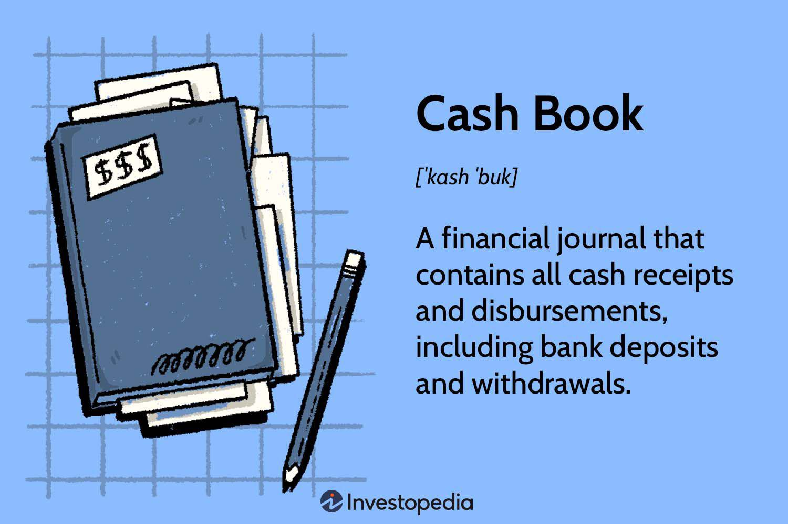

A comprehensive understanding of finance terminology is crucial for navigating the complex world of finance, investment, and trading. This intricate domain involves a wide array of concepts, tools, and practices that form the foundation of financial literacy. Whether you're an individual investor or a part of a larger institutional setting, grasping key financial terms can dramatically improve your ability to make informed decisions, assess risks, and identify opportunities.

This article aims to demystify pivotal finance terms that are fundamental to market operations and investment decision-making. By clarifying these terms, it sets a solid groundwork for readers to expand their understanding of markets and trading strategies. Furthermore, the article introduces influential financial books that serve as essential resources for anyone keen to deepen their knowledge of quant finance and algorithmic trading. These texts provide comprehensive insights into the mathematical and strategic elements of financial markets.



In addition to foundational terminology and literature, the proficiency in finance also requires an understanding of real-world financial applications. This article presents examples of how institutional investors employ trading strategies utilizing these financial principles, demonstrating how theoretical concepts are applied in practical scenarios to manage risks and optimize returns.

Lastly, the article explores the concept of algorithmic trading, a sophisticated process that uses automated systems to execute pre-defined trading strategies. It incorporates advanced technologies and financial principles to effectively navigate today's fast-paced markets, presenting readers with cutting-edge approaches to trading.

Understanding these elements equips readers with essential knowledge, empowering them to make informed financial decisions and build a strong acumen in trading and investment.

## Table of Contents

## Key Finance Terminology

Understanding finance terminology is crucial for comprehending market dynamics and making informed investment decisions. Several core terms underpin financial strategies and operations, including 'trading book,' 'alpha,' 'arbitrage,' and 'market [liquidity](/wiki/liquidity-risk-premium).'

A 'trading book' refers to the portfolio of financial instruments held by a financial institution for the purpose of trading. These instruments include securities, commodities, and other assets that are actively managed to capitalize on market conditions. The trading book is marked to market daily, meaning it is revalued based on current market prices, enabling traders to assess their real-time gains or losses.

'Alpha' represents the excess return on an investment relative to a market benchmark or index. It is a measure of an investment's performance on a risk-adjusted basis. Positive alpha indicates that the investment has outperformed its benchmark, while negative alpha suggests underperformance. Mathematically, alpha can be expressed as:

$$
\alpha = R_i - R_f - \beta (R_m - R_f)
$$

where $R_i$ is the return of the investment, $R_m$ is the market return, $R_f$ is the risk-free rate, and $\beta$ is the investment’s beta, representing its sensitivity to market movements.

'Arbitrage' involves exploiting price differentials of the same asset in different markets or forms to earn risk-free profit. It ensures prices do not significantly deviate from fair value for long periods, contributing to market efficiency. Classic examples include currency arbitrage in the forex market and triangular arbitrage involving cross-exchange rates.

'Market liquidity' describes the ease with which assets can be bought or sold in a market without affecting the asset's price. Liquidity is crucial for market stability, as high liquidity indicates that assets can be readily converted into cash. Markets characterized by high liquidity often see smaller bid-ask spreads and lower transaction costs.

These terms form the backbone of financial strategies and investment decisions, each playing a significant role in how financial markets function. Mastery of these concepts is essential for those aiming to navigate and succeed in the financial sector.

## Influential Financial Books

Books provide a wealth of knowledge for those looking to deepen their understanding of financial markets. Notable among these are "The Elements of Statistical Learning" and "Inside the Black Box," which serve as essential reads for individuals interested in quantitative finance and [algorithmic trading](/wiki/algorithmic-trading).

"The Elements of Statistical Learning," authored by Trevor Hastie, Robert Tibshirani, and Jerome Friedman, is a foundational text that explores statistical and machine learning methods pivotal to quantitative finance. It covers techniques such as linear regression, classification, resampling methods, and support vector machines, which can be applied to modeling financial data. The book is known for its thorough mathematical explanation of algorithms and its practical approach towards data-driven finance solutions.

"Inside the Black Box" by Rishi K. Narang offers a compelling look into the mechanism of quantitative trading strategies used by hedge funds. It examines how quantitative models are structured and the statistical techniques employed to generate trading signals. Narang elucidates risk management practices and emphasizes the importance of rigorous model testing and performance analytics, providing readers with a lens into the decision-making processes behind automated trading systems.

These [books](/wiki/algo-trading-books) not only explain the mathematical concepts necessary for understanding quantitative models but also elaborate on their strategic applications in real-world trading. For instance, algorithms derived from these resources can be instrumental in risk assessment, portfolio optimization, and deriving alpha through market inefficiencies, which are core objectives in financial analysis and trading.

#### Example of Application: Linear Regression

Consider using linear regression to predict stock prices based on historical data. The formula used is:

$$
Y = \alpha + \beta X + \epsilon
$$

Where:
- $Y$ is the dependent variable (e.g., future stock price),
- $\alpha$ is the intercept,
- $\beta$ represents the slopes of the predictor,
- $X$ is the independent variable (e.g., historical prices),
- $\epsilon$ is the error term.

In Python, such a model can be implemented using libraries such as `scikit-learn`:

```python
from sklearn.linear_model import LinearRegression
import numpy as np

# Simulated data
X = np.array([[1], [2], [3], [4], [5]])
Y = np.array([15, 16, 17, 18, 20])

# Model
model = LinearRegression().fit(X, Y)

# Predictive output
prediction = model.predict(np.array([[6]]))
print("Predicted stock price:", prediction)
```

The implementation of these mathematical concepts provides a practical approach to understanding the mechanics of [quantitative trading](/wiki/quantitative-trading) systems, making these books invaluable resources for both academic and professional growth in the financial industry.

## Real-World Financial Examples

Institutional investors often employ sophisticated trading strategies that demonstrate the practical application of finance terminology. For instance, hedge funds and proprietary trading desks leverage strategies such as statistical [arbitrage](/wiki/arbitrage) and algorithmic trading. These strategies require a deep understanding of market conditions and extensive use of financial terminology such as "alpha," "beta," and "[volatility](/wiki/volatility-trading-strategies)."

One common strategy involves [statistical arbitrage](/wiki/statistical-arbitrage), which seeks to exploit price inefficiencies between related financial instruments. This strategy uses mathematical models to determine expected price paths, identifying opportunities when actual prices deviate significantly. The goal is to achieve a nonzero expected return by constructing a portfolio with zero overall exposure, thus hedging against market risks.

```python
import numpy as np

# Example of a basic mean reversion strategy
def calc_zscore(price, window=20):
    mean = np.mean(price[-window:])
    std = np.std(price[-window:])
    z_score = (price[-1] - mean) / std
    return z_score

# Simulated price data
price_data = np.random.normal(loc=100, scale=1, size=100)

z_score = calc_zscore(price_data)
print("Current Z-score:", z_score)

# Trading signal based on z-score
if z_score > 2:
    print("Signal: Short")
elif z_score < -2:
    print("Signal: Long")
else:
    print("Signal: Hold")
```

Trading books, a subset of a financial institution's book of records, are instrumental in managing positions and risks. Professional traders continuously update trading books to reflect active trades, potential risks, and strategies. They provide a framework for decision-making by offering a record of positions held and trades executed, highlighting exposure to various financial instruments.

By using these trading strategies and tools, professional investors can manage large portfolios effectively, mitigating risks while striving for optimal returns. This practical application of finance concepts transforms theoretical knowledge into actionable strategies, forming the basis for robust financial performance and sound risk management practices.

Understanding such examples not only grounds theoretical concepts in reality but also equips individuals with the expertise necessary to navigate the intricacies of modern financial markets successfully.

## Fundamentals of Algorithmic Trading

Algorithmic trading utilizes computerized systems to execute trading orders based on pre-established strategies, thereby improving the efficiency and speed of financial transactions. By leveraging advanced technologies and robust financial principles, algorithmic trading aims to exploit market opportunities while mitigating risks.

Automated trading systems use statistical and mathematical models to analyze large datasets, identifying patterns and trends that might be invisible to human traders. These systems employ algorithms, which range from simple strategies, such as monitoring moving averages, to more complex techniques, such as [machine learning](/wiki/machine-learning) and [artificial intelligence](/wiki/ai-artificial-intelligence), to forecast market movements and optimize trading decisions.

Advanced algorithmic trading systems can process orders in milliseconds or even microseconds, allowing them to take advantage of tiny price movements. This is crucial in high-frequency trading ([HFT](/wiki/high-frequency-trading-strategies)), where the speed of execution is a key [factor](/wiki/factor-investing) in profitability. These systems can also operate outside of conventional trading hours, thereby exploiting global market events as they unfold.

Risk management is a vital component of algorithmic trading. Automated systems can implement trailing stops, limits, and other risk management techniques with precision, minimizing potential losses. The ability to backtest trading strategies using historical data ensures that the strategies are robust and can adapt to changing market conditions.

Books like "Algorithmic Trading: Winning Strategies and Their Rationale" provide invaluable insights into creating and deploying effective trading algorithms. Such resources often discuss the use of programming languages like Python for developing automated trading systems. Here is an example of a simple moving average crossover strategy implemented in Python:

```python
import pandas as pd

# Load the historical stock data
data = pd.read_csv('historical_data.csv')

# Calculate short-term and long-term moving averages
data['Short_MA'] = data['Close'].rolling(window=50, min_periods=1).mean()
data['Long_MA'] = data['Close'].rolling(window=200, min_periods=1).mean()

# Generate trading signals
data['Signal'] = 0
data['Signal'][50:] = np.where(data['Short_MA'][50:] > data['Long_MA'][50:], 1, -1)

# Backtest strategy
initial_capital = 10000
positions = initial_capital * data['Signal']

# Plot the trading signals
import matplotlib.pyplot as plt

plt.figure(figsize=(14, 7))
plt.plot(data['Close'], color='k', lw=2., label='Price')
plt.plot(data['Short_MA'], color='b', lw=2., label='50-day MA')
plt.plot(data['Long_MA'], color='r', lw=2., label='200-day MA')
plt.plot(data[data['Signal'] == 1].index, data['Short_MA'][data['Signal'] == 1], '^', markersize=10, color='g', lw=0, label='Buy Signal')
plt.plot(data[data['Signal'] == -1].index, data['Short_MA'][data['Signal'] == -1], 'v', markersize=10, color='r', lw=0, label='Sell Signal')
plt.title('Moving Average Crossover Strategy')
plt.legend()
plt.show()
```

The code above represents a fundamental strategy where the crossing of a short-term moving average over a long-term moving average generates buy signals, while the reverse indicates sell signals. Such algorithmic strategies, when executed effectively, can maximize trading performance by ensuring disciplined, emotion-free decisions. Through continuous refinement and adaptation, traders can enhance their algorithmic systems, aligning them more closely with dynamic market conditions.

## Conclusion

Mastering the fundamental elements of finance is essential for anyone aiming to thrive in investment, trading, or broader financial pursuits. This article has sought to provide a structured framework for enhancing financial literacy and trading acumen by dissecting key components that underpin modern finance. By understanding crucial finance terminology, individuals can comprehend market dynamics and make strategic decisions that influence trading and investment outcomes.

Moreover, learning from influential financial literature, such as "The Elements of Statistical Learning" and "Inside the Black Box," equips readers with the mathematical and strategic insights required to navigate the complexities of quantitative finance and algorithmic trading. These texts serve as valuable resources, offering detailed explanations of risk management practices and advanced trading strategies.

Additionally, examining real-world financial examples illustrates how theoretical knowledge applies in practical settings. Institutional investors and professional traders employ a variety of techniques and frameworks, such as trading books, to manage positions and mitigate risks effectively. Observing these practices plays a critical role in bridging the gap between academic understanding and real-world application.

The exploration of algorithmic trading fundamentals underscores the importance of leveraging technology and pre-defined strategies to seize market opportunities efficiently. Algorithmic trading not only optimizes trading performance but also introduces a level of precision and scalability unattainable through manual trading methods.

In conclusion, a well-rounded grasp of finance terminology, supplemented by insights from acclaimed books and practical examples, prepares individuals to succeed in today's financial markets. Together, these components foster a comprehensive understanding of finance, empowering readers to make informed and strategic decisions in their financial endeavors.

## References & Further Reading

[1]: Hastie, T., Tibshirani, R., & Friedman, J. (2009). ["The Elements of Statistical Learning: Data Mining, Inference, and Prediction."](https://link.springer.com/book/10.1007/978-0-387-84858-7) Springer.

[2]: Narang, R. K. (2009). ["Inside the Black Box: The Simple Truth About Quantitative Trading"](https://onlinelibrary.wiley.com/doi/book/10.1002/9781118267738). Wiley.

[3]: Chan, E. P. (2009). ["Quantitative Trading: How to Build Your Own Algorithmic Trading Business"](https://github.com/ftvision/quant_trading_echan_book). Wiley.

[4]: Lopez de Prado, M. (2018). ["Advances in Financial Machine Learning"](https://www.amazon.com/Advances-Financial-Machine-Learning-Marcos/dp/1119482089). Wiley.

[5]: Jansen, S. (2018). ["Machine Learning for Algorithmic Trading"](https://github.com/stefan-jansen/machine-learning-for-trading). Packt Publishing.

[6]: Aronson, D. R. (2006). ["Evidence-Based Technical Analysis: Applying the Scientific Method and Statistical Inference to Trading Signals"](https://www.amazon.com/Evidence-Based-Technical-Analysis-Scientific-Statistical/dp/0470008741). Wiley.

[7]: Kearns, M., & Nevmyvaka, Y. (2013). ["Machine Learning for Financial Engineering"](https://www.cis.upenn.edu/~mkearns/papers/KearnsNevmyvakaHFTRiskBooks.pdf). Springer.