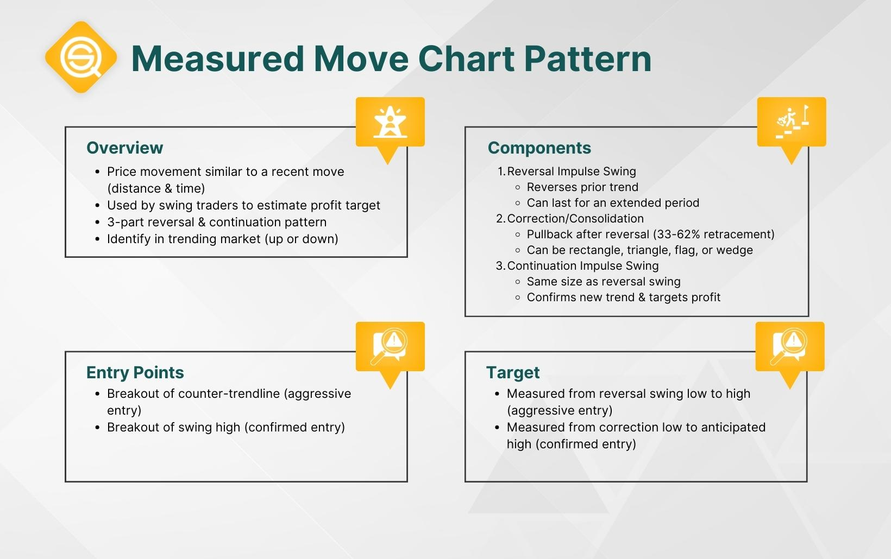

## Table of Contents

## What is a Measured Move chart pattern?

A Measured Move chart pattern is a technical analysis tool used by traders to predict future price movements in financial markets. It is a pattern that shows a clear and predictable movement in price over time, typically seen in stocks, commodities, and forex markets. The pattern consists of three main parts: an initial move, a correction, and a continuation move. The initial move is the first leg of the pattern where the price moves significantly in one direction. This is followed by a correction, where the price retraces part of the initial move. Finally, the continuation move sees the price resuming in the direction of the initial move, often reaching a target that is equal to the length of the initial move.

Traders use the Measured Move pattern to set price targets and manage their trades effectively. By identifying the initial move and the correction, traders can estimate where the price might go next. For example, if the initial move was an increase of $10, and the correction retraced $5, traders might expect the continuation move to add another $10 to the price, setting a target $5 above the peak of the initial move. This pattern helps traders make informed decisions about when to enter or exit a trade, potentially increasing their chances of making a profit.

## How does the Measured Move pattern form?

The Measured Move pattern starts with a big price move in one direction. This is called the initial move. It can go up or down, depending on the market. Imagine the price of a stock going up by $10. This is the first part of the pattern. After this big move, the price takes a break and goes back a little bit. This is called the correction. If the stock went up $10, it might come back down by $5. This correction is important because it shows that the market is taking a breather before the next big move.

After the correction, the price starts moving again in the same direction as the initial move. This is called the continuation move. If the stock went up $10 at first and then came back down $5, the continuation move might push the price up another $10. Traders look at the size of the initial move to guess where the price might go next. If the initial move was $10, they might expect the price to go up another $10 after the correction, setting a target $5 above the highest point of the initial move. This helps traders decide when to buy or sell the stock.

## What are the key components of a Measured Move pattern?

The Measured Move pattern has three main parts: the initial move, the correction, and the continuation move. The initial move is when the price of something, like a stock, goes up or down a lot. For example, if a stock's price goes up by $10, that's the initial move. After this big move, the price takes a break and goes back a little bit. This is called the correction. If the stock went up $10, it might come back down by $5. This correction helps the market catch its breath before the next big move.

After the correction, the price starts moving again in the same direction as the initial move. This is called the continuation move. If the stock went up $10 at first and then came back down $5, the continuation move might push the price up another $10. Traders use the size of the initial move to guess where the price might go next. If the initial move was $10, they might expect the price to go up another $10 after the correction, setting a target $5 above the highest point of the initial move. This helps traders decide when to buy or sell the stock.

## Can you explain the different phases of a Measured Move pattern?

The first phase of a Measured Move pattern is the initial move. This is when the price of something, like a stock, goes up or down a lot. Imagine if a stock's price goes up by $10. That's the initial move. It's the first big change in price and sets the stage for what happens next. Traders pay close attention to this move because it helps them figure out where the price might go later.

After the initial move, the second phase is the correction. This is when the price takes a little break and goes back a bit. If the stock went up $10, it might come back down by $5. The correction is important because it gives the market a chance to rest before the next big move. It's like taking a deep breath after running a long distance.

The third phase is the continuation move. After the correction, the price starts moving again in the same direction as the initial move. If the stock went up $10 at first and then came back down $5, the continuation move might push the price up another $10. Traders use the size of the initial move to guess where the price might go next. If the initial move was $10, they might expect the price to go up another $10 after the correction, setting a target $5 above the highest point of the initial move. This helps traders decide when to buy or sell the stock.

## How can a beginner identify a Measured Move pattern on a chart?

To spot a Measured Move pattern on a chart, a beginner should first look for a big move in the price of the stock or whatever they're watching. This big move is called the initial move. It could be the price going up a lot, like $10, or going down a lot. After this big move, the price will take a little break and go back a bit. This is the correction. If the price went up $10, it might come back down by $5. So, the first thing to do is find this big move and then the smaller move that follows it.

Next, after spotting the correction, the beginner should watch for the price to start moving again in the same direction as the initial move. This is the continuation move. If the price went up $10 at first and then came back down $5, the continuation move might push the price up another $10. By looking at the size of the initial move, a beginner can guess where the price might go next. If the initial move was $10, they might expect the price to go up another $10 after the correction, setting a target $5 above the highest point of the initial move. This helps them decide when to buy or sell the stock.

## What are the common time frames for observing Measured Move patterns?

Measured Move patterns can be seen on different time frames, from very short to very long periods. For short-term traders, these patterns might show up on charts that look at minutes or hours. For example, if someone is trading stocks during the day, they might see a Measured Move pattern on a 5-minute or 1-hour chart. These short time frames are good for people who want to make quick trades and take advantage of fast price changes.

For longer-term investors, Measured Move patterns can appear on daily, weekly, or even monthly charts. Someone who is looking to hold onto a stock for weeks or months might find these patterns on a daily chart. These longer time frames are useful for people who are not in a hurry and want to make decisions based on bigger price movements over time. Both short and long time frames can help traders and investors spot these patterns and make better choices about when to buy or sell.

## What are the entry and exit signals for trading using the Measured Move pattern?

When using the Measured Move pattern for trading, the entry signal often comes right after the correction phase. After you see the big initial move and then the price pulling back a bit, that's when you might want to get into the trade. If the price starts moving again in the same direction as the initial move, that's your cue to enter. For example, if the stock went up $10, then came back down $5, you might buy the stock when it starts going up again after the $5 drop. This way, you're jumping in as the price is likely to keep going in the same direction.

The [exit](/wiki/exit-strategy) signal for trading with the Measured Move pattern comes when the price reaches the target set by the initial move. If the initial move was $10, you would expect the continuation move to add another $10 to the price. So, if the stock went up $10, dropped $5, and then started going up again, you would aim to sell the stock when it goes up another $10 from where it started going up again. That would be $5 above the highest point of the initial move. This helps you lock in your profits before the price might start to fall again.

## How does one calculate the price target using the Measured Move pattern?

To calculate the price target using the Measured Move pattern, you start by looking at the size of the initial move. Let's say the price of a stock goes up by $10. That's your initial move. After this big move, the price might come back down a bit, maybe by $5. This smaller move back is called the correction. Once the price starts going up again after the correction, you expect it to go up by the same amount as the initial move. So, if the initial move was $10, you expect the price to go up another $10 after the correction.

To find the exact price target, you add the size of the initial move to the price where the stock starts going up again after the correction. If the stock went up $10, then came back down $5, and then starts going up again, you add $10 to the price at the bottom of the correction. If the bottom of the correction was at $100, your target would be $100 + $10 = $110. This means you're aiming to sell the stock when it reaches $110, which is $5 above the highest point of the initial move.

## What are the risk management strategies when trading with the Measured Move pattern?

When trading with the Measured Move pattern, one important risk management strategy is to set a stop-loss order. A stop-loss is like a safety net that helps you limit your losses if the price doesn't move the way you expected. If you enter a trade after the correction and the price starts moving against you, the stop-loss can automatically close your trade at a price you set, keeping your losses small. For example, if you buy a stock after it corrects $5 from an initial move of $10, you might set your stop-loss just below the lowest point of the correction to protect your investment.

Another key strategy is to manage your position size. This means deciding how much money to put into each trade. By only risking a small part of your total money on any single trade, you can handle losses better. If one trade goes wrong, it won't wipe out all your money. For instance, if you have $1,000 to trade with, you might decide to only risk $100 on a trade based on the Measured Move pattern. This way, even if the trade doesn't work out, you still have most of your money to try again with other trades.

## How can the Measured Move pattern be combined with other technical indicators for better results?

Combining the Measured Move pattern with other technical indicators can make your trading decisions more accurate. One useful indicator to use with the Measured Move pattern is the Relative Strength Index (RSI). The RSI helps you see if a stock is overbought or oversold. If you see a Measured Move pattern and the RSI shows the stock is not overbought, it might be a good time to enter the trade. This way, you're using the pattern to spot the trend and the RSI to check if the stock has more room to move in that direction.

Another helpful indicator to use with the Measured Move pattern is moving averages. Moving averages smooth out price data to help you see the overall trend more clearly. If you see a Measured Move pattern and the price is above a key moving average, like the 50-day or 200-day moving average, it can confirm that the trend is strong. This can give you more confidence in your trade. By combining the Measured Move pattern with these other indicators, you can make smarter trading choices and possibly improve your results.

## What are some real-world examples of successful trades using the Measured Move pattern?

In one real-world example, a trader spotted a Measured Move pattern on a daily chart of a tech stock. The stock had an initial move up of $5, followed by a correction of $2.50. After the correction, the price started moving up again. The trader entered the trade at the bottom of the correction and set a target of $5 above the highest point of the initial move. The stock hit the target within a few days, and the trader made a nice profit. This showed how the Measured Move pattern can help traders predict where the price might go next.

Another example involves a [forex](/wiki/forex-system) trader who noticed a Measured Move pattern on a 1-hour chart of the EUR/USD pair. The initial move was a drop of 50 pips, followed by a correction of 25 pips. When the price started moving down again after the correction, the trader entered a short position. They set their target at 50 pips below the lowest point of the correction. The trade worked out well, and the trader was able to exit at their target, making a profit. This example shows how the Measured Move pattern can work in different markets and time frames.

## What are the limitations and potential pitfalls of relying on the Measured Move pattern for trading decisions?

One big problem with using the Measured Move pattern for trading is that it doesn't always work. Sometimes the price doesn't move the way the pattern predicts. The stock might not go up or down as much as you expect after the correction, or it might start moving in a different direction. This can lead to losses if you rely too much on the pattern without considering other factors. It's also hard to spot the pattern perfectly, and if you get it wrong, you might enter or exit a trade at the wrong time.

Another issue is that the Measured Move pattern can be affected by other things happening in the market. Big news or events can change how the price moves and mess up the pattern. For example, if a company announces good or bad news, the stock price might jump or drop suddenly, making the pattern useless. Also, the pattern might work well in some markets but not in others. So, it's important to use the Measured Move pattern along with other tools and not to depend on it alone for making trading decisions.

## References & Further Reading

[1]: Bulkowski, T. N. (2005). ["Encyclopedia of Chart Patterns"](https://books.google.com/books/about/Encyclopedia_of_Chart_Patterns.html?id=tIwlEAAAQBAJ). Wiley.

[2]: Schwager, J. D. (1990). ["Technical Analysis of the Futures Markets: A Comprehensive Guide to Trading Methods and Applications"](https://www.amazon.com/Technical-Analysis-Futures-Markets-Comprehensive/dp/013898008X). New York Institute of Finance.

[3]: Pring, M. J. (2002). ["Technical Analysis Explained: The Successful Investor's Guide to Spotting Investment Trends and Turning Points"](https://www.amazon.com/Technical-Analysis-Explained-Fifth-Successful/dp/0071825177). McGraw-Hill Education.

[4]: Murphy, J. J. (1999). ["Technical Analysis of the Financial Markets: A Comprehensive Guide to Trading Methods and Applications"](https://www.amazon.com/Technical-Analysis-Financial-Markets-Comprehensive/dp/0735200661). New York Institute of Finance.

[5]: Elder, A. (1993). ["Trading for a Living: Psychology, Trading Tactics, Money Management"](https://www.amazon.com/Trading-Living-Psychology-Tactics-Management/dp/0471592242). Wiley.