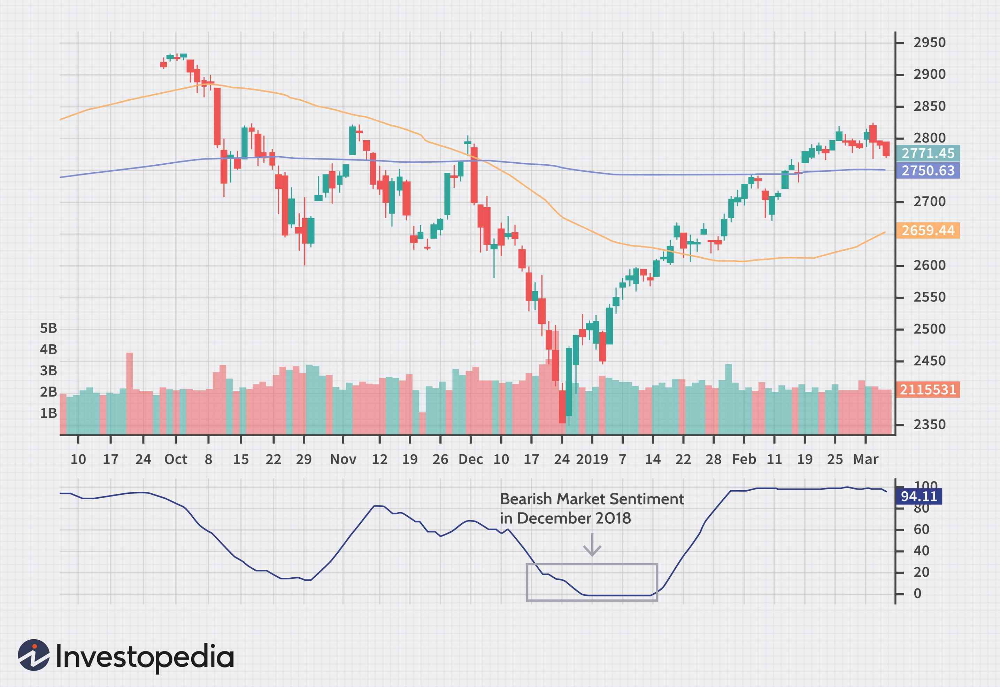

The rapid evolution of technology has significantly transformed financial markets, with notable advancements in algorithmic trading and sentiment analysis. Algorithmic trading, which utilizes automated instructions based on various variables such as time, price, and mathematical models, has revolutionized how trades are executed, enhancing speed and efficiency[1]. Sentiment analysis, a technique that interprets and analyzes opinions, emotions, and attitudes expressed in text, plays a pivotal role in understanding investor behavior and market dynamics. By leveraging natural language processing (NLP) and machine learning, sentiment analysis provides critical insights into investor sentiment, offering a predictive edge in forecast market trends.

Understanding investor sentiment is especially crucial as it reflects the overall attitude of investors towards specific markets or assets, influencing price movements and often dictating market volatility. Bullish, bearish, or neutral sentiment can significantly impact trading decisions, creating opportunities for profitable trades[2]. Thus, sentiment analysis serves as a bridge between raw sentiment data and informed trading strategies, enabling traders to gauge market bias and adjust their actions accordingly.



This article explores the intersection of investor sentiment, sentiment analysis, and algorithmic trading. We will examine how these concepts influence financial markets and discuss strategies for leveraging sentiment analysis in trading frameworks. By implementing these strategies, investors can potentially enhance their trading performance, yielding a competitive advantage in increasingly complex financial environments. 

As markets continue to evolve, the integration of cutting-edge technology in trading practices, including sentiment analysis, is likely to become more prevalent. This trend underscores the need for traders and investors to adapt to new methods that can provide valuable insights and improve decision-making processes.

[1] Hendershott, T., Jones, C. M., & Menkveld, A. J. (2011). Does Algorithmic Trading Improve Liquidity? The Journal of Finance, 66(1), 1-33.

[2] Baker, M., & Wurgler, J. (2006). Investor Sentiment and the Cross-Section of Stock Returns. The Journal of Finance, 61(4), 1645-1680.

## Table of Contents

## Understanding Investor Sentiment

Market sentiment is a critical concept in finance, reflecting the collective attitude and expectations of investors toward a particular financial market or asset. This sentiment serves as a barometer for market dynamics, influencing price movements and [volatility](/wiki/volatility-trading-strategies).

Investor sentiment can be broadly categorized into three primary states: bullish, bearish, and neutral. A bullish sentiment indicates optimism among investors, with expectations of rising asset prices, thereby encouraging buying behavior. Conversely, bearish sentiment is characterized by pessimism, with expectations of declining asset prices, leading to selling pressure. Neutral sentiment suggests a lack of strong convictions in either direction, often resulting in range-bound trading activity.

Several factors contribute to shaping investor sentiment. Economic indicators, such as GDP growth rates, unemployment figures, and [interest rate](/wiki/interest-rate-trading-strategies) changes, provide insights into economic health and potential market direction. Market news, including corporate earnings reports, mergers and acquisitions, and significant announcements, can rapidly alter sentiment by influencing perceptions of a market or asset's future potential. Geopolitical events, such as elections, trade negotiations, or conflicts, also play a crucial role, as they can introduce uncertainty or stability, affecting investor confidence.

The influence of sentiment on financial markets is profound, as it can drive substantial price movements. When sentiment aligns uniformly—either bullish or bearish—the market may experience pronounced trends, with prices moving in accordance with the prevailing sentiment. This movement often results in increased volatility, presenting trading opportunities for both short-term and long-term investors. Traders who understand and anticipate shifts in market sentiment can position themselves to capitalize on these opportunities, potentially enhancing their returns while managing risks.

In summary, understanding investor sentiment is essential for navigating the complexities of financial markets. By appreciating how sentiment impacts market dynamics, traders and investors can better anticipate price movements and volatility, allowing for more informed decision-making and strategic trading approaches.

## The Role of Sentiment Analysis

Sentiment analysis is an essential tool for extracting valuable insights from large volumes of textual data, capturing opinions, emotions, and attitudes with the aid of natural language processing (NLP) and [machine learning](/wiki/machine-learning) techniques. By systematically analyzing qualitative data from diverse sources such as news articles, reports, and social media platforms, sentiment analysis enables the identification of market trends and the gauging of investor sentiment, which is crucial for deriving data-driven decisions in trading activities.

In trading contexts, sentiment analysis is instrumental in providing signals about market movements by capturing collective investor attitudes. This process typically involves the application of keyword-based analysis, rule-based linguistic analysis, and sophisticated machine learning models.

1. **Keyword-Based Analysis**: This technique involves using predefined sets of keywords related to sentiments such as "bullish," "bearish," or "volatile." These keywords are tagged in the text to determine sentiment polarity, which is either positive, negative, or neutral.

2. **Rule-Based Linguistic Analysis**: This method utilizes linguistic rules to interpret sentiment. It relies on syntactic and semantic rules which are predefined to classify sentiment based on the construction of text phrases. It can adjust for negations and modifiers in sentences that might alter sentiment interpretation.

3. **Machine Learning Models**: Machine learning approaches for sentiment analysis involve training models on labeled data to learn sentiment patterns. Techniques such as supervised learning utilize algorithms like Support Vector Machines (SVM), Naive Bayes, and more advanced deep learning architectures like recurrent neural networks (RNNs), particularly Long Short-Term Memory (LSTM) networks, that excel in understanding context in textual data over sequences.

```python
# Example: Using a simple machine learning model to predict sentiment
from sklearn.feature_extraction.text import CountVectorizer
from sklearn.naive_bayes import MultinomialNB
from sklearn.pipeline import make_pipeline

# Sample data
texts = ["The market is bullish today", "Stocks plummet amid economic woes", "Investors remain cautios"]
labels = ['positive', 'negative', 'neutral']

# Vectorizing text data and classifying
model = make_pipeline(CountVectorizer(), MultinomialNB())
model.fit(texts, labels)

# Predicting sentiment of a new text
new_text = ["The economic outlook is uncertain"]
predicted_sentiment = model.predict(new_text)
print(predicted_sentiment)
```

Sentiment analysis's relevance transcends mere gauging of public opinion by transforming qualitative insights into [quantitative trading](/wiki/quantitative-trading) datasets. These datasets can be integrated into [algorithmic trading](/wiki/algorithmic-trading) systems, where real-time sentiment shifts potentially indicate market entry and [exit](/wiki/exit-strategy) points. Consequently, this methodology provides a mechanism for capturing the psychological dimensions of the market, often preceding fundamental data impacts. As technological progress in NLP and machine learning advances, the precision and reliability of sentiment analysis will inevitably enhance, further embedding it into data-driven financial decision-making processes.

## Algo Trading and Sentiment Analysis

Algo trading, or algorithmic trading, employs automated systems that execute trading orders based on predefined criteria, achieving speeds and frequencies beyond the capabilities of human traders. This approach leverages computational algorithms that make split-second decisions, thus optimizing trade execution and reducing emotions from the trading process. Integrating sentiment analysis with algorithmic trading can significantly bolster decision-making efficacy. Sentiment analysis, utilizing natural language processing (NLP) and machine learning, allows these systems to process and interpret large volumes of unstructured textual data, such as news articles and social media posts, to gauge market sentiment.

Incorporating sentiment data into trading algorithms offers a strategic advantage by enabling systems to track shifts in market sentiment. By doing so, these algorithms adapt and respond to new information quickly, potentially improving trading outcomes. The integration of sentiment analysis is particularly advantageous in event-driven trading scenarios. In such cases, significant news events or sudden changes in public perception can elicit immediate shifts in market sentiment, thereby predicting potential price movements.

For instance, an algorithm might use sentiment analysis to assess whether market sentiment around a particular stock is turning negative based on a barrage of unfavorable news articles or social media mentions. The algorithm can then automatically short-sell the stock, anticipating a decline in its price. Python libraries such as TextBlob, VADER, and Hugging Face's transformers facilitate the implementation of sentiment analysis in trading algorithms. A simple Python example using TextBlob for sentiment analysis would look like this:

```python
from textblob import TextBlob

# Sample news headline
headline = "Tech company faces significant losses due to data breach"

# Perform sentiment analysis
blob = TextBlob(headline)
sentiment_score = blob.sentiment.polarity

# Simple decision-making based on sentiment score
if sentiment_score < -0.1:
    action = "sell"
elif sentiment_score > 0.1:
    action = "buy"
else:
    action = "hold"

print(f"Sentiment Score: {sentiment_score}, Recommended Action: {action}")
```

This code evaluates the sentiment polarity of a given headline and suggests a trading action. Such algorithms, when fine-tuned and combined with real-time data feeds, enable rapid response to market changes. As sentiment analysis continues to evolve with advances in machine learning and NLP, its integration with algorithmic trading will enhance adaptive trading strategies, improve risk management, and ultimately contribute to more sophisticated financial market operations.

## Sentiment Trading Strategies

Sentiment trading strategies utilize the overall mood of the market, known as market sentiment, to guide trading decisions. These strategies are built upon the belief that investor sentiment significantly influences market prices and trends. Market sentiment indicators serve as essential tools for traders aiming to understand and exploit these emotional trends.

Examples of such indicators include the Put/Call Ratio, Volatility Index (VIX), and social media sentiment analysis. The Put/Call Ratio is a widely used measure that compares the [volume](/wiki/volume-trading-strategy) of put options to call options, offering insight into market expectations. A high ratio suggests bearish sentiment, while a low ratio indicates bullish sentiment. The VIX, often referred to as the "fear index," gauges market volatility and investor fear, with higher values typically corresponding to increased uncertainty and bearish sentiment.

Social media sentiment has emerged as a powerful indicator, as platforms such as Twitter and Reddit have become influential in shaping market perceptions. Analyzing social media sentiment involves leveraging natural language processing techniques to quantify the emotional tone of posts and discussions related to specific stocks or the broader market.

Sentiment trading strategies can be categorized into contrarian and trend-following approaches. Contrarian strategies are based on the hypothesis that market sentiment can often lead to overreactions. By betting against the prevailing sentiment, contrarians anticipate sentiment reversals, seeking opportunities when market emotions are at extreme levels. For instance, a contrarian might short a stock experiencing excessive bullish sentiment, expecting a future price correction.

On the other hand, trend-following strategies align trades with current sentiment trends, capitalizing on [momentum](/wiki/momentum). Traders employing this approach believe that once a sentiment-driven trend is established, it will likely persist, allowing them to profit by going with the flow. This strategy requires precise timing, as entering trades too late can result in losses when sentiment begins to change.

Both strategies come with risks and require careful analysis. The rapidly evolving nature of sentiment, influenced by news, events, and public opinion, demands adaptable and responsive trading systems. Understanding how to effectively calibrate these strategies can provide traders with a competitive edge in recognizing and acting upon sentiment-driven opportunities.

## Challenges and Future of Sentiment Analysis in Trading

Sentiment analysis in trading, while powerful, encounters several challenges. Language complexities pose significant hurdles as sentiment varies across different languages and cultures. For example, synonyms, homonyms, and colloquial expressions can lead to misinterpretations without careful linguistic models. This necessitates continuous refinement of natural language processing (NLP) models to ensure they adequately understand the nuances of language.

Improving NLP and machine learning methods holds promise for more precise sentiment analysis. As algorithms become more sophisticated, the ability to discern sentiment from complex text patterns increases. Advanced techniques such as transformer-based models like BERT and GPT have started to show strong capabilities in contextual language understanding, allowing for more nuanced sentiment detection.

Moreover, expanding and diversifying data sources is pivotal. Traditional sources like news articles and financial reports are now supplemented with [alternative data](/wiki/best-alternative-data), including social media feeds and IoT data, offering broader sentiment insights. These data sets can capture real-time sentiment shifts, providing a more dynamic perspective on market emotions.

The integration of sentiment analysis into trading platforms is expected to enhance real-time trading and risk management. By leveraging sentiment data, trading algorithms can respond more adeptly to market shifts, potentially improving market predictions and decision-making processes. Algorithms could, for example, automatically adjust trading strategies in response to major sentiment-driven market events, enhancing their adaptability and effectiveness.

In summary, while challenges persist, particularly related to language complexities and model accuracy, ongoing advancements in NLP, machine learning, and data integration signal a promising future for sentiment analysis in trading. As these technologies evolve, they are likely to significantly enhance real-time trading capabilities and risk management strategies in financial markets.

## Conclusion

Sentiment analysis provides an essential tool for comprehending investor sentiment and anticipating market trends. Through the integration of sentiment analysis with algorithmic trading, investors can gain actionable insights, aiding in the formulation of more robust and adaptive trading strategies. This integration enables the processing of vast amounts of text data to discern patterns and sentiment shifts, which can be crucial in making informed trading decisions. By interpreting market sentiment accurately, traders can enhance their predictions about asset price movements, thus optimizing their trading execution.

The future prospects for sentiment analysis in trading are promising, as advancements in natural language processing (NLP) and machine learning techniques continue to evolve. These improvements are expected to yield more sophisticated and accurate sentiment analysis tools, thereby enhancing their utility in trading platforms. As machine learning models become more adept at handling the complexities of human language, the precision of sentiment extraction will improve, enabling traders to better gauge market sentiment.

Additionally, the expanding variety of data sources, including alternative data and Internet of Things (IoT) datasets, offers new dimensions for sentiment analysis, which can significantly broaden its effectiveness. This evolving landscape promises more integrated systems that seamlessly incorporate sentiment insights, augmenting real-time trading capabilities and bolstering risk management strategies.

As technological advancements continue to reshape the financial markets, sentiment analysis is poised to maintain its crucial role. By providing deeper insights into collective investor emotions and drawing connections to market movements, sentiment analysis will be instrumental in navigating the complexities of modern trading environments.

## References & Further Reading

[1]: Hendershott, T., Jones, C. M., & Menkveld, A. J. (2011). ["Does Algorithmic Trading Improve Liquidity?"](https://onlinelibrary.wiley.com/doi/full/10.1111/j.1540-6261.2010.01624.x) The Journal of Finance, 66(1), 1-33.

[2]: Baker, M., & Wurgler, J. (2006). ["Investor Sentiment and the Cross-Section of Stock Returns."](https://onlinelibrary.wiley.com/doi/10.1111/j.1540-6261.2006.00885.x) The Journal of Finance, 61(4), 1645-1680.

[3]: ["Advances in Financial Machine Learning"](https://www.amazon.com/Advances-Financial-Machine-Learning-Marcos/dp/1119482089) by Marcos Lopez de Prado

[4]: ["Machine Learning for Algorithmic Trading"](https://github.com/stefan-jansen/machine-learning-for-trading) by Stefan Jansen

[5]: Tetlock, P. C. (2007). ["Giving Content to Investor Sentiment: The Role of Media in the Stock Market."](https://onlinelibrary.wiley.com/doi/abs/10.1111/j.1540-6261.2007.01232.x) The Journal of Finance, 62(3), 1139-1168.