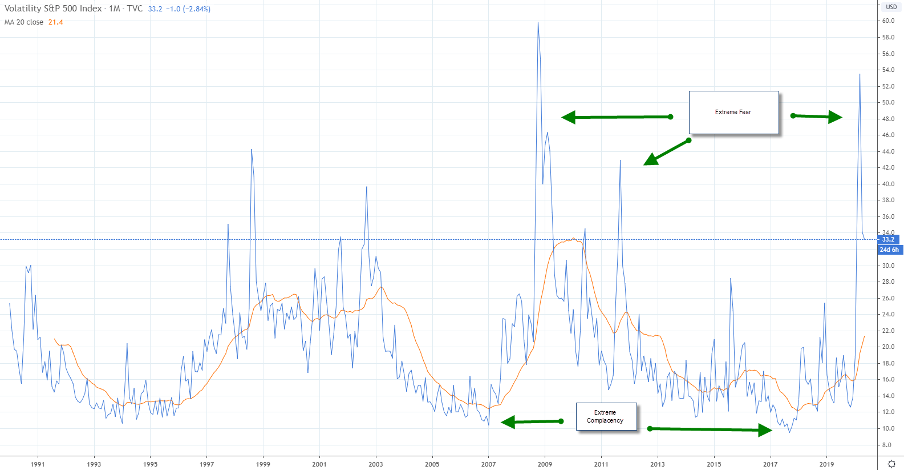

## Table of Contents

## What is investor sentiment?

Investor sentiment is how people feel about the stock market and the economy. It's like the mood of investors, whether they are feeling hopeful or worried. When investors are feeling good, they are more likely to buy stocks and invest money. When they are feeling bad, they might sell their stocks or not invest at all.

This sentiment can affect the stock market a lot. If many people feel good about the market, stock prices can go up because more people are buying. But if many people feel bad, stock prices can go down because more people are selling. It's important for investors to understand this because it can help them make better choices about when to buy or sell stocks.

## Why is measuring investor sentiment important?

Measuring investor sentiment is important because it helps people understand how others feel about the market. This can give clues about what might happen next with stock prices. If most investors are feeling happy and confident, it might mean that stock prices will go up because more people will want to buy stocks. On the other hand, if investors are feeling scared or unsure, it might mean that stock prices could go down because more people will want to sell their stocks.

Knowing investor sentiment can also help investors make smarter choices. For example, if everyone is very excited about a certain stock, it might be a good time to think carefully before jumping in, because the price might already be too high. Or, if everyone is very worried and selling, it might be a good time to buy, because prices might be low. By understanding how others feel, investors can decide when to buy or sell in a way that might help them make more money.

## What are the basic indicators of investor sentiment?

There are several basic indicators that help measure how investors are feeling. One common indicator is the stock market itself. If stock prices are going up a lot, it usually means investors are feeling good and confident. If prices are going down, it might mean they are worried or unsure. Another indicator is the amount of money being invested. When investors are putting more money into the market, it shows they are feeling positive. If they are taking money out, it can mean they are feeling negative.

Surveys and polls are also used to measure investor sentiment. These ask investors directly how they feel about the market and the economy. The results can show if more people are feeling hopeful or worried. Another useful indicator is the level of fear or greed in the market. This can be measured by looking at things like the VIX, which is sometimes called the "fear index." A high VIX means investors are scared, while a low VIX means they are feeling more relaxed and confident.

Putting all these indicators together helps give a good picture of investor sentiment. By watching these signs, investors can get a sense of the overall mood and make better choices about when to buy or sell stocks. Understanding these basics can help anyone interested in the stock market to navigate it more successfully.

## How can sentiment be measured using surveys?

Surveys are a direct way to find out how investors feel about the market. They ask people simple questions like, "Do you think the stock market will go up or down in the next six months?" or "How do you feel about the economy right now?" By collecting answers from many people, survey makers can see if most investors are feeling hopeful or worried. Some well-known surveys that do this are the American Association of Individual Investors (AAII) Sentiment Survey and the Investors Intelligence Sentiment Survey.

These surveys help create a big picture of investor sentiment. If a survey finds that most people are feeling good about the market, it's a sign that investors might keep buying stocks, which could push prices up. On the other hand, if the survey shows that most people are feeling bad, it might mean investors will start selling, which could make prices go down. By looking at these survey results, anyone can get a sense of the overall mood in the market and make smarter choices about their investments.

## What role do market-based indicators play in measuring investor sentiment?

Market-based indicators are important tools for measuring how investors feel about the market. One common indicator is the stock market itself. When stock prices are going up a lot, it usually means that investors are feeling good and confident about the future. On the other hand, if stock prices are going down, it might mean that investors are worried or unsure. Another market-based indicator is the [volume](/wiki/volume-trading-strategy) of trading, which is how much people are buying and selling. If trading volume is high, it shows that investors are active and engaged, which often means they feel strongly about the market, whether positive or negative.

Another key market-based indicator is the VIX, which is also known as the "fear index." The VIX measures how much people expect the stock market to move around in the future. A high VIX means that investors are scared and expect big changes, while a low VIX means they are feeling more relaxed and expect the market to stay steady. By watching these market-based indicators, people can get a good sense of how investors are feeling overall. This can help them make smarter choices about when to buy or sell stocks, based on the current mood of the market.

## How do social media and news analysis contribute to sentiment measurement?

Social media and news analysis help measure how people feel about the market by looking at what they are saying online. When people post on social media or write news articles, they share their thoughts and feelings. By using special tools, like computers that can read and understand words, we can see if more people are saying good things or bad things about the market. If lots of people are posting happy messages about stocks and the economy, it might mean that investors are feeling good. But if many people are posting worried or angry messages, it might mean they are feeling bad about the market.

News analysis is also important because news articles can influence how people feel. If the news is full of stories about the economy doing well, it can make investors feel more confident. But if the news is full of stories about problems, like companies going bankrupt or stock prices falling, it can make investors feel scared or unsure. By looking at what's being said in the news, we can get a good idea of the overall mood. This helps investors understand what other people are thinking and feeling, which can guide their own decisions about buying or selling stocks.

## What are the differences between short-term and long-term sentiment indicators?

Short-term sentiment indicators are like quick snapshots of how people feel about the market right now. They can change fast, sometimes even from day to day. Things like the stock market's daily ups and downs, the VIX, and what people are saying on social media are all short-term indicators. They help investors see if others are feeling happy or worried at the moment. This can be useful for making quick decisions, like buying or selling stocks in the next few days or weeks.

Long-term sentiment indicators, on the other hand, give a bigger picture of how people feel over a longer time, like months or years. They don't change as quickly as short-term indicators. Surveys that ask investors about their feelings over the next six months or a year are examples of long-term indicators. Also, things like how much money people are putting into the market over time can show long-term sentiment. These indicators help investors understand the overall mood and make plans for the future, rather than just reacting to what's happening right now.

## How can behavioral finance theories be applied to understand investor sentiment?

Behavioral finance theories help us understand investor sentiment by looking at how people's feelings and biases affect their decisions about money. One important idea is that people often make choices based on emotions, like fear or greed, rather than just looking at the facts. For example, if investors are scared because they see bad news, they might sell their stocks even if the news doesn't really change the value of the company. This fear can spread and make more people sell, which can cause stock prices to go down even if nothing has changed with the company itself.

Another key concept in behavioral finance is that people tend to follow the crowd. If lots of people are buying a certain stock, others might jump in too, even if they don't fully understand why. This herd behavior can create big swings in the market, where prices go up or down a lot because of what everyone else is doing. By understanding these behaviors, we can see how investor sentiment can drive the market in ways that don't always make sense based on the actual value of stocks. This helps investors be more aware of their own feelings and the feelings of others, so they can make smarter choices.

## What advanced statistical methods are used to refine sentiment measurements?

Advanced statistical methods help make sentiment measurements more accurate by looking at lots of data in smart ways. One method is called [machine learning](/wiki/machine-learning), which is like teaching a computer to find patterns in what people are saying or doing. For example, a computer can read thousands of social media posts and figure out if more people are feeling happy or worried about the market. It does this by learning what words and phrases people use when they feel certain ways. Another method is called natural language processing, which helps computers understand and analyze the words people use in news articles or on social media. This can show if the overall mood is positive or negative.

Another important statistical method is sentiment analysis, which looks at how often certain words or phrases appear in texts. If words like "bullish" or "optimistic" show up a lot, it might mean investors are feeling good. If words like "bearish" or "pessimistic" are common, it might mean they're feeling bad. By using these methods, researchers can get a more detailed picture of investor sentiment. This helps them see not just the overall mood, but also how it's changing over time and what might be causing those changes. Understanding these patterns can lead to better predictions about what the market might do next.

## How does investor sentiment impact market volatility and asset pricing?

Investor sentiment can make the stock market go up and down a lot, which is called market [volatility](/wiki/volatility-trading-strategies). When investors are feeling happy and confident, they buy more stocks, which can push prices up quickly. But if something happens to make them worried or scared, they might start selling their stocks all at once, which can make prices fall just as fast. This back-and-forth can make the market feel like a roller coaster, with big swings in stock prices. Understanding how people feel can help investors guess when these big moves might happen and plan their own buying and selling around it.

Sentiment also affects how much people are willing to pay for stocks, which is called asset pricing. When investors are feeling good, they might think stocks are worth more money and be willing to pay higher prices for them. This can make stock prices go up even if the actual value of the company hasn't changed. On the other hand, if investors are feeling bad, they might think stocks are worth less and only want to pay lower prices, which can push stock prices down. By watching how people feel, investors can get a better idea of whether stock prices are too high or too low, which can help them make smarter choices about when to buy or sell.

## What are the limitations and challenges in accurately measuring investor sentiment?

Measuring investor sentiment can be tricky because it's hard to know exactly what everyone is thinking and feeling. People might say one thing in a survey but do something different with their money. Also, sentiment can change really fast, like if there's a big news event or a surprise in the market. This makes it hard to keep up with how people feel. Plus, not everyone's feelings are the same. Some investors might be hopeful while others are worried, and figuring out the overall mood from all these different opinions is like trying to solve a big puzzle.

Another challenge is that the tools we use to measure sentiment, like surveys, social media, and market indicators, can sometimes give different answers. For example, the stock market might be going up, but social media posts might show that people are feeling worried. It's hard to know which one to trust more. Also, some of these tools can be affected by things that aren't really about the market, like a big event that makes people post more on social media. This can make the data confusing and less reliable. Despite these challenges, trying to understand investor sentiment is still important because it can help people make better choices about their investments.

## How can investors use sentiment data to make informed decisions?

Investors can use sentiment data to get a sense of how other people feel about the market. By looking at things like surveys, social media posts, and market indicators, they can see if most people are feeling happy or worried. If the data shows that lots of people are feeling good and confident, it might be a good time to buy stocks because prices could go up. But if the data shows that many people are scared or unsure, it might be a good time to sell or wait before buying, because prices could go down. By understanding the overall mood, investors can make choices that match what's happening in the market.

Sentiment data can also help investors avoid making decisions based on their own emotions. For example, if everyone is very excited about a certain stock, an investor might feel like they should buy it too. But if the sentiment data shows that the excitement is already pushing the price too high, it might be better to wait. On the other hand, if everyone is very worried and selling, sentiment data can show if the fear is making prices too low, which could be a good time to buy. By using sentiment data, investors can make more thoughtful decisions and not just follow the crowd or their own feelings.

## References & Further Reading

[1]: Hendershott, T., Jones, C. M., & Menkveld, A. J. (2011). ["Does Algorithmic Trading Improve Liquidity?"](https://onlinelibrary.wiley.com/doi/full/10.1111/j.1540-6261.2010.01624.x) The Journal of Finance, 66(1), 1-33.

[2]: Baker, M., & Wurgler, J. (2006). ["Investor Sentiment and the Cross-Section of Stock Returns."](https://onlinelibrary.wiley.com/doi/10.1111/j.1540-6261.2006.00885.x) The Journal of Finance, 61(4), 1645-1680.

[3]: ["Advances in Financial Machine Learning"](https://www.amazon.com/Advances-Financial-Machine-Learning-Marcos/dp/1119482089) by Marcos Lopez de Prado

[4]: ["Machine Learning for Algorithmic Trading"](https://github.com/stefan-jansen/machine-learning-for-trading) by Stefan Jansen

[5]: Tetlock, P. C. (2007). ["Giving Content to Investor Sentiment: The Role of Media in the Stock Market."](https://onlinelibrary.wiley.com/doi/abs/10.1111/j.1540-6261.2007.01232.x) The Journal of Finance, 62(3), 1139-1168.